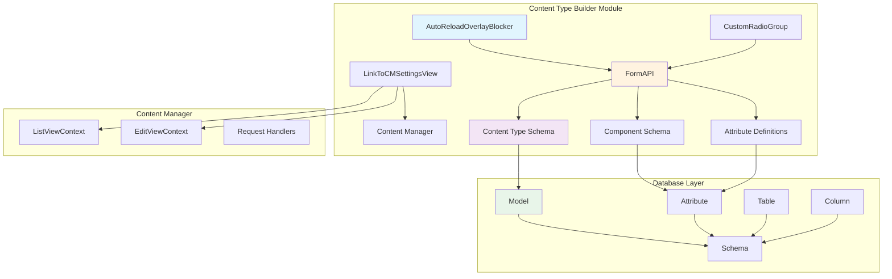
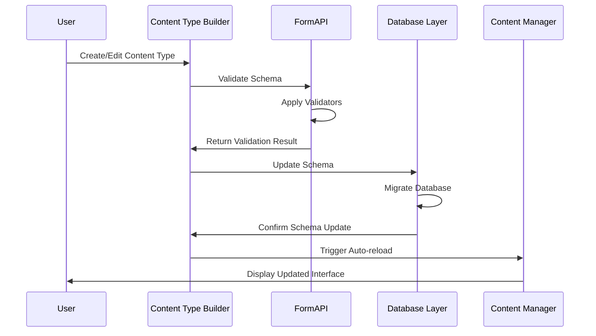
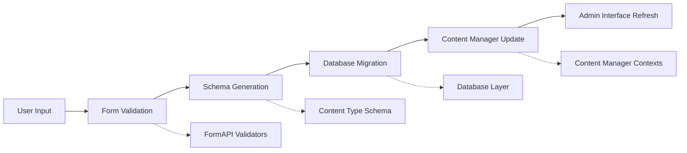
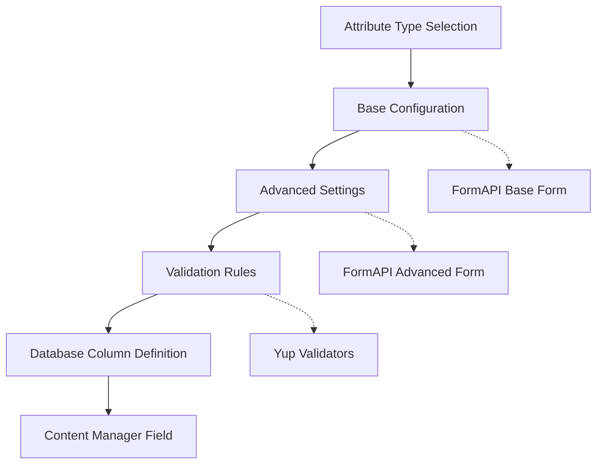
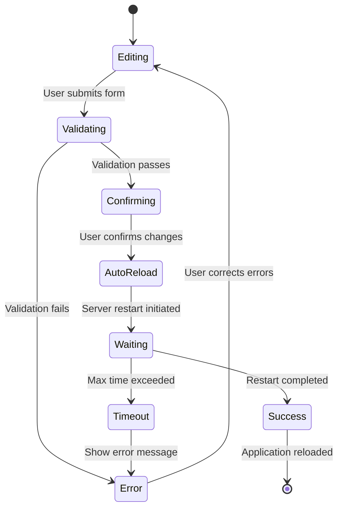
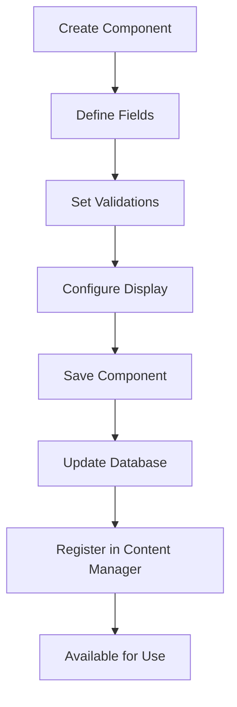

# Content Type Builder Module

The Content Type Builder is a core Strapi module that provides a visual interface for creating and managing content types, components, and their relationships. It enables developers and content managers to define the structure of their content without writing code, making it a central component of Strapi's content management capabilities.

## Overview

The Content Type Builder module serves as the primary interface for content modeling in Strapi. It allows users to create, modify, and delete content types (both collection types and single types), define attributes with various field types, establish relationships between content types, and manage reusable components. The module integrates closely with the database layer to automatically generate corresponding database schemas and with the content manager to provide editing interfaces.

## Architecture

### Core Architecture Diagram

### Component Interaction Flow

## Core Components

### AutoReloadOverlayBlocker

The `AutoReloadOverlayBlocker` component manages the application state during server restarts required for schema changes. It provides a visual overlay that blocks user interaction while the server is restarting, preventing data corruption and ensuring a smooth user experience.

**Key Features:**
- Displays loading states with customizable icons and messages
- Handles timeout scenarios (5-minute maximum wait time)
- Provides context for other components to trigger reloads
- Shows error states when restart takes too long

**Context Value:**
- `lockAppWithAutoreload`: Function to lock the application
- `unlockAppWithAutoreload`: Function to unlock the application

### CustomRadioGroup

The `CustomRadioGroup` component provides a styled radio button group for form selections within the content type builder interface. It supports internationalization and custom styling to maintain consistency with Strapi's design system.

**Props:**
- `intlLabel`: Internationalized label for the group
- `name`: Form field name
- `onChange`: Change handler function
- `radios`: Array of radio options with titles and descriptions
- `value`: Currently selected value

### LinkToCMSettingsView

The `LinkToCMSettingsView` component creates navigation links between the content type builder and content manager configuration views. It handles permission checking and generates appropriate URLs based on content type configurations.

**Key Features:**
- RBAC permission validation
- Dynamic URL generation for different content types
- Support for collection types, single types, and components
- Integration with Strapi's navigation system

### FormAPI

The `FormAPI` is a comprehensive utility system for managing form validation, schema mutations, and field extensions within the content type builder. It provides a plugin architecture for extending content type and attribute definitions.

**Core Capabilities:**
- Dynamic form field registration
- Schema validation with Yup integration
- Content type and attribute extension system
- Custom field validator creation
- Schema mutation pipeline

**Key Methods:**
- `extendContentType`: Add custom validators and form sections to content types
- `extendFields`: Extend attribute field definitions
- `makeValidator`: Create validation schemas
- `mutateContentTypeSchema`: Apply mutations to content type schemas

## Data Flow

### Content Type Creation Flow

### Attribute Definition Process

## Integration Points

### Database Layer Integration

The content type builder integrates with the database layer through:
- **Model Definitions**: Maps content types to database models
- **Attribute Mappings**: Converts field types to database columns
- **Schema Management**: Handles database schema migrations
- **Relationship Handling**: Manages foreign key constraints and join tables

### Content Manager Integration

Integration with the content manager module includes:
- **View Configuration**: Links to content manager configuration views
- **Context Sharing**: Shares content type definitions with editing interfaces
- **Permission Management**: Coordinates RBAC permissions between modules
- **Real-time Updates**: Triggers interface updates after schema changes

### Admin Panel Integration

The module integrates with the broader admin panel through:
- **Plugin Architecture**: Extends the admin panel with content type management
- **Navigation System**: Provides menu items and routing
- **State Management**: Shares application state with other modules
- **Component Library**: Uses shared UI components and design system

## Field Types and Validation

### Supported Field Types

The content type builder supports various field types through the database layer:
- **StringField**: Text inputs with validation
- **NumberField**: Numeric inputs with range validation
- **DateField**: Date picker inputs
- **DatetimeField**: Date and time inputs
- **JSONField**: JSON data storage
- **Relational Fields**: References to other content types

### Validation System

Validation is handled through the FormAPI with:
- **Yup Integration**: Schema-based validation
- **Custom Validators**: Plugin-extensible validation rules
- **Async Validation**: Server-side validation support
- **Cross-field Validation**: Complex validation logic

## Process Flows

### Schema Update Process

### Component Creation Flow

## Extension Points

### Plugin Extensions

The FormAPI provides several extension points:
- **Custom Field Types**: Add new field types through plugins
- **Validators**: Extend validation logic
- **Form Sections**: Add custom form sections
- **Schema Mutations**: Modify schemas during processing

### Custom Field Integration

Custom fields can be integrated through:
- **Component Registration**: Register custom input components
- **Validation Extensions**: Add field-specific validation
- **Form Integration**: Integrate with form generation
- **Content Manager Support**: Provide editing interfaces

## Error Handling

### Validation Errors

The module handles various validation scenarios:
- **Field-level Validation**: Individual field validation errors
- **Schema Validation**: Content type structure validation
- **Database Constraints**: Database-level constraint violations
- **Permission Errors**: RBAC permission violations

### Auto-reload Failures

Auto-reload scenarios are handled through:
- **Timeout Management**: 5-minute maximum wait time
- **Error States**: Visual indication of restart failures
- **Recovery Options**: Documentation links and support
- **State Rollback**: Ability to revert changes on failure

## Performance Considerations

### Schema Caching

The module implements caching strategies for:
- **Content Type Definitions**: Cached schema definitions
- **Validation Rules**: Pre-compiled validation schemas
- **Form Configurations**: Cached form layouts
- **Permission Checks**: Cached RBAC permissions

### Database Migration Optimization

Database operations are optimized through:
- **Incremental Migrations**: Only necessary changes applied
- **Transaction Management**: Atomic schema updates
- **Index Management**: Automatic index creation
- **Relationship Optimization**: Efficient foreign key handling

## Security Considerations

### Permission Management

The module implements comprehensive permission checking:
- **Content Type Permissions**: Create, read, update, delete permissions
- **Field-level Permissions**: Restrict access to sensitive fields
- **Admin Panel Access**: Restrict module access to authorized users
- **Plugin Permissions**: Manage plugin-specific permissions

### Data Validation

Security is enforced through:
- **Input Sanitization**: Clean user inputs
- **SQL Injection Prevention**: Parameterized queries
- **XSS Protection**: Output encoding
- **Schema Validation**: Strict type checking

## Related Documentation

- [Database Module](database.md) - Database layer integration and schema management
- [Content Manager Module](content-manager.md) - Content editing interfaces and view configuration
- [Admin Panel Module](admin.md) - Core admin panel functionality and plugin architecture
- [Upload Module](upload.md) - Media handling and file upload capabilities