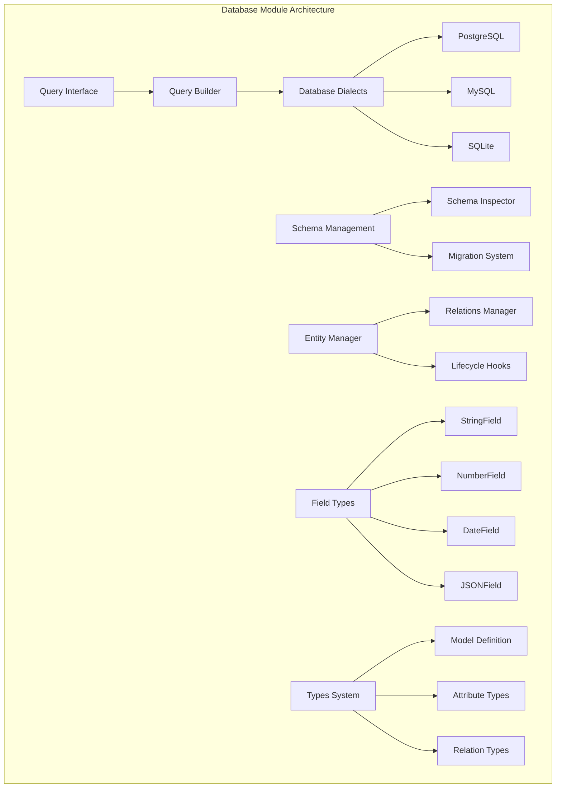
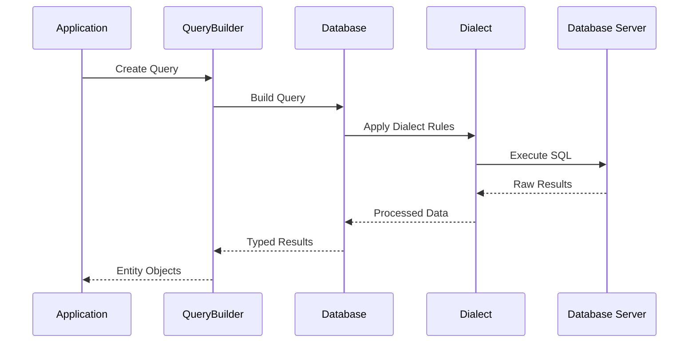
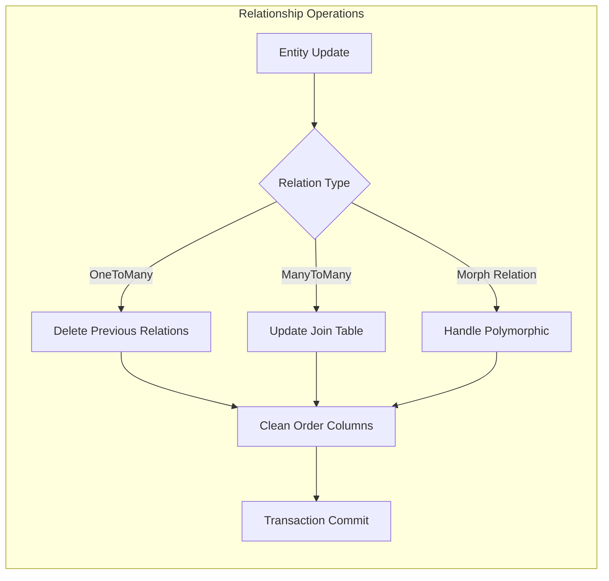

# Database Module Documentation

## Introduction

The Database module is the core data persistence layer of the Strapi application, providing a comprehensive ORM (Object-Relational Mapping) system with multi-database support. It handles database connections, schema management, query building, data type conversion, and relationship management across PostgreSQL, MySQL, and SQLite databases.

## Architecture Overview

The database module follows a layered architecture with clear separation of concerns:



## Core Components

### 1. Types System (`packages.core.database.src.types.index`)

The foundation of the database module, defining all data structures and type definitions.

#### Key Interfaces:

**Model**: Defines the structure of database entities
```typescript
interface Model {
  uid: string;                    // Unique identifier
  tableName: string;              // Database table name
  singularName: string;           // Singular entity name
  attributes: Record<string, Attribute>;  // Field definitions
  indexes?: Index[];              // Database indexes
  foreignKeys?: ForeignKey[];     // Foreign key constraints
  lifecycles?: Partial<Record<Action, SubscriberFn>>;  // Lifecycle hooks
}
```

**Attribute Types**: Comprehensive type system for entity fields
- **ScalarAttribute**: Basic data types (string, number, date, boolean, JSON, etc.)
- **RelationalAttribute**: Relationship definitions (oneToOne, oneToMany, manyToOne, manyToMany, morph relations)
- **BaseAttribute**: Common properties for all attributes (type, columnName, default, required, unique, etc.)

**Relation System**: Advanced relationship management with support for:
- Bidirectional relations (oneToOne, oneToMany, manyToOne, manyToMany)
- Polymorphic relations (morphOne, morphMany, morphToOne, morphToMany)
- Join tables and columns with ordering support
- Complex join configurations with conditions

### 2. Database Dialects (`packages.core.database.src.dialects`)

Database-specific implementations providing abstraction over different database systems.

#### PostgreSQL Dialect
- **Features**: Full SQL compliance, JSONB support, advanced data types
- **Special Handling**: 
  - Custom type parsing for DATE, JSONB, and NUMERIC types
  - Schema support with search path configuration
  - Advanced error transformation (e.g., NOT NULL violations)
  - Type conversion SQL for datetime/time transformations

#### MySQL Dialect
- **Features**: Big number support, custom type casting
- **Special Handling**:
  - Automatic configuration for big numbers and decimal handling
  - Boolean type casting for TINY(1) fields
  - Date string preservation
  - Foreign key constraint management during schema updates
  - Session configuration for primary key requirements

#### SQLite Dialect
- **Features**: Lightweight, file-based database support
- **Special Handling**:
  - Directory creation for database files
  - Foreign key pragma management
  - Type mapping (enum → text, decimal → float, timestamp → datetime)
  - Operator filtering for unsupported operations
  - Constraint alteration limitations

### 3. Field Type System (`packages.core.database.src.fields`)

Provides data conversion between JavaScript types and database-specific formats.

**StringField**: Simple string conversion using `toString()`
**NumberField**: Numeric validation with NaN detection
**DateField**: Date parsing with validation
**DatetimeField**: ISO string conversion with date-fns validation
**JSONField**: Complex JSON handling with double-parse support for legacy data

### 4. Schema Management (`packages.core.database.src.schema.types`)

Comprehensive schema definition and diffing system.

**Core Structures**:
- **Schema**: Collection of tables
- **Table**: Definition with columns, indexes, and foreign keys
- **Column**: Type information with constraints (nullable, unique, primary, default values)

**Diff System**: Sophisticated change detection for:
- Table additions/removals/modifications
- Column changes with detailed diff reporting
- Index modifications
- Foreign key constraint updates

### 5. Query Streaming (`packages.core.database.src.query.helpers.streams.readable`)

**ReadableStrapiQuery**: High-performance streaming query execution
- **Batch Processing**: Configurable batch sizes (default 500)
- **Memory Management**: Efficient result streaming with backpressure handling
- **Population Support**: Automatic relationship loading
- **Result Mapping**: Optional transformation to entity format
- **Error Handling**: Robust error management with stream cleanup

### 6. Entity Relationship Management (`packages.core.database.src.entity-manager.regular-relations`)

Advanced relationship management with sophisticated deletion strategies.

**Key Functions**:
- **deleteRelations**: Batch relationship deletion with order column cleanup
- **deletePreviousOneToAnyRelations**: Handles one-sided relationship replacement
- **deletePreviousAnyToOneRelations**: Manages inverse relationship cleanup
- **cleanOrderColumns**: Maintains sequential ordering in relationship tables

**Document-Aware Operations**: Special handling for document-based entities with sibling ID management.

## Data Flow Architecture



## Relationship Management Flow



## Integration Points

### With [Core Module](core.md)
- **Lifecycle Integration**: Hooks into application lifecycle events
- **Configuration Management**: Uses core configuration system
- **Error Handling**: Leverages core error types and handling

### With [Utils Module](utils.md)
- **Knex Utilities**: Uses shared database utilities
- **Schema Helpers**: Leverages schema manipulation utilities

### With [Metadata Module](metadata.md)
- **Model Metadata**: Retrieves entity metadata for query building
- **Relationship Information**: Uses metadata for relationship resolution

## Configuration

The database module supports extensive configuration options:

```typescript
interface DatabaseConfig {
  connection: {
    client: 'postgres' | 'mysql' | 'sqlite';
    connection: ConnectionConfig;
    pool?: PoolConfig;
  };
  schema?: {
    default?: string;  // PostgreSQL schema
  };
  settings?: {
    forceMigration?: boolean;
    runMigrations?: boolean;
  };
}
```

## Best Practices

1. **Use Streaming for Large Datasets**: Leverage ReadableStrapiQuery for memory-efficient processing
2. **Transaction Management**: Always use transactions for multi-operation updates
3. **Relationship Cleanup**: Use provided relationship management functions for consistency
4. **Type Safety**: Leverage the comprehensive type system for compile-time safety
5. **Dialect-Specific Features**: Use dialect methods for database-specific optimizations

## Error Handling

The module provides comprehensive error transformation:
- **Database Errors**: Transformed to application-specific error types
- **Validation Errors**: Field-level validation with detailed messages
- **Constraint Violations**: Proper handling of unique, foreign key, and check constraints
- **Connection Errors**: Graceful handling of database connection issues

## Performance Considerations

1. **Query Optimization**: Built-in query optimization through Knex.js
2. **Batch Operations**: Support for batch inserts, updates, and deletes
3. **Indexing**: Automatic index management based on entity definitions
4. **Connection Pooling**: Efficient connection management
5. **Streaming**: Memory-efficient processing of large result sets

## Migration Support

The schema diff system enables safe database migrations:
- **Change Detection**: Automatic detection of schema changes
- **Migration Generation**: Programmatic migration creation
- **Rollback Support**: Ability to reverse schema changes
- **Data Preservation**: Safe schema updates without data loss

This comprehensive database module provides a robust foundation for data persistence in Strapi applications, with support for complex relationships, multiple database systems, and advanced querying capabilities.