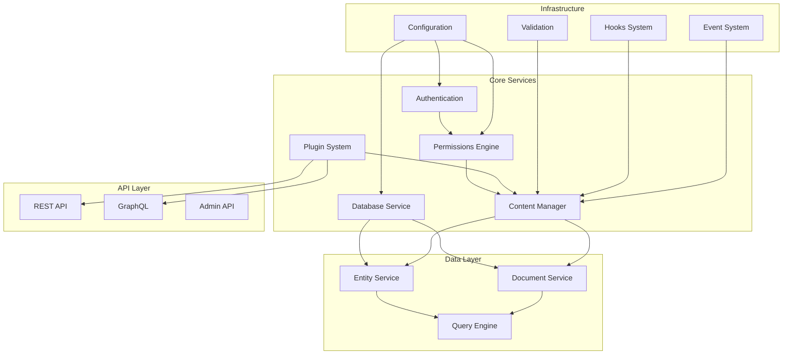
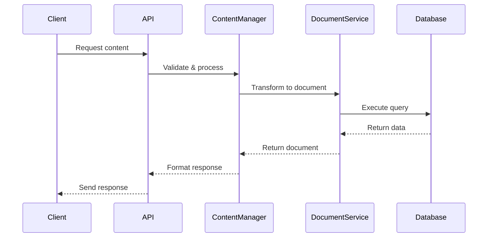

# Strapi Core Module Documentation

## Overview

The strapi--strapi module is the foundational core of the Strapi CMS platform, providing the essential infrastructure, services, and APIs that power the entire system. This module encompasses the core functionality including database management, content type handling, authentication, permissions, and the plugin system.

## Architecture



## Core Components

### 1. Database Service
The database service provides the foundational data persistence layer, supporting multiple database dialects and offering a unified query interface.

**Key Components:**
- **Database Core** (`packages/core/database/src/types/index.ts`): Defines the base database interfaces including `Model`, `Attribute`, and relationship types
- **Query Engine** (`packages/core/database/src/query/`): Provides query building and execution capabilities
- **Schema Management** (`packages/core/database/src/schema/`): Handles database schema introspection and migration
- **Field Types** (`packages/core/database/src/fields/`): Implements various field type handlers (String, Number, Date, JSON, etc.)

**Supported Databases:**
- PostgreSQL
- MySQL/MariaDB
- SQLite

### 2. Content Management System
The content management system handles all content-related operations including content types, components, and media management.

**Key Components:**
- **Content Manager** (`packages/core/content-manager/`): Core content management functionality
- **Content Type Builder** (`packages/core/content-type-builder/`): Dynamic content type creation and management
- **Upload System** (`packages/core/upload/`): File and media management
- **Document Service** (`packages/core/types/src/modules/documents/`): Modern document-based content handling

### 3. Authentication & Authorization
Comprehensive security system managing user authentication, role-based access control, and API token management.

**Key Components:**
- **Admin Authentication** (`packages/core/admin/shared/contracts/authentication.ts`): Admin panel authentication
- **User Management** (`packages/core/admin/shared/contracts/user.ts`): User CRUD operations
- **Role & Permissions** (`packages/core/admin/shared/contracts/roles.ts`, `packages/core/admin/shared/contracts/permissions.ts`): RBAC implementation
- **API Tokens** (`packages/core/admin/shared/contracts/api-token.ts`): API authentication tokens
- **Transfer Tokens** (`packages/core/admin/shared/contracts/transfer.ts`): Data transfer authentication

### 4. Plugin System
Extensible plugin architecture allowing third-party functionality integration.

**Key Components:**
- **Plugin Core** (`packages/core/types/src/plugin/`): Plugin configuration and lifecycle management
- **Plugin Discovery** (`packages/core/strapi/src/node/core/plugins.ts`): Plugin detection and loading
- **Injection Zones** (`packages/core/content-manager/admin/src/components/InjectionZone.tsx`): UI extension points

### 5. API Layer
Multiple API interfaces for different use cases and integration scenarios.

**Key Components:**
- **REST API** (`packages/core/types/src/core/route.ts`): RESTful API endpoints
- **Admin API** (`packages/core/admin/shared/contracts/`): Administrative operations
- **Content API** (`packages/core/admin/shared/contracts/content-api/`): Content delivery API
- **GraphQL** (via plugins): GraphQL API support

## Sub-modules

### Database Module
- **Purpose**: Data persistence and query management
- **Key Files**: 
  - `packages/core/database/src/types/index.ts` - Core database types
  - `packages/core/database/src/query/query-builder.ts` - Query building
  - `packages/core/database/src/dialects/` - Database-specific implementations
- **Documentation**: [Database Module](database.md)

### Content Manager Module
- **Purpose**: Content creation, editing, and management
- **Key Files**:
  - `packages/core/content-manager/admin/src/content-manager.ts` - Main content manager
  - `packages/core/content-manager/shared/contracts/` - Content management APIs
  - `packages/core/content-manager/admin/src/pages/` - Admin UI components
- **Documentation**: [Content Manager Module](content-manager.md)

### Admin Module
- **Purpose**: Administrative interface and user management
- **Key Files**:
  - `packages/core/admin/admin/src/` - Admin panel implementation
  - `packages/core/admin/shared/contracts/` - Admin APIs
  - `packages/core/admin/admin/src/features/` - Core admin features
- **Documentation**: [Admin Module](admin.md)

### Upload Module
- **Purpose**: File and media management
- **Key Files**:
  - `packages/core/upload/admin/src/` - Upload UI components
  - `packages/core/upload/shared/contracts/` - Upload APIs
  - `packages/core/upload/server/src/` - Upload server logic
- **Documentation**: [Upload Module](upload.md)

### Content Type Builder Module
- **Purpose**: Dynamic content type creation and management
- **Key Files**:
  - `packages/core/content-type-builder/admin/src/` - CTB admin interface
  - `packages/core/content-type-builder/shared/contracts/` - CTB APIs
- **Documentation**: [Content Type Builder Module](content-type-builder.md)

## Data Flow



## Configuration

The strapi--strapi module is configured through various configuration files:

### Server Configuration
```typescript
// packages/core/types/src/core/config/server.ts
interface Server {
  host: string;
  port: number;
  app: AppProp;
  // Optional configurations
  socket?: string | number;
  url?: string;
  proxy?: boolean;
  // ... additional options
}
```

### Database Configuration
Supports multiple database configurations with dialect-specific settings.

### Plugin Configuration
```typescript
// packages/core/types/src/core/config/plugin.ts
interface Plugin {
  [key: string]: {
    enabled: boolean;
    resolve?: string;
    config?: object;
  } | boolean;
}
```

## Security Features

- **Authentication**: Multiple authentication strategies (JWT, API tokens, SSO)
- **Authorization**: Role-based access control with granular permissions
- **Validation**: Comprehensive input validation using Yup schemas
- **Rate Limiting**: Configurable rate limiting for API endpoints
- **Audit Logging**: Enterprise edition includes audit logging capabilities

## Performance Considerations

- **Query Optimization**: Built-in query optimization and caching
- **Pagination**: Efficient pagination for large datasets
- **Streaming**: Support for streaming large file uploads
- **Indexing**: Automatic database indexing based on content type definitions

## Extension Points

The module provides several extension points:

1. **Custom Field Types**: Extend the attribute system with custom field types
2. **Plugin Development**: Create plugins using the plugin API
3. **Custom Validators**: Add custom validation logic
4. **Event Hooks**: Hook into system events for custom behavior
5. **Middleware**: Add custom middleware for request processing

## Related Documentation

- [Database Module](database.md)
- [Content Manager Module](content-manager.md)
- [Admin Module](admin.md)
- [Upload Module](upload.md)
- [Content Type Builder Module](content-type-builder.md)
- [Authentication & Authorization](auth.md)
- [Plugin Development Guide](plugin-development.md)

## API Reference

For detailed API documentation, refer to the individual module documentation files listed above.