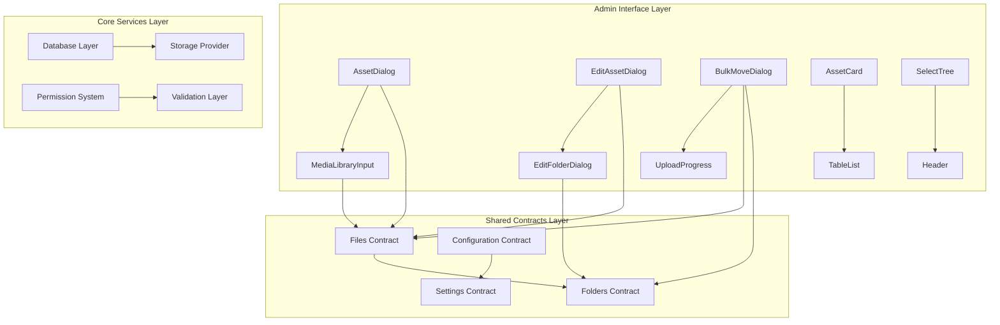
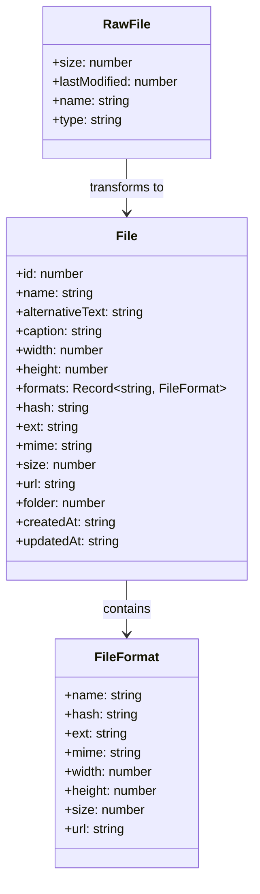
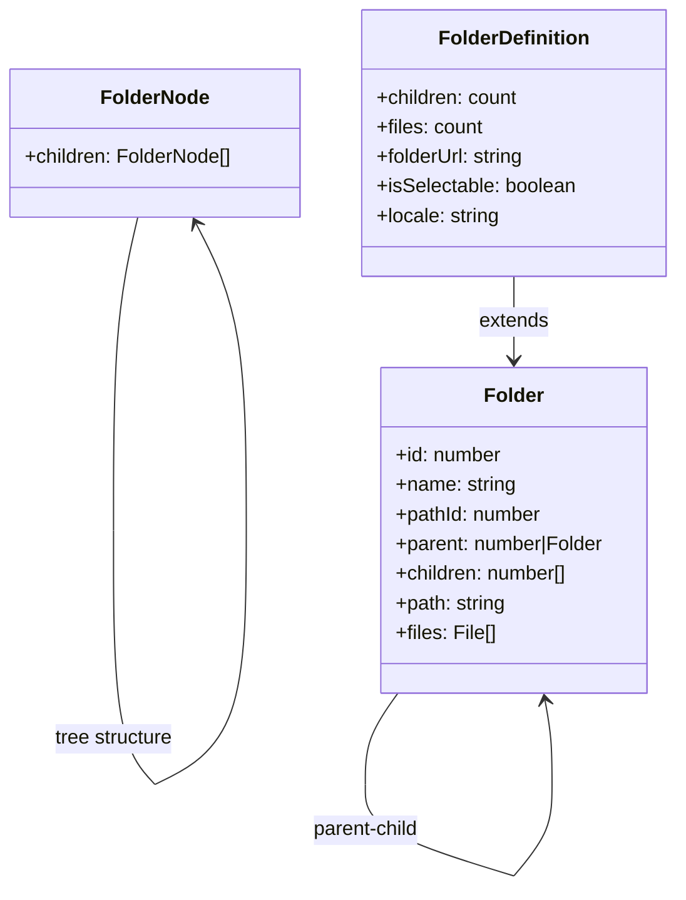
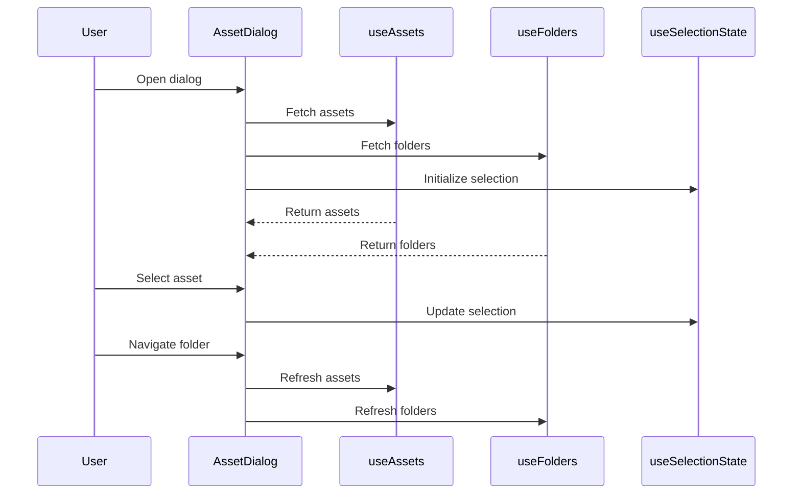
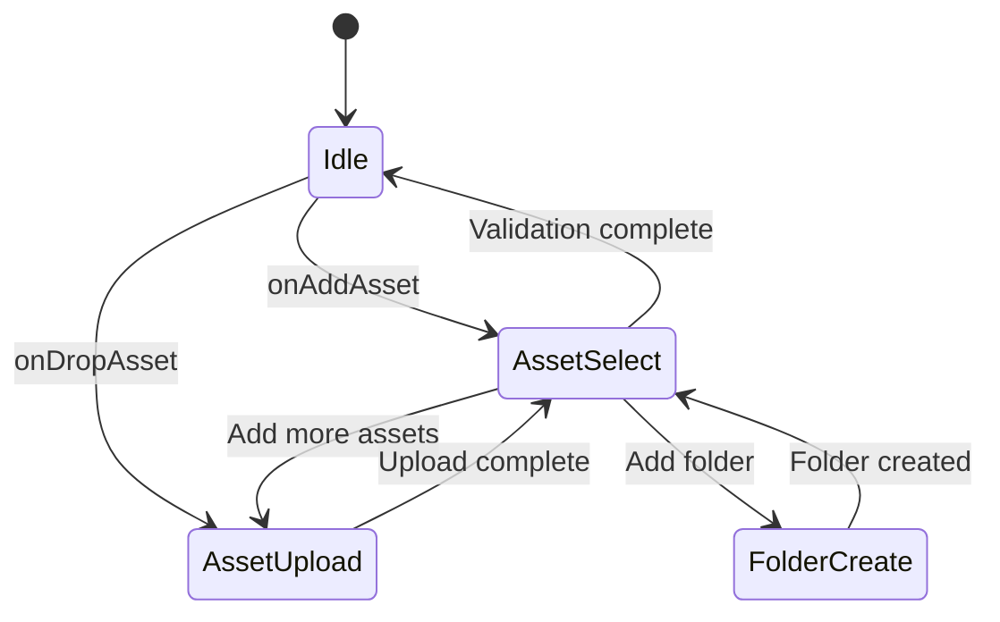
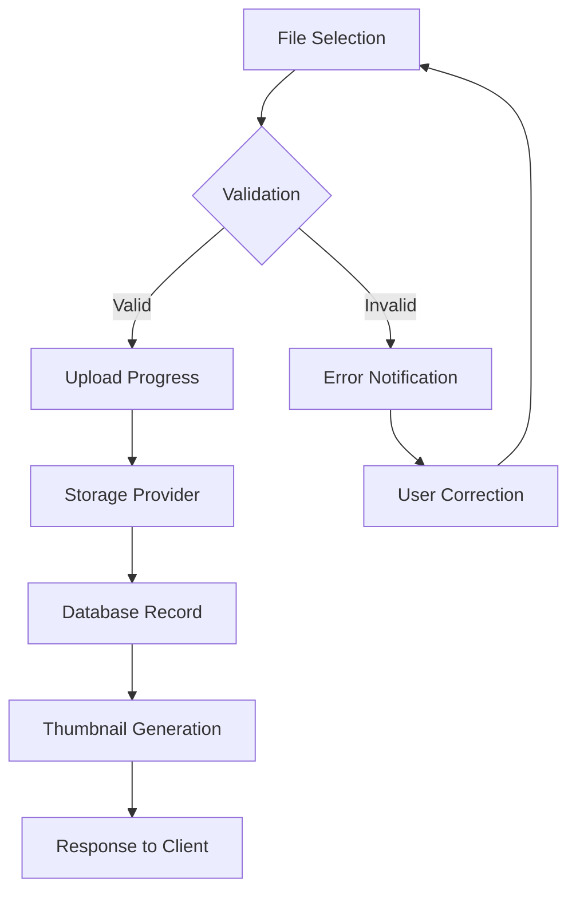
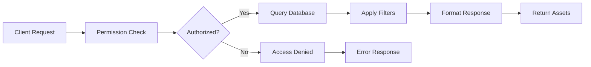

# Upload Module Documentation

## Introduction

The Upload module is a core component of the Strapi CMS that provides comprehensive media file management capabilities. It handles file uploads, storage, organization, and retrieval within the Strapi ecosystem. The module integrates seamlessly with the admin panel and content manager, offering both programmatic APIs and user-friendly interfaces for managing digital assets.

## Architecture Overview

The Upload module follows a layered architecture with clear separation of concerns:



## Core Components

### 1. File Management System

The file management system is built around the `File` interface defined in the shared contracts:



### 2. Folder Management System

The folder system provides hierarchical organization of assets:



### 3. API Contract Layer

The module exposes well-defined API contracts for different operations:

#### File Operations
- **GetFiles**: Retrieve paginated file listings with filtering
- **GetFile**: Fetch individual file details
- **CreateFile**: Upload new files via FormData
- **UpdateFile**: Modify existing file metadata
- **DeleteFile**: Remove files from storage
- **BulkDeleteFiles**: Mass deletion operations
- **BulkMoveFiles**: Mass file relocation

#### Folder Operations
- **GetFolders**: List folder hierarchy
- **GetFolder**: Retrieve specific folder details
- **CreateFolders**: Create new folders
- **UpdateFolder**: Modify folder properties
- **BulkDeleteFolders**: Mass folder deletion
- **BulkMoveFolders**: Mass folder relocation

### 4. Admin Interface Components

#### AssetDialog Component
The primary interface for asset selection and management:



#### MediaLibraryInput Component
Integrated input component for content management:



### 5. Configuration and Settings

The module provides two levels of configuration:

#### User Configuration
- **Page Size**: Number of items per page
- **Sort Order**: Default sorting preferences
- **Allowed Types**: File type restrictions

#### System Settings
- **Size Optimization**: Automatic file compression
- **Responsive Dimensions**: Multi-size image generation
- **Auto Orientation**: Automatic image rotation
- **Video Preview**: Video thumbnail generation

## Data Flow Architecture

### Upload Process Flow



### Asset Retrieval Flow



## Integration Points

### Database Integration
The module integrates with the core database layer through:
- [Database Module](database.md) for data persistence
- Entity relationships for file-folder associations
- Query builders for complex filtering operations

### Admin Panel Integration
Seamless integration with the admin interface:
- [Admin Module](admin.md) for UI components and permissions
- Content manager integration for field-level asset selection
- Shared notification and error handling systems

### Content Manager Integration
Direct integration with content management:
- [Content Manager Module](content-manager.md) for media field types
- Form integration for asset selection
- Dynamic zone support for media components

## Security and Permissions

The module implements comprehensive security measures:

### File Validation
- MIME type verification
- File size limits
- Extension validation
- Content scanning (when configured)

### Access Control
- Role-based permissions per operation
- Folder-level access restrictions
- Asset ownership and sharing rules
- API rate limiting for uploads

### Storage Security
- Secure file naming conventions
- Path traversal protection
- Signed URL generation for private assets
- Content Security Policy headers

## Performance Optimization

### Caching Strategy
- Metadata caching for frequently accessed files
- Thumbnail caching with automatic regeneration
- Folder structure caching for navigation
- Query result caching with invalidation

### Upload Optimization
- Chunked upload for large files
- Parallel upload processing
- Resume capability for interrupted uploads
- Bandwidth throttling options

### Database Optimization
- Indexed queries for file searches
- Pagination for large result sets
- Lazy loading for folder structures
- Connection pooling for high concurrency

## Error Handling

### Upload Errors
```typescript
interface UploadError {
  type: 'validation' | 'storage' | 'network' | 'unknown'
  message: string
  details?: Record<string, unknown>
  retryable: boolean
}
```

### Recovery Mechanisms
- Automatic retry for transient failures
- Graceful degradation for partial failures
- User-friendly error messages
- Detailed logging for debugging

## Extension Points

### Custom Storage Providers
The module supports pluggable storage backends:
- Local filesystem
- Cloud storage (AWS S3, Google Cloud, Azure)
- CDN integration
- Custom provider implementation

### Event Hooks
- Pre/post upload events
- File transformation hooks
- Permission check hooks
- Notification hooks

### Custom Validators
- File type validators
- Size constraint validators
- Content-specific validators
- Business rule validators

## Monitoring and Analytics

### Metrics Collection
- Upload success/failure rates
- Storage usage statistics
- Performance metrics
- User activity tracking

### Health Checks
- Storage provider connectivity
- Database connection status
- File system permissions
- Available storage space

## Configuration Reference

### Environment Variables
```bash
UPLOAD_PROVIDER=local
UPLOAD_PROVIDER_OPTIONS={}
UPLOAD_SIZE_LIMIT=1000000
UPLOAD_MIME_TYPES=image/*,video/*,application/pdf
```

### Module Settings
```json
{
  "sizeOptimization": true,
  "responsiveDimensions": true,
  "autoOrientation": true,
  "videoPreview": true
}
```

## Best Practices

### File Organization
- Use meaningful folder structures
- Implement consistent naming conventions
- Regular cleanup of unused assets
- Proper metadata tagging

### Performance
- Optimize images before upload when possible
- Use appropriate thumbnail sizes
- Implement lazy loading for large galleries
- Cache frequently accessed assets

### Security
- Validate all file uploads
- Implement virus scanning for user uploads
- Use secure storage configurations
- Regular security audits

## Troubleshooting

### Common Issues
1. **Upload Failures**: Check file size limits and MIME type restrictions
2. **Permission Errors**: Verify user roles and folder permissions
3. **Storage Issues**: Check storage provider connectivity and quotas
4. **Performance Problems**: Review caching configuration and database indexes

### Debug Information
- Enable detailed logging for upload operations
- Monitor storage provider API responses
- Check file system permissions and quotas
- Review database query performance

## Migration and Upgrades

### Version Compatibility
- API version compatibility matrix
- Database schema migration scripts
- Configuration migration tools
- Rollback procedures

### Data Migration
- Bulk file migration utilities
- Folder structure preservation
- Metadata migration
- Validation and verification processes