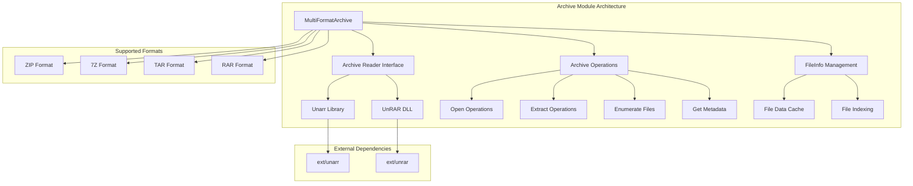
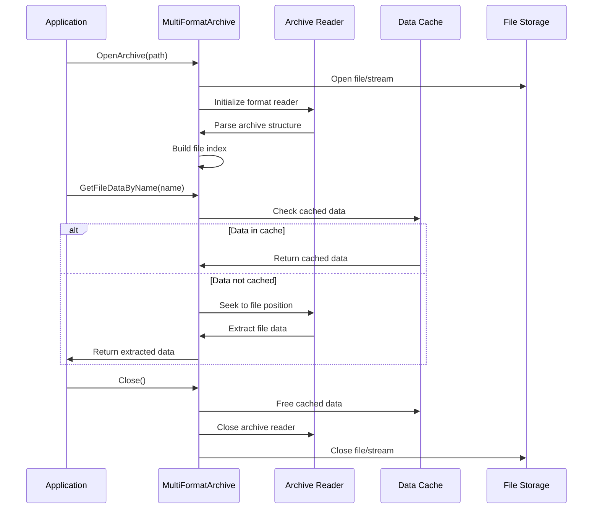
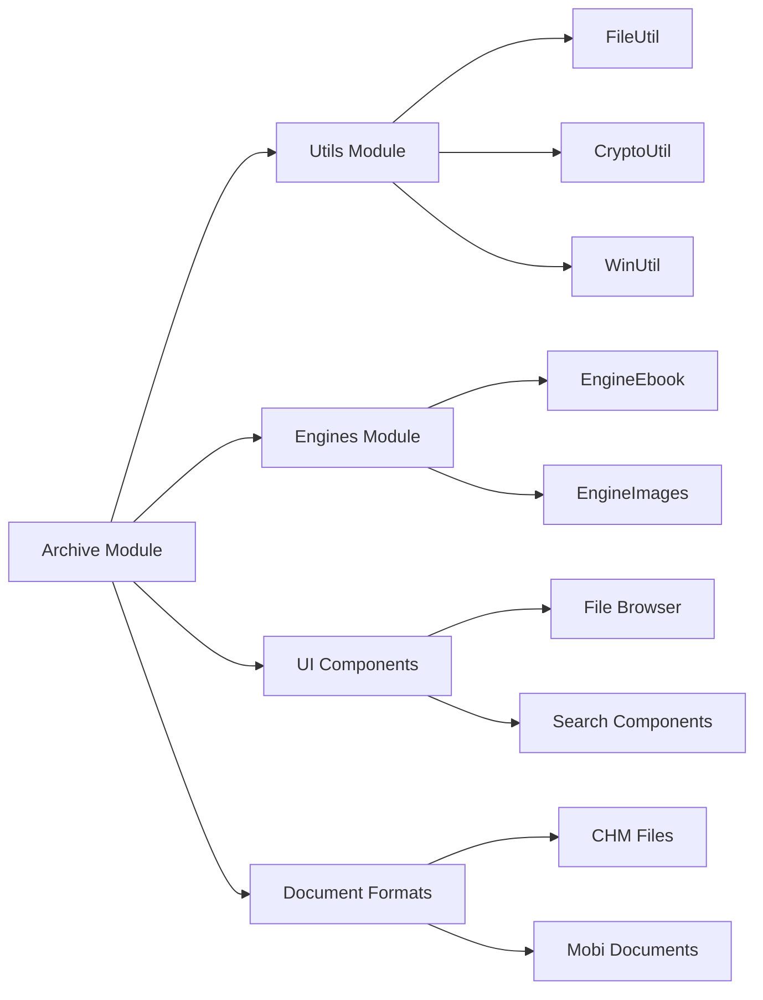

# Archive Module Documentation

## Introduction

The Archive module provides a unified interface for reading and extracting files from various archive formats including ZIP, 7Z, TAR, and RAR. It serves as a critical utility component within the SumatraPDF ecosystem, enabling the application to handle compressed document collections and bundled resources efficiently.

The module abstracts the complexity of different archive formats through a common `MultiFormatArchive` class, providing consistent APIs for file enumeration, metadata retrieval, and data extraction regardless of the underlying archive format.

## Architecture Overview



## Core Components

### MultiFormatArchive Class

The `MultiFormatArchive` class is the central component that provides unified access to different archive formats. It manages archive opening, file enumeration, and data extraction operations.

**Key Responsibilities:**
- Format-specific archive opening and initialization
- File information management and indexing
- Memory-efficient data extraction with caching support
- Fallback mechanisms for format-specific edge cases

**Core Methods:**
- `Open()` - Opens archive from file path or stream
- `GetFileDataByName()` - Extracts file data by name
- `GetFileDataById()` - Extracts file data by internal ID
- `GetFileInfos()` - Returns complete file listing
- `GetComment()` - Retrieves archive-level comments

### FileInfo Structure

The `FileInfo` structure encapsulates metadata for individual files within an archive:

```cpp
struct FileInfo {
    size_t fileId;              // Unique identifier within archive
    size_t fileSizeUncompressed; // Uncompressed file size
    u64 filePos;                // Position within archive
    u64 fileTime;               // File timestamp
    const char* name;           // File name/path
    const char* data;           // Cached data pointer (optional)
    
    FILETIME GetWinFileTime() const;
};
```

### Data Management

The module implements sophisticated data management strategies:

1. **Memory Management**: Custom allocator for efficient memory usage
2. **Data Caching**: Optional pre-loading of file contents for frequently accessed archives
3. **Zero Padding**: Automatic null-termination padding for string safety
4. **Overflow Protection**: Built-in checks for arithmetic overflow in size calculations

## Format-Specific Implementations

### ZIP Format Support
- Uses Unarr library for standard ZIP files
- Supports both stored and deflated compression methods
- Handles ZIP64 format for large archives

### 7Z Format Support
- Leverages Unarr's 7Z implementation
- Supports various compression algorithms (LZMA, LZMA2, etc.)
- Handles solid archives efficiently

### TAR Format Support
- Optimized for sequential access patterns
- Pre-loads all file data on open for performance
- Handles various TAR variants (GNU, POSIX, USTAR)

### RAR Format Support
- Primary implementation using Unarr library
- Fallback to UnRAR DLL for complex archives
- Handles RAR5 format and password-protected archives

## Data Flow Architecture



## Integration with SumatraPDF Ecosystem

The Archive module integrates with several other system components:

### Document Engine Integration
- Provides archive access for [document formats](document_formats.md) that support bundled content
- Enables [ebook engines](engines.md#EngineEbook) to handle compressed document collections
- Supports [image engines](engines.md#EngineImages) for comic book archives (CBZ, CBR)

### UI Component Integration
- Works with [file browser components](ui_components.md) for archive navigation
- Integrates with [search functionality](ui_components.md) for content discovery within archives
- Supports [thumbnail generation](ui_components.md) for archive contents

### Utility Dependencies
- Leverages [FileUtil](utils.md) for cross-platform file operations
- Uses [CryptoUtil](utils.md) for archive integrity verification
- Integrates with [WinUtil](wingui.md) for Windows-specific archive handling

## Error Handling and Robustness

The module implements comprehensive error handling strategies:

1. **Format Detection**: Automatic format detection with fallback mechanisms
2. **Corruption Handling**: Graceful handling of corrupted archives
3. **Memory Safety**: Bounds checking and overflow protection
4. **Resource Cleanup**: Proper cleanup of allocated resources
5. **Fallback Mechanisms**: Alternative extraction methods for problematic archives

## Performance Optimizations

### Memory Efficiency
- Custom allocator reduces memory fragmentation
- Optional pre-loading for sequential access patterns
- Smart caching based on access patterns

### Speed Optimizations
- File indexing for O(1) name-based lookups
- Lazy loading of file contents
- Format-specific optimizations (e.g., TAR pre-loading)

### Resource Management
- Stream-based processing for large archives
- Configurable memory limits
- Automatic resource cleanup

## Security Considerations

The Archive module addresses several security concerns:

1. **Path Traversal**: Validation of file paths within archives
2. **Memory Exhaustion**: Limits on archive size and file count
3. **Format Exploits**: Input validation for archive format structures
4. **DLL Security**: Secure loading of external libraries (UnRAR)

## Usage Examples

### Basic Archive Opening
```cpp
// Open a ZIP archive
MultiFormatArchive* archive = OpenZipArchive("document.zip");
if (archive) {
    // Get file listing
    auto& files = archive->GetFileInfos();
    
    // Extract specific file
    ByteSlice data = archive->GetFileDataByName("content.pdf");
    
    // Clean up
    delete archive;
}
```

### Stream-Based Archive Access
```cpp
// Open archive from memory stream
IStream* stream = /* create stream */;
MultiFormatArchive* archive = OpenZipArchive(stream);
// Use archive...
```

## Future Enhancements

Potential areas for future development:

1. **Additional Formats**: Support for more archive formats (ISO, DMG, etc.)
2. **Write Support**: Adding archive creation and modification capabilities
3. **Encryption**: Enhanced support for encrypted archives
4. **Performance**: Multi-threaded extraction for large archives
5. **Streaming**: Real-time extraction for network-based archives

## Dependencies

### External Libraries
- **Unarr**: Primary archive reading library for most formats
- **UnRAR**: Fallback RAR format support via DLL

### Internal Dependencies
- [Utils Module](utils.md): Base utilities and helper functions
- [File Utilities](utils.md): File I/O operations
- [Crypto Utilities](utils.md): Integrity verification
- [Windows Utilities](wingui.md): Platform-specific operations

## Module Relationships



This documentation provides a comprehensive overview of the Archive module's architecture, functionality, and integration within the SumatraPDF ecosystem. The module's design emphasizes flexibility, performance, and reliability in handling diverse archive formats while maintaining clean interfaces for other system components.