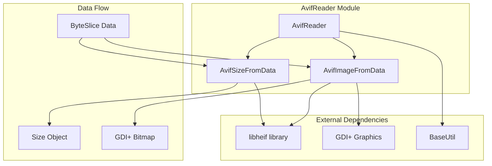
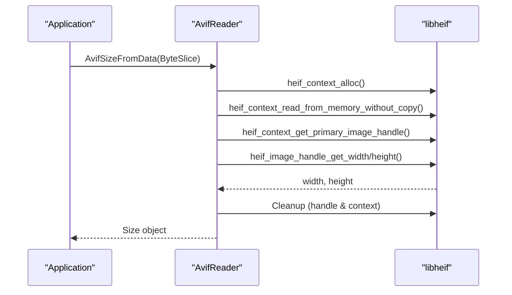
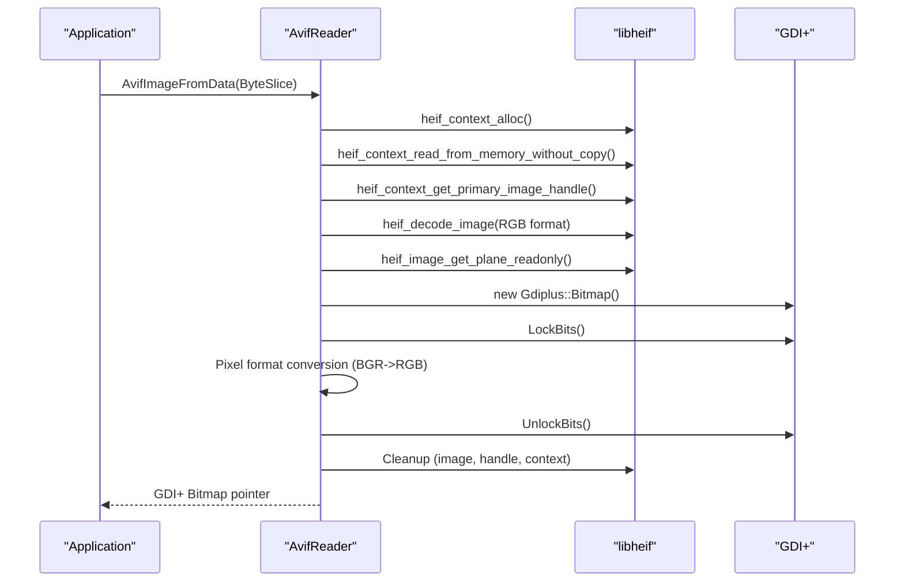

# AvifReader Module Documentation

## Introduction

The AvifReader module provides functionality for reading and processing AVIF (AV1 Image File Format) images within the SumatraPDF application. It serves as a lightweight wrapper around the libheif library, offering a simple interface to extract image dimensions and convert AVIF images to GDI+ bitmap objects for display.

## Module Overview

The AvifReader module is designed as a utility component that handles AVIF image format support in SumatraPDF. It provides two primary functions: extracting image dimensions without full decoding, and converting AVIF image data into Windows GDI+ bitmap objects suitable for rendering in the application's user interface.

## Architecture

### Component Structure

### Core Components

The module consists of two main functions that work with libheif data structures:

- **heif_image_handle**: A handle to the primary image within an AVIF container
- **heif_image**: The decoded image data in a specific color format

## Functionality

### Image Size Extraction

The `AvifSizeFromData` function provides a lightweight way to extract image dimensions without performing full image decoding:

### Image Conversion

The `AvifImageFromData` function performs full image decoding and conversion to GDI+ bitmap format:

## Implementation Details

### Color Space Handling

The module currently decodes images to RGB format with the following configuration:
- **Color Space**: `heif_colorspace_RGB`
- **Chroma**: `heif_chroma_interleaved_RGB`
- **Pixel Format**: `PixelFormat32bppRGB` (32-bit RGB without alpha channel)

### Memory Management

The implementation follows a strict cleanup pattern:
1. All libheif resources are properly released in reverse order of allocation
2. Early exit on error conditions with proper cleanup
3. Context and handle management to prevent memory leaks

### Pixel Format Conversion

The module performs BGR to RGB color channel swapping during the copy process, as libheif provides data in BGR format while GDI+ expects RGB format.

## Dependencies

### Internal Dependencies
- **BaseUtil**: Provides fundamental utilities including the `ByteSlice` data structure and basic types

### External Dependencies
- **libheif**: Core AVIF/HEIF image format decoding library
- **GDI+**: Windows graphics library for bitmap creation and manipulation

### Build Configuration
The module supports conditional compilation through the `NO_AVIF` preprocessor directive, allowing AVIF support to be disabled at build time.

## Error Handling

The module implements defensive programming practices:
- All libheif function calls are checked for error conditions
- Graceful degradation when AVIF support is disabled
- Proper resource cleanup on error paths
- Return of null/empty values on failure

## Performance Considerations

### Memory Efficiency
- Uses `heif_context_read_from_memory_without_copy` to avoid unnecessary data copying
- Direct plane access for pixel data to minimize memory allocations
- Efficient pixel-by-pixel copying with stride handling

### Processing Pipeline
- Size extraction without full decoding for quick metadata access
- Streamlined conversion process with minimal intermediate buffers
- Optimized pixel format conversion during the copy operation

## Integration Points

The AvifReader module integrates with SumatraPDF's image handling pipeline, providing AVIF format support alongside other image formats. It serves as a bridge between the libheif library and the application's GDI+-based rendering system.

## Future Considerations

### Potential Enhancements
- Alpha channel support for images with transparency
- Color space optimization based on source image properties
- Performance optimizations for large images
- Extended metadata extraction capabilities

### TODO Items
The source code contains several TODO comments indicating areas for future improvement:
- Investigate partial image loading capabilities
- Evaluate color space matching requirements for alpha channel handling
- Consider memcpy optimization for pixel copying

## Related Modules

For information about other image format readers in the system, see:
- [TgaReader](TgaReader.md): TGA image format support
- [EngineImages](EngineImages.md): Image-based document engine that may utilize AvifReader

For graphics and rendering components, see:
- [mupdf_java_bindings](mupdf_java_bindings.md): PDF and document rendering system
- [ui_components](ui_components.md): User interface components that display images