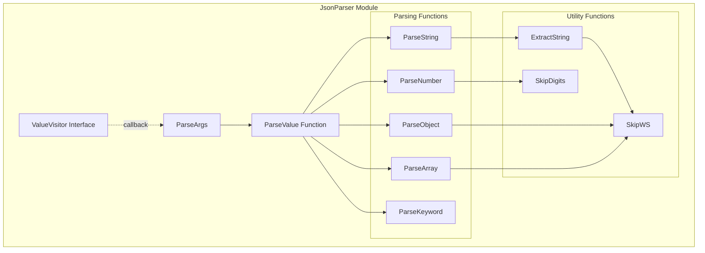
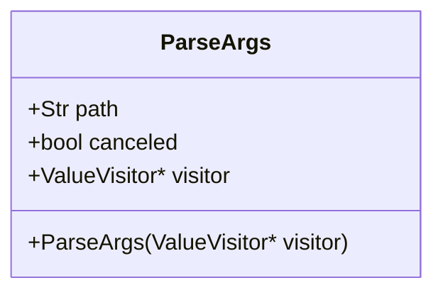
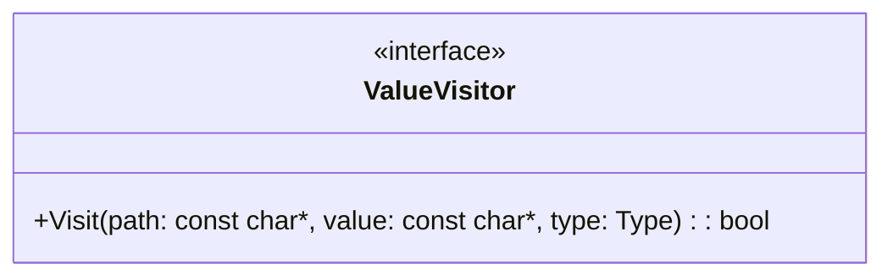
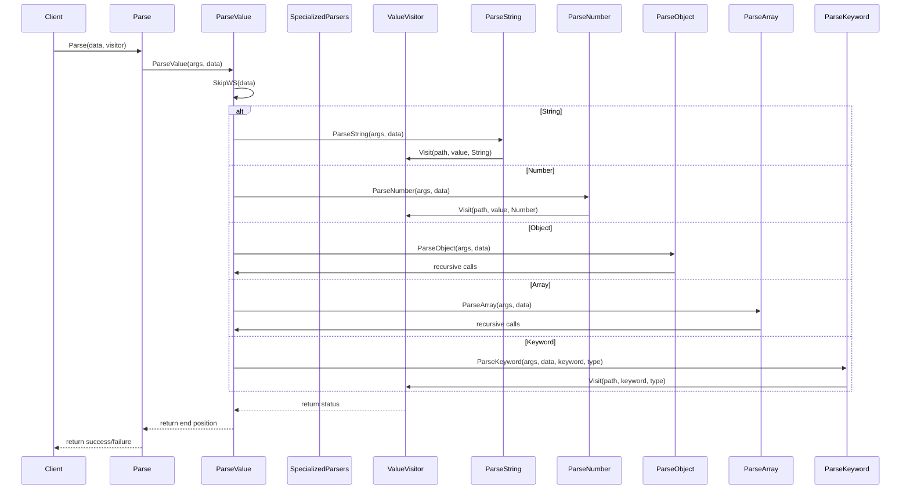
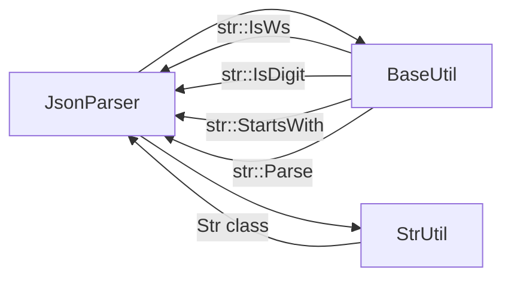

# JsonParser Module Documentation

## Introduction

The JsonParser module provides a lightweight, streaming JSON parser implementation for the SumatraPDF project. It offers a visitor pattern-based approach to JSON parsing that allows for efficient processing of JSON data without loading entire documents into memory. The parser is designed to handle standard JSON syntax including objects, arrays, strings, numbers, booleans, and null values.

## Architecture Overview

The JsonParser module follows a recursive descent parsing architecture with a visitor pattern for handling parsed values. The core design separates parsing logic from data processing, allowing flexible handling of JSON content.



## Core Components

### ParseArgs Class

The `ParseArgs` class serves as the primary data structure for coordinating parsing operations and maintaining parser state.



**Properties:**
- `path`: Tracks the current JSON path using JSON Pointer notation (e.g., `/object/array[0]/property`)
- `canceled`: Boolean flag to indicate if parsing should be terminated early
- `visitor`: Pointer to the ValueVisitor interface for handling parsed values

### ValueVisitor Interface

The ValueVisitor interface provides the callback mechanism for processing parsed JSON values. While not directly implemented in the provided code, it's referenced as the interface that consuming code must implement.



**Method:**
- `Visit`: Called for each parsed value with its path, value, and type information. Returns `false` to cancel parsing.

### Type Enumeration

The parser recognizes five JSON value types:
- `Type::String`: JSON string values
- `Type::Number`: Numeric values (integers and floating-point)
- `Type::Bool`: Boolean values (true/false)
- `Type::Null`: Null values
- `Type::Object` and `Type::Array`: Complex types handled through recursive parsing

## Parsing Process Flow

The parsing process follows a recursive descent approach, with each JSON value type handled by a specialized parsing function.



## Key Features

### 1. Streaming Parser Design
The parser processes JSON data in a single pass without building an in-memory representation, making it memory-efficient for large JSON documents.

### 2. UTF-8 Support
Full UTF-8 support including Unicode escape sequences (`\uXXXX`) with proper conversion to UTF-8 encoding.

### 3. Path Tracking
Maintains JSON Pointer notation paths for each value, enabling precise location tracking within nested structures.

### 4. Early Termination
Supports cancellation during parsing through the visitor interface, allowing applications to stop processing when specific conditions are met.

### 5. BOM Handling
Automatically detects and skips UTF-8 Byte Order Mark (BOM) at the beginning of input data.

## Error Handling

The parser uses a fail-fast approach with null pointer returns to indicate parsing errors. Common error conditions include:

- Malformed JSON syntax
- Invalid escape sequences in strings
- Invalid numeric formats
- Unexpected characters
- Premature end of input

## Usage Example

```cpp
class MyVisitor : public json::ValueVisitor {
public:
    bool Visit(const char* path, const char* value, json::Type type) override {
        printf("Path: %s, Value: %s, Type: %d\n", path, value, (int)type);
        return true; // Continue parsing
    }
};

// Usage
MyVisitor visitor;
const char* jsonData = R"({"name": "example", "count": 42})";
bool success = json::Parse(jsonData, &visitor);
```

## Dependencies

The JsonParser module has minimal dependencies within the SumatraPDF codebase:

- **BaseUtil**: Provides fundamental utilities including string operations and character classification
- **StrUtil**: String manipulation utilities for the `Str` class used in path tracking



## Performance Characteristics

- **Time Complexity**: O(n) where n is the length of the input JSON string
- **Space Complexity**: O(d) where d is the maximum depth of the JSON structure (for path tracking)
- **Memory Usage**: Minimal heap allocation, primarily for string extraction and path building

## Integration with SumatraPDF

The JsonParser module is designed as a utility component that can be used throughout the SumatraPDF application for:

- Configuration file parsing
- Metadata extraction from document formats
- Settings and preferences handling
- Plugin communication protocols

The streaming nature makes it particularly suitable for processing potentially large JSON files without impacting application responsiveness.

## Related Modules

For comprehensive document processing capabilities, the JsonParser works alongside other utility modules:

- [Archive](Archive.md) - For handling compressed JSON files
- [FileWatcher](FileWatcher.md) - For monitoring JSON configuration files
- [StrFormat](StrFormat.md) - For formatted output of parsed data

## Future Enhancements

Potential improvements to the JsonParser module could include:

1. **Validation Mode**: Strict JSON schema validation
2. **Error Reporting**: Detailed error messages with line/column information
3. **Incremental Parsing**: Support for parsing JSON data in chunks
4. **Custom Allocators**: Pluggable memory management for embedded systems
5. **JSON5 Support**: Extended syntax support for modern JSON variants