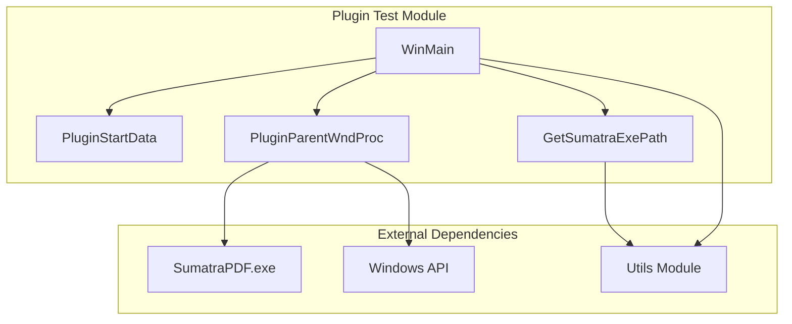
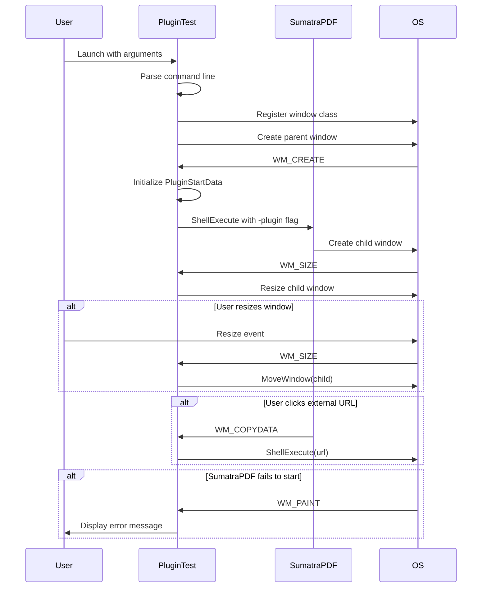
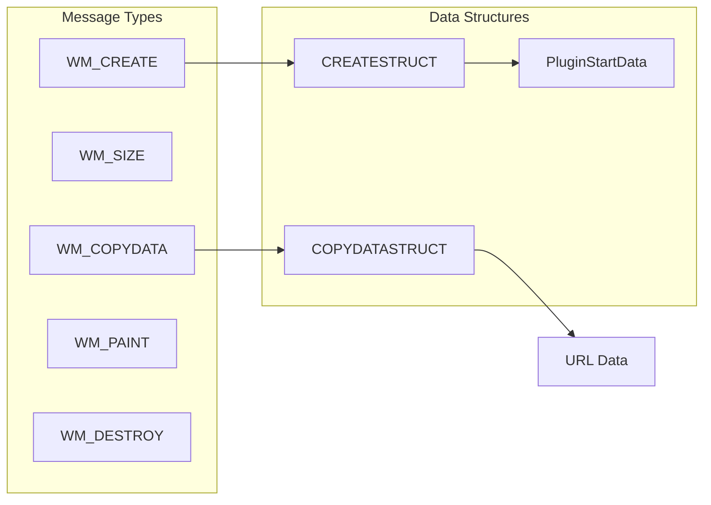
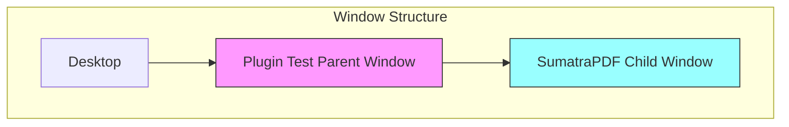

# Plugin Test Module Documentation

## Introduction

The Plugin Test module is a minimal example implementation demonstrating how to host SumatraPDF as a plugin within another application. This module serves as both a reference implementation and a testing tool for the plugin functionality, showing developers how to integrate SumatraPDF's document viewing capabilities into their own applications through a plugin architecture.

## Module Overview

The Plugin Test module provides a complete working example of hosting SumatraPDF in plugin mode, handling window management, inter-process communication, and error scenarios. It demonstrates the essential patterns for integrating SumatraPDF as a child window within a parent application.

## Core Architecture

### Component Structure



### Key Components

#### PluginStartData Structure
The `PluginStartData` structure serves as the configuration object for plugin initialization, containing:
- `sumatraPath`: Path to the SumatraPDF executable
- `filePath`: Path to the document to be displayed
- `fileOriginUrl`: Optional URL/origin information for UI display

#### PluginParentWndProc Function
The window procedure function handles critical plugin lifecycle events:
- **WM_CREATE**: Launches SumatraPDF with plugin parameters
- **WM_SIZE**: Manages window resizing and layout
- **WM_COPYDATA**: Handles URL opening requests from the plugin
- **WM_PAINT**: Provides error state visualization
- **WM_DESTROY**: Handles cleanup and application termination

#### WinMain Function
The main entry point orchestrates:
- Command-line argument parsing and validation
- Window class registration
- Plugin initialization and window creation
- Message loop management

## Data Flow Architecture



## Plugin Communication Protocol

### Window Message Interface

The plugin communication is based on Windows messages with specific data structures:



### Command Line Interface

SumatraPDF is launched with the following plugin-specific command line format:
```
SumatraPDF.exe -plugin [origin_url] <parent_hwnd> "<file_path>"
```

## Integration Patterns

### Window Hierarchy


### Error Handling Strategy

The module implements a multi-layered error handling approach:

1. **File Existence Check**: Verifies SumatraPDF executable availability
2. **Process Launch Monitoring**: Detects SumatraPDF startup failures
3. **Visual Error Feedback**: Provides user-friendly error messages
4. **Graceful Degradation**: Continues operation even if child window creation fails

## Dependencies and Integration

### Internal Dependencies
- **Utils Module**: Provides file system utilities, string manipulation, and Windows-specific helpers
- **BaseUtil**: Core utility functions and type definitions

### External Dependencies
- **Windows API**: Window management, process creation, inter-process communication
- **SumatraPDF.exe**: The actual document viewer application

### Related Modules
- [Utils](Utils.md): Provides foundational utilities for file operations and string handling
- [UI Components](UI Components.md): For understanding window management patterns

## Usage Examples

### Basic Plugin Integration
```cpp
// Initialize plugin data
PluginStartData data = {
    "C:\\Program Files\\SumatraPDF\\SumatraPDF.exe",
    "C:\\Documents\\document.pdf",
    "https://example.com/document.pdf"
};

// Create parent window with plugin support
HWND hwnd = CreateWindowExW(0, PLUGIN_NAME, PLUGIN_NAME, 
                           WS_OVERLAPPEDWINDOW, CW_USEDEFAULT, 0,
                           CW_USEDEFAULT, 0, nullptr, nullptr, 
                           hInstance, &data);
```

### Custom Error Handling
The plugin test demonstrates how to handle various error scenarios:
- Missing SumatraPDF executable
- Invalid document paths
- Plugin startup failures
- Window communication issues

## Security Considerations

### Process Isolation
- SumatraPDF runs as a separate process, providing crash isolation
- Parent application remains stable even if plugin crashes

### URL Handling
- External URL requests are intercepted and handled by the parent
- Prevents unwanted navigation or security issues

### File Access
- Document paths are validated before passing to SumatraPDF
- Origin URL provides context without exposing temporary file paths

## Performance Characteristics

### Startup Time
- Plugin initialization typically completes within milliseconds
- SumatraPDF process launch adds minimal overhead

### Memory Usage
- Parent application maintains minimal memory footprint
- Most resources managed by SumatraPDF process

### Responsiveness
- Window resize operations handled in real-time
- Smooth integration with parent application UI

## Testing and Validation

### Test Scenarios
1. **Normal Operation**: Standard document loading and display
2. **Error Conditions**: Missing files, invalid paths, startup failures
3. **Window Management**: Resize, minimize, maximize operations
4. **URL Handling**: External link navigation
5. **Cleanup**: Proper resource deallocation on exit

### Validation Points
- Successful SumatraPDF process creation
- Proper window hierarchy establishment
- Correct message handling and routing
- Graceful error recovery

## Future Enhancements

### Potential Improvements
- **Bidirectional Communication**: Enhanced message passing capabilities
- **Plugin API**: Standardized interface for plugin development
- **Error Reporting**: Detailed diagnostic information
- **Configuration Management**: Runtime plugin configuration options

### Extension Points
- Custom message handlers for application-specific features
- Integration with application-specific UI themes
- Advanced error recovery mechanisms
- Performance monitoring and optimization

## Conclusion

The Plugin Test module serves as a comprehensive example of embedding SumatraPDF functionality within external applications. It demonstrates best practices for plugin architecture, inter-process communication, and error handling while providing a solid foundation for custom integrations. The modular design and clear separation of concerns make it an excellent reference for developers looking to incorporate document viewing capabilities into their applications.