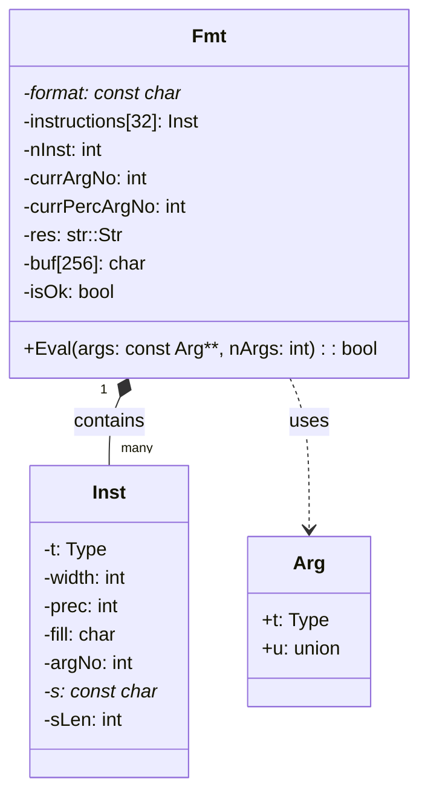
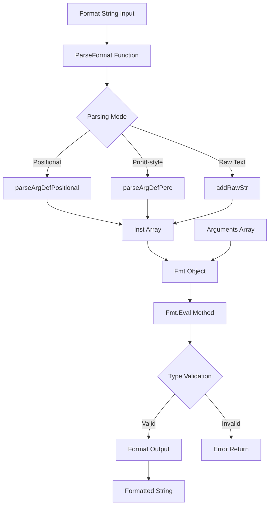
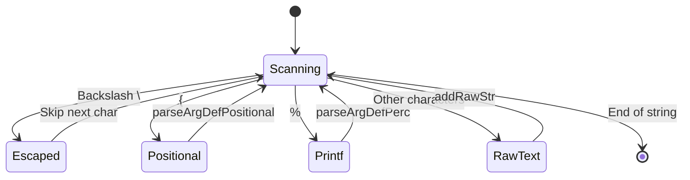
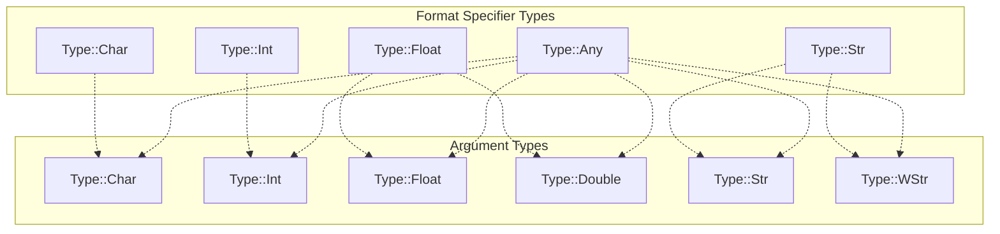
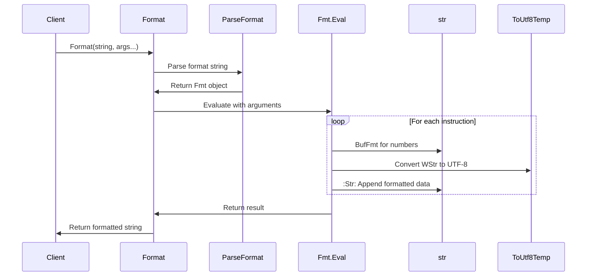
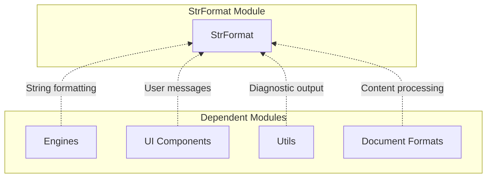

# StrFormat Module Documentation

## Introduction

The StrFormat module provides a flexible and type-safe string formatting system for C++ applications. It implements a printf-style formatting mechanism with support for both positional arguments (`{n}`) and traditional printf-style format specifiers (`%d`, `%s`, etc.). The module is designed to handle various data types including integers, floating-point numbers, strings, and wide strings while providing compile-time type safety and runtime validation.

## Architecture Overview

The StrFormat module is built around two core components that work together to provide a complete formatting solution:

### Core Components

1. **Fmt** - The main formatting engine that parses format strings and evaluates them against provided arguments
2. **Inst** - Individual formatting instructions that represent parsed format specifiers

## Data Flow Architecture

The formatting process follows a clear two-phase approach:

## Format String Parsing

The module supports two distinct format specification styles:

### Positional Format Specifiers
- Syntax: `{n}` where `n` is the argument index
- Example: `"Value: {0}, Count: {1}"`
- Allows reordering and reuse of arguments

### Printf-style Format Specifiers
- Syntax: `%[flags][width][.precision]type`
- Supported types: `c` (char), `d` (integer), `f` (float), `s` (string), `v` (any)
- Example: `"Name: %s, Age: %d, Score: %.2f"`

## Type System

The module implements a comprehensive type system that ensures type safety during formatting:

### Supported Types
- **Type::None**: Empty/unused argument
- **Type::Char**: Single character
- **Type::Int**: Integer values
- **Type::Float**: Single-precision floating point
- **Type::Double**: Double-precision floating point
- **Type::Str**: C-style string (const char*)
- **Type::WStr**: Wide string (const WCHAR*)
- **Type::Any**: Generic type acceptance
- **Type::RawStr**: Literal string segments

### Type Validation Matrix

## Component Interactions

The formatting system interacts with several utility modules:

## Error Handling

The module implements comprehensive error handling at multiple levels:

1. **Parse-time validation**: Ensures format string syntax is correct
2. **Argument count validation**: Verifies all referenced arguments are provided
3. **Type compatibility validation**: Checks that argument types match format specifiers
4. **Buffer overflow protection**: Uses fixed-size buffers with bounds checking

## Performance Characteristics

- **Memory allocation**: Uses stack-allocated buffer (256 bytes) for temporary formatting
- **Instruction limit**: Supports up to 32 format instructions per format string
- **String building**: Efficient appending using str::Str for result construction
- **Type conversion**: Lazy conversion of wide strings to UTF-8 only when needed

## Integration with System

The StrFormat module serves as a foundational utility used throughout the application:

## API Usage Patterns

The module provides multiple convenience functions for different use cases:

1. **Dynamic allocation**: `Format()` - Returns newly allocated string
2. **Temporary strings**: `FormatTemp()` - Returns temporary buffer (for immediate use)
3. **Variable arguments**: Overloaded functions supporting 1-6 arguments
4. **Array-based**: Direct argument array processing for advanced scenarios

## Thread Safety

- The formatting functions themselves are thread-safe
- Returned strings from `Format()` are owned by the caller
- `FormatTemp()` returns thread-local temporary storage
- No shared mutable state between concurrent formatting operations

This design makes the StrFormat module a robust, efficient, and type-safe solution for string formatting needs throughout the application.