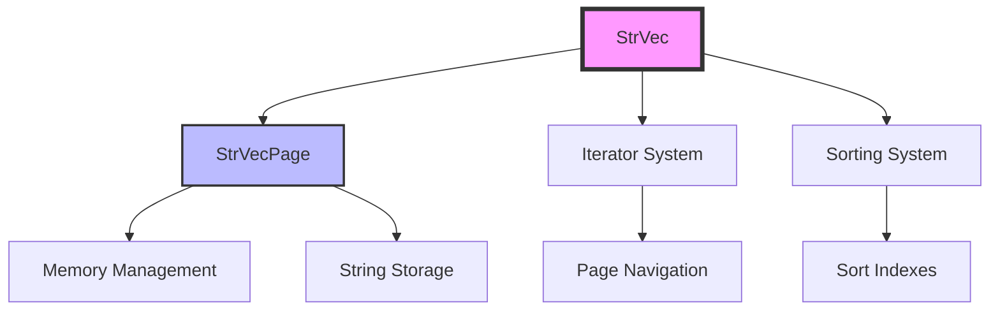
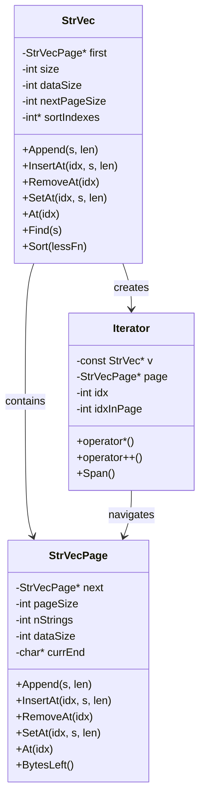
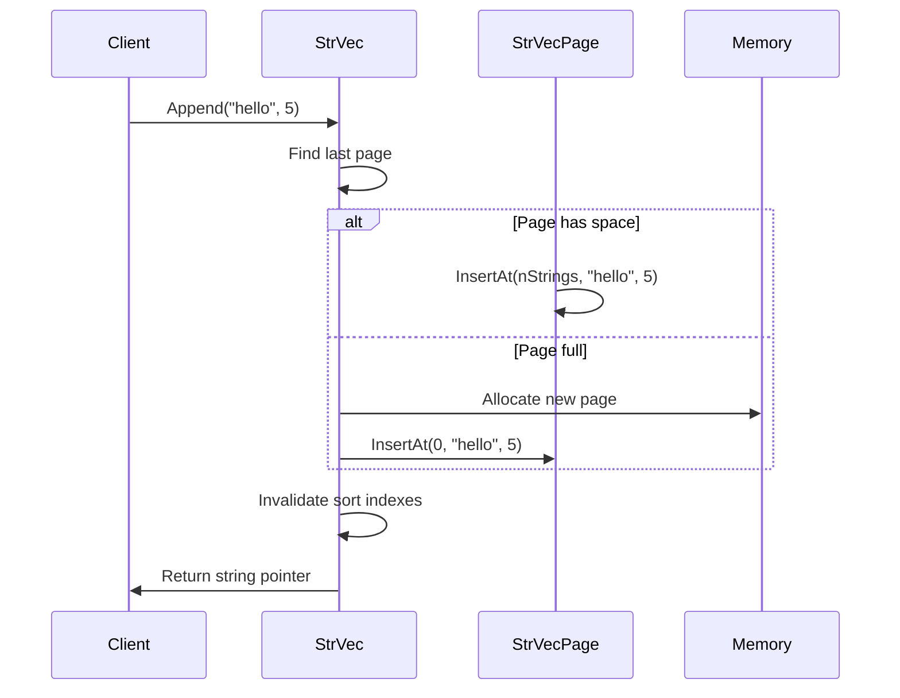
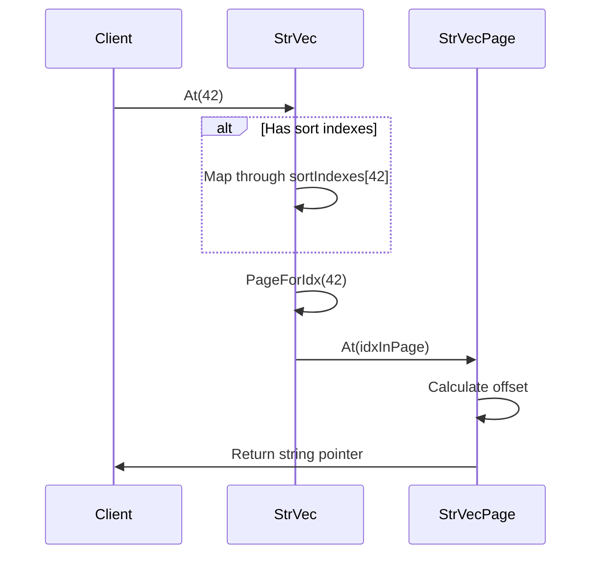
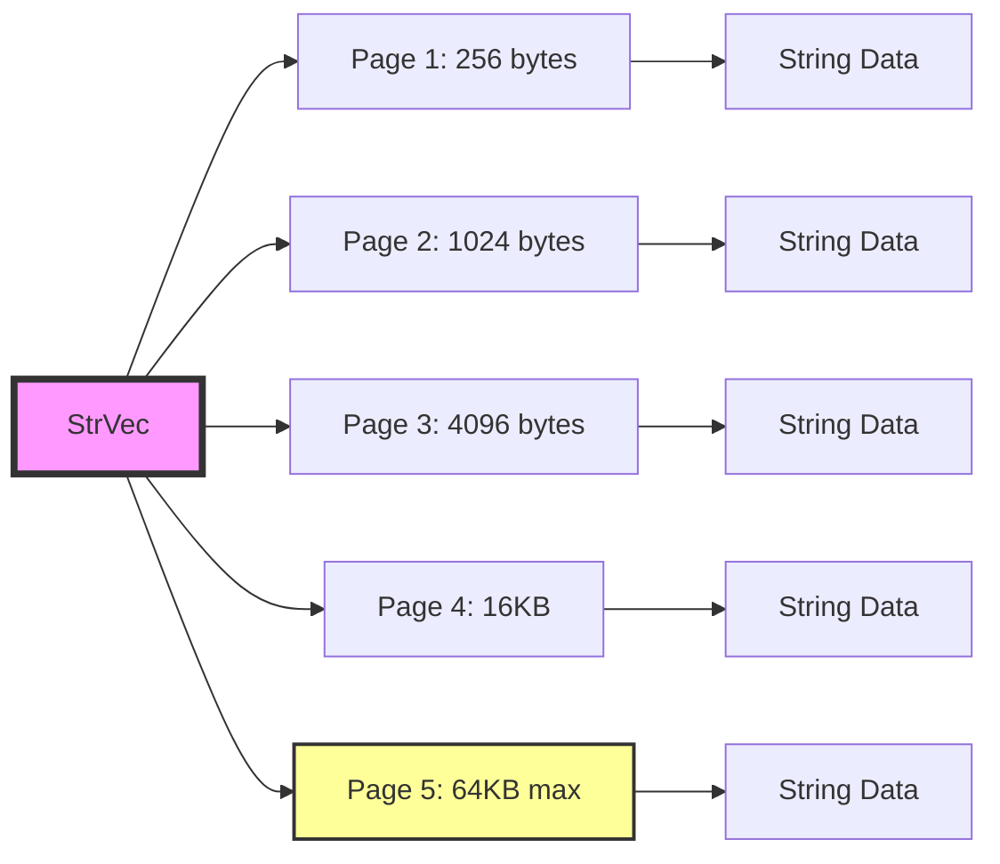
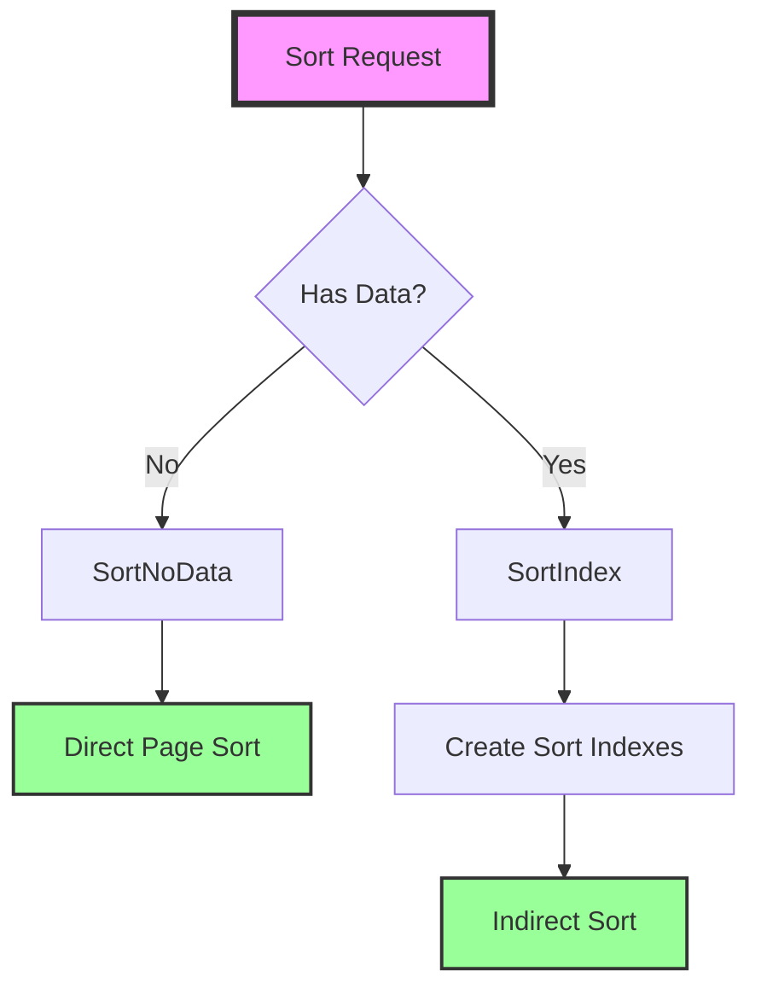
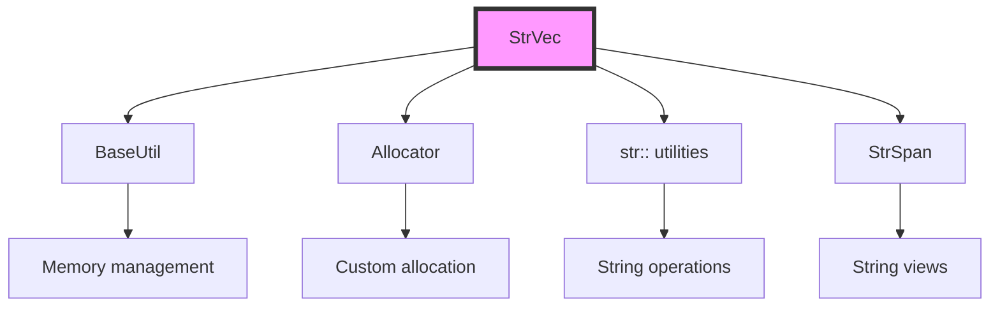

# StrVec Module Documentation

## Introduction

The StrVec module provides a high-performance, memory-efficient string vector implementation for the SumatraPDF project. It offers dynamic array functionality specifically optimized for storing and manipulating collections of strings with minimal memory overhead and fast operations.

## Overview

StrVec is a specialized string container that uses a paged memory allocation strategy to efficiently manage large collections of strings. Unlike standard C++ containers, it's designed with performance and memory efficiency as primary goals, making it particularly suitable for applications that need to handle large numbers of strings with minimal overhead.

## Architecture

### Core Components



### Component Relationships



## Data Flow

### String Insertion Flow



### String Retrieval Flow



## Memory Management

### Page-Based Allocation Strategy

The StrVec module uses a sophisticated paged allocation system designed for optimal memory usage:



### Memory Layout

Each StrVecPage contains:
- **Header**: Page metadata (next pointer, sizes, counters)
- **Index Array**: Offset and length pairs for each string
- **Optional Data**: Additional per-string data (if dataSize > 0)
- **String Storage**: Actual string data allocated from the end of the page

```
┌─────────────────────────────────────────────────────────────┐
│                    StrVecPage Memory Layout                 │
├─────────────────────────────────────────────────────────────┤
│ Header (StrVecPage struct)                                  │
├─────────────────────────────────────────────────────────────┤
│ Index Entry 0: [offset][length][optional data]             │
│ Index Entry 1: [offset][length][optional data]             │
│ ...                                                         │
│ Index Entry N-1: [offset][length][optional data]           │
├─────────────────────────────────────────────────────────────┤
│ Free Space                                                  │
├─────────────────────────────────────────────────────────────┤
│ String N-1 (allocated from end)                            │
│ ...                                                         │
│ String 1 (allocated from end)                              │
│ String 0 (allocated from end)                              │
└─────────────────────────────────────────────────────────────┘
```

## Key Features

### 1. Efficient String Operations

- **Fast Append**: O(1) amortized time complexity
- **Fast Random Access**: O(1) with page navigation
- **Memory Efficient**: Minimal overhead per string
- **Zero-Copy Operations**: Returns direct pointers to stored strings

### 2. Advanced Sorting Capabilities



### 3. Flexible Comparison Functions

- **Case-Sensitive**: Standard string comparison
- **Case-Insensitive**: `StrLessNoCase` for case-insensitive sorting
- **Natural Sorting**: `StrLessNatural` for human-friendly ordering

### 4. String Manipulation Utilities

- **Split**: Efficient string splitting with separator handling
- **Join**: Fast string concatenation with custom separators
- **Find/Contains**: Linear search with optional case-insensitive matching

## Performance Characteristics

### Time Complexity

| Operation | Average Case | Worst Case | Notes |
|-----------|-------------|------------|---------|
| Append | O(1) | O(1) | Amortized, may trigger page allocation |
| InsertAt | O(n) | O(n) | Requires shifting elements |
| RemoveAt | O(n) | O(n) | Requires shifting elements |
| RemoveAtFast | O(1) | O(1) | Swaps with last element |
| At/Random Access | O(1) | O(1) | Page navigation is O(pages) |
| Find | O(n) | O(n) | Linear search |
| Sort | O(n log n) | O(n log n) | Uses std::sort |

### Space Complexity

- **Per String Overhead**: 8 bytes (offset + length) + optional data
- **Page Overhead**: Fixed header size (~32 bytes)
- **Growth Strategy**: Exponential page size growth (256B → 1024B → 4KB → 16KB → 64KB)

## Integration with System

### Dependencies

The StrVec module integrates with several other system components:



### Usage Patterns

StrVec is designed to be used throughout the SumatraPDF application for:
- **File Lists**: Managing collections of file paths
- **Configuration**: Storing settings and preferences
- **Document Processing**: Handling text extraction and manipulation
- **UI Data**: Managing list items and menu entries

## Error Handling

The module uses several strategies for error handling:

1. **Assertion-Based Validation**: `ReportIf()` macros for debug builds
2. **Null String Handling**: Special `kNullOffset` value for null strings
3. **Memory Allocation**: Returns `kNoSpace` when allocation fails
4. **Bounds Checking**: Validates all array accesses

## Thread Safety

StrVec is **not thread-safe** by design. Concurrent access requires external synchronization:

- **Read Operations**: Multiple concurrent reads are safe if no writes occur
- **Write Operations**: Must be externally synchronized
- **Mixed Operations**: Require full external synchronization

## Best Practices

### 1. Memory Efficiency

```cpp
// Good: Reserve space when size is known
StrVec vec;
vec.Append("item1");
vec.Append("item2");
// Let the system manage page allocation

// Better: Batch operations when possible
StrVec vec;
for (const auto& item : largeCollection) {
    vec.Append(item.c_str(), item.length());
}
```

### 2. Performance Optimization

```cpp
// Use RemoveAtFast when order doesn't matter
vec.RemoveAtFast(index);  // O(1) vs O(n)

// Use Find with length when possible
int idx = vec.Find(StrSpan(needle, needleLen));
```

### 3. Sorting Strategy

```cpp
// For data without additional per-string data
StrVec vec(0);  // dataSize = 0
Sort(&vec, StrLessNatural);  // Uses faster SortNoData

// For data with additional per-string data
StrVec vec(sizeof(MyData));
Sort(&vec, StrLessNoCase);  // Uses SortIndex
```

## Future Enhancements

Potential areas for improvement:

1. **Thread-Safe Variants**: Add optional internal synchronization
2. **Custom Allocators**: Support for memory pool allocation
3. **Unicode Support**: Enhanced UTF-8 handling capabilities
4. **Compression**: Optional string compression for large datasets
5. **SIMD Optimization**: Vectorized string operations for bulk processing

## Related Documentation

- [Utils Module Overview](Utils.md) - General utilities documentation
- [StrSpan Documentation](StrSpan.md) - String view implementation
- [Allocator System](Allocator.md) - Memory management details
- [String Utilities](str_utilities.md) - Supporting string functions

## Conclusion

The StrVec module provides a robust, high-performance foundation for string collection management in SumatraPDF. Its paged architecture, efficient memory usage, and comprehensive feature set make it well-suited for the demanding requirements of document processing applications. The design balances performance, memory efficiency, and ease of use, making it an excellent choice for managing large collections of strings throughout the application.