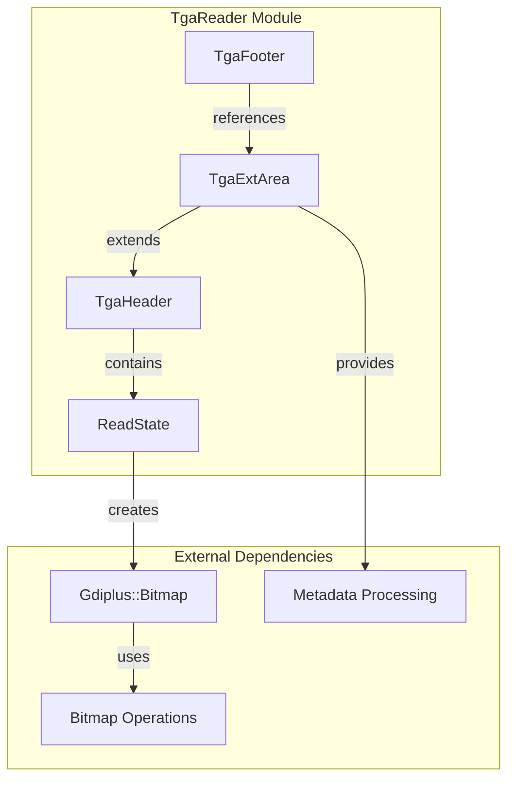
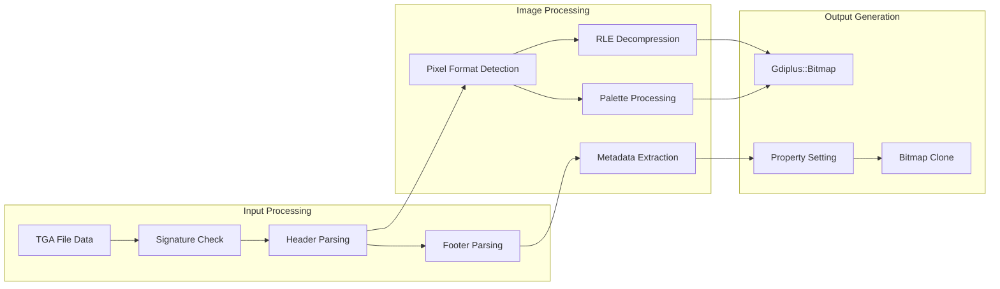
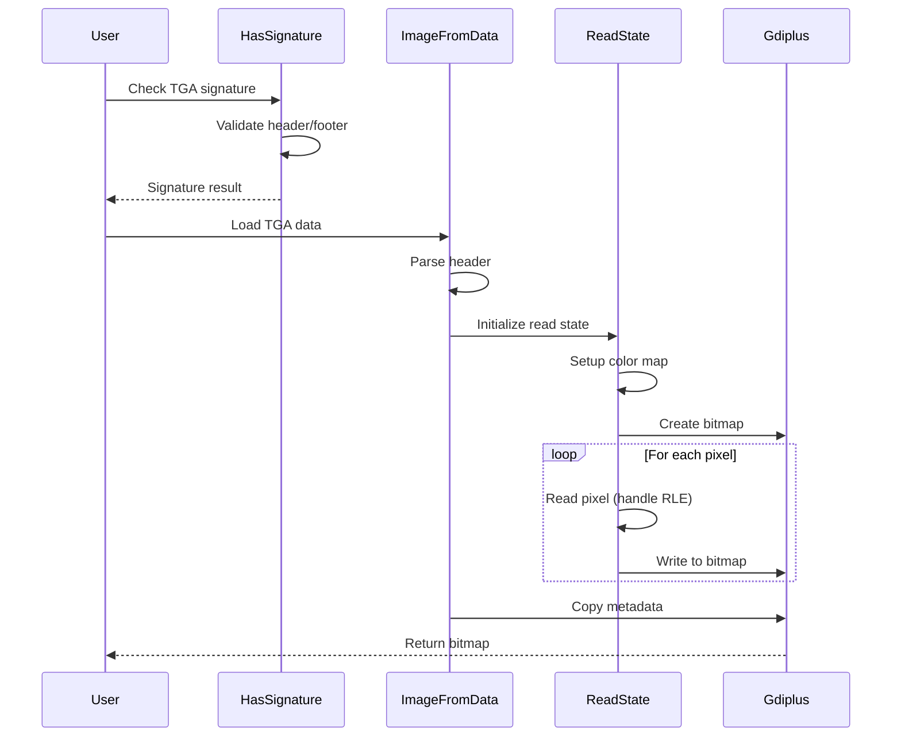
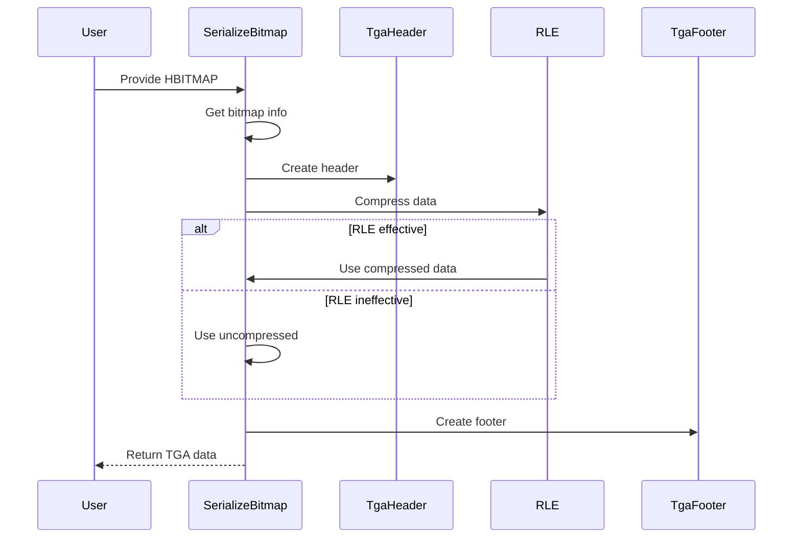

# TgaReader Module Documentation

## Introduction

The TgaReader module provides comprehensive functionality for reading and writing TGA (Truevision Graphics Adapter) image files. TGA is a raster graphics file format that supports various color depths, compression methods, and metadata storage. This module is part of the SumatraPDF utility system and handles both TGA file parsing and bitmap serialization operations.

## Module Overview

The TgaReader module is located within the `src.utils` namespace and provides a complete implementation for TGA file format support. It handles various TGA image types including palette-based, truecolor, and grayscale images, with optional RLE (Run-Length Encoding) compression support. The module also supports TGA format version 2.0 features including extended metadata areas.

## Core Components

### 1. TgaHeader Structure

The `TgaHeader` structure represents the standard TGA file header containing essential image information:

```cpp
struct TgaHeader {
    u8 idLength;        // Length of ID field
    u8 cmapType;        // Color map type (0=none, 1=palette)
    u8 imageType;       // Image type (palette, truecolor, grayscale, RLE variants)
    u16 cmapFirstEntry; // First entry index for color map
    u16 cmapLength;     // Number of entries in color map
    u8 cmapBitDepth;    // Bit depth of color map entries
    u16 offsetX, offsetY; // Image origin coordinates
    u16 width, height;  // Image dimensions
    u8 bitDepth;        // Bits per pixel
    u8 flags;           // Image flags (alpha, orientation)
};
```

### 2. TgaFooter Structure

The `TgaFooter` structure contains version 2.0 TGA format footer information:

```cpp
struct TgaFooter {
    u32 extAreaOffset;  // Offset to extension area
    u32 devAreaOffset;  // Offset to developer area
    char signature[18]; // File signature ("TRUEVISION-XFILE.")
};
```

### 3. TgaExtArea Structure

The `TgaExtArea` structure handles extended metadata for TGA version 2.0:

```cpp
struct TgaExtArea {
    u16 size;                    // Size of extension area
    char author[41];             // Author name
    char comments[4][81];        // Comment fields
    u16 dateTime[6];             // Date/time information
    u8 fields_14_to_15[47];      // Reserved fields
    char progName[41];           // Program name
    u16 progVersion;             // Program version
    char progVersionC;           // Program version character
    u32 fields_18_to_23[6];      // Additional reserved fields
    u8 alphaType;                // Alpha channel type
};
```

### 4. ReadState Structure

The `ReadState` structure manages the state during TGA file reading operations:

```cpp
struct ReadState {
    const u8* data;     // Current data pointer
    const u8* end;      // End of data pointer
    ImageType type;     // Image type
    int n;              // Bytes per pixel
    bool isRLE;         // RLE compression flag
    int repeat;         // RLE repeat count
    bool repeatSame;    // RLE repeat same pixel flag
    struct {
        int firstEntry; // Color map first entry
        int length;     // Color map length
        const u8* data; // Color map data
        int n;          // Color map bytes per entry
    } cmap;
    bool failed;        // Read failure flag
};
```

## Architecture

### Module Architecture Diagram



### Data Flow Architecture



## Key Functionality

### Image Type Support

The module supports six different TGA image types through the `ImageType` enumeration:

- **Type_Palette (1)**: Palette-based images without compression
- **Type_Truecolor (2)**: Truecolor images without compression
- **Type_Grayscale (3)**: Grayscale images without compression
- **Type_Palette_RLE (9)**: Palette-based images with RLE compression
- **Type_Truecolor_RLE (10)**: Truecolor images with RLE compression
- **Type_Grayscale_RLE (11)**: Grayscale images with RLE compression

### Pixel Format Detection

The `GetPixelFormat()` function determines the appropriate GDI+ pixel format based on:
- Image type (palette, truecolor, grayscale)
- Bit depth (15, 16, 24, 32 bits per pixel)
- Alpha channel configuration
- Alpha type (ignore, normal, premultiplied)

### RLE Compression Support

The module implements Run-Length Encoding (RLE) compression for both reading and writing:
- **Reading**: `ReadPixel()` function handles RLE decompression during pixel extraction
- **Writing**: `SerializeBitmap()` function implements RLE compression for bitmap serialization

### Metadata Handling

TGA version 2.0 metadata support includes:
- Author information extraction
- Date/time information parsing
- Software/program information with version details
- Alpha channel type specification

## Component Interactions

### Reading Process Flow



### Writing Process Flow



## Dependencies

### Internal Dependencies

The TgaReader module relies on several internal components:

- **BaseUtil**: Provides fundamental utilities and type definitions
- **GDI+**: Used for bitmap creation and manipulation
- **String utilities**: For metadata processing and string operations

### External Dependencies

The module interfaces with:

- **Windows GDI**: For bitmap operations and device context handling
- **GDI+ library**: For advanced image processing and pixel format conversions

## Error Handling

The module implements comprehensive error handling:

- **Size validation**: Checks minimum data sizes for headers and footers
- **Format validation**: Validates image types, bit depths, and color map configurations
- **Memory safety**: Prevents buffer overruns during pixel reading
- **RLE integrity**: Validates RLE compression data integrity
- **Bitmap operations**: Handles GDI+ operation failures gracefully

## Performance Considerations

### Memory Management

- Uses stack-allocated structures for header/footer parsing
- Implements efficient RLE compression/decompression
- Minimizes memory allocations during pixel processing
- Employs temporary buffers for bitmap serialization

### Optimization Strategies

- **RLE compression**: Automatically selects optimal compression method
- **Pixel format detection**: Efficient bit manipulation for format conversion
- **Metadata processing**: Conditional metadata extraction based on availability
- **Endian conversion**: Optimized little-endian conversion functions

## Integration with System

The TgaReader module integrates with the broader SumatraPDF system through:

- **Image format support**: Provides TGA format capabilities to the document engine
- **Bitmap serialization**: Enables TGA export functionality
- **Metadata preservation**: Maintains image metadata across operations
- **Error reporting**: Integrates with system-wide error handling mechanisms

## Usage Examples

### Reading TGA Files

```cpp
// Check if data represents a valid TGA file
ByteSlice tgaData = /* TGA file data */;
if (tga::HasSignature(tgaData)) {
    // Load TGA as GDI+ bitmap
    Gdiplus::Bitmap* bitmap = tga::ImageFromData(tgaData);
    if (bitmap) {
        // Use bitmap...
        delete bitmap;
    }
}
```

### Writing TGA Files

```cpp
// Serialize HBITMAP to TGA format
HBITMAP hBitmap = /* Windows bitmap handle */;
ByteSlice tgaData = tga::SerializeBitmap(hBitmap);
if (tgaData.data) {
    // Save TGA data to file...
    free(tgaData.data);
}
```

## Future Enhancements

Potential improvements to the TgaReader module could include:

- **Additional format support**: Extended bit depths and color spaces
- **Performance optimization**: SIMD optimizations for pixel processing
- **Enhanced metadata**: Support for additional TGA 2.0 metadata fields
- **Streaming support**: Large file processing without full memory loading
- **Validation improvements**: More comprehensive format validation

## Related Modules

The TgaReader module works in conjunction with:

- **[Archive](Archive.md)**: For compressed TGA file handling
- **[GuessFileType](GuessFileType.md)**: For file type detection
- **[FileWatcher](FileWatcher.md)**: For monitoring TGA file changes

This documentation provides a comprehensive overview of the TgaReader module's architecture, functionality, and integration within the SumatraPDF system. The module serves as a robust implementation for TGA format support, enabling both reading and writing operations with full metadata preservation and error handling.