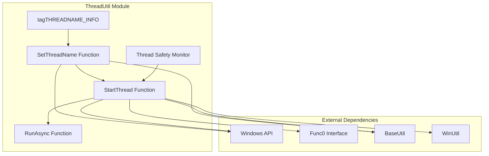
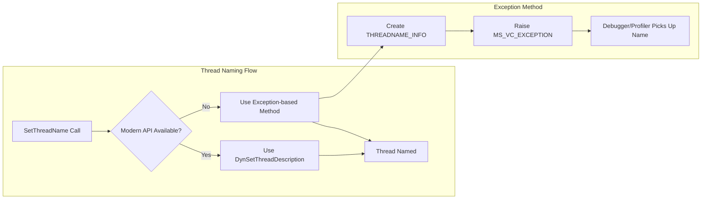
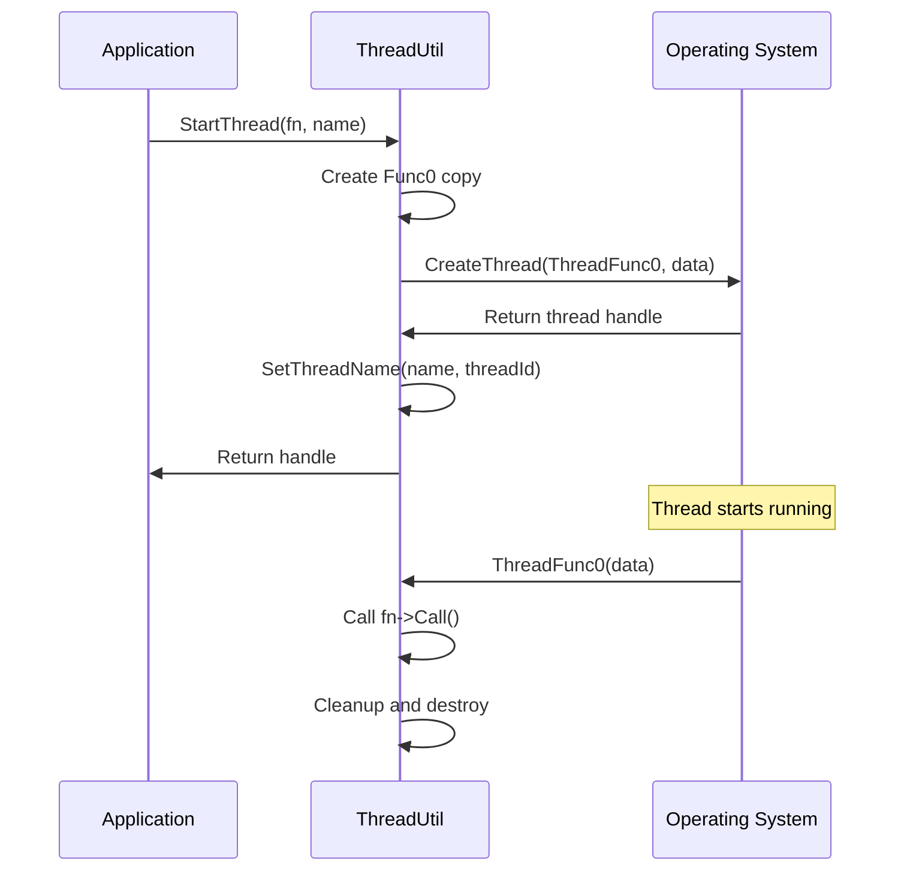
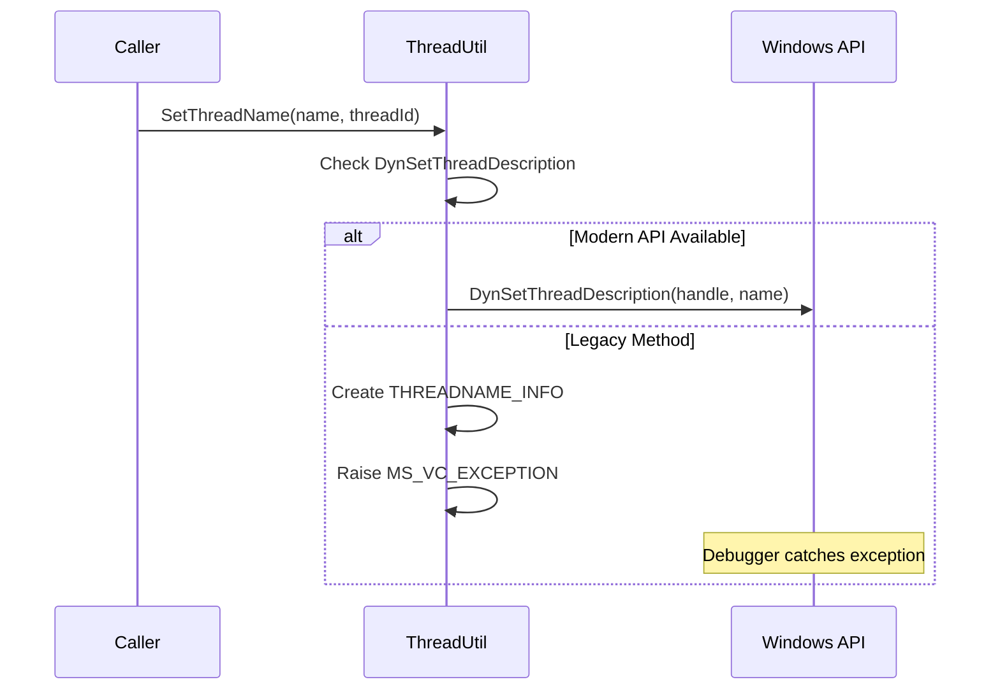

# ThreadUtil Module Documentation

## Introduction

The ThreadUtil module provides essential threading utilities for the SumatraPDF application, offering cross-platform thread management, naming capabilities, and asynchronous execution functionality. This module serves as a foundational component for managing concurrent operations throughout the application.

## Core Functionality

### Thread Naming and Identification

The module's primary feature is the ability to assign meaningful names to threads, which is crucial for debugging, monitoring, and logging purposes. The implementation provides both modern Windows API support and fallback mechanisms for older systems.

### Asynchronous Execution

ThreadUtil offers a clean abstraction for running functions asynchronously, handling thread lifecycle management automatically and providing thread naming for better debugging experience.

### Thread Safety Monitoring

The module includes facilities for tracking "dangerous" threads - threads that perform critical operations and need special consideration during application shutdown or state transitions.

## Architecture

### Component Structure



### Thread Naming Architecture



## Key Components

### tagTHREADNAME_INFO Structure

The `tagTHREADNAME_INFO` structure is the core data structure for thread naming on Windows platforms. It follows the Microsoft-defined format for thread naming exceptions:

```cpp
typedef struct tagTHREADNAME_INFO {
    DWORD dwType;     // Must be 0x1000
    LPCSTR szName;    // Pointer to name string
    DWORD dwThreadID; // Thread ID (-1 for caller thread)
    DWORD dwFlags;    // Reserved, must be zero
} THREADNAME_INFO;
```

### Thread Naming Implementation

The `SetThreadName` function implements a dual-approach strategy:

1. **Modern Approach**: Uses `DynSetThreadDescription` when available (Windows 10+)
2. **Legacy Approach**: Uses the exception-based method for older Windows versions

This ensures compatibility across different Windows versions while leveraging modern APIs when available.

### Thread Creation and Management

The module provides two main functions for thread management:

- **`StartThread`**: Creates a named thread that executes a given function
- **`RunAsync`**: Creates and immediately detaches a thread for fire-and-forget operations

Both functions use the `Func0` interface pattern for flexible function binding.

## Data Flow

### Thread Creation Flow



### Thread Naming Data Flow



## Dependencies

### Internal Dependencies

- **BaseUtil**: Provides fundamental utilities and type definitions
- **WinUtil**: Windows-specific utility functions
- **ScopedWin**: RAII wrappers for Windows handles
- **WinDynCalls**: Dynamic loading of Windows API functions

### External Dependencies

- **Windows API**: Thread creation, exception handling, and modern thread description APIs
- **Func0 Interface**: Abstract function interface for thread execution

## Integration with Other Modules

The ThreadUtil module serves as a foundational component used throughout the application:

- **Document Processing**: Background loading and rendering operations
- **UI Components**: Asynchronous UI updates and background tasks
- **File Operations**: Non-blocking file I/O operations
- **Network Operations**: Background download and update checks

## Thread Safety Considerations

### Atomic Operations

The module uses `AtomicInt` for the dangerous thread counter, ensuring thread-safe increment and decrement operations without explicit locking.

### Resource Management

- **Automatic Cleanup**: Threads automatically clean up their resources upon completion
- **Handle Management**: Uses RAII patterns for handle management
- **Memory Management**: Proper cleanup of dynamically allocated function objects

## Platform Compatibility

### Windows-Specific Implementation

The current implementation is Windows-specific, utilizing:
- Windows thread creation APIs
- MSVC-specific exception handling
- Windows 10+ thread description API

### Cross-Platform Considerations

The module provides stub implementations for non-MSVC compilers, ensuring the code compiles on other platforms, though with reduced functionality.

## Best Practices

### Thread Naming

- Use descriptive, consistent naming conventions
- Include module or operation identifiers in thread names
- Keep names concise but informative

### Thread Lifecycle

- Prefer `RunAsync` for fire-and-forget operations
- Use `StartThread` when thread handle management is needed
- Always consider thread cleanup and synchronization

### Error Handling

- Check return values from thread creation functions
- Handle thread creation failures gracefully
- Consider timeout mechanisms for thread operations

## Performance Considerations

### Thread Creation Overhead

- Thread creation has inherent overhead; consider thread pooling for frequent operations
- The module creates threads with default stack size and security attributes

### Memory Management

- Each thread creates its own temporary allocator
- Function objects are dynamically allocated and automatically cleaned up
- Consider memory usage patterns in long-running threads

## Monitoring and Debugging

### Thread Identification

Named threads appear in debuggers and profiling tools with their assigned names, making it easier to:
- Identify performance bottlenecks
- Debug race conditions
- Monitor thread lifecycle

### Dangerous Thread Tracking

The dangerous thread counter provides a mechanism to:
- Track critical background operations
- Implement graceful shutdown procedures
- Prevent premature application termination

## Future Enhancements

### Potential Improvements

- Cross-platform thread naming support
- Thread pool implementation
- Advanced thread synchronization primitives
- Thread performance metrics and monitoring
- Integration with modern C++ threading facilities

### Platform Extensions

- Linux thread naming via `prctl` or `pthread_setname_np`
- macOS thread naming support
- Portable thread identification mechanisms

## References

- [BaseUtil.md](BaseUtil.md) - Base utility functions and type definitions
- [WinUtil.md](WinUtil.md) - Windows-specific utility functions
- [ScopedWin.md](ScopedWin.md) - RAII wrappers for Windows handles
- [WinDynCalls.md](WinDynCalls.md) - Dynamic API loading utilities

## Related Documentation

- [Microsoft Thread Naming Documentation](https://docs.microsoft.com/en-us/visualstudio/debugger/how-to-set-a-thread-name-in-native-code)
- [Windows Thread API Reference](https://docs.microsoft.com/en-us/windows/win32/api/processthreadsapi/)
- [Func0 Interface Pattern](https://en.wikipedia.org/wiki/Function_object)