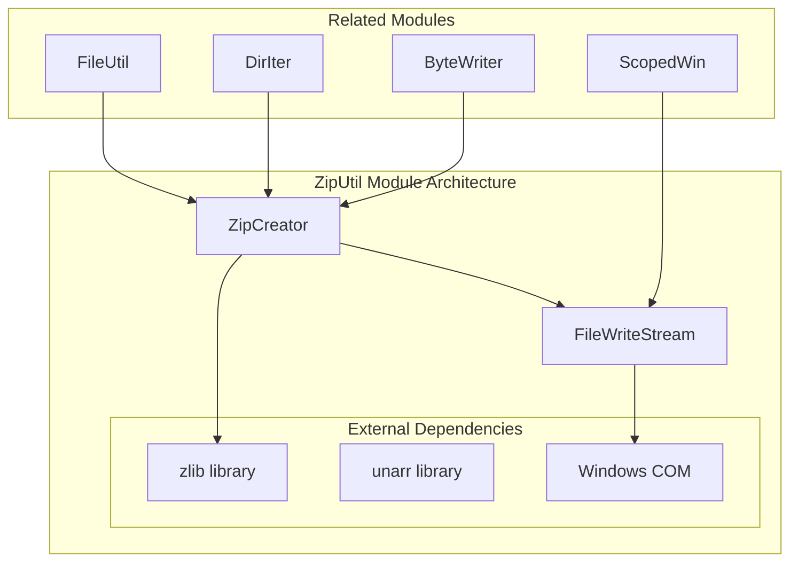
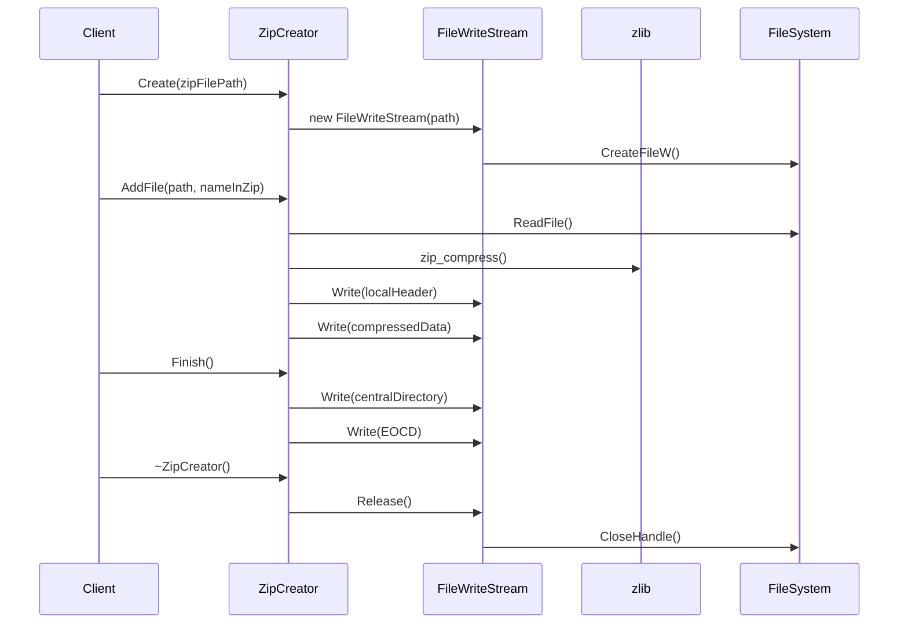
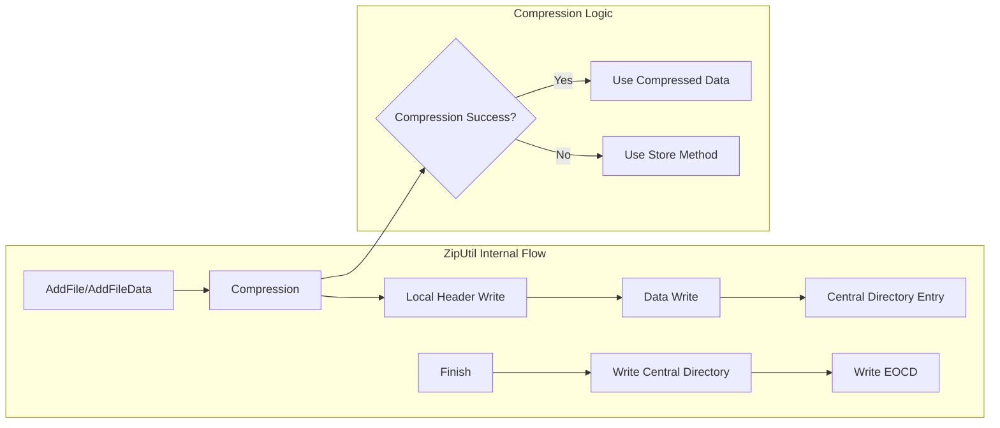
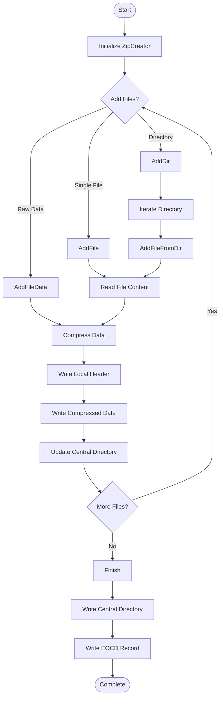
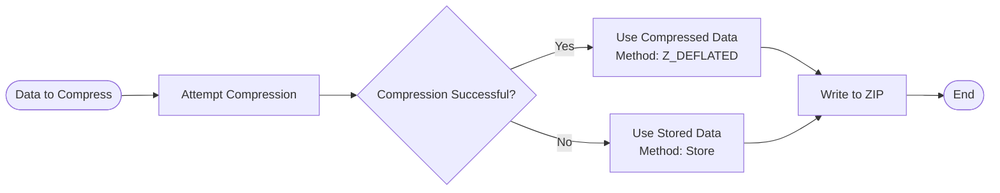

# ZipUtil Module Documentation

## Introduction

The ZipUtil module provides ZIP archive creation and compression functionality for the SumatraPDF application. It offers a high-level interface for creating ZIP files from directories, individual files, or raw data, with built-in compression support using the zlib library.

## Architecture Overview

The ZipUtil module is built around a core `ZipCreator` class that handles the low-level details of ZIP file format creation, compression, and streaming. The module integrates with Windows COM interfaces for stream-based operations and uses zlib for data compression.

## Core Components

### FileWriteStream Class

The `FileWriteStream` class implements the Windows `ISequentialStream` interface to provide COM-compatible stream writing capabilities. It handles file creation, writing operations, and reference counting for memory management.

**Key Features:**
- Implements IUnknown interface for COM compatibility
- Provides thread-safe reference counting
- Handles Windows file operations through CreateFileW API
- Supports sequential write operations only (Read returns E_NOTIMPL)

### ZipCreator Class

The main class responsible for creating ZIP archives. It supports multiple input sources and handles the complete ZIP file format lifecycle.

**Key Features:**
- Stream-based architecture supporting both file and memory streams
- Automatic compression using zlib with fallback to store method
- Support for UTF-8 filenames
- DOS date/time preservation
- Central directory management

## Data Flow

## Component Interactions

## Key Functions and Methods

### ZipCreator Methods

- **AddFileData()**: Core method for adding file data with compression
- **AddFile()**: High-level method to add files from filesystem
- **AddFileFromDir()**: Adds files with relative path preservation
- **AddDir()**: Recursively adds entire directories
- **Finish()**: Completes ZIP creation by writing central directory

### Utility Functions

- **zip_compress()**: Custom compression function using zlib with DEFLATED method
- **Ungzip()**: Decompresses gzip-compressed data with memory management
- **OpenDirAsZipStream()**: Creates an IStream containing a directory as a ZIP

## Process Flow

### ZIP Creation Process

### Compression Decision Logic

## Dependencies

### Internal Dependencies
- **FileUtil**: For file reading and timestamp operations
- **DirIter**: For directory traversal
- **ByteWriter**: For structured binary data writing
- **ScopedWin**: For Windows handle management

### External Dependencies
- **zlib**: For compression and decompression operations
- **unarr**: For archive handling (header inclusion)
- **Windows COM**: For stream interfaces

## Integration with System

The ZipUtil module integrates with the broader SumatraPDF system through:

1. **File Operations**: Uses FileUtil for reading files and getting modification times
2. **Directory Handling**: Leverages DirIter for recursive directory processing
3. **Memory Management**: Utilizes the application's memory allocation functions
4. **String Handling**: Uses the application's string utilities for path manipulation

## Error Handling

The module implements several error handling strategies:

- **File Operation Errors**: Returns false on file read/write failures
- **Memory Allocation**: Checks for allocation failures and returns empty results
- **Compression Errors**: Falls back to store method if compression fails
- **Size Limits**: Validates against ZIP format size constraints (UINT32_MAX, UINT16_MAX)

## Performance Considerations

- **Memory Usage**: Uses temporary buffers for compression with automatic growth
- **Stream-Based**: Supports large files through streaming without loading entirely into memory
- **Compression Ratio**: Automatically determines optimal compression method
- **Reference Counting**: Proper COM object lifecycle management

## Related Documentation

- [FileUtil Module](FileUtil.md) - File operations and utilities
- [DirIter Module](DirIter.md) - Directory iteration functionality
- [ByteWriter Module](ByteWriter.md) - Binary data writing utilities
- [ScopedWin Module](ScopedWin.md) - Windows resource management