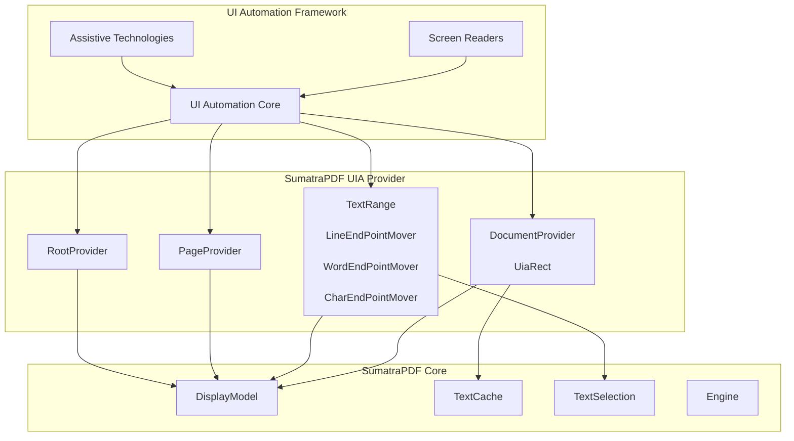

# Accessibility UIA Provider Module

## Overview

The Accessibility UIA (UI Automation) Provider module implements Microsoft UI Automation support for SumatraPDF, enabling screen readers and other assistive technologies to interact with PDF documents. This module provides programmatic access to document content, structure, and navigation functionality through the UI Automation framework.

## Purpose

The module serves as a bridge between SumatraPDF's internal document representation and the Windows UI Automation API, allowing:
- Screen readers to access and announce document content
- Assistive technologies to navigate through pages and text
- Text selection and range operations for accessibility tools
- Document structure exposure for better navigation

## Architecture

## Core Components

### [DocumentProvider](document_provider.md)
The DocumentProvider serves as the main entry point for UI Automation clients, implementing multiple UI Automation interfaces to provide comprehensive document accessibility support.

Key capabilities:
- Document lifecycle management and page element organization
- Text content and selection management through ITextProvider
- Navigation within document structure via IRawElementProviderFragment
- Property exposure for assistive technologies

### [TextRange](text_range.md)
The TextRange component provides sophisticated text manipulation capabilities through specialized endpoint movers that handle different text granularities.

Core functionality:
- Character, word, line, page, and document-level text operations
- Range-based text selection and navigation
- Text extraction for screen readers
- Endpoint movement and validation

## Module Integration

The UIA Provider module integrates with several other SumatraPDF modules:

- **[core_application_and_ui](core_application_and_ui.md)**: Provides the main window and UI components that host the UIA providers
- **[mupdf_engine_integration](mupdf_engine_integration.md)**: Supplies the underlying document engines and text extraction capabilities
- **[document_navigation](document_navigation.md)**: Offers document structure and navigation support

## Key Features

### Document Structure Exposure
- Hierarchical representation of document pages
- Text content with multiple granularity levels
- Navigation between document elements

### Text Selection Support
- Programmatic text selection for assistive technologies
- Range-based text operations
- Selection state management

### Accessibility Properties
- Document metadata (name, type, content availability)
- Bounding rectangle information
- Runtime identification for UI elements

## Implementation Details

The module follows Microsoft's UI Automation patterns and implements standard interfaces to ensure compatibility with screen readers and assistive technologies. It maintains a clear separation between the UI Automation API surface and SumatraPDF's internal document representation, providing a clean abstraction layer for accessibility support.

## Usage

The UIA Provider is automatically instantiated when SumatraPDF loads a document and becomes available to UI Automation clients. Screen readers and assistive technologies can then query the document structure, navigate through content, and perform text selection operations through the standard UI Automation API.