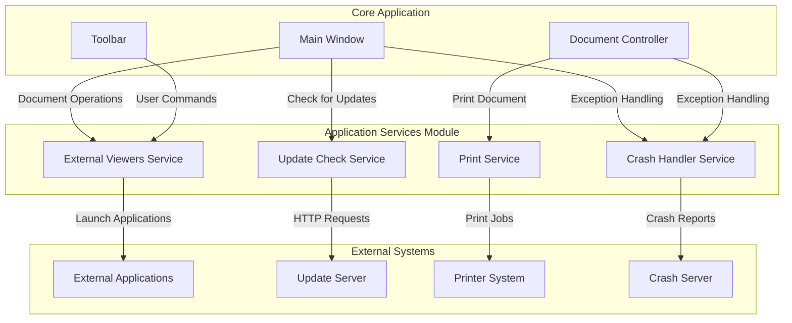
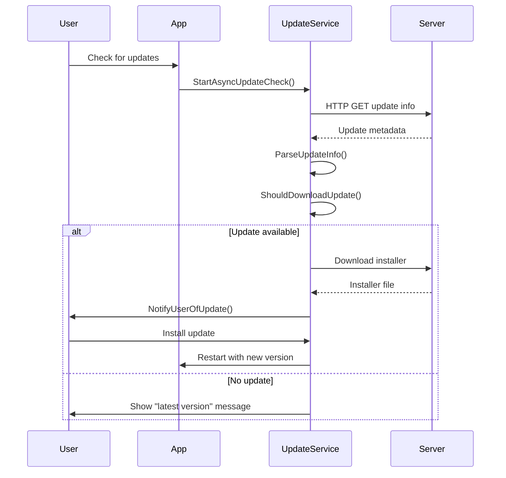
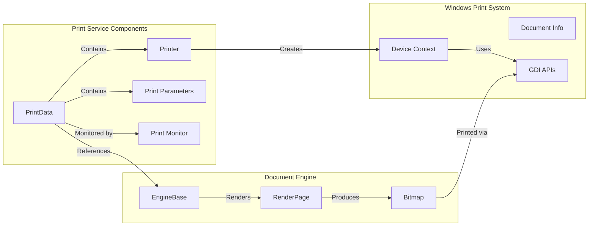
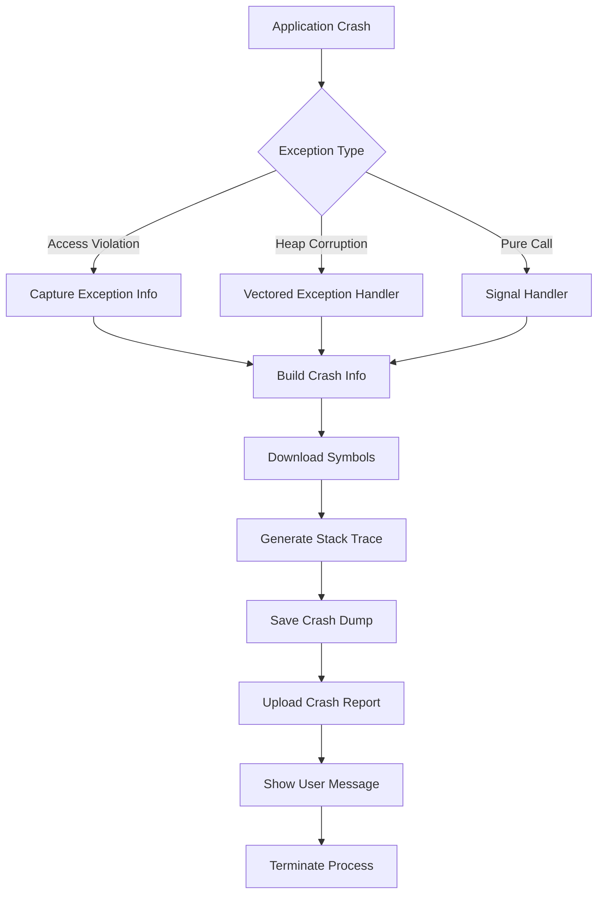
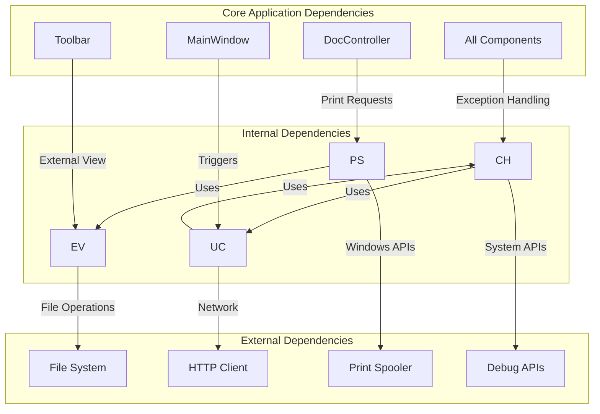

# Application Services Module

## Introduction

The Application Services module provides essential system-level services that support the core functionality of SumatraPDF. This module handles external application integration, software updates, document printing capabilities, and crash reporting functionality. These services ensure that SumatraPDF can interact seamlessly with other applications, maintain itself through automated updates, provide comprehensive printing support, and maintain stability through robust crash handling.

## Architecture Overview

The Application Services module consists of four primary service domains that work together to provide comprehensive application support:

## Core Components

### External Viewers Service

The External Viewers service manages integration with third-party applications for document viewing and manipulation. It provides a framework for launching external programs with specific document contexts and command-line arguments.

**Key Features:**
- Automatic detection of installed external viewers
- Support for multiple file formats and applications
- Context-aware launching with document-specific parameters
- Integration with file managers and specialized PDF tools

**Supported External Viewers:**
- File explorers (Windows Explorer, Directory Opus, Total Commander, Double Commander)
- PDF readers (Adobe Acrobat Reader, Foxit Reader, PDF-XChange Editor)
- Specialized tools (PDF & DjVu Bookmarker)
- System viewers (XPS Viewer, HTML Help)

### Update Check Service

The Update Check service provides automated software update functionality, ensuring users have access to the latest features and security improvements. It implements a sophisticated update mechanism that balances user convenience with system resources.

**Key Features:**
- Automatic and user-initiated update checks
- Version comparison and update availability detection
- Secure download and installation of updates
- Configurable update intervals and preferences
- Support for both release and pre-release builds

**Update Process Flow:**

### Print Service

The Print Service provides comprehensive document printing capabilities with advanced features for professional printing needs. It supports various print settings, paper formats, and printing modes.

**Key Features:**
- Full Windows printing system integration
- Support for page ranges, selection printing, and scaling options
- Advanced print settings (duplex, color, paper sources)
- Paper size detection and automatic formatting
- Print progress monitoring and cancellation
- Support for custom paper sizes and printer-specific features

**Print Architecture:**

### Crash Handler Service

The Crash Handler service provides robust crash reporting and system stability features. It captures detailed crash information and facilitates debugging and issue resolution.

**Key Features:**
- Comprehensive crash information collection
- Symbol downloading and stack trace generation
- Automatic crash report submission
- System information gathering
- Memory corruption detection
- Integration with debugging tools

**Crash Handling Process:**

## Component Interactions

### Service Dependencies

The Application Services module components interact with each other and with other system modules:

### Data Flow Patterns

**External Viewer Launch Flow:**
1. User selects external viewer from menu or toolbar
2. ExternalViewers service validates file compatibility
3. Service constructs command-line arguments with document context
4. External application launched with formatted parameters
5. Service monitors launch success and reports errors

**Update Check Flow:**
1. Timer or user action triggers update check
2. UpdateCheck service builds request with system information
3. HTTP request sent to update server
4. Response parsed for version information
5. Comparison performed against current version
6. User notified of update availability
7. Optional download and installation initiated

**Print Operation Flow:**
1. User initiates print from document view
2. Print dialog presented with printer options
3. Print settings applied to printer configuration
4. Document rendered to printer device context
5. Progress monitored and reported to user
6. Print job completed or cancelled

**Crash Handling Flow:**
1. Exception or crash condition detected
2. Crash handler intercepts exception
3. System state and crash information collected
4. Symbols downloaded if necessary
5. Stack trace and crash dump generated
6. Report uploaded to crash server
7. User notified of crash (if appropriate)
8. Application terminates gracefully

## Integration Points

### Main Window Integration

The Application Services module integrates closely with the [Main Window Management](main_window_management.md) system:

- **External Viewers**: Menu items and toolbar buttons trigger external viewer launches
- **Update Checks**: Automatic checks initiated on application startup and periodic intervals
- **Print Operations**: Print commands processed through the main window's document context
- **Crash Handling**: Global exception handling covers all main window operations

### Document Engine Integration

Services interact with document engines through the [Document Engine Integration](mupdf_engine_integration.md) systems:

- **Print Service**: Uses engine rendering capabilities for print output
- **External Viewers**: Leverages engine type information for compatibility checking
- **Crash Handler**: Captures engine state during crashes for debugging

### Settings and Preferences

The module integrates with the application's settings system for configuration management:

- **Update Preferences**: User-configurable update check intervals and behaviors
- **Print Defaults**: Default printer settings and preferences
- **External Viewer Settings**: Custom external viewer configurations

## Error Handling and Recovery

### Service-Level Error Handling

Each service implements comprehensive error handling:

**External Viewers:**
- Application not found errors
- File type incompatibility detection
- Launch failure reporting
- Registry access errors

**Update Service:**
- Network connectivity issues
- Server unavailability
- Invalid update data
- Download failures
- Installation problems

**Print Service:**
- Printer unavailable conditions
- Print job failures
- Memory allocation errors
- Device context creation failures

**Crash Handler:**
- Symbol download failures
- Report upload errors
- Memory allocation during crashes
- Recursive crash conditions

### Recovery Mechanisms

The module implements several recovery strategies:

- **Graceful Degradation**: Services continue operating when non-critical failures occur
- **Fallback Options**: Alternative approaches attempted when primary methods fail
- **User Notification**: Clear error messages provided to users for actionable issues
- **Logging**: Comprehensive error logging for debugging and support

## Performance Considerations

### Resource Management

**Memory Usage:**
- Print service manages large bitmap allocations efficiently
- Crash handler uses dedicated heap to avoid allocation deadlocks
- Update service streams large downloads to temporary files

**Threading:**
- Print operations run on separate threads to maintain UI responsiveness
- Update checks performed asynchronously to avoid blocking
- Crash handling uses dedicated threads for dump generation

**Network Efficiency:**
- Update checks include system information to reduce server load
- Crash reports compressed before upload
- Symbol downloads cached locally for reuse

### Optimization Strategies

- **Lazy Loading**: External viewer detection performed only when needed
- **Caching**: Printer information and settings cached for reuse
- **Batch Operations**: Multiple print pages processed efficiently
- **Background Processing**: Non-critical operations performed in background

## Security Considerations

### Data Protection

- **Crash Reports**: Sensitive information filtered from crash reports
- **Update Verification**: Update signatures verified before installation
- **External Applications**: Only trusted applications launched with documents

### System Access

- **Registry Access**: Limited to necessary keys for external viewer detection
- **Network Access**: Restricted to official update and crash report servers
- **File System**: Access limited to temporary directories and user documents

### Privacy

- **Update Information**: Minimal system information included in update checks
- **Crash Reporting**: User consent respected for crash report submission
- **External Viewers**: No tracking of external application usage

## Future Enhancements

### Planned Improvements

- **Enhanced External Integration**: Support for cloud storage and online services
- **Advanced Print Features**: Support for booklet printing and watermarks
- **Improved Update Experience**: Delta updates and background installation
- **Enhanced Crash Analytics**: Better categorization and trend analysis

### Extensibility

The module is designed for extensibility:

- **Plugin Architecture**: External viewer support easily extensible
- **Service Interfaces**: Clean interfaces allow for service replacement
- **Configuration System**: Flexible settings support new features
- **Error Handling**: Robust error handling supports new failure modes

This comprehensive service module ensures that SumatraPDF provides a professional, reliable, and feature-rich experience while maintaining system stability and user security.