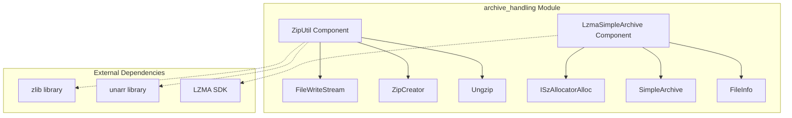
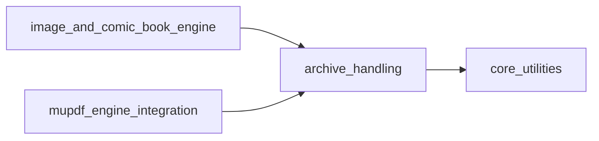
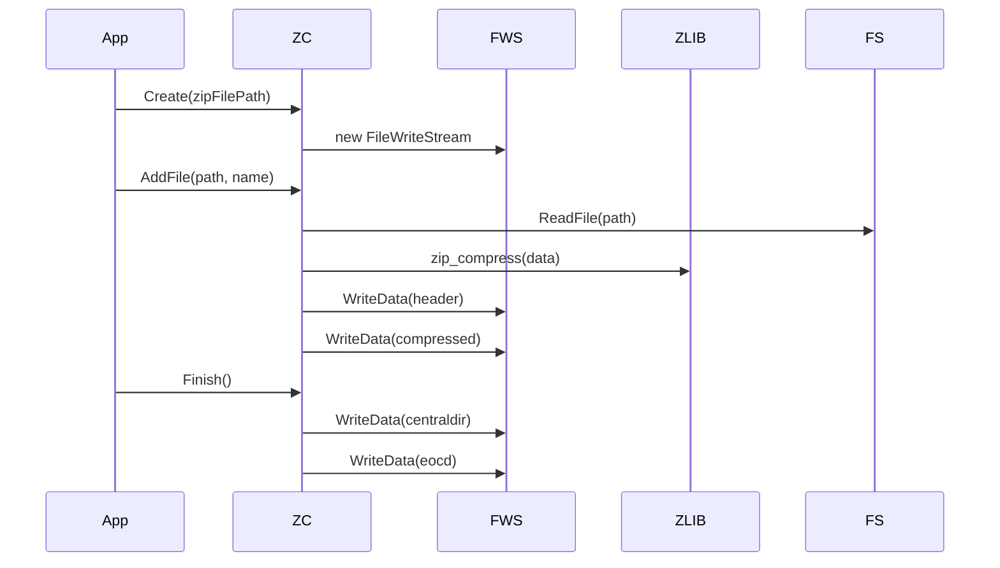
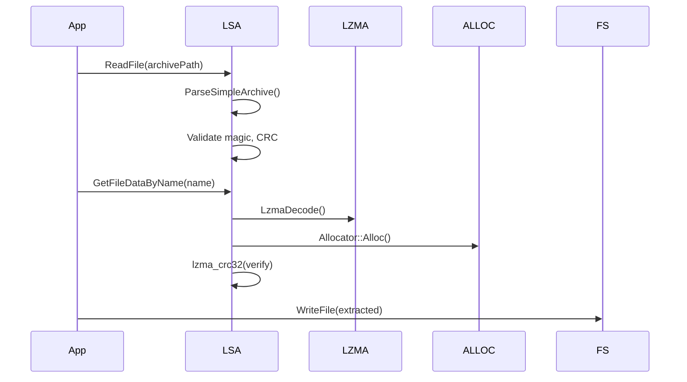
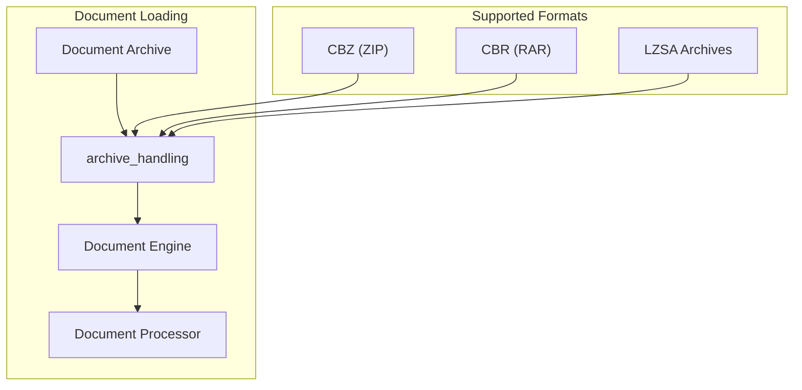

# Archive Handling Module Documentation

## Introduction

The archive_handling module provides comprehensive archive file processing capabilities for the SumatraPDF application. This module implements two distinct archive formats: ZIP compression/decompression and a custom LZMA-based simple archive format. It serves as a critical utility layer that enables the application to handle compressed document formats, extract resources, and manage archived content efficiently.

## Module Overview

The archive_handling module is part of the core_utilities module group and provides essential archive processing functionality through two main components:

- **ZipUtil**: Handles standard ZIP archive creation and extraction with gzip decompression support
- **LzmaSimpleArchive**: Implements a custom lightweight archive format using LZMA compression

## Architecture

### Component Structure



### Module Dependencies



## Core Components

### ZipUtil Component

The ZipUtil component provides ZIP archive creation and gzip decompression functionality. It implements a complete ZIP file writer that can create standard ZIP archives compatible with other ZIP tools.

#### Key Classes and Functions

**FileWriteStream Class**
- Implements `ISequentialStream` COM interface
- Provides file-based stream writing capabilities
- Handles Windows file operations with proper resource management
- Supports reference counting for COM compliance

**ZipCreator Class**
- Creates ZIP archives with DEFLATE compression
- Supports adding files, directories, and raw data
- Implements standard ZIP format with local headers, central directory, and end-of-central-directory records
- Provides compression ratio optimization through automatic compression method selection

**Ungzip Function**
- Decompresses gzip-compressed data
- Implements streaming decompression with automatic buffer expansion
- Ensures null-terminated output for string safety
- Handles memory allocation and error recovery

#### ZIP Format Implementation

The ZipCreator implements the standard ZIP file format:


### LzmaSimpleArchive Component

The LzmaSimpleArchive component implements a custom archive format optimized for SumatraPDF's specific needs. This format provides efficient compression with fast extraction and integrity verification.

#### Custom Archive Format

The archive format consists of:
- **Magic Header**: 4-byte identifier "LzSA"
- **File Count**: Number of archived files
- **File Entries**: Metadata for each file including compression info, timestamps, and names
- **Header CRC**: Integrity check for header data
- **Compressed Data**: File contents with compression method indicators

#### Key Classes and Functions

**ISzAllocatorAlloc Structure**
- Adapts SumatraPDF's allocator to LZMA's ISzAlloc interface
- Provides memory management bridge between systems
- Implements allocation and deallocation callbacks

**SimpleArchive Structure**
- Container for archive metadata and file information
- Supports up to 256 files per archive
- Maintains file indexing and integrity information

**Core Functions**
- `ParseSimpleArchive`: Validates and parses archive format
- `Decompress`: Handles LZMA, LZMA+BCJ, and uncompressed data
- `GetFileDataByName/Idx`: Extracts specific files with CRC verification
- `ExtractFiles`: Batch extraction with directory support

## Data Flow

### ZIP Creation Process



### Archive Extraction Process



## Integration Points

### Comic Book Archive Support

The archive_handling module integrates with the [image_and_comic_book_engine](image_and_comic_book_engine.md) to provide comic book archive (CBZ/CBR) support:

- **CBZ Support**: Uses ZipUtil to extract images from ZIP-based comic archives
- **CBR Support**: Integrates with unarr library for RAR format support
- **Image Extraction**: Provides sequential access to comic page images
- **Metadata Handling**: Supports ComicInfo.xml parsing for comic metadata

### Document Processing Pipeline



## Error Handling and Validation

### Integrity Verification

Both archive formats implement comprehensive validation:

- **CRC32 Verification**: All extracted data undergoes checksum validation
- **Format Validation**: Magic numbers and structure validation prevent corruption
- **Memory Safety**: Bounds checking prevents buffer overflows
- **Resource Cleanup**: Automatic cleanup of allocated resources on failure

### Error Recovery

- **Partial Extraction**: Continues processing remaining files if individual files fail
- **Memory Management**: Graceful handling of allocation failures
- **Format Fallback**: Automatic fallback between compression methods
- **Stream Recovery**: COM stream error handling with proper resource release

## Performance Optimizations

### Memory Management

- **Custom Allocators**: Integration with SumatraPDF's memory management system
- **Buffer Reuse**: Efficient buffer management for large archives
- **Streaming Processing**: Memory-efficient processing of large files
- **Temporary Storage**: Strategic use of temporary allocations

### Compression Strategy

- **Adaptive Compression**: Automatic selection between storage and DEFLATE compression
- **Compression Ratios**: Optimized for document and image content
- **Fast Extraction**: Prioritizes extraction speed for frequently accessed archives
- **Cache Integration**: Works with application caching systems

## Security Considerations

### Input Validation

- **Path Traversal Protection**: Validates extracted file paths prevent directory traversal
- **Size Limits**: Enforces reasonable limits on archive sizes and file counts
- **Format Validation**: Strict validation of archive format specifications
- **Memory Limits**: Prevents memory exhaustion through size constraints

### Safe Extraction

- **Sandboxed Extraction**: Extracts to temporary locations with validation
- **Permission Checks**: Verifies write permissions before extraction
- **File Overwrite Protection**: Prevents accidental overwriting of existing files
- **Cleanup Procedures**: Ensures temporary files are properly cleaned up

## Usage Examples

### Creating a ZIP Archive

```cpp
// Create a new ZIP file
ZipCreator zip("output.zip");

// Add individual files
zip.AddFile("document.pdf", "docs/document.pdf");
zip.AddFile("image.png", "images/cover.png");

// Add entire directory
zip.AddDir("resources", true); // recursive

// Finalize the archive
zip.Finish();
```

### Extracting from LZMA Archive

```cpp
// Read and parse archive
auto archiveData = file::ReadFile("data.lzsa");
SimpleArchive archive;
ParseSimpleArchive(archiveData.data(), archiveData.size(), &archive);

// Extract specific file
u8* fileData = GetFileDataByName(&archive, "config.json", allocator);
if (fileData) {
    // Process extracted data
    ProcessConfig(fileData);
    Allocator::Free(allocator, fileData);
}
```

### Gzip Decompression

```cpp
// Decompress gzip data
ByteSlice compressed = ReadCompressedData();
ByteSlice decompressed = Ungzip(compressed);

// Use decompressed data
ProcessDecompressedData(decompressed);
```

## Testing and Quality Assurance

### Test Coverage

- **Format Compliance**: Tests against standard ZIP format specifications
- **Round-trip Testing**: Ensures data integrity through compression/decompression cycles
- **Error Condition Testing**: Validates proper error handling for corrupted archives
- **Performance Testing**: Benchmarks extraction speed and memory usage

### Compatibility Testing

- **Cross-platform**: Tests archive compatibility across different operating systems
- **Tool Compatibility**: Ensures archives work with standard ZIP tools
- **Format Variants**: Tests various ZIP and LZMA format variations
- **Large File Support**: Validates handling of large archives and files

## Future Enhancements

### Planned Improvements

- **Additional Formats**: Support for 7-Zip and other archive formats
- **Encryption Support**: Implementation of archive encryption capabilities
- **Streaming API**: Enhanced streaming interfaces for large archives
- **Progress Callbacks**: Extraction progress reporting for user feedback

### Performance Optimizations

- **Multi-threading**: Parallel compression and decompression support
- **Hardware Acceleration**: Integration with hardware compression features
- **Memory Mapping**: Memory-mapped file access for large archives
- **Caching Improvements**: Enhanced caching strategies for frequently accessed archives

## Related Documentation

- [core_utilities](core_utilities.md) - Base utility functions and data structures
- [image_and_comic_book_engine](image_and_comic_book_engine.md) - Comic book format support
- [mupdf_engine_integration](mupdf_engine_integration.md) - PDF processing integration
- [ebook_engines](ebook_engines.md) - E-book format support that may use archive handling