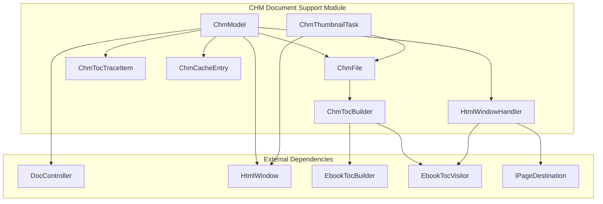
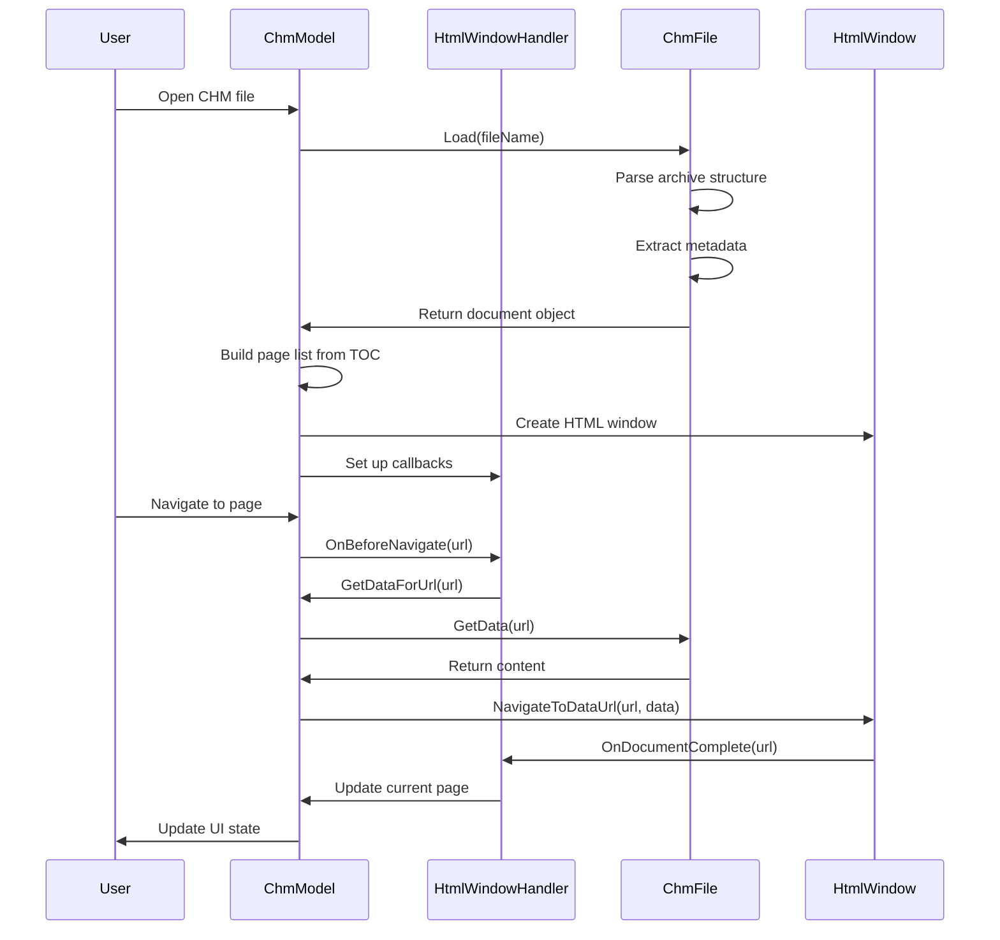
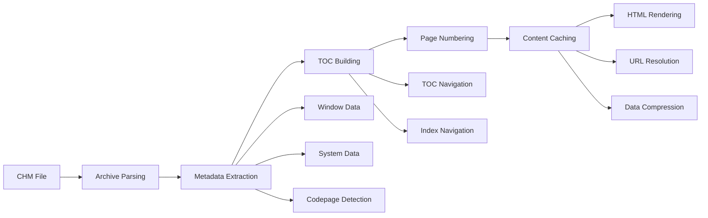
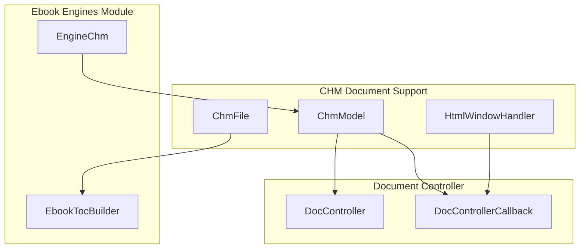
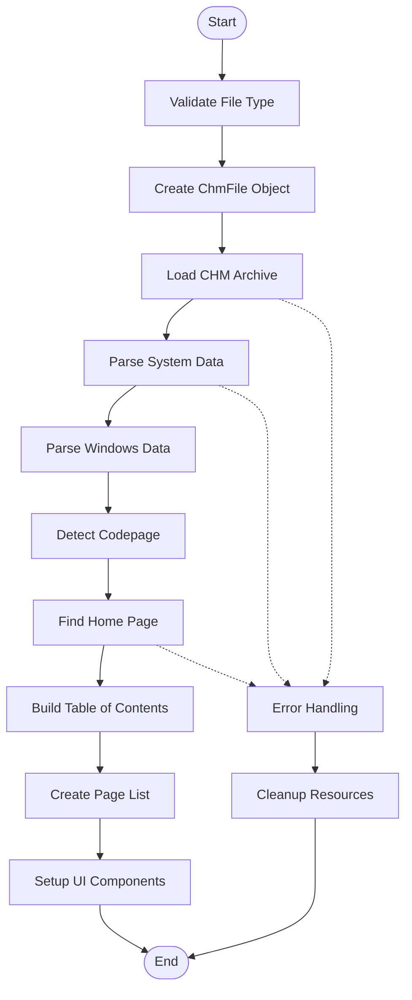
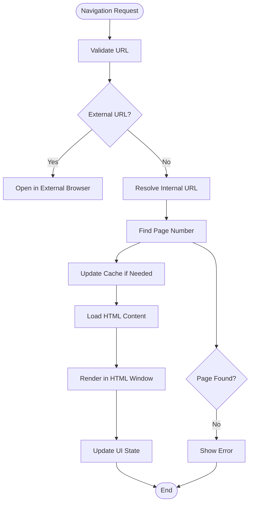

# CHM Document Support Module

## Introduction

The CHM (Compiled HTML Help) document support module provides comprehensive functionality for reading, parsing, and displaying Microsoft CHM format documents within the SumatraPDF application. This module serves as a specialized engine that handles the unique requirements of CHM files, including their compressed archive structure, HTML content rendering, table of contents navigation, and integrated help system features.

## Module Overview

The CHM document support module is responsible for:
- Loading and parsing CHM archive files
- Extracting and managing HTML content and resources
- Building navigational structures (table of contents and index)
- Integrating with the HTML rendering engine for display
- Providing document-specific features like zoom control and page navigation
- Supporting CHM-specific features such as topic ID resolution and window data parsing

## Core Architecture

### Component Structure

### Key Components

#### ChmModel
The primary controller class that manages CHM document presentation and user interaction. It implements the DocController interface and coordinates between the CHM file parser and the HTML rendering engine.

**Key Responsibilities:**
- Document loading and initialization
- Page navigation and display management
- Zoom control and display state management
- Table of contents integration
- Thumbnail generation
- HTML window coordination

#### ChmFile
The core file parser that handles the low-level CHM archive format. It provides access to the compressed content within CHM files and manages the document's metadata and structure.

**Key Responsibilities:**
- CHM archive file parsing
- Content extraction and decompression
- Metadata parsing (title, paths, codepage)
- Table of contents and index parsing
- Topic ID resolution
- Character encoding handling

#### HtmlWindowHandler
A callback handler that bridges the ChmModel with the HTML rendering engine. It processes navigation events and manages data flow between the CHM document and the display component.

**Key Responsibilities:**
- Navigation event handling
- Document completion notifications
- Data retrieval for URLs
- External link handling
- User interaction coordination

## Data Flow Architecture

## Document Processing Pipeline

## Integration with Ebook Engines

The CHM document support module integrates with the broader ebook engines framework:

## Key Features and Capabilities

### 1. CHM Archive Handling
- **File Format Support**: Complete support for Microsoft CHM format
- **Archive Navigation**: Efficient traversal of compressed content
- **Data Extraction**: On-demand content retrieval with caching
- **Error Handling**: Robust handling of corrupted or incomplete archives

### 2. Content Navigation
- **Table of Contents**: Hierarchical navigation structure extraction
- **Index Support**: Keyword-based navigation for help documents
- **Page Numbering**: Virtual page system based on content structure
- **URL Resolution**: Internal and external link handling

### 3. Character Encoding
- **Multi-language Support**: Automatic codepage detection and conversion
- **UTF-8 Handling**: Proper Unicode text processing
- **Legacy Support**: Compatibility with various Windows codepages

### 4. HTML Integration
- **Content Rendering**: Seamless integration with HTML display engine
- **JavaScript Support**: Browser-compatible script execution
- **CSS Styling**: Style sheet processing and application
- **External Resources**: Image and stylesheet loading

### 5. User Interface Features
- **Zoom Control**: Adjustable text scaling (integer-based for browser compatibility)
- **Search Integration**: Find-in-page functionality
- **Print Support**: Document printing capabilities
- **Thumbnail Generation**: Preview image creation

## Process Flows

### Document Loading Process

### Navigation Process

## Dependencies and Integration

### Internal Dependencies
- **DocController**: Base document controller interface
- **HtmlWindow**: HTML rendering and display component
- **EbookTocBuilder**: Table of contents construction framework
- **Settings**: Application configuration management
- **GlobalPrefs**: Global preferences system

### External Dependencies
- **chm_lib**: CHM file format parsing library
- **HtmlParser**: HTML content parsing and processing
- **strconv**: String conversion utilities
- **file**: File system operations

### Related Modules
- [ebook_engines](ebook_engines.md): Parent module containing CHM engine implementation
- [html_rendering_components](html_rendering_components.md): HTML display and rendering support
- [document_navigation](document_navigation.md): Navigation and user interface components
- [core_utilities](core_utilities.md): Utility functions and data structures

## Error Handling and Recovery

The module implements comprehensive error handling for various scenarios:

### File Access Errors
- Invalid or corrupted CHM files
- Missing required system files
- Archive extraction failures
- Memory allocation errors

### Content Processing Errors
- Malformed HTML content
- Invalid character encodings
- Missing navigation structures
- Broken internal links

### Runtime Errors
- Navigation failures
- Cache management issues
- HTML rendering problems
- Resource allocation failures

## Performance Considerations

### Optimization Strategies
- **Lazy Loading**: Content extracted on-demand
- **Caching System**: URL-based data caching to avoid repeated extraction
- **Memory Management**: Efficient memory allocation with pool allocators
- **Thread Safety**: Critical section protection for concurrent access

### Resource Management
- **Memory Limits**: 128MB limit on individual file extraction
- **Cache Cleanup**: Automatic cleanup of unused cached data
- **Thumbnail Generation**: Separate thread for thumbnail creation
- **Document Access**: Thread-safe document access patterns

## Security Considerations

### Content Security
- **External Link Handling**: External URLs opened in system browser
- **Script Execution**: Controlled JavaScript execution environment
- **Resource Access**: Restricted access to external resources
- **Data Validation**: Input validation for all user-provided data

### File Security
- **Archive Validation**: Validation of CHM file structure
- **Path Traversal**: Protection against directory traversal attacks
- **Content Sanitization**: HTML content processing and sanitization
- **Memory Protection**: Bounds checking and buffer overflow protection

## Future Enhancements

### Potential Improvements
- Enhanced Unicode support for international documents
- Improved error reporting and diagnostics
- Performance optimizations for large documents
- Extended metadata extraction capabilities
- Better integration with modern HTML standards

### Compatibility Considerations
- Maintaining backward compatibility with existing CHM files
- Supporting newer Windows help formats
- Cross-platform compatibility improvements
- Integration with cloud-based help systems