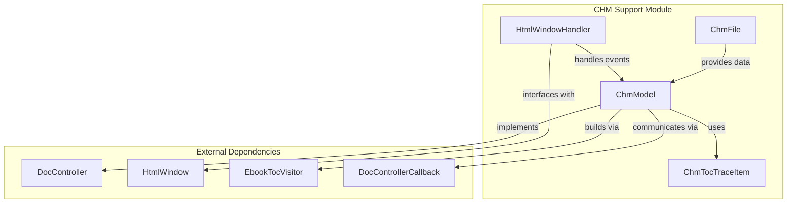
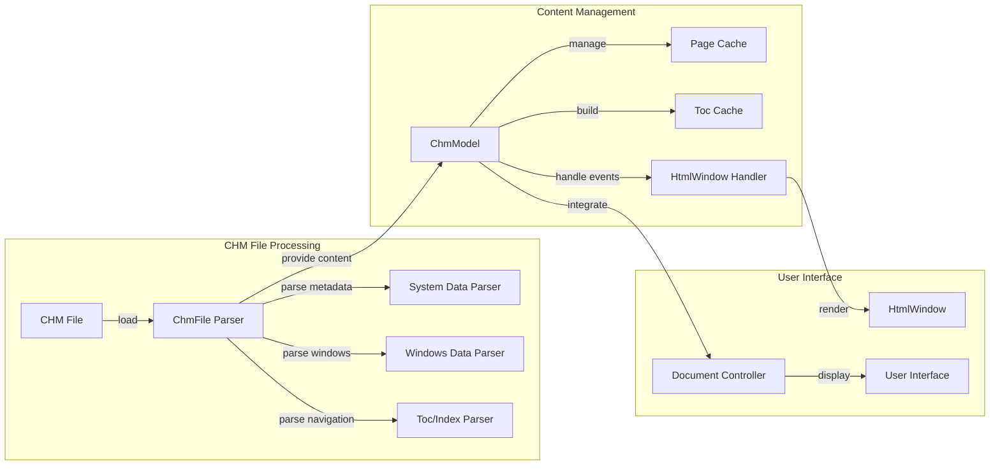
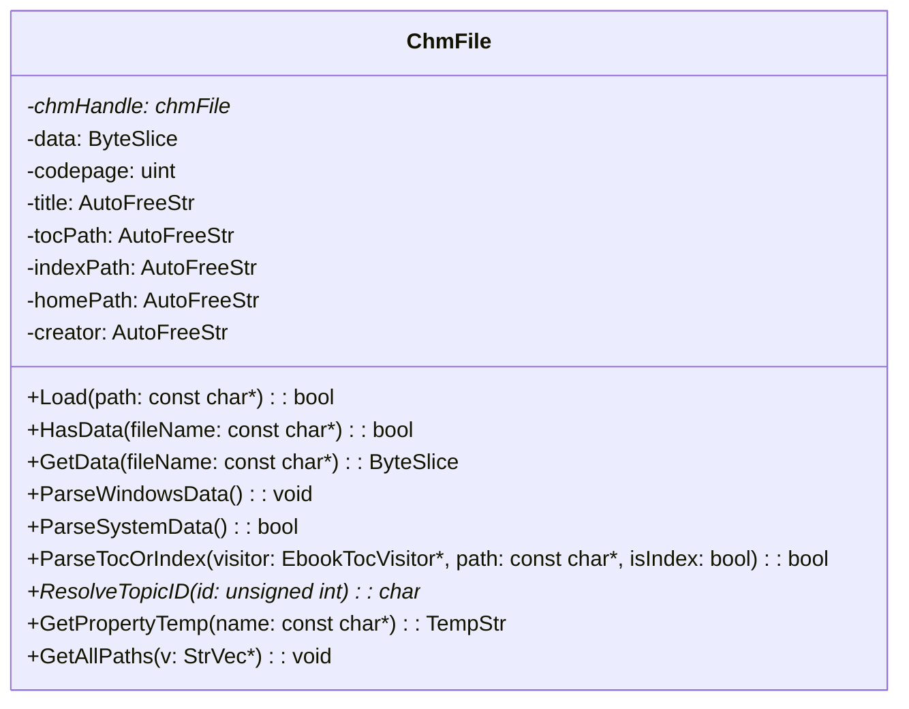
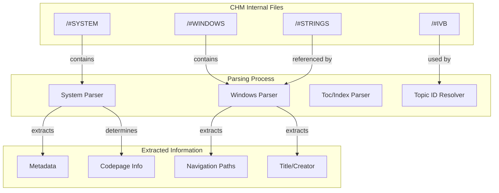
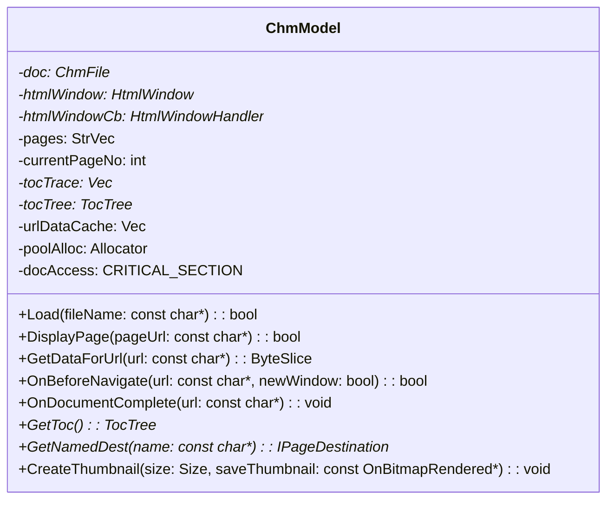
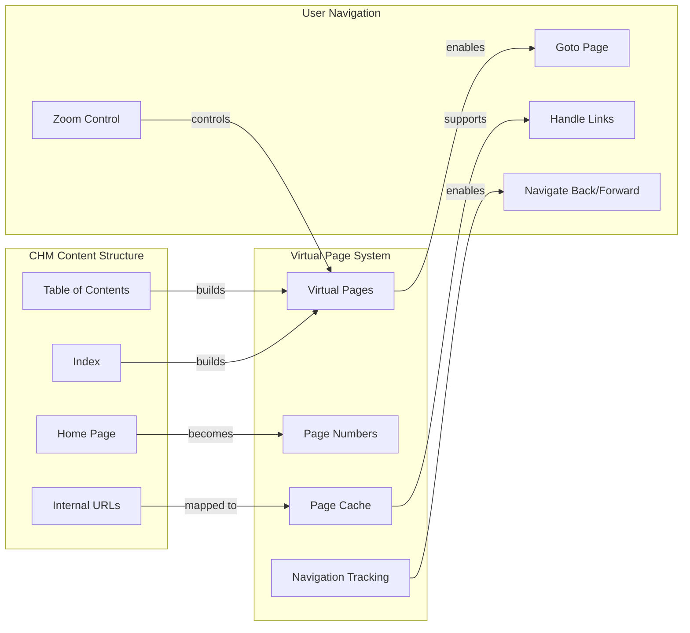
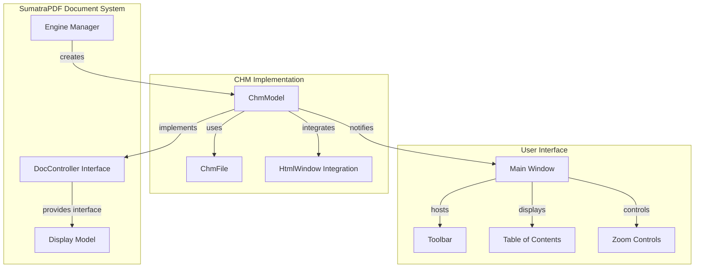
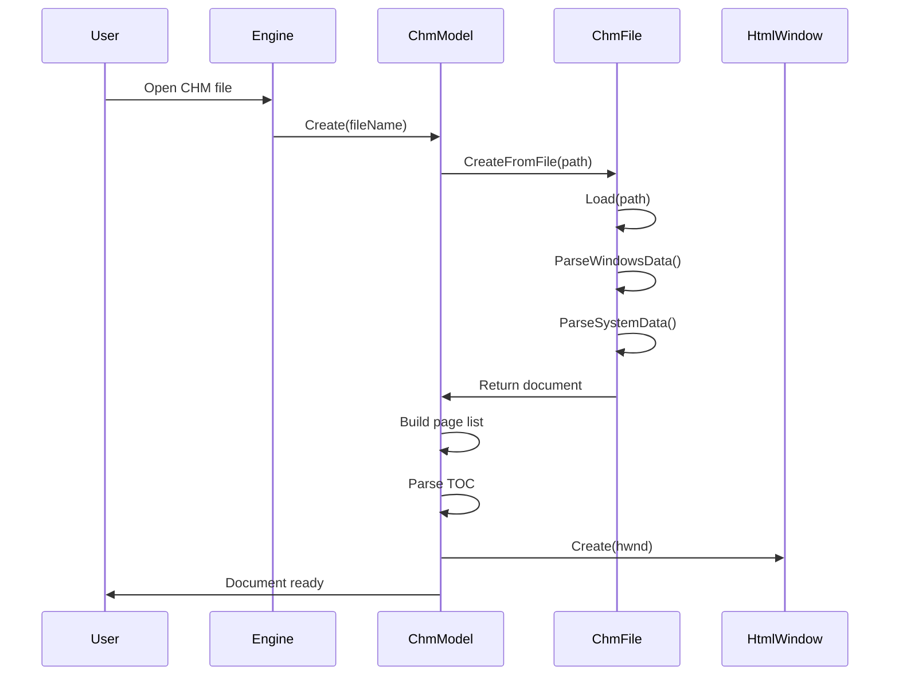
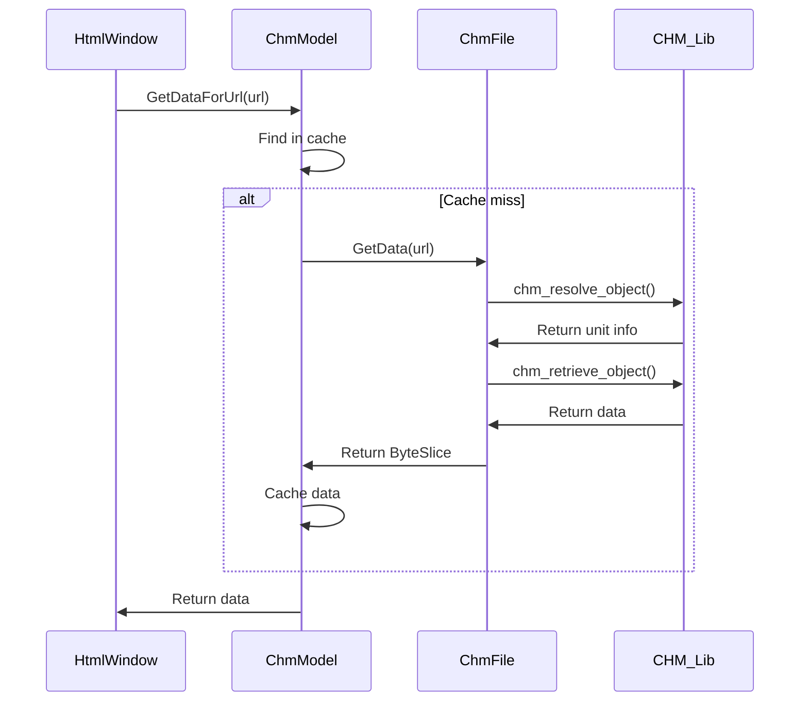
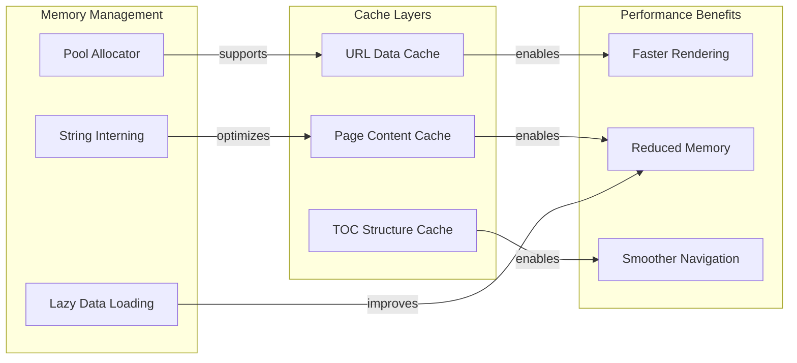

# CHM Support Module Documentation

## Introduction

The CHM (Compiled HTML Help) support module provides comprehensive functionality for reading, parsing, and displaying Microsoft CHM files within the SumatraPDF document viewer. This module implements a complete CHM document engine that handles the proprietary CHM file format, extracts content, manages navigation, and provides an interactive viewing experience through HTML rendering.

## Module Overview

The CHM support module consists of two primary components that work together to provide complete CHM file handling capabilities:

- **ChmFile**: Low-level CHM file parser and data extractor
- **ChmModel**: High-level document model that integrates with SumatraPDF's document controller system

## Architecture

### Core Components Architecture

### Data Flow Architecture

## Component Details

### ChmFile Class

The `ChmFile` class serves as the primary interface for accessing CHM file content and metadata. It provides low-level functionality for reading and parsing CHM files using the chmlib library.

#### Key Responsibilities:
- **File Loading**: Opens and validates CHM files
- **Data Extraction**: Retrieves file content by path
- **Metadata Parsing**: Extracts document properties, codepage information, and navigation structures
- **Path Resolution**: Handles CHM internal path resolution and normalization
- **Character Encoding**: Manages text encoding conversion for different codepages

#### Core Methods:

#### File Structure Parsing:

The ChmFile class implements sophisticated parsing for CHM internal structures:

### ChmModel Class

The `ChmModel` class implements the document controller interface and provides high-level CHM document management. It integrates CHM files into SumatraPDF's document viewing system.

#### Key Responsibilities:
- **Document Management**: Implements the DocController interface for CHM files
- **Page Navigation**: Manages virtual page numbering based on CHM content structure
- **HTML Rendering**: Coordinates with HtmlWindow for content display
- **Table of Contents**: Builds and manages hierarchical navigation structures
- **Zoom Control**: Handles zoom levels for HTML content
- **Thumbnail Generation**: Creates document thumbnails

#### Core Methods:

#### Navigation and Page Management:

### HtmlWindowHandler Class

The `HtmlWindowHandler` class implements the callback interface for HTML window events, bridging between the HTML rendering engine and the CHM model.

#### Key Responsibilities:
- **Navigation Events**: Handles before-navigate and document-complete events
- **Data Requests**: Provides CHM content data to the HTML renderer
- **User Interaction**: Processes mouse events and focus management
- **Download Handling**: Manages file downloads from CHM content

### ChmTocTraceItem Structure

The `ChmTocTraceItem` structure represents individual entries in the CHM table of contents, maintaining hierarchical relationships and navigation information.

## Integration with SumatraPDF

### Document Controller Interface

The ChmModel implements the DocController interface, allowing seamless integration with SumatraPDF's document management system:

### File Type Support

The module registers support for CHM files through the `IsSupportedFileType` method, enabling automatic detection and loading of CHM documents.

## Data Processing Pipeline

### CHM File Loading Process

### Content Retrieval Process

## Error Handling and Validation

### File Validation

The module implements comprehensive validation for CHM files:

- **File Format Validation**: Verifies CHM file structure and integrity
- **Data Size Limits**: Enforces 128MB limit on extracted content
- **Path Validation**: Normalizes and validates internal paths
- **Encoding Detection**: Handles various character encodings and codepages

### Error Recovery

- **Graceful Degradation**: Continues operation with partial data if some components fail
- **Fallback Mechanisms**: Uses alternative methods for content extraction
- **User Feedback**: Provides meaningful error messages for common issues

## Performance Optimizations

### Caching Strategy

### Memory Management

- **Pool Allocation**: Uses memory pools for efficient allocation of small objects
- **Reference Counting**: Manages object lifetimes through reference counting
- **Lazy Loading**: Defers expensive operations until needed
- **String Interning**: Reduces memory usage for repeated strings

## Security Considerations

### Content Security

- **Path Traversal Protection**: Validates and sanitizes file paths
- **External URL Handling**: Opens external links in system browser
- **Script Execution**: Controls JavaScript execution within CHM content
- **Data Validation**: Validates all extracted data before processing

### Sandboxing

- **Isolated Rendering**: CHM content is rendered in isolated HTML windows
- **Limited File System Access**: Restricted access to file system operations
- **Controlled Navigation**: Navigation events are validated before processing

## Dependencies

### External Libraries

- **chmlib**: Core CHM file format parsing library
- **HtmlWindow**: HTML rendering and display component
- **TrivialHtmlParser**: Lightweight HTML parsing for TOC extraction

### Internal Dependencies

- **DocController**: Base document controller interface
- **EbookTocVisitor**: TOC building and navigation interface
- **StrFormat**: String formatting and manipulation utilities
- **FileUtil**: File system operations

## Related Modules

- [ebook_support](ebook_support.md) - Shared ebook functionality and base classes
- [html_parser](html_parser.md) - HTML parsing utilities used for TOC extraction
- [wingui](wingui.md) - Windows GUI components including HtmlWindow
- [document_formats](document_formats.md) - Document format detection and management

## Future Enhancements

### Planned Improvements

- **Enhanced Search**: Full-text search within CHM content
- **Better TOC Support**: Improved handling of complex TOC structures
- **Performance Optimization**: Faster loading and rendering of large CHM files
- **Accessibility**: Enhanced accessibility features for screen readers

### Technical Debt

- **Code Modernization**: Update to use modern C++ features
- **Error Handling**: Improve error reporting and recovery mechanisms
- **Testing**: Add comprehensive unit tests for all components
- **Documentation**: Expand inline documentation and examples