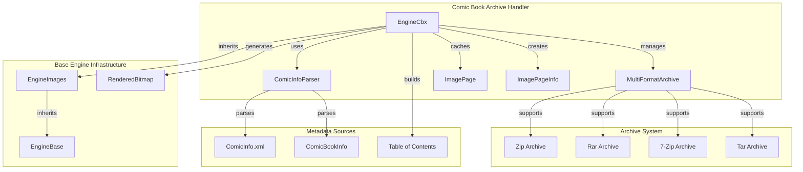
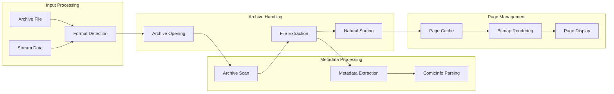
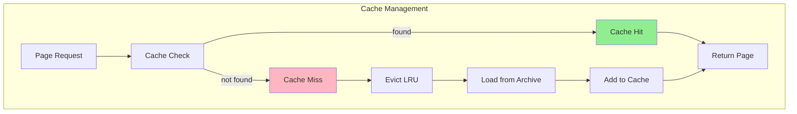

# Comic Book Archive Handler Module

## Introduction

The Comic Book Archive Handler module provides specialized support for reading and rendering comic book archive formats within the SumatraPDF document viewer. This module handles popular comic book formats including CBZ (ZIP archives), CBR (RAR archives), CB7 (7-Zip archives), and CBT (TAR archives), making it possible to view comic books as sequential page-based documents.

## Module Overview

The comic book archive handler is part of the broader `image_and_comic_book_engine` module tree, specializing in archive-based comic book formats. It extends the base image engine functionality to handle multi-page comic book archives with metadata support and table of contents generation.

## Core Components

### EngineCbx Class

The `EngineCbx` class is the primary engine for handling comic book archive formats. It inherits from `EngineImages` and provides specialized functionality for comic book archives.

**Key Features:**
- Support for multiple archive formats (ZIP, RAR, 7-Zip, TAR)
- Automatic image extraction and page ordering
- Comic metadata parsing (ComicInfo.xml and ComicBookInfo formats)
- Table of contents generation from archive file structure
- Page caching for performance optimization

**Supported File Types:**
- CBZ (Comic Book ZIP)
- CBR (Comic Book RAR) 
- CB7 (Comic Book 7-Zip)
- CBT (Comic Book TAR)
- Direct archive formats (ZIP, RAR, 7Z, TAR)

### ComicInfoParser Class

The `ComicInfoParser` class handles metadata extraction from comic book archives, supporting two primary standards:

**ComicInfo.xml Format:**
- Title, author, publication date
- Summary and description
- Creator information
- Series metadata

**ComicBookInfo Format:**
- JSON-based metadata standard
- Publication information
- Credit information for writers and artists
- Creation and modification dates

## Architecture

### Component Relationships



### Data Flow Architecture



## Key Functionality

### Archive Format Detection

The module uses a two-stage detection process:
1. **Content-based detection**: Analyzes file headers to determine actual archive format
2. **Extension-based fallback**: Uses file extensions when content detection is inconclusive

This approach handles misnamed files (e.g., CBR archives with .cbz extensions) correctly.

### Page Management

**Page Caching System:**
- Maintains a cache of up to 10 decoded bitmaps
- Uses Most Recently Used (MRU) eviction policy
- Thread-safe access with critical sections
- Automatic memory management for cached pages

**Page Loading Process:**
1. Extract image data from archive
2. Decode bitmap using GDI+ 
3. Cache decoded bitmap for future use
4. Apply transformations (zoom, rotation) during rendering

### Metadata Extraction

**ComicInfo.xml Processing:**
- XML parsing using HTML pull parser
- Extracts title, author, publication date, summary
- Handles both standard and extended ComicInfo schemas

**ComicBookInfo Processing:**
- JSON parsing for embedded metadata
- Extracts publication information and credits
- Supports primary/secondary author distinction

### Table of Contents Generation

Automatically generates table of contents from archive file structure:
- Natural sorting of file names
- Hierarchical organization based on directory structure
- Page labels derived from file names
- Navigation support for quick page access

## Performance Optimizations

### Caching Strategy



### Memory Management

- **Smart Pointers**: Uses reference counting for page objects
- **Lazy Loading**: Pages loaded only when needed
- **Automatic Cleanup**: Memory freed when pages are evicted from cache
- **Stream Management**: Efficient handling of archive streams

## Integration with SumatraPDF

### Engine Registration

The comic book archive handler integrates with SumatraPDF's engine system through:
- File type registration in the engine factory
- Stream-based creation for memory-mapped files
- Property interface for document metadata
- Rendering interface for page display

### User Interface Integration

- **File Open**: Supports drag-and-drop and file dialog selection
- **Navigation**: Page navigation controls adapted for sequential comic reading
- **Zoom**: Fit width, fit page, and custom zoom modes
- **Rotation**: Support for landscape-oriented comics

## Error Handling

### Robust Archive Processing

- **Corrupted Archives**: Graceful handling of damaged archives
- **Missing Images**: Skip invalid image files and continue processing
- **Format Confusion**: Detect and reject non-comic XPS files masquerading as ZIP
- **Memory Constraints**: Handle out-of-memory conditions during large image processing

### Recovery Mechanisms

- **Partial Loading**: Load valid pages even if some images are corrupted
- **Fallback Rendering**: Use placeholder for failed image loads
- **Metadata Fallback**: Continue without metadata if parsing fails

## Dependencies

### Internal Dependencies

- **[EngineImages](image_and_comic_book_engine.md)**: Base class providing image rendering functionality
- **[MultiFormatArchive](core_utilities.md)**: Archive handling abstraction layer
- **[Bitmap utilities](image_and_comic_book_engine.md)**: Image decoding and processing
- **[JSON Parser](core_utilities.md)**: ComicBookInfo metadata parsing
- **[HTML Parser](core_utilities.md)**: ComicInfo.xml metadata extraction

### External Dependencies

- **GDI+**: Image rendering and transformation
- **Windows COM**: Stream handling and file operations
- **Archive Libraries**: ZIP, RAR, 7-Zip, and TAR format support

## File Format Support

### Primary Formats

| Format | Extension | Archive Type | Description |
|--------|-----------|--------------|-------------|
| CBZ | .cbz | ZIP | Most common comic book format |
| CBR | .cbr | RAR | Popular compressed format |
| CB7 | .cb7 | 7-Zip | High compression ratio |
| CBT | .cbt | TAR | Unix-style archive |

### Image Formats Within Archives

- **Standard**: PNG, JPEG, GIF, BMP, TIFF
- **Advanced**: WebP, JPEG 2000, HEIC, AVIF
- **Specialized**: TGA, JXR, HDP, WDP

## Usage Examples

### Basic File Opening

```cpp
// Create engine from file
EngineBase* engine = CreateEngineCbxFromFile("comic.cbz");
if (engine) {
    // Get page count
    int pageCount = engine->PageCount();
    
    // Render first page
    RenderPageArgs args;
    args.pageNo = 1;
    args.zoom = 1.0f;
    args.rotation = 0;
    
    RenderedBitmap* bitmap = engine->RenderPage(args);
    // Use bitmap for display
}
```

### Metadata Access

```cpp
EngineCbx* cbxEngine = (EngineCbx*)engine;

// Get title
TempStr title = cbxEngine->GetPropertyTemp(kPropTitle);

// Get authors
TempStr authors = cbxEngine->GetPropertyTemp(kPropAuthor);

// Get creation date
TempStr date = cbxEngine->GetPropertyTemp(kPropCreationDate);
```

## Future Enhancements

### Potential Improvements

- **Advanced Metadata**: Support for additional comic metadata standards
- **Reading Modes**: Right-to-left reading support for manga
- **Page Layout**: Double-page spread detection and handling
- **Performance**: Multi-threaded archive extraction
- **Format Support**: Additional archive formats (ACE, LZH)

### Integration Opportunities

- **Library Management**: Integration with comic library systems
- **Bookmarking**: Support for reading position bookmarks
- **Annotations**: Comic-specific annotation features
- **Sharing**: Export and sharing capabilities

## Conclusion

The Comic Book Archive Handler module provides comprehensive support for comic book archive formats within SumatraPDF. Through its robust archive handling, efficient caching system, and rich metadata support, it enables users to read comic books as naturally as any other document format. The module's architecture ensures good performance and reliability while maintaining compatibility with the broader SumatraPDF ecosystem.