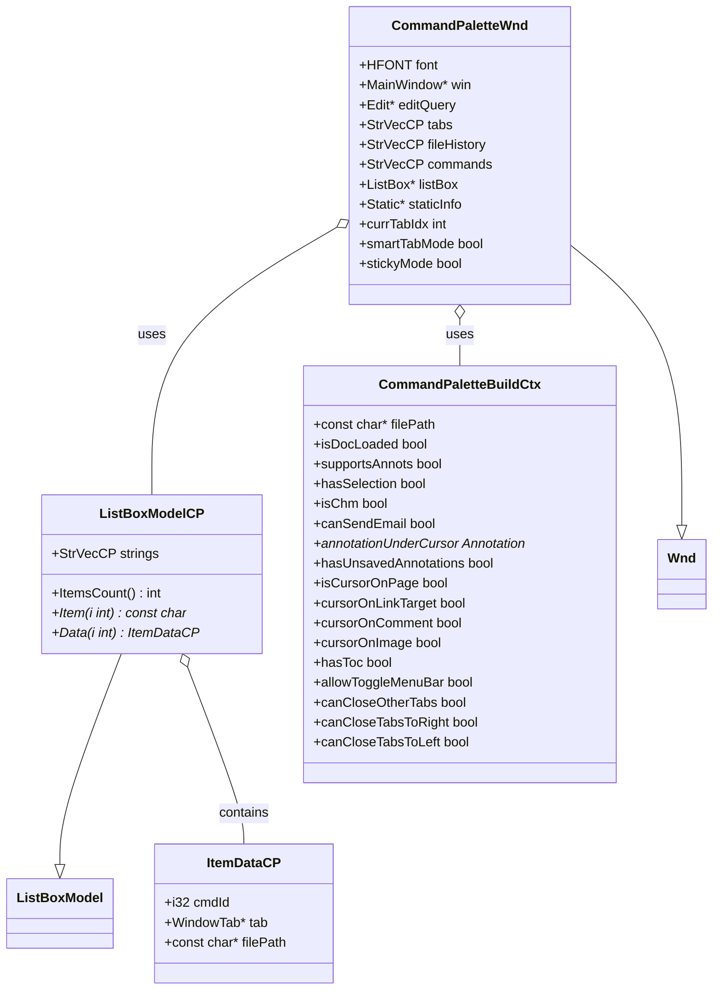
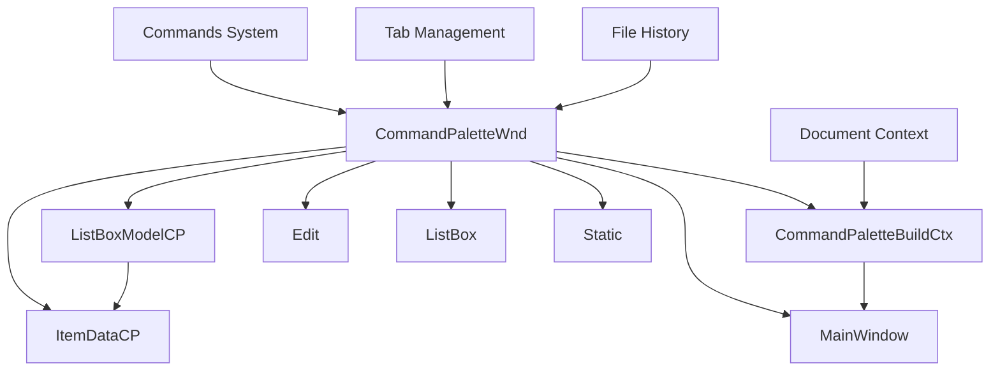
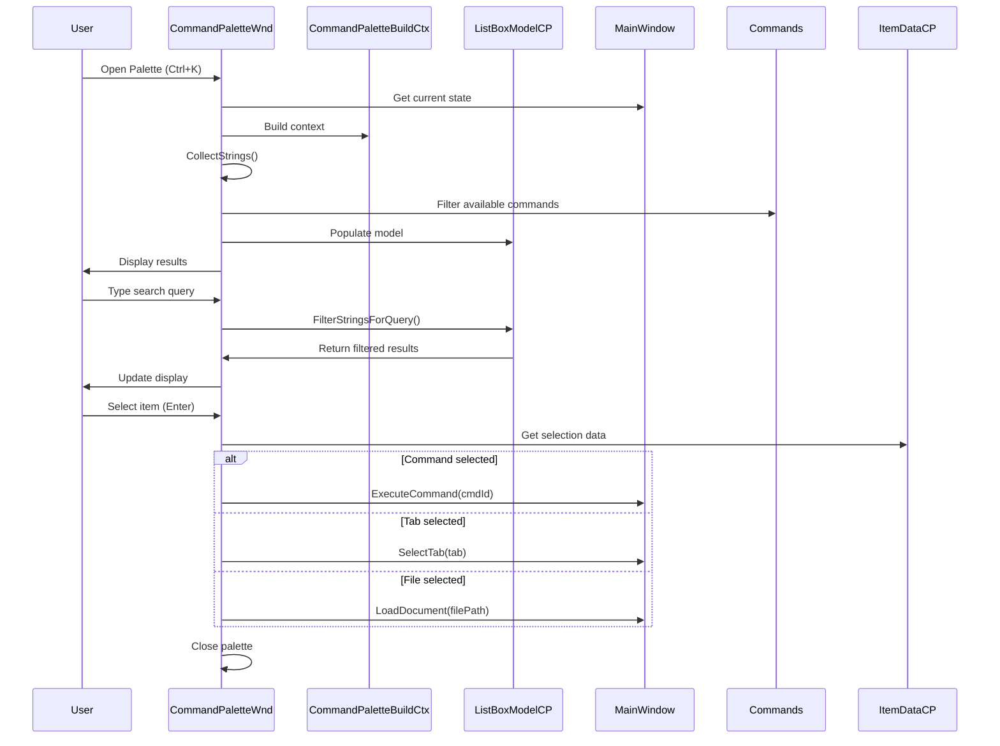
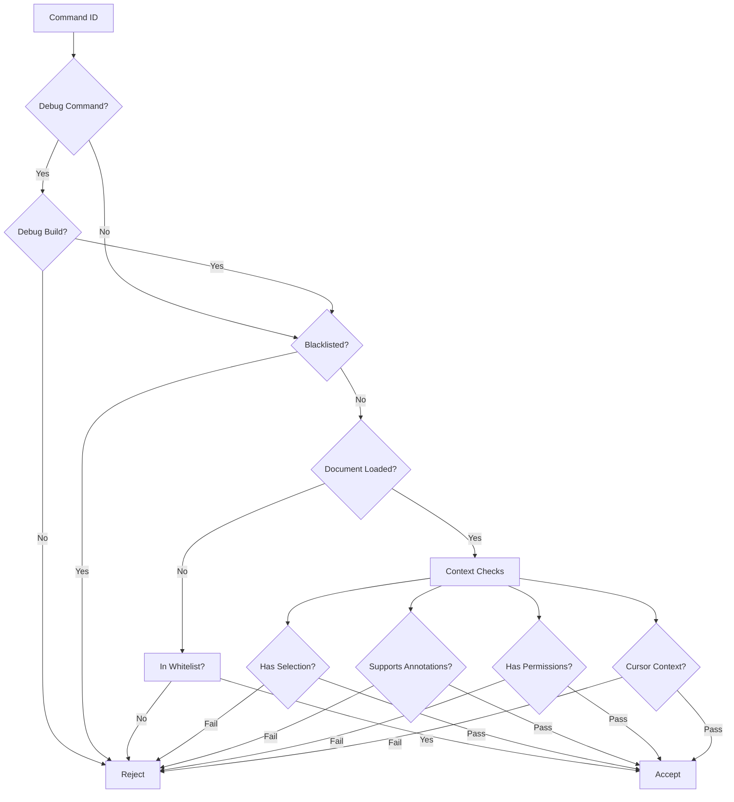
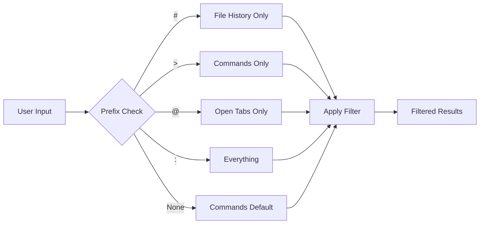
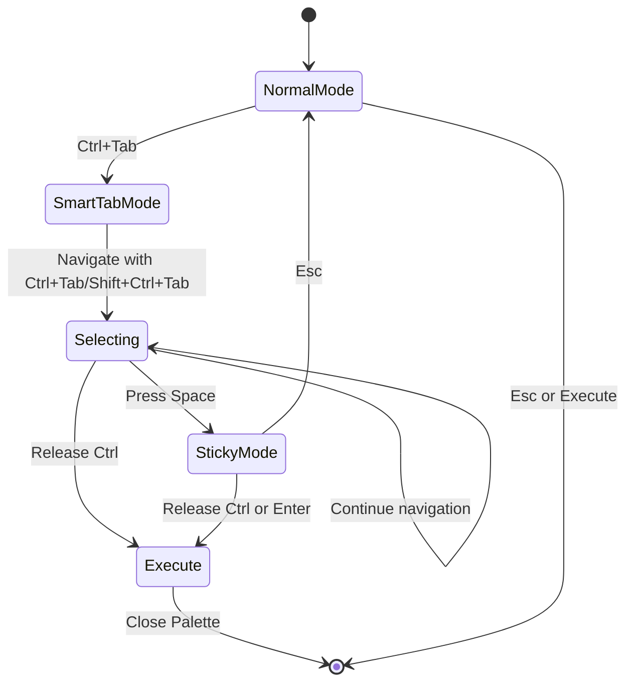
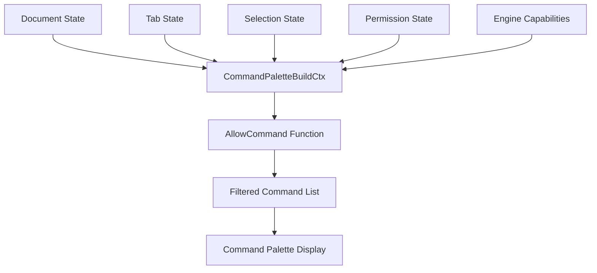

# Command Palette Module Documentation

## Overview

The Command Palette module provides a powerful, keyboard-driven interface for accessing all application functionality in SumatraPDF. It serves as a unified search and command execution interface that allows users to quickly find and execute commands, switch between tabs, and access file history without navigating through traditional menus.

## Purpose and Core Functionality

The Command Palette module implements a modern command interface that:
- Provides fuzzy search across all available commands, open tabs, and file history
- Supports multiple search modes (commands, tabs, file history, or everything)
- Enables keyboard-only navigation and execution
- Offers smart tab switching with live preview
- Maintains context-aware command availability based on current document state

## Architecture

### Core Components

### Component Relationships

## Data Flow

## Command Filtering Logic

## Search Modes

The Command Palette supports multiple search prefixes that determine which content to search:

## Smart Tab Mode

The Command Palette includes a special "smart tab" mode for quick tab switching:

## Integration with Other Modules

### Dependencies

- **[MainWindow](main_window.md)**: Provides current application state and tab management
- **[Commands](commands.md)**: Command definitions and execution system
- **[Settings](settings.md)**: Global preferences and file history
- **[Document Formats](document_formats.md)**: Document-specific capabilities
- **[UI Components](ui_components.md)**: Shared UI elements and theming

### Context-Aware Filtering

The Command Palette integrates deeply with the application's state to provide contextually relevant commands:

## Key Features

### 1. Fuzzy Search
- Multi-word search with case-insensitive matching
- All words must match for a result to appear
- Real-time filtering as the user types

### 2. Context Awareness
- Commands are filtered based on current document type
- Annotation commands only appear for supported formats
- Selection-dependent commands require active selection
- Permission-based filtering for restricted operations

### 3. Multiple Content Types
- **Commands**: All available application commands
- **Tabs**: Currently open document tabs
- **File History**: Recently opened files
- **Everything**: Combined search across all types

### 4. Smart Navigation
- Keyboard-only operation
- Smart tab mode for quick tab switching
- Sticky mode for extended browsing
- Live preview in smart tab mode

## Performance Considerations

The Command Palette is designed for responsiveness:
- String collection happens once when opened
- Filtering is performed on pre-collected data
- UI updates are batched to prevent flicker
- Memory is managed efficiently with temporary string allocations

## Extensibility

The module supports custom commands through the [Commands](commands.md) system:
- External viewer commands are dynamically added
- Selection handlers appear contextually
- Keyboard shortcuts are included in search results
- Custom commands can be filtered by file type

## Error Handling

The Command Palette includes robust error handling:
- Invalid commands are logged and skipped
- Missing files in history are gracefully handled
- UI state is preserved during filtering operations
- Safe cleanup on unexpected closure

This design ensures the Command Palette remains a reliable and efficient interface for accessing all application functionality while maintaining responsiveness and contextual relevance.