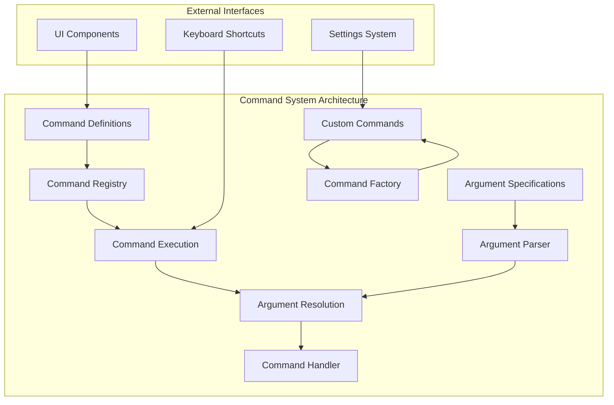
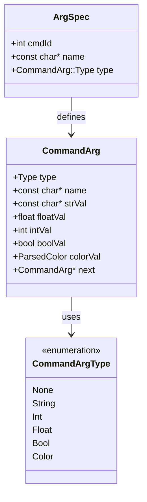
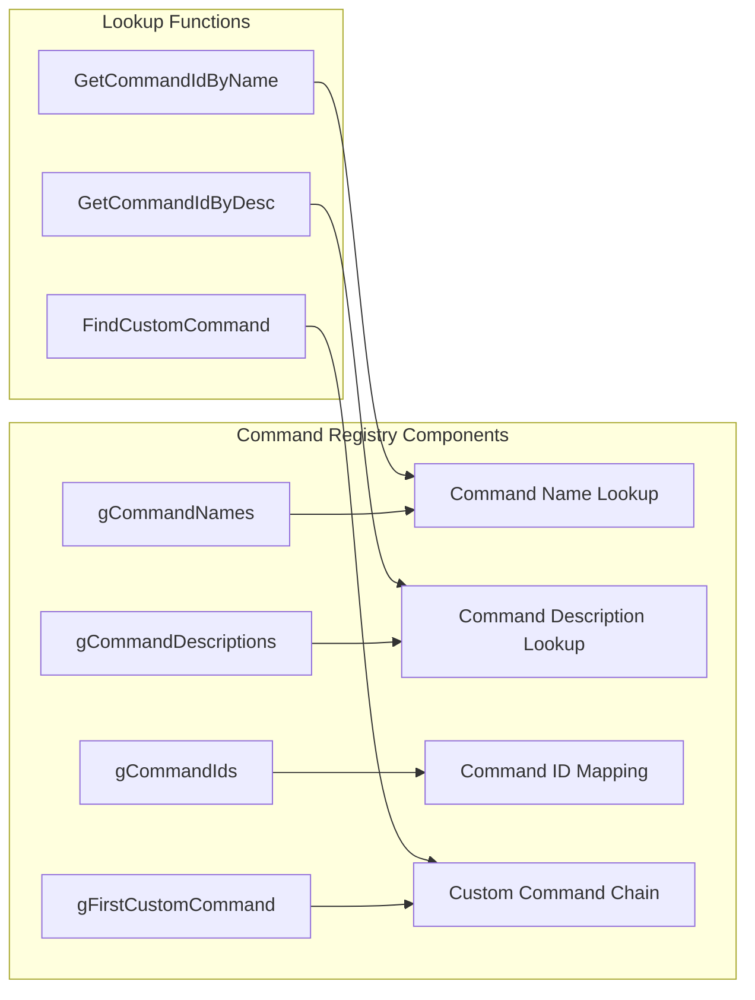
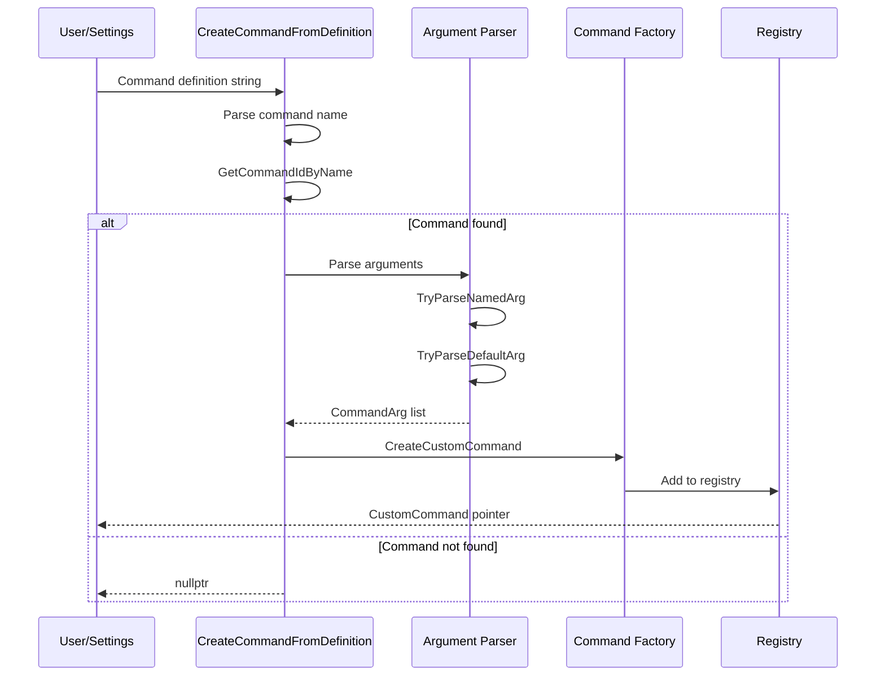
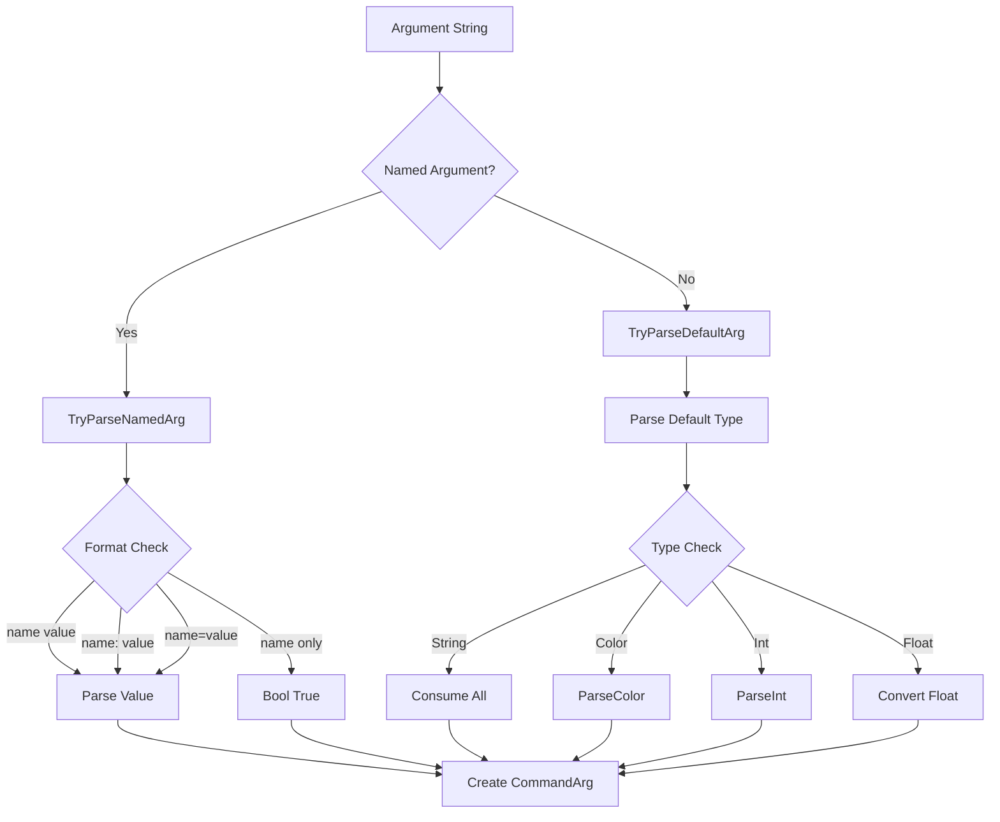
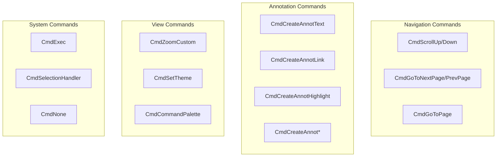
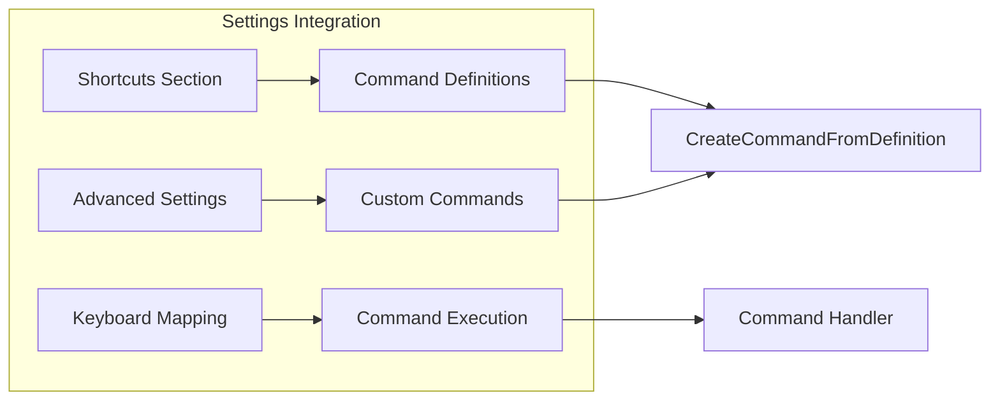
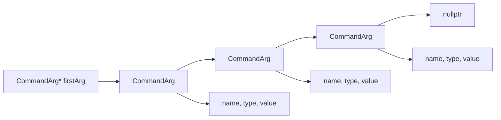
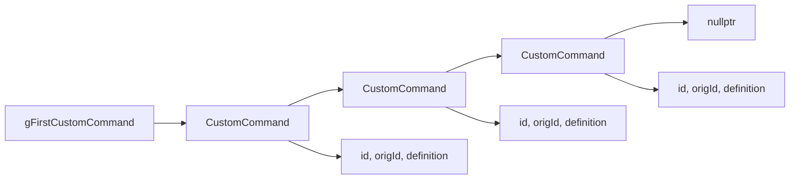

# Command System Module Documentation

## Introduction

The command_system module is a core component of the SumatraPDF application that provides a comprehensive command processing framework. It handles command definitions, argument parsing, custom command creation, and command execution management. The module serves as the central hub for processing user actions, keyboard shortcuts, and programmatic commands throughout the application.

## Architecture Overview

The command system is built around a flexible architecture that supports both built-in commands and user-defined custom commands with typed arguments. It provides a unified interface for command execution while maintaining extensibility for advanced use cases.



## Core Components

### ArgSpec Structure

The `ArgSpec` structure defines the specification for command arguments, providing a type-safe way to handle command parameters.



### Command Registry

The command registry maintains mappings between command names, descriptions, and IDs for both built-in and custom commands.



## Command Processing Flow

### Command Creation and Parsing

The system supports creating custom commands from string definitions with sophisticated argument parsing capabilities.



### Argument Parsing Logic

The argument parser supports multiple formats and type conversions with intelligent defaults.



## Command Types and Categories

### Built-in Command Categories

The system organizes commands into logical categories based on functionality:



### Custom Command Features

Custom commands extend the system with user-defined functionality:

- **Argument Support**: Typed parameters (String, Int, Float, Bool, Color)
- **Command Chaining**: Multiple custom commands can reference the same base command
- **Validation**: Built-in validation for command-specific arguments
- **Memory Management**: Automatic cleanup of command arguments and definitions

## Integration Points

### Settings System Integration

The command system integrates with the settings system to allow user-defined shortcuts and commands.



### UI Component Integration

Commands are exposed through various UI components:

- **Menu System**: Command descriptions and keyboard shortcuts
- **Toolbar**: Button commands and custom actions
- **Command Palette**: Searchable command interface
- **Keyboard Shortcuts**: Direct command invocation

## Data Structures

### Command Argument Chain

Arguments are stored in a linked list for efficient processing:



### Custom Command Registry

Custom commands are maintained in a global linked list:



## Error Handling and Validation

### Command Validation

The system implements comprehensive validation at multiple levels:

- **Command Name Validation**: Checks against known command names
- **Argument Type Validation**: Ensures type compatibility
- **Value Parsing Validation**: Validates argument values (colors, numbers, etc.)
- **Command-Specific Validation**: Special validation for certain commands (e.g., CmdCommandPalette modes)

### Error Reporting

Errors are logged with detailed information for debugging:

- Unknown command names
- Invalid argument types
- Failed value parsing
- Missing required arguments

## Memory Management

### Automatic Cleanup

The system provides automatic memory management for dynamically allocated resources:

- **CommandArg Cleanup**: `FreeCommandArgs()` recursively frees argument chains
- **Custom Command Cleanup**: `FreeCustomCommands()` removes all custom commands
- **String Management**: Automatic cleanup of dynamically allocated strings

### Resource Tracking

Global pointers are maintained for resource tracking:

- `gFirstCustomCommand`: Head of custom command list
- `gCommandNames`: Built-in command names
- `gCommandDescriptions`: Built-in command descriptions

## Performance Considerations

### Lookup Optimization

- **String Indexing**: Uses `seqstrings::StrToIdxIS` for efficient case-insensitive lookups
- **Command ID Caching**: Command IDs are pre-computed for built-in commands
- **Argument Parsing**: Optimized parsing with early termination

### Memory Efficiency

- **String Interning**: Command names and descriptions are stored in contiguous arrays
- **Linked Lists**: Efficient memory usage for variable-length argument lists
- **Lazy Allocation**: Resources are allocated only when needed

## Security Considerations

### Command Injection Prevention

- **Argument Validation**: All arguments are validated before processing
- **Type Safety**: Strong typing prevents buffer overflows
- **String Sanitization**: Input strings are properly handled

### Access Control

- **Command Restrictions**: Certain commands may have execution restrictions
- **User Input Validation**: External input is validated before command creation

## Dependencies

The command_system module has dependencies on several other system components:

- **utils Module**: Base utilities and string handling ([utils.md](utils.md))
- **Settings Module**: Configuration and preferences ([settings.md](settings.md))
- **Display System**: Display mode definitions ([display_system.md](display_system.md))

## Usage Examples

### Creating a Custom Command

```cpp
// Create a custom zoom command
const char* definition = "CmdZoomCustom 150%";
CustomCommand* cmd = CreateCommandFromDefinition(definition);
if (cmd) {
    // Command created successfully
    float zoomLevel = GetCommandFloatArg(cmd, kCmdArgLevel, 100.0f);
}
```

### Parsing Command Arguments

```cpp
// Parse arguments for annotation creation
const char* args = "color=#FF0000 openedit=true";
CommandArg* firstArg = nullptr;
// Parse arguments and create CommandArg chain
// Use FindArg() to retrieve specific arguments
```

### Command Lookup

```cpp
// Find command by name
int cmdId = GetCommandIdByName("CmdOpenFile");
if (cmdId >= 0) {
    // Command found
}

// Find command by description
int cmdId = GetCommandIdByDesc("Open File");
```

## Future Enhancements

### Planned Features

- **Command History**: Track and replay command sequences
- **Scripting Support**: Enhanced scripting capabilities
- **Command Chaining**: Support for command sequences
- **Conditional Commands**: Commands with execution conditions

### Performance Improvements

- **Command Indexing**: Faster command lookup for large command sets
- **Argument Caching**: Cache parsed arguments for repeated use
- **Memory Pool**: Reduce allocation overhead for frequent operations

## Conclusion

The command_system module provides a robust, extensible framework for command processing in SumatraPDF. Its flexible architecture supports both simple and complex command scenarios while maintaining performance and reliability. The system's integration with other components makes it a central part of the application's functionality, enabling rich user interactions and customizable behavior.