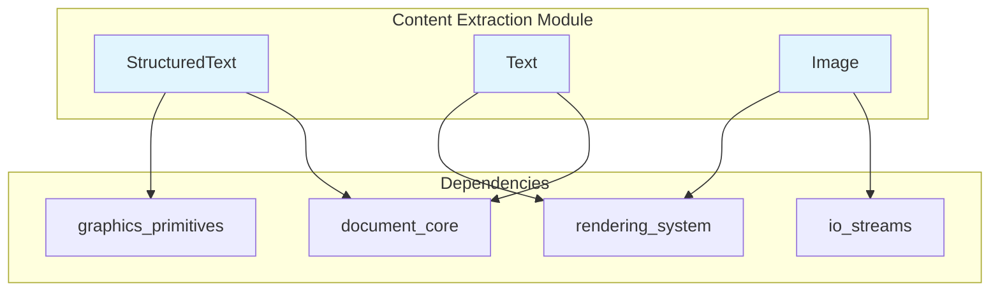
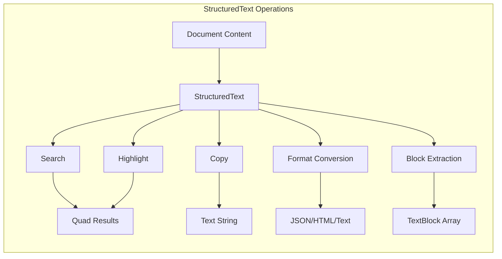
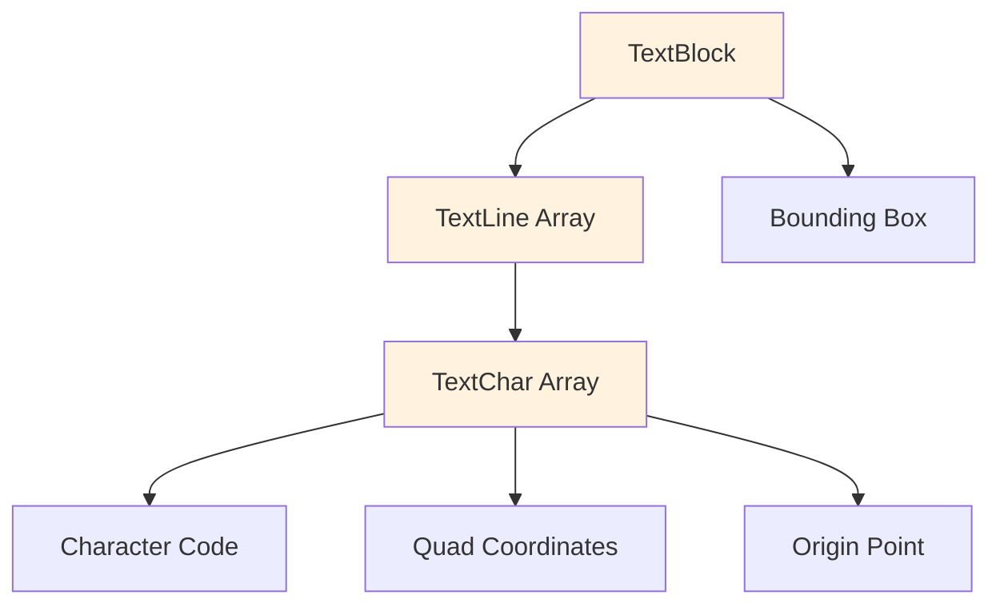
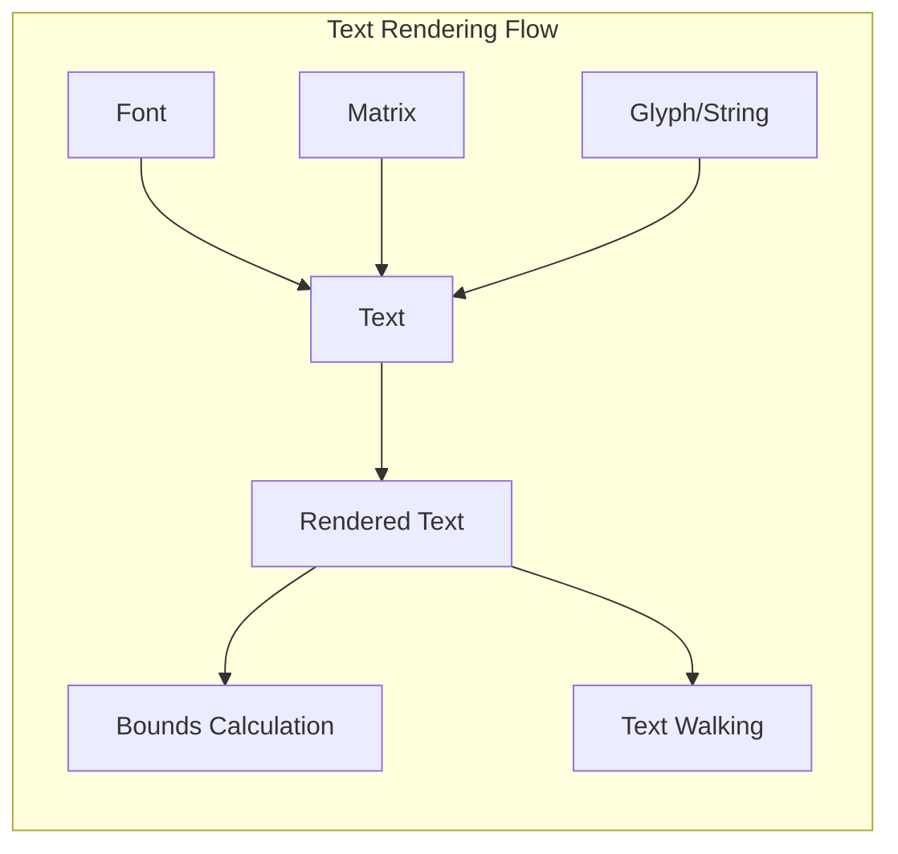
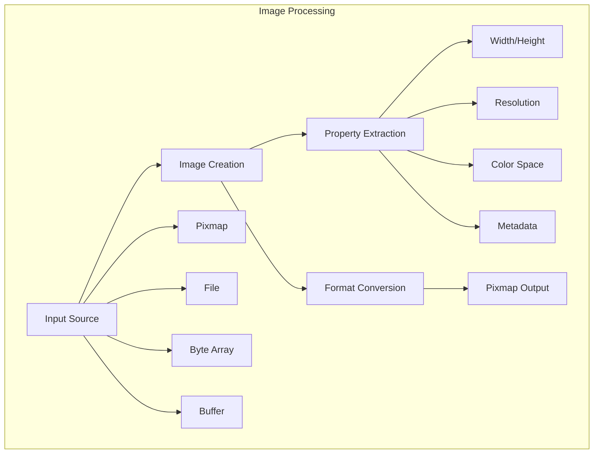
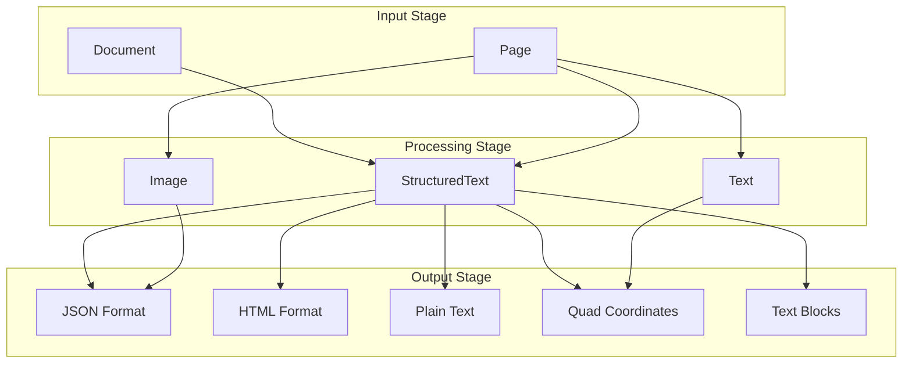
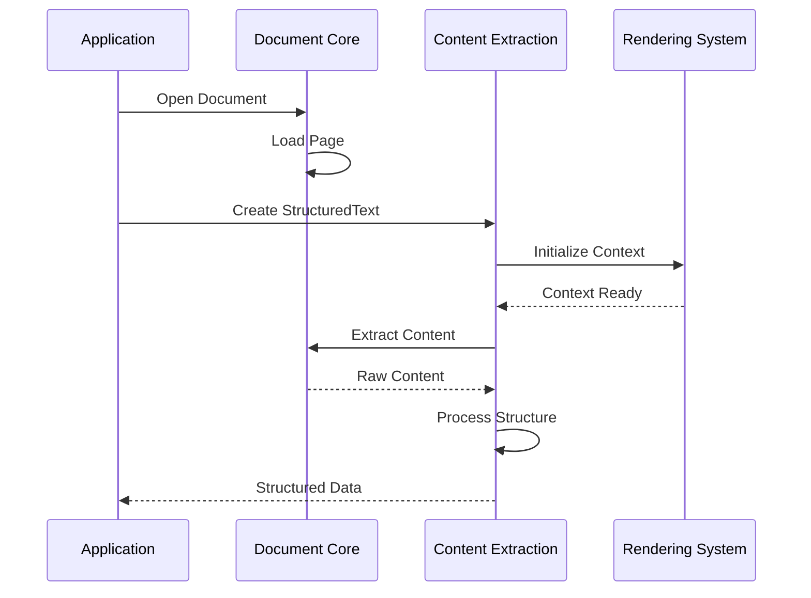
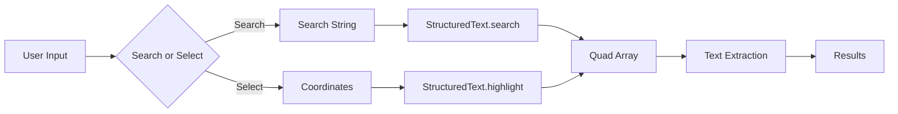

# Content Extraction Module

## Introduction

The content_extraction module provides comprehensive functionality for extracting and processing textual and visual content from documents. Built on top of the MuPDF library's Java bindings, this module enables applications to parse document structure, extract text with spatial information, handle images, and convert document content into various formats including JSON, HTML, and plain text.

The module serves as a critical component in document processing pipelines, offering both high-level structured text extraction and low-level text rendering capabilities. It supports text search, selection, and coordinate-based content extraction, making it essential for applications requiring precise document content manipulation and analysis.

## Architecture Overview

The content_extraction module is built around three core components that work together to provide comprehensive document content extraction capabilities:

### Core Components

1. **StructuredText** - High-level structured text extraction with spatial information
2. **Text** - Low-level text rendering and manipulation
3. **Image** - Image content extraction and processing

### Module Dependencies

The content_extraction module integrates with several other system modules:

- **[document_core](document_core.md)** - Provides document and page access through Document and Page classes
- **[rendering_system](rendering_system.md)** - Supplies rendering context and device capabilities via Device and Pixmap
- **[graphics_primitives](graphics_primitives.md)** - Offers geometric primitives (Point, Rect, Quad) for spatial text representation
- **[io_streams](io_streams.md)** - Handles buffer operations for image data through Buffer class

## Component Details

### StructuredText Component

The StructuredText class provides high-level text extraction with spatial information and document structure awareness. It serves as the primary interface for extracting readable content from documents while maintaining layout and formatting information.

#### Key Features

- **Multi-format Output**: Converts extracted text to JSON, HTML, and plain text formats
- **Spatial Search**: Provides coordinate-based text search and selection capabilities
- **Structured Blocks**: Organizes text into hierarchical blocks, lines, and characters
- **Selection Modes**: Supports character, word, and line-level text selection

#### Core Functionality

#### Text Structure Hierarchy

The StructuredText component organizes content in a hierarchical structure:

#### Selection and Search Capabilities

The component provides three selection modes for different use cases:

- **SELECT_CHARS** (0) - Character-level precision for detailed text selection
- **SELECT_WORDS** (1) - Word-level selection for natural text processing
- **SELECT_LINES** (2) - Line-level selection for paragraph and column extraction

### Text Component

The Text class provides low-level text rendering and manipulation capabilities. It implements the TextWalker interface and serves as both a text container and a rendering target for document content.

#### Key Features

- **Glyph Rendering**: Direct glyph placement with font and transformation matrix support
- **String Rendering**: Text string rendering with writing mode support
- **Bounds Calculation**: Precise bounding box calculation for rendered text
- **Text Walking**: Iterative text content traversal via TextWalker interface

#### Rendering Pipeline

### Image Component

The Image class handles image content extraction and processing from documents. It supports multiple input sources and provides comprehensive image property access and format conversion capabilities.

#### Key Features

- **Multi-source Input**: Creates images from Pixmap, files, byte arrays, or buffers
- **Property Access**: Provides width, height, resolution, and color space information
- **Format Conversion**: Converts to Pixmap for further processing
- **Metadata Support**: Handles color keys, decode arrays, and orientation information

#### Image Processing Flow

## Data Flow Architecture

The content extraction process follows a structured data flow that transforms raw document content into structured, searchable, and convertible formats:

## Integration Patterns

### Document Processing Pipeline

The content_extraction module integrates with the broader document processing system through well-defined interfaces:

### Text Search and Selection Flow

The search and selection functionality follows a coordinate-based approach:

## Usage Patterns

### Basic Text Extraction

The module supports various text extraction patterns based on application requirements:

1. **Full Document Text**: Extract complete text content as plain text
2. **Structured Blocks**: Extract text organized by blocks, lines, and characters
3. **Coordinate-based Selection**: Extract text from specific regions using coordinates
4. **Format-specific Output**: Convert extracted text to JSON or HTML formats

### Image Processing

Image extraction supports multiple workflows:

1. **Direct Extraction**: Extract images from document pages
2. **Format Conversion**: Convert images to Pixmap for processing
3. **Property Analysis**: Access image metadata and properties
4. **Multi-source Creation**: Create images from various input sources

## Performance Considerations

### Memory Management

- Native resources are managed through finalizers and explicit destroy methods
- StructuredText objects should be destroyed after use to free native memory
- Image objects maintain references to source data and should be properly cleaned up

### Processing Optimization

- Text extraction can be performed at different granularity levels (blocks, lines, characters)
- Search operations return Quad arrays for efficient spatial processing
- Format conversion (JSON/HTML) is performed on-demand to minimize processing overhead

## Error Handling

The module relies on native code integration and requires proper error handling:

- Context initialization must succeed before any operations
- Native method calls may throw exceptions for invalid operations
- Resource cleanup is essential to prevent memory leaks
- Coordinate-based operations validate input parameters

## Extension Points

The module provides several extension points for custom functionality:

- **StructuredTextWalker Interface**: Custom text processing during document traversal
- **TextWalker Interface**: Custom text rendering and processing
- **Format Conversion**: Custom output formats through string-based conversion methods
- **Selection Modes**: Extensible selection behavior for specialized use cases

This architecture enables the content_extraction module to serve as a robust foundation for document content processing while maintaining flexibility for diverse application requirements.