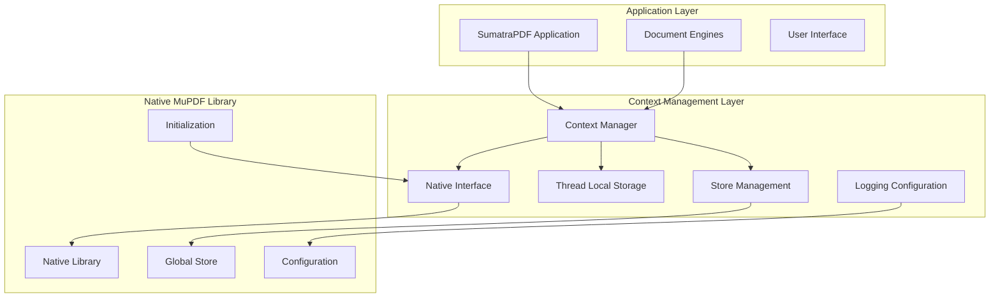
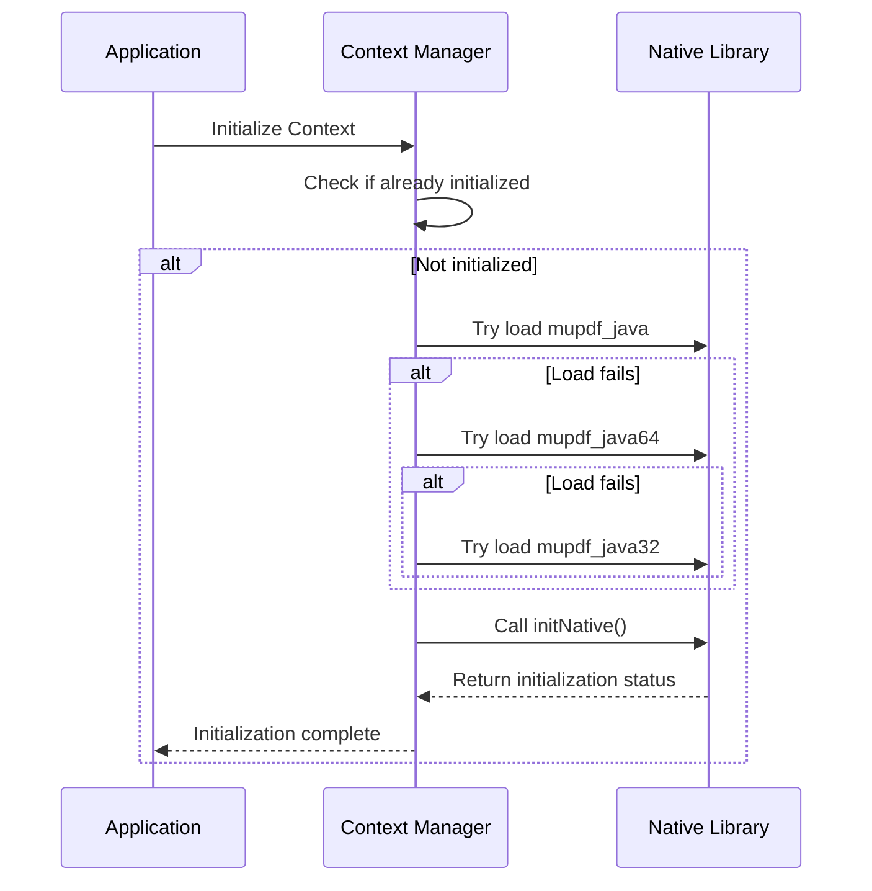
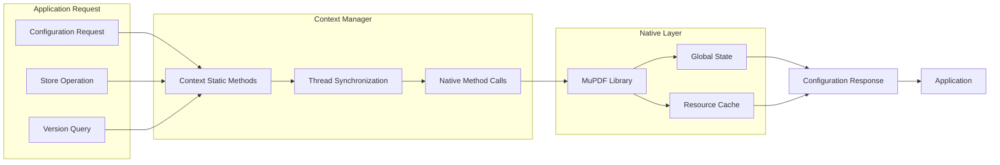

# Context Management Module

## Introduction

The context_management module provides the foundational runtime environment for MuPDF operations within the SumatraPDF application. It serves as the primary interface between the Java application layer and the native MuPDF library, handling library initialization, memory management, and global configuration settings that affect all document processing operations.

This module is critical for establishing the execution context required for all PDF, XPS, and ebook document operations, making it a fundamental dependency for the entire document rendering pipeline.

## Architecture Overview

The Context class acts as a singleton manager that orchestrates the interaction between the Java application and the native MuPDF library. It provides thread-safe access to global MuPDF functionality while managing the lifecycle of the underlying native resources.



## Core Components

### Context Class

The `Context` class is the central component of this module, providing static methods for:

- **Library Initialization**: Loading the appropriate native MuPDF library (mupdf_java, mupdf_java64, or mupdf_java32)
- **Memory Management**: Controlling the global store size and performing garbage collection
- **Configuration Management**: Setting global rendering options like ICC profiles, anti-aliasing, and CSS settings
- **Version Information**: Providing access to MuPDF version details
- **Logging**: Managing error and warning message handling

### Key Features

#### Native Library Loading
The module implements a robust library loading mechanism that attempts to load the most appropriate version of the MuPDF native library based on the system architecture:



#### Store Management
The module provides methods to control MuPDF's internal store, which manages cached resources:

- `emptyStore()`: Clears all cached resources
- `shrinkStore(int percent)`: Reduces store size by specified percentage
- `setStoreSize()`: Configures maximum store size (must be called before any other operations)

#### Global Configuration
The Context class exposes several global configuration options:

- **ICC Color Management**: Enable/disable ICC profile usage
- **Anti-aliasing**: Control rendering quality levels
- **CSS Processing**: Configure document and user CSS handling
- **Logging**: Set up custom error and warning handlers

## Dependencies and Integration

### Upstream Dependencies
The context_management module has no internal dependencies within the SumatraPDF codebase, as it serves as the foundational layer for all MuPDF operations.

### Downstream Dependencies
This module is a critical dependency for multiple engine modules:

- **[mupdf_engine_integration](mupdf_engine_integration.md)**: Directly uses Context for all MuPDF operations
- **[pdf_synchronization](pdf_synchronization.md)**: Relies on Context for PDF document processing
- **[annotation_editing](annotation_editing.md)**: Uses Context for annotation manipulation
- **[image_processing](image_processing.md)**: Depends on Context for image operations

### External Dependencies
- **Native MuPDF Library**: The module requires the appropriate MuPDF native library to be available
- **Java Native Interface (JNI)**: Used for communication between Java and native code

## Data Flow



## Configuration Management

### Initialization Requirements
The Context must be properly initialized before any MuPDF operations can occur. The initialization process:

1. Loads the native MuPDF library
2. Initializes internal MuPDF structures
3. Sets up global error handling
4. Configures default settings

### Thread Safety
All Context operations are thread-safe through the use of:
- Static initialization blocks
- Synchronized logging access
- Thread-local storage for context management

### Error Handling
The module provides comprehensive error handling:
- Runtime exceptions for initialization failures
- Native error propagation through JNI
- Configurable logging for debugging and monitoring

## Usage Patterns

### Basic Initialization
```java
// Initialize context (automatic on first use)
Context.init();

// Configure global settings
Context.setStoreSize(256); // Set store size to 256MB
Context.enableICC();       // Enable color management
Context.setAntiAliasLevel(8); // Set anti-aliasing level
```

### Store Management
```java
// Clear cached resources
Context.emptyStore();

// Reduce memory usage
Context.shrinkStore(50); // Shrink store by 50%
```

### Version and Logging
```java
// Get MuPDF version information
Version version = Context.getVersion();

// Set up custom logging
Context.setLog(new Context.Log() {
    public void error(String message) {
        System.err.println("MuPDF Error: " + message);
    }
    public void warning(String message) {
        System.out.println("MuPDF Warning: " + message);
    }
});
```

## Performance Considerations

### Memory Management
- The global store size directly impacts memory usage and performance
- Store shrinking can be used to manage memory pressure
- Emptying the store clears all cached resources, potentially impacting performance

### Threading Model
- Context operations are designed to be thread-safe
- Native calls are synchronized to prevent race conditions
- Thread-local storage minimizes contention

### Initialization Overhead
- Library loading occurs only once per JVM instance
- Native initialization is performed lazily
- Configuration changes apply globally and immediately

## Security Considerations

### Native Code Execution
- The module executes native code through JNI
- Library loading paths should be secured
- Input validation is performed before native calls

### Resource Management
- Store operations can affect system memory
- Improper configuration may lead to resource exhaustion
- Logging should be configured to prevent information leakage

## Future Considerations

### Scalability
The current design supports single JVM instances. For multi-instance deployments:
- Consider per-instance configuration isolation
- Implement resource pooling for high-concurrency scenarios
- Evaluate native library sharing mechanisms

### Monitoring
Future enhancements could include:
- Performance metrics for store operations
- Native memory usage tracking
- Configuration change auditing
- Error rate monitoring

## Related Documentation

- [mupdf_engine_integration](mupdf_engine_integration.md) - Document engine implementation using Context
- [pdf_synchronization](pdf_synchronization.md) - PDF synchronization features
- [annotation_editing](annotation_editing.md) - Annotation manipulation capabilities
- [image_processing](image_processing.md) - Image processing operations