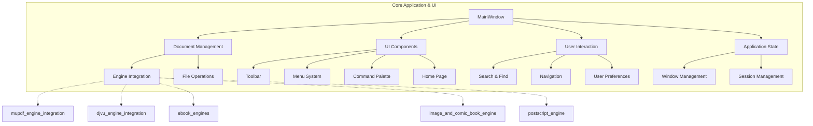
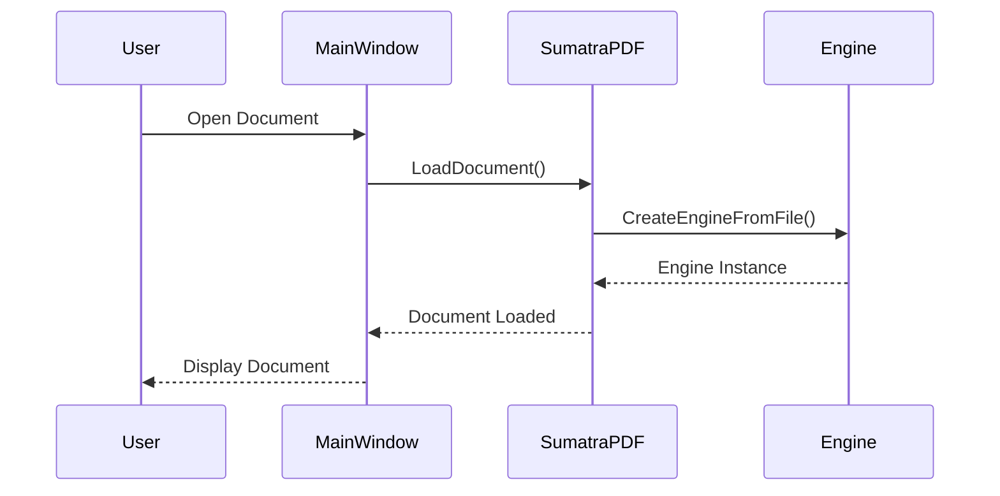
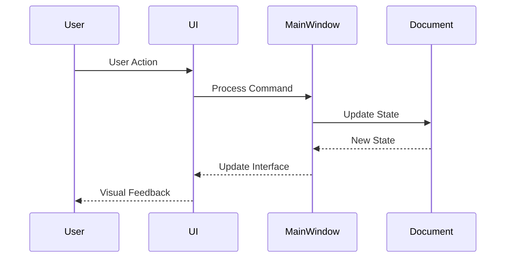

# Core Application and UI Module

## Overview

The `core_application_and_ui` module serves as the central hub of the SumatraPDF application, providing the main application framework, user interface components, and core functionality for document viewing and user interaction. This module orchestrates the interaction between various subsystems including document engines, UI components, and user preferences.

## Architecture

## Core Components

### Main Application Framework

The module provides the foundational application structure through several key components:

- **MainWindow**: Central window management and document display coordination
- **SumatraPDF**: Application initialization, global state management, and document loading
- **LinkHandler**: Navigation and hyperlink processing within documents
- **HwndPasswordUI**: Password dialog handling for protected documents

### User Interface Components

The UI layer consists of multiple specialized components:

- **Toolbar**: Main toolbar with navigation, zoom, and document controls
- **Menu System**: Context menus, main menu bar, and menu customization
- **Command Palette**: Advanced command interface for power users
- **Home Page**: Welcome screen with frequently accessed documents
- **Caption**: Custom window caption with integrated controls

### Document Interaction

Components for user interaction with documents:

- **Search & Find**: Text search functionality with progress tracking
- **Table of Contents**: Document navigation through bookmarks/TOC
- **External Viewers**: Integration with external document viewers
- **Update Check**: Automatic update checking and notification
- **Print System**: Document printing with advanced options

## Sub-modules

### 1. Main Window Management
**File**: [main_window_management.md](main_window_management.md)

Handles the primary application window, document display coordination, and window state management. Includes MainWindow class and related window management functionality.

**Key Components:**
- `MainWindow`: Central window management and document display coordination
- `LinkHandler`: Navigation and hyperlink processing within documents  
- `HwndPasswordUI`: Password dialog handling for protected documents

### 2. User Interface Components
**File**: [ui_components.md](ui_components.md)

Comprehensive UI system including toolbar, menus, dialogs, and custom controls. Manages user interface rendering and interaction patterns.

**Key Components:**
- `ToolbarButtonInfo`: Toolbar button configuration and behavior
- `MenuOwnerDrawInfo`: Custom menu drawing and styling
- `ButtonInfo`: Custom caption button management
- `ArgSpec`: Command argument specifications
- `CommandPaletteBuildCtx`: Command palette context and filtering
- `HomePageLayout`: Home page layout and thumbnail management

### 3. Document Navigation and Search
**File**: [document_navigation.md](document_navigation.md)

Provides document navigation capabilities including search functionality, table of contents management, and page navigation controls.

**Key Components:**
- `Dialog_Find_Data`: Find dialog data and state management
- `Dialog_GoToPage_Data`: Go to page dialog functionality
- `UpdateFindStatusData`: Search progress and status updates
- `VistorForPageNoData`: TOC navigation and page number tracking

### 4. Application Services
**File**: [application_services.md](application_services.md)

Core application services including update checking, external viewer integration, printing system, and crash handling.

**Key Components:**
- `ExternalViewerInfo`: External viewer configuration and integration
- `UpdateInfo`: Update checking and version management
- `PaperSizeDesc`: Print paper size detection and management
- `Base`: Crash handling and error reporting infrastructure

## Key Features

### Multi-Document Support
- Tab-based document management
- Multiple window instances
- Document state persistence
- Session management

### Advanced UI Features
- Customizable toolbar and menus
- Command palette for quick access
- Theme support and dark mode
- Multi-language support

### Document Interaction
- Comprehensive search with highlighting
- Bookmark and TOC navigation
- Annotation support (where applicable)
- External viewer integration

### User Experience
- Home page with frequently read documents
- Update notifications
- Crash reporting and recovery
- Accessibility features

## Dependencies

The core_application_and_ui module integrates with several other modules:

- **Engine Integration Modules**: For document rendering and processing
- **Core Utilities**: For file operations, settings management, and system integration
- **Theme System**: For consistent visual appearance
- **Accessibility**: For screen reader and keyboard navigation support

## Usage Patterns

### Document Loading Flow

### User Interface Updates

## Configuration and Customization

The module supports extensive customization through:

- **Global Preferences**: User settings and preferences storage
- **Theme System**: Visual appearance customization
- **Command System**: Custom commands and keyboard shortcuts
- **Layout Management**: Window and UI element arrangement

## Error Handling and Recovery

- **Crash Handler**: Comprehensive crash reporting and recovery
- **Error Notifications**: User-friendly error messages
- **State Recovery**: Document state restoration after errors
- **Logging System**: Detailed logging for debugging and support

## Performance Considerations

- **Lazy Loading**: UI components loaded on demand
- **Caching**: Document thumbnails and frequently accessed data
- **Threading**: Background operations for non-blocking UI
- **Memory Management**: Efficient resource usage and cleanup

This module serves as the primary interface between users and the SumatraPDF application, providing a robust, feature-rich environment for document viewing and interaction.