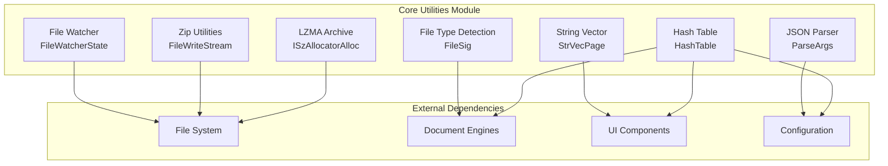

# Core Utilities Module

## Overview

The `core_utilities` module provides fundamental utility services and data structures that support the entire SumatraPDF application. This module implements cross-cutting concerns including file system monitoring, data structures, parsing utilities, and archive handling that are used throughout the system.

## Architecture



## Sub-modules

### 1. File System Monitoring
**File**: [file_watcher.md](file_watcher.md)

Implements asynchronous file system monitoring using Windows `ReadDirectoryChangesW` API. Provides real-time notifications when watched files are modified, created, or deleted. Handles both local files and network drives with different monitoring strategies.

**Key Features**:
- Overlapped I/O with completion callbacks
- Network drive support via periodic polling
- Thread-safe subscription model
- Automatic duplicate notification filtering

### 2. Data Structures
**File**: [data_structures.md](data_structures.md)

Provides high-performance, memory-efficient data structures optimized for the application's specific needs.

**Components**:
- **HashTable**: Generic hash table with chaining collision resolution
- **StrVecPage**: Paged string vector for efficient string storage and manipulation
- **Dict**: Type-safe dictionary wrapper around HashTable

### 3. Parsing Utilities
**File**: [parsing_utilities.md](parsing_utilities.md)

Implements specialized parsers for configuration and data exchange formats.

**Components**:
- **JSON Parser**: Lightweight JSON parser with visitor pattern
- **File Type Detection**: Multi-format file type identification using signatures and content analysis

### 4. Archive Handling
**File**: [archive_handling.md](archive_handling.md)

Provides archive creation and extraction capabilities for various formats.

**Components**:
- **Zip Utilities**: ZIP archive creation with compression
- **LZMA Archive**: Custom LZMA-based archive format for efficient storage

## Core Components Overview

### FileWatcherState
State container for tracking file modification times and sizes. Used to detect changes in files that cannot be monitored via `ReadDirectoryChangesW` (e.g., network files).

### HashTable
Generic hash table implementation using:
- Power-of-two sizing for efficient modulo operations
- Chaining for collision resolution
- Load factor of 150% for optimal performance
- Support for custom hash functions and comparators

### ParseArgs
Context object for JSON parsing that maintains parsing state, path information, and visitor callbacks. Enables streaming JSON parsing with early termination support.

### StrVecPage
Memory-efficient string storage using:
- Paged allocation to reduce fragmentation
- In-place string updates when possible
- Support for associated data per string
- Multiple sorting algorithms (case-sensitive, case-insensitive, natural)

### FileSig
File signature structure for content-based type detection. Contains offset, signature bytes, and corresponding file type for format identification.

### FileWriteStream
COM-compatible sequential stream implementation for writing ZIP archives. Provides abstraction over file handles for archive creation.

### ISzAllocatorAlloc
Bridge between SumatraPDF's allocator system and LZMA library's allocation interface. Enables custom memory management within LZMA operations.

## Usage Patterns

### File Watching
```cpp
// Subscribe to file changes
WatchedFile* wf = FileWatcherSubscribe(filePath, callback);
// Unsubscribe when done
FileWatcherUnsubscribe(wf);
```

### Dictionary Usage
```cpp
// Create string-to-int mapping
MapStrToInt dict(64); // initial size
int existingVal;
const char* internedKey;
bool inserted = dict.Insert("key", 42, &existingVal, &internedKey);
```

### String Vector Operations
```cpp
// Efficient string collection and manipulation
StrVec strings;
strings.Append("string1");
strings.Append("string2");
SortNatural(&strings); // natural order sorting
```

## Integration Points

The core utilities module serves as a foundation for:
- **[core_application_and_ui.md](core_application_and_ui.md)**: File watching for document reload
- **[mupdf_engine_integration.md](mupdf_engine_integration.md)**: Archive extraction for document processing
- **[ebook_engines.md](ebook_engines.md)**: File type detection for format support
- **[image_and_comic_book_engine.md](image_and_comic_book_engine.md)**: Archive handling for comic book formats

## Performance Considerations

- **File Watcher**: Uses separate thread with APC (Asynchronous Procedure Call) mechanism to avoid blocking UI thread
- **Hash Table**: Optimized for cache performance with power-of-two sizing and minimal allocations
- **String Vector**: Paged allocation reduces memory fragmentation and improves locality
- **Archive Handling**: Streaming operations minimize memory usage for large archives

## Thread Safety

- File watcher operations are thread-safe using critical sections
- Hash table operations require external synchronization
- String vector operations are not thread-safe
- Archive operations are generally not thread-safe (depends on underlying libraries)

## Error Handling

The module uses a combination of:
- Return values for operation success/failure
- Optional output parameters for additional error information
- Assertions for programming errors
- Logging for diagnostic information

All components are designed to fail gracefully and provide meaningful error information when operations cannot be completed.