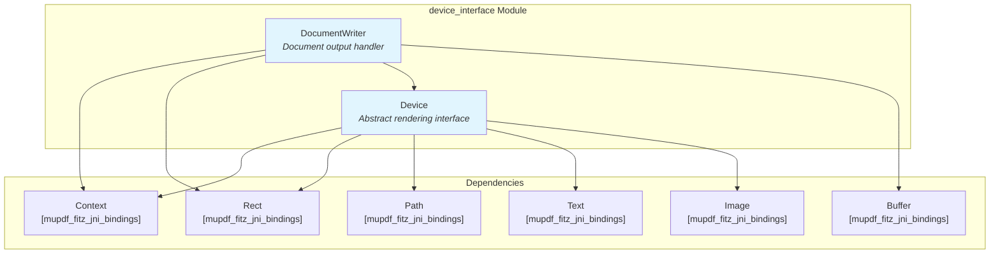
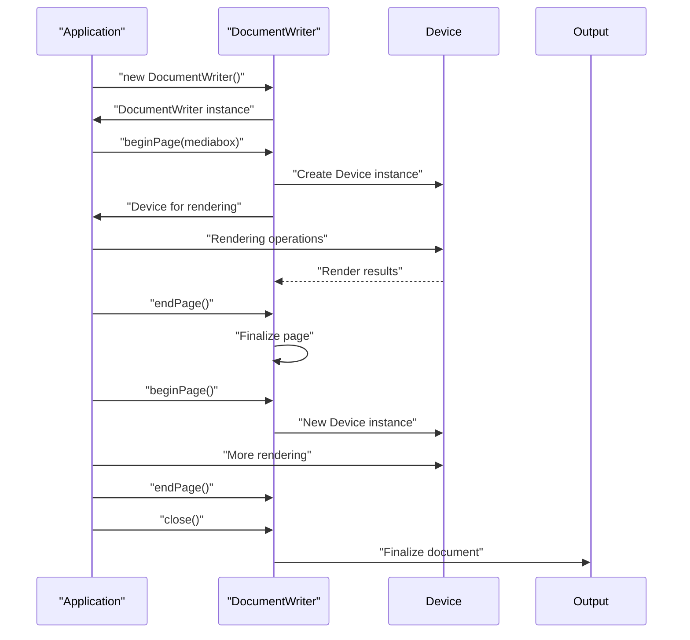
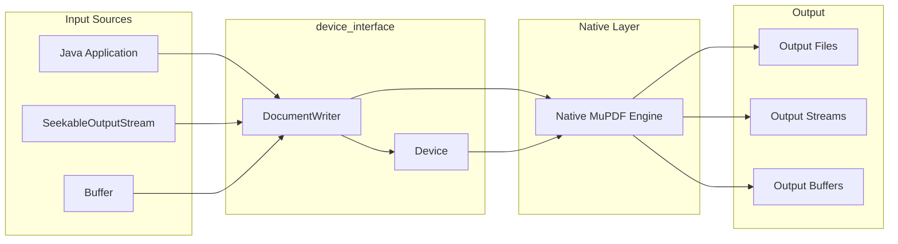

# Device Interface Module Documentation

## Introduction

The device_interface module provides the core abstraction layer for rendering and document writing operations in the MuPDF Java bindings. This module serves as the bridge between Java applications and the native MuPDF rendering engine, enabling developers to implement custom rendering devices and create document output in various formats.

The module consists of two primary components: the abstract `Device` class that defines the rendering interface, and the `DocumentWriter` class that handles document generation and output operations.

## Architecture Overview

The device_interface module is part of the larger MuPDF Java bindings ecosystem, specifically within the mupdf_fitz_jni_bindings module. It provides the essential interface for graphics rendering and document creation operations.



## Core Components

### Device Class

The `Device` class is an abstract base class that defines the complete interface for rendering operations. It serves as the foundation for implementing custom rendering devices that can process various graphical elements.

#### Key Features:
- **Abstract Rendering Interface**: Defines methods for rendering paths, text, images, and other graphical elements
- **State Management**: Handles rendering states including clips, masks, and groups
- **Blend Mode Support**: Implements PDF 1.4 blend modes for advanced compositing
- **Structure Support**: Provides document structure and accessibility features
- **Native Integration**: Bridges Java applications with native MuPDF rendering engine

#### Core Rendering Methods:

**Path Operations:**
- `fillPath()` - Fill geometric paths with colors or patterns
- `strokePath()` - Draw path outlines with customizable stroke properties
- `clipPath()` - Define clipping regions using paths

**Text Operations:**
- `fillText()` - Render filled text with specified styling
- `strokeText()` - Render outlined text
- `clipText()` - Use text as clipping regions
- `ignoreText()` - Skip text rendering for specific use cases

**Image Operations:**
- `fillImage()` - Render raster images
- `fillImageMask()` - Apply image masks for transparency effects
- `clipImageMask()` - Use image masks for clipping

**Advanced Features:**
- `fillShade()` - Render gradient and shaded fills
- `beginMask()`/`endMask()` - Define transparency masks
- `beginGroup()`/`endGroup()` - Create isolated rendering groups
- `beginTile()`/`endTile()` - Handle tiled patterns

#### Blend Modes:
The Device class supports comprehensive blend modes as defined in PDF 1.4:

**Separable Blend Modes:**
- Normal, Multiply, Screen, Overlay, Darken, Lighten
- Color Dodge, Color Burn, Hard Light, Soft Light
- Difference, Exclusion

**Non-separable Blend Modes:**
- Hue, Saturation, Color, Luminosity

#### Device Flags:
Control various rendering behaviors:
- `DEVICE_FLAG_MASK` - Device is a mask device
- `DEVICE_FLAG_COLOR` - Device supports color
- `DEVICE_FLAG_UNCACHEABLE` - Device cannot be cached
- `DEVICE_FLAG_BBOX_DEFINED` - Bounding box is defined

#### Document Structure Constants:
Support for PDF logical structure:
- Document hierarchy (DOCUMENT, PART, SECT, etc.)
- Content elements (P, H1-H6, LIST, TABLE, etc.)
- Accessibility features (ARTIFACT, ASIDE, etc.)

### DocumentWriter Class

The `DocumentWriter` class provides document generation capabilities, enabling the creation of output documents in various formats from rendered content.

#### Key Features:
- **Multiple Output Targets**: Support for file-based, stream-based, and buffer-based output
- **Format Flexibility**: Configurable output formats with options
- **Page Management**: Sequential page creation and management
- **OCR Integration**: Built-in OCR progress monitoring
- **Device Integration**: Seamless integration with Device instances for rendering

#### Constructor Options:

**File-based Output:**
```java
DocumentWriter(String filename, String format, String options)
```

**Stream-based Output:**
```java
DocumentWriter(SeekableOutputStream stream, String format, String options)
```

**Buffer-based Output:**
```java
DocumentWriter(Buffer buffer, String format, String options)
```

#### Document Creation Workflow:



#### OCR Integration:
The DocumentWriter supports OCR (Optical Character Recognition) operations with progress monitoring through the `OCRListener` interface:

```java
public interface OCRListener {
    boolean progress(int page, int percent);
}
```

## Data Flow Architecture



## Integration with Other Modules

The device_interface module integrates with several other modules in the system:

### [mupdf_fitz_jni_bindings](mupdf_fitz_jni_bindings.md)
- **Context Management**: Uses Context for initialization and resource management
- **Graphics Objects**: Integrates with Rect, Path, Text, Image, and other graphics primitives
- **Buffer Handling**: Works with Buffer class for memory-based operations

### [mupdf_engine_integration](mupdf_engine_integration.md)
- **Page Rendering**: Device instances are used for rendering pages from MuPDF documents
- **Annotation Support**: Provides rendering capabilities for PDF annotations
- **Image Processing**: Handles image rendering and processing operations

### [core_utilities](core_utilities.md)
- **Stream Operations**: Utilizes SeekableOutputStream for flexible output handling
- **Memory Management**: Integrates with buffer management utilities

## Usage Patterns

### Custom Device Implementation

```java
class CustomTraceDevice extends Device {
    @Override
    public void fillPath(Path path, boolean evenOdd, Matrix ctm, 
                        ColorSpace cs, float[] color, float alpha, int cp) {
        System.out.println("Filling path with color: " + 
                          Arrays.toString(color));
    }
    
    @Override
    public void fillText(Text text, Matrix ctm, ColorSpace cs, 
                        float[] color, float alpha, int cp) {
        System.out.println("Rendering text at position");
    }
    
    // Implement other required methods...
}
```

### Document Creation Example

```java
// Create a PDF document writer
DocumentWriter writer = new DocumentWriter("output.pdf", "pdf", "");

// Begin a new page
Rect pageBounds = new Rect(0, 0, 612, 792); // US Letter size
Device device = writer.beginPage(pageBounds);

// Perform rendering operations on the device
// ... rendering code ...

// End the page
writer.endPage();

// Close the document
writer.close();
```

## Error Handling and Resource Management

Both Device and DocumentWriter implement proper resource management:

- **Native Resource Cleanup**: Automatic cleanup of native resources through `finalize()`
- **Explicit Cleanup**: `destroy()` method for explicit resource disposal
- **Exception Safety**: Proper handling of native exceptions and errors

## Performance Considerations

- **Device Caching**: Some devices support caching for improved performance
- **Batch Operations**: Group rendering operations for better efficiency
- **Memory Management**: Proper disposal of devices and writers to prevent memory leaks
- **Native Optimization**: Leverages native MuPDF optimizations for rendering

## Thread Safety

The device_interface components are generally not thread-safe:
- **Single-threaded Access**: Device instances should be used from a single thread
- **Sequential Document Creation**: DocumentWriter pages must be created sequentially
- **Context Sharing**: Context initialization is handled automatically and safely

## Extensibility

The abstract Device class provides a foundation for custom rendering implementations:
- **Custom Renderers**: Implement specialized rendering devices for specific use cases
- **Filtering Devices**: Create devices that filter or transform rendering operations
- **Analysis Devices**: Implement devices that analyze content without rendering
- **Output Devices**: Create devices that render to custom output formats

This extensibility makes the device_interface module a powerful foundation for building custom document processing and rendering applications.