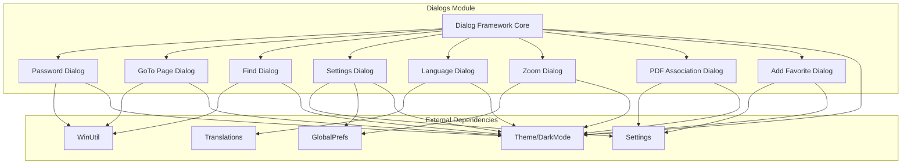
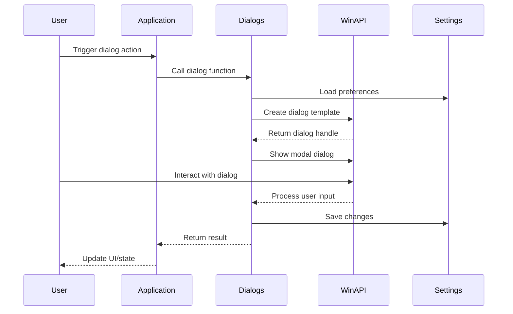
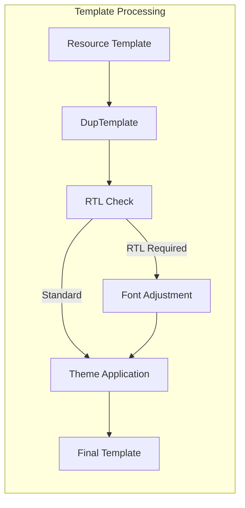
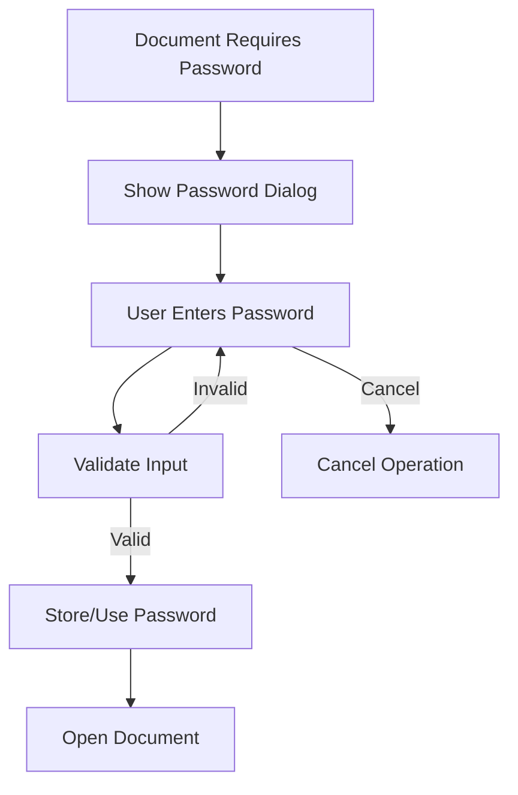
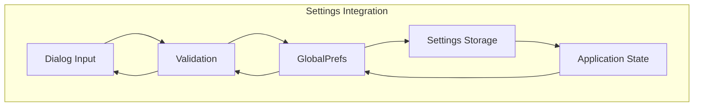

# Dialogs Module Documentation

## Overview

The dialogs module provides the user interface dialog system for SumatraPDF, handling all modal and modeless dialog interactions. It manages user input collection, preferences configuration, and various document-specific operations through a consistent dialog framework built on Windows API.

## Purpose and Core Functionality

The dialogs module serves as the primary interface between users and the application's configuration systems. It provides specialized dialogs for:

- **Document Navigation**: Page navigation, zoom control, and find operations
- **User Preferences**: Application settings, language selection, and UI customization
- **Document Security**: Password-protected document access
- **File Association**: PDF file association management
- **Content Management**: Bookmark/favorite management

## Architecture

### Component Structure



### Dialog Creation Flow



## Core Components

### Dialog Data Structures

Each dialog type has an associated data structure for passing information between the application and dialog procedure:

#### Dialog_GetPassword_Data
```cpp
struct Dialog_GetPassword_Data {
    const char* fileName;  // Document requiring password
    char* pwdOut;          // User-entered password
    bool* remember;        // Remember password flag
};
```

#### Dialog_GoToPage_Data
```cpp
struct Dialog_GoToPage_Data {
    char* currPageLabel;   // Current page display
    int pageCount;         // Total pages in document
    bool onlyNumeric;      // Numeric-only restriction
    char* newPageLabel;    // User-selected page
};
```

#### Dialog_Find_Data
```cpp
struct Dialog_Find_Data {
    char* searchTerm;      // Search query
    bool matchCase;        // Case sensitivity
    WNDPROC editWndProc;   // Edit control procedure
};
```

### Dialog Template System

The module implements a sophisticated dialog template system supporting:

- **RTL (Right-to-Left) Layout**: Automatic layout adjustment for RTL languages
- **Custom Fonts**: Dynamic font size adjustment
- **Theme Support**: Dark mode integration
- **Template Extension**: Extended dialog template support (DLGTEMPLATEEX)



## Dialog Types and Functionality

### 1. Password Dialog (Dialog_GetPassword)

**Purpose**: Secure password collection for encrypted PDF documents

**Features**:
- Password field with masking
- "Remember password" option
- File-specific context display
- Secure memory handling

**Process Flow**:


### 2. GoTo Page Dialog (Dialog_GoToPage)

**Purpose**: Direct page navigation with label support

**Features**:
- Numeric and labeled page support
- Page count display
- Current page pre-selection
- Input validation

### 3. Find Dialog (Dialog_Find)

**Purpose**: Document text search with advanced options

**Features**:
- Case-sensitive search
- Search term persistence
- F3 key integration hint
- Extended edit control functionality

### 4. Settings Dialog (Dialog_Settings)

**Purpose**: Comprehensive application preferences configuration

**Configuration Areas**:
- Display modes and zoom levels
- UI behavior (tabs, bookmarks)
- Update checking and file associations
- TeX inverse search integration
- Advanced print settings

### 5. Language Dialog (Dialog_ChangeLanguage)

**Purpose**: Application language selection

**Features**:
- Available languages enumeration
- Current language highlighting
- Immediate language switching
- Font-aware display for non-Latin scripts

### 6. Custom Zoom Dialog (Dialog_CustomZoom)

**Purpose**: Precise zoom level configuration

**Features**:
- Predefined zoom levels
- Custom zoom input
- CHM-specific zoom ranges
- Percentage formatting

### 7. PDF Association Dialog (Dialog_PdfAssociate)

**Purpose**: System file association management

**Features**:
- Default PDF application setting
- "Don't ask again" option
- System integration

### 8. Add Favorite Dialog (Dialog_AddFavorite)

**Purpose**: Bookmark creation with custom naming

**Features**:
- Current page context
- Optional favorite naming
- Name validation and trimming

## Integration with System Components

### Settings Integration

The dialogs module interfaces with the [settings](settings.md) system to persist user preferences:



### Translation System

All dialogs integrate with the [translations](translations.md) system for internationalization:

- Dynamic text loading based on current language
- RTL layout adaptation
- Font considerations for non-Latin scripts
- Access key grouping for keyboard navigation

### Theme and Dark Mode

The module supports the [theme](theme.md) system including dark mode:

- Automatic dark mode detection
- Consistent theming across all dialogs
- Windows API integration for system themes

## Error Handling and Validation

### Input Validation

Each dialog implements appropriate validation:

- **Password**: Non-empty validation
- **Page Numbers**: Range and format validation
- **Zoom Levels**: Numeric range validation
- **File Names**: Path validation

### Memory Management

- Automatic cleanup of dialog data structures
- Secure password handling with proper disposal
- String memory management with RAII patterns

## Security Considerations

### Password Handling

- Secure memory allocation for passwords
- Immediate cleanup after use
- Optional encrypted storage
- No password logging or caching

### File Association

- System-level permission checks
- User consent for file association changes
- Registry modification safety

## Performance Optimizations

### Dialog Caching

- Template reuse for frequently accessed dialogs
- Font and theme caching
- Language resource optimization

### Resource Management

- Efficient dialog template processing
- Memory-conscious string handling
- Minimal resource allocation during dialog display

## Extension Points

### Custom Dialog Integration

The framework supports extension through:

- Standardized dialog procedure patterns
- Consistent data structure templates
- Theme integration hooks
- Translation system integration

### New Dialog Types

To add new dialogs, developers should:

1. Define data structure following naming convention
2. Implement dialog procedure with standard patterns
3. Add translation strings to language files
4. Integrate with theme system
5. Add appropriate validation and error handling

## Dependencies

### Internal Dependencies

- [Settings](settings.md): Preference storage and retrieval
- [Translations](translations.md): Internationalization support
- [Theme](theme.md): Visual consistency and dark mode
- [WinUtil](utils.md#winutil): Windows API utilities

### External Dependencies

- Windows API: Dialog box management
- Win32 Common Controls: UI elements
- Windows Theme API: Visual styling

## Usage Examples

### Basic Dialog Usage

```cpp
// Password dialog example
bool* rememberPassword = new bool(false);
char* password = Dialog_GetPassword(hwndParent, "document.pdf", rememberPassword);
if (password != nullptr) {
    // Use password to open document
    free(password);
}
delete rememberPassword;
```

### Settings Dialog Integration

```cpp
// Settings dialog with preference persistence
GlobalPrefs* prefs = gGlobalPrefs;
INT_PTR result = Dialog_Settings(hwndParent, prefs);
if (result == IDOK) {
    // Settings automatically updated in prefs
    SaveSettings();
}
```

## Future Considerations

### Modern UI Integration

- Potential migration to modern Windows UI frameworks
- Accessibility improvements
- Touch-friendly interface adaptations

### Enhanced Validation

- Real-time input validation
- Better error messaging
- Context-sensitive help integration

### Performance Enhancements

- Dialog pre-loading for faster display
- Resource pooling for template management
- Optimized string handling for large datasets