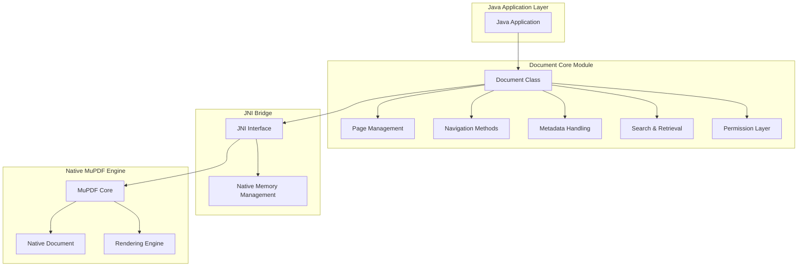
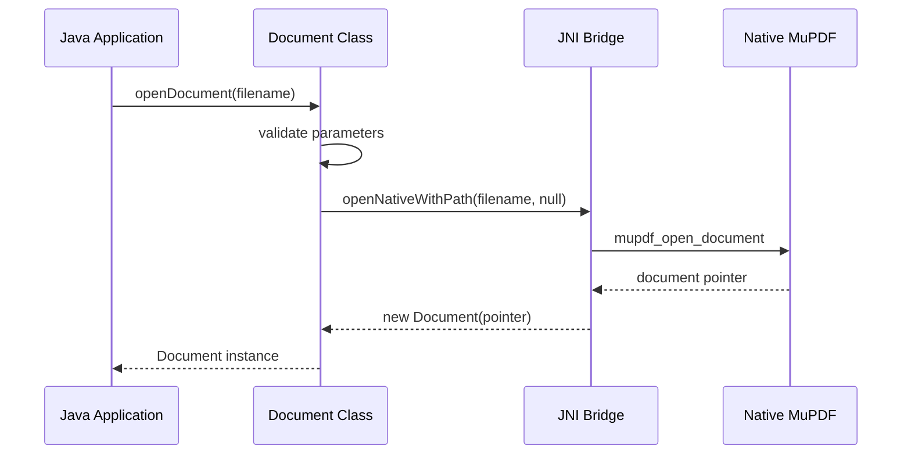
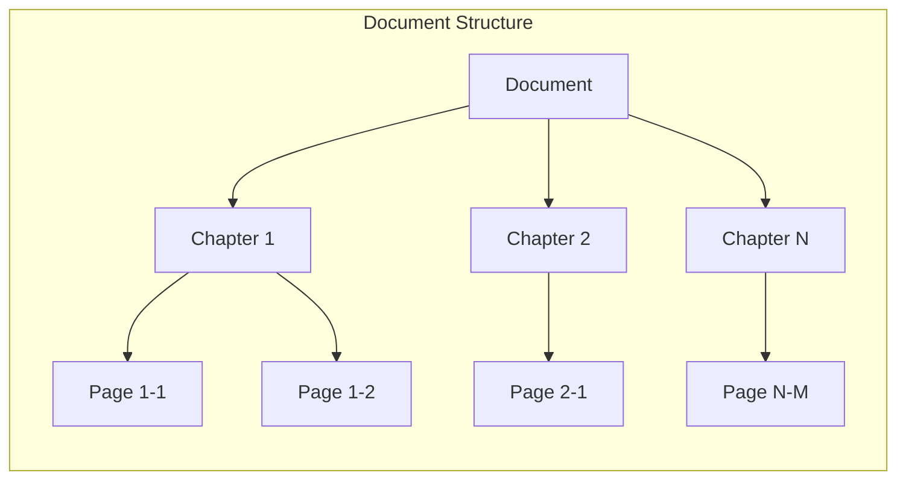
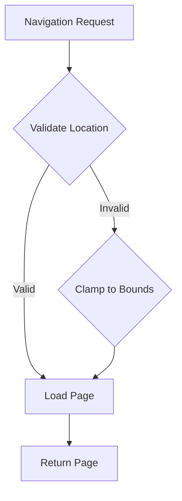
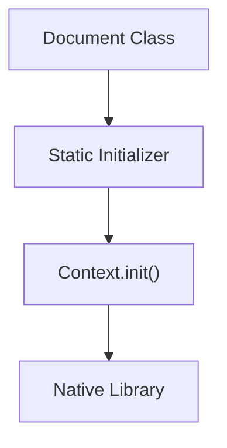
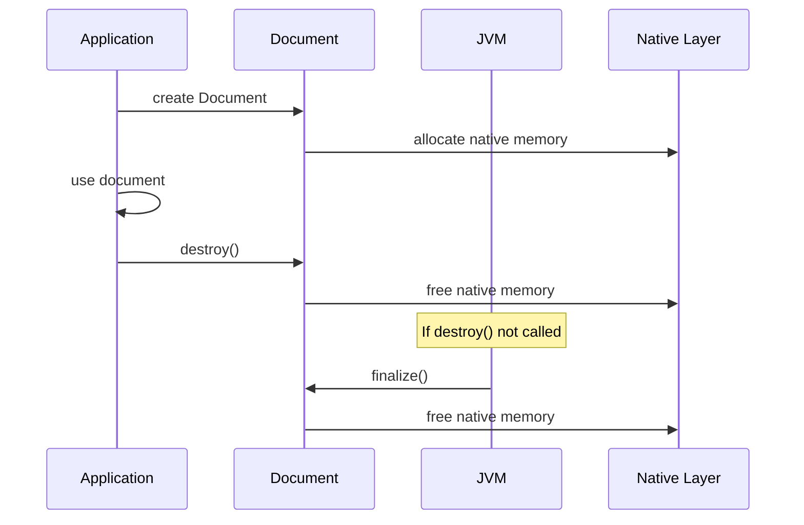

# Document Core Module

## Introduction

The document_core module provides the fundamental document abstraction layer for the MuPDF Java bindings. It serves as the primary interface for document operations, offering a unified API for handling various document formats including PDF, XPS, CBZ, and other supported formats. This module is the cornerstone of document management within the MuPDF ecosystem, providing essential functionality for document loading, navigation, metadata access, and page management.

## Architecture Overview

The Document class acts as the central abstraction that encapsulates native document operations through JNI (Java Native Interface) bindings. It provides a high-level Java API that translates Java method calls into native MuPDF operations, handling memory management, document lifecycle, and format-specific operations transparently.



## Core Components

### Document Class

The `Document` class is the primary component of this module, providing comprehensive document management capabilities:

- **Document Loading**: Multiple constructors for opening documents from files, byte arrays, or streams
- **Page Management**: Loading individual pages, chapter-based navigation, and page counting
- **Metadata Access**: Reading and writing document metadata including author, title, subject, keywords
- **Search Functionality**: Text search capabilities within document pages
- **Security Features**: Password authentication and permission management
- **Navigation Support**: Bookmark creation, link resolution, and outline management

## Key Features

### Document Loading and Initialization

The module provides multiple static factory methods for document creation:



### Chapter and Page Management

The document supports multi-chapter documents with hierarchical page organization:



### Location-Based Navigation

The module implements a sophisticated location system for precise document navigation:



## Dependencies and Integration

### Context Management Dependency

The Document class depends on the [context_management](mupdf_fitz_jni_bindings.md#context-management) module for MuPDF context initialization:



### Related Modules

The document_core module integrates with several other system components:

- **[Page Module](page_core.md)**: Document pages are loaded as Page objects
- **[Location Module](location_types.md)**: Navigation uses Location objects for chapter/page positioning
- **[Link Module](link_handling.md)**: Link resolution and outline management
- **[Metadata Module](metadata_management.md)**: Document metadata operations
- **[Search Module](text_search.md)**: Text search functionality within documents

## API Reference

### Document Creation Methods

| Method | Description | Parameters |
|--------|-------------|------------|
| `openDocument(String filename)` | Open document from file path | filename: Path to document file |
| `openDocument(byte[] buffer, String magic)` | Open document from memory buffer | buffer: Document data, magic: Format hint |
| `openDocument(SeekableInputStream stream, String magic)` | Open document from stream | stream: Input stream, magic: Format hint |

### Navigation Methods

| Method | Description | Return Type |
|--------|-------------|-------------|
| `countPages()` | Total page count across all chapters | int |
| `countPages(int chapter)` | Page count for specific chapter | int |
| `loadPage(int number)` | Load page by absolute number | Page |
| `loadPage(Location loc)` | Load page by location | Page |
| `nextPage(Location loc)` | Get next page location | Location |
| `previousPage(Location loc)` | Get previous page location | Location |

### Security and Permissions

| Method | Description | Parameters |
|--------|-------------|------------|
| `needsPassword()` | Check if document requires password | - |
| `authenticatePassword(String password)` | Authenticate with password | password: Document password |
| `hasPermission(int permission)` | Check specific permission | permission: Permission constant |

### Metadata Constants

```java
public static final String META_FORMAT = "format";
public static final String META_ENCRYPTION = "encryption";
public static final String META_INFO_AUTHOR = "info:Author";
public static final String META_INFO_TITLE = "info:Title";
public static final String META_INFO_SUBJECT = "info:Subject";
public static final String META_INFO_KEYWORDS = "info:Keywords";
public static final String META_INFO_CREATOR = "info:Creator";
public static final String META_INFO_PRODUCER = "info:Producer";
public static final String META_INFO_CREATIONDATE = "info:CreationDate";
public static final String META_INFO_MODIFICATIONDATE = "info:ModDate";
```

### Permission Constants

```java
public static final int PERMISSION_PRINT = 'p';
public static final int PERMISSION_COPY = 'c';
public static final int PERMISSION_EDIT = 'e';
public static final int PERMISSION_ANNOTATE = 'n';
public static final int PERMISSION_FORM = 'f';
public static final int PERMISSION_ACCESSIBILITY = 'y';
public static final int PERMISSION_ASSEMBLE = 'a';
public static final int PERMISSION_PRINT_HQ = 'h';
```

## Memory Management

The Document class implements automatic memory management through finalization:



## Error Handling

The module implements several error handling mechanisms:

- **Invalid Page Numbers**: Throws `IllegalArgumentException` for out-of-range page requests
- **Authentication Failure**: Returns `false` for incorrect passwords
- **Document Corruption**: Native exceptions are propagated as Java exceptions
- **Memory Issues**: Automatic cleanup through finalization

## Performance Considerations

### Accelerator Support

Documents may support accelerator files for faster loading:

```java
public native boolean supportsAccelerator();
public native void saveAccelerator(String filename);
public native void outputAccelerator(SeekableOutputStream stream);
```

### Format Recognition

Static method for format detection without full document loading:

```java
public static native boolean recognize(String magic);
```

## Usage Examples

### Basic Document Loading

```java
// Load document from file
Document doc = Document.openDocument("document.pdf");

// Check if password required
if (doc.needsPassword()) {
    boolean authenticated = doc.authenticatePassword("password");
    if (!authenticated) {
        throw new SecurityException("Invalid password");
    }
}

// Get page count
int totalPages = doc.countPages();

// Load first page
Page firstPage = doc.loadPage(0);
```

### Document Navigation

```java
// Navigate to specific location
Location loc = new Location(0, 5); // Chapter 0, Page 5
Page page = doc.loadPage(loc);

// Get next page location
Location nextLoc = doc.nextPage(loc);
if (!nextLoc.equals(loc)) {
    Page nextPage = doc.loadPage(nextLoc);
}
```

### Metadata Access

```java
// Read metadata
String author = doc.getMetaData(Document.META_INFO_AUTHOR);
String title = doc.getMetaData(Document.META_INFO_TITLE);

// Check permissions
boolean canPrint = doc.hasPermission(Document.PERMISSION_PRINT);
boolean canCopy = doc.hasPermission(Document.PERMISSION_COPY);
```

## Thread Safety

The Document class is not thread-safe. All operations should be synchronized externally if used across multiple threads. The underlying native MuPDF library handles thread-local contexts through the [context_management](mupdf_fitz_jni_bindings.md#context-management) module.

## Future Enhancements

Potential areas for future development:

- **Async Operations**: Non-blocking document loading and page rendering
- **Streaming Support**: Progressive document loading for large files
- **Format Conversion**: Document format conversion capabilities
- **Digital Signatures**: Support for digitally signed documents
- **Form Handling**: Enhanced PDF form support and manipulation