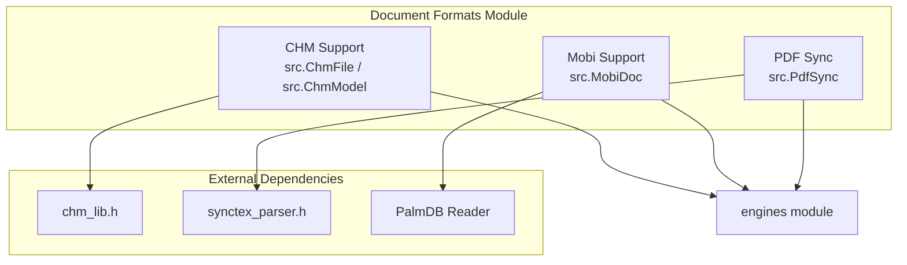

# Document Formats Module

## Overview

The `document_formats` module is a core component of the SumatraPDF system that provides comprehensive support for various document formats. This module handles the parsing, rendering, and management of different document types including CHM (Compiled HTML Help), Mobi (Mobipocket eBooks), and PDF synchronization files.

## Architecture



## Sub-modules

### 1. CHM Support ([chm_support.md](chm_support.md))
Handles Microsoft Compiled HTML Help files (.chm) with features including:
- CHM file parsing and navigation
- Table of Contents (ToC) extraction
- Index support
- HTML content rendering
- Topic ID resolution

**Key Components:**
- `ChmFile`: Core CHM file handler
- `ChmModel`: Document model for CHM files
- `HtmlWindowHandler`: HTML content rendering interface
- `ChmTocTraceItem`: Table of contents structure

### 2. Mobi Support ([mobi_support.md](mobi_support.md))
Provides comprehensive Mobipocket eBook format support:
- Mobi document parsing and decompression
- Multiple compression format support (None, PalmDoc, Huffman)
- Image extraction and management
- Table of Contents parsing
- DRM detection and handling

**Key Components:**
- `MobiHeader`: Mobi document metadata structure
- `PalmDocHeader`: PalmDoc format header
- `HuffHeader`: Huffman compression header
- `CdicHeader`: Dictionary compression header

### 3. PDF Synchronization ([pdf_sync.md](pdf_sync.md))
Implements bidirectional synchronization between PDF documents and source files:
- SyncTeX integration for LaTeX documents
- PDFSync support for pdfsync package
- Forward and inverse search capabilities
- Coordinate transformation between PDF and source

**Key Components:**
- `Pdfsync`: PDFSync-based synchronizer
- `SyncTex`: SyncTeX-based synchronizer
- `PdfsyncLine`: Source line mapping structure
- `PdfsyncPoint`: PDF coordinate mapping structure

## Key Features

### Document Format Support
- **CHM**: Full support for Microsoft Compiled HTML Help format
- **Mobi**: Complete Mobipocket eBook format support with compression
- **PDF Sync**: Synchronization with LaTeX source files

### Compression Support
- PalmDoc compression algorithm
- Huffman dictionary compression
- Uncompressed document handling

### Navigation and Structure
- Hierarchical table of contents
- Index support for CHM files
- Page-based navigation for eBooks
- Cross-reference resolution

## Integration Points

### Engine Integration
The document_formats module integrates with the [engines module](engines.md) to provide document-specific rendering capabilities. Each format handler implements the necessary interfaces for document loading, page navigation, and content extraction.

### UI Integration
Integration with [ui_components module](ui_components.md) provides:
- Document property display
- Navigation controls
- Search functionality
- Print support

## File Format Specifications

### CHM Format
Based on Microsoft ITSS (InfoTech Storage System) format with:
- Compressed HTML content
- Hierarchical table of contents
- Index files
- Navigation structure

### Mobi Format
Based on Palm Database format with:
- Record-based storage
- Multiple compression algorithms
- Image support
- Metadata handling

### SyncTeX Format
Industry standard for LaTeX/PDF synchronization:
- Coordinate mapping
- Source file tracking
- Bidirectional search

## Error Handling

The module implements comprehensive error handling for:
- Corrupted file detection
- Unsupported format versions
- Decompression failures
- Missing dependencies
- Memory allocation failures

## Performance Considerations

### Memory Management
- Streaming decompression for large documents
- Caching strategies for frequently accessed content
- Efficient data structures for navigation

### Processing Optimization
- Lazy loading of document sections
- Incremental parsing for large files
- Optimized coordinate transformations

## Dependencies

### External Libraries
- **chm_lib**: CHM file format support
- **synctex_parser**: SyncTeX synchronization
- **zlib**: Compression support

### Internal Dependencies
- [utils module](utils.md): File I/O, string manipulation
- [engines module](engines.md): Document engine interfaces
- [wingui module](wingui.md): Windows GUI integration

## Usage Examples

### Loading a CHM File
```cpp
ChmFile* chm = ChmFile::CreateFromFile("document.chm");
if (chm) {
    // Access table of contents
    chm->ParseToc(&tocVisitor);
    
    // Get document properties
    TempStr title = chm->GetPropertyTemp(kPropTitle);
}
```

### Loading a Mobi Document
```cpp
MobiDoc* mobi = MobiDoc::CreateFromFile("ebook.mobi");
if (mobi) {
    // Get HTML content
    ByteSlice html = mobi->GetHtmlData();
    
    // Extract cover image
    ByteSlice* cover = mobi->GetCoverImage();
}
```

### PDF Synchronization
```cpp
Synchronizer* sync;
int result = Synchronizer::Create("document.pdf", engine, &sync);
if (result == PDFSYNCERR_SUCCESS) {
    // Forward search: source to PDF
    Vec<Rect> rects;
    int page;
    sync->SourceToDoc("source.tex", 42, 0, &page, rects);
    
    // Inverse search: PDF to source
    AutoFreeStr filename;
    int line, col;
    sync->DocToSource(1, Point(100, 200), filename, &line, &col);
}
```

## Future Enhancements

### Planned Features
- Enhanced metadata extraction
- Better error recovery for corrupted files
- Performance optimizations for large documents
- Additional format support

### Potential Improvements
- Streaming parser for very large CHM files
- Parallel decompression for Mobi documents
- Caching layer for frequently accessed documents
- Enhanced synchronization accuracy