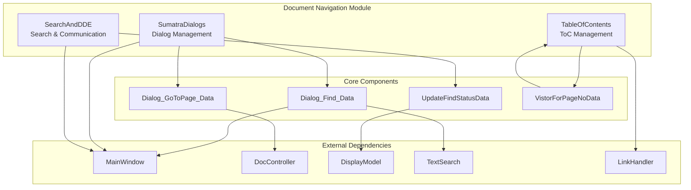
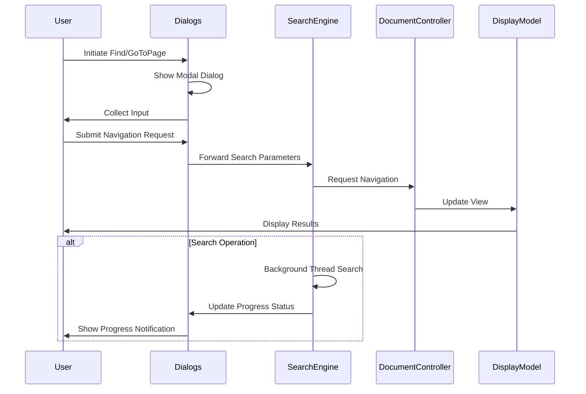
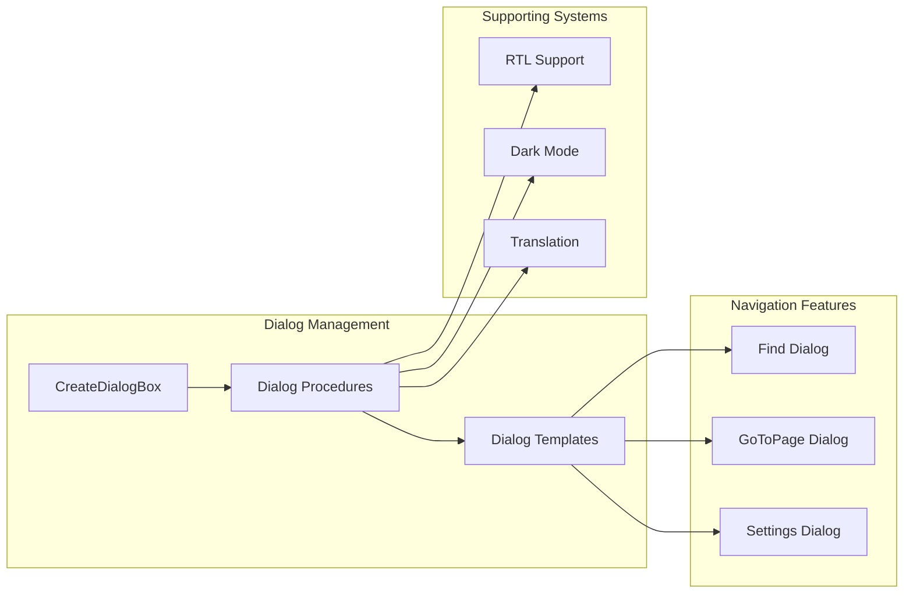
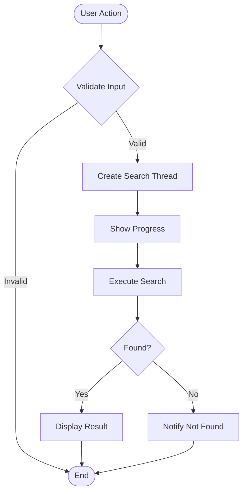

# Document Navigation Module

## Overview

The Document Navigation module provides essential user interface components and functionality for navigating through documents in SumatraPDF. This module handles dialog-based navigation features including find operations, page navigation, table of contents management, and search status updates. It serves as the primary interface between user navigation requests and the document viewing engine.

## Purpose and Core Functionality

The Document Navigation module enables users to:
- Search for text within documents through find dialogs
- Navigate to specific pages via "Go to Page" dialogs
- View and interact with document table of contents (ToC)
- Monitor search progress and status
- Handle various document navigation patterns including forward/inverse search for TeX documents

## Architecture

### Component Structure

### Data Flow Architecture

## Core Components

### Dialog_Find_Data
**File**: `src/SumatraDialogs.cpp`

Structure for managing find dialog state and user input:
- `searchTerm`: Current search text
- `matchCase`: Case sensitivity flag
- `editWndProc`: Custom edit control procedure

**Key Functions**:
- `Dialog_Find()`: Displays find dialog and returns user input
- Custom edit control handling for enhanced text input
- Integration with text search engine for immediate search initiation

### Dialog_GoToPage_Data
**File**: `src/SumatraDialogs.cpp`

Structure for page navigation dialog management:
- `currPageLabel`: Currently displayed page label
- `pageCount`: Total number of pages in document
- `onlyNumeric`: Restricts input to numeric values only
- `newPageLabel`: User-entered page destination

**Key Functions**:
- `Dialog_GoToPage()`: Modal dialog for page navigation
- Support for both numeric and labeled page references
- Validation against document page count

### UpdateFindStatusData
**File**: `src/SearchAndDDE.cpp`

Progress tracking structure for search operations:
- `win`: Target main window
- `current`: Current search progress
- `total`: Total search scope

**Key Functions**:
- `UpdateFindStatus()`: Updates search progress notifications
- Thread-safe progress reporting
- Integration with notification system for user feedback

### VistorForPageNoData
**File**: `src/TableOfContents.cpp`

Tree traversal structure for ToC page mapping:
- `pageNo`: Target page number for lookup
- `bestMatch`: Closest matching ToC item
- `bestMatchPageNo`: Page number of best match
- `nItems`: Total items processed

**Key Functions**:
- `TreeItemForPageNo()`: Finds closest ToC item for given page
- `visitTree()`: Traverses ToC tree structure
- Supports intelligent page-to-ToC mapping

## Module Integration

### Dialog System Integration

### Search and Navigation Flow

## Key Features

### 1. Find Operations
- **Text Search**: Full-text search with case sensitivity options
- **Progress Tracking**: Real-time search progress notifications
- **Navigation**: Forward and backward search result navigation
- **Integration**: Seamless integration with document text extraction

### 2. Page Navigation
- **Direct Input**: "Go to Page" dialog with validation
- **Page Labels**: Support for custom page labeling schemes
- **Numeric Only**: Optional restriction to numeric input
- **Context Awareness**: Integration with document page count

### 3. Table of Contents
- **Tree Structure**: Hierarchical document structure display
- **Page Mapping**: Intelligent page-to-ToC item mapping
- **Customization**: Support for custom colors and fonts
- **Interaction**: Click-to-navigate functionality

### 4. Search Status Management
- **Progress Updates**: Real-time search progress reporting
- **Thread Safety**: Safe cross-thread status updates
- **User Feedback**: Visual progress indicators and notifications
- **Cancellation**: Support for search operation cancellation

## Dependencies and Interactions

### Internal Dependencies
- **[Main Window Management](main_window_management.md)**: Window state and focus management
- **[UI Components](ui_components.md)**: Dialog creation and UI element handling
- **[Application Services](application_services.md)**: Settings and preferences integration

### External Engine Integration
- **[MuPDF Engine Integration](mupdf_engine_integration.md)**: Text extraction and search capabilities
- **[Document Controllers](mupdf_engine_integration.md)**: Document navigation and page management

### System Integration
- **Text Search Engine**: Background search thread management
- **Notification System**: Progress and status display
- **Translation System**: Multi-language dialog support
- **Theme System**: Dark mode and visual customization

## Usage Patterns

### Find Operation Flow
1. User initiates find via menu, toolbar, or keyboard shortcut
2. Find dialog displays with previous search term (if any)
3. User enters search text and configures options (case sensitivity)
4. Dialog returns search parameters to calling code
5. Search engine performs text search on background thread
6. Progress updates displayed via notification system
7. Results highlighted in document view

### Page Navigation Flow
1. User opens "Go to Page" dialog
2. Dialog displays current page and total page count
3. User enters destination page (numeric or labeled)
4. Input validated against document constraints
5. Document controller navigates to specified page
6. Display model updates view position

### ToC Interaction Flow
1. Document loads and ToC structure extracted
2. ToC tree populated with document hierarchy
3. User clicks ToC item or navigates via keyboard
4. Page mapping determines target destination
5. Document controller navigates to target location
6. Display model updates view and highlights selection

## Error Handling

### Dialog Validation
- Input validation for page numbers and search terms
- Graceful handling of invalid user input
- Clear error messaging and user guidance

### Search Error Management
- Thread-safe error reporting
- Cancellation handling for long-running searches
- Fallback behavior for unsupported document types

### Navigation Error Recovery
- Invalid page number handling
- Missing ToC structure management
- Document state validation before navigation

## Performance Considerations

### Search Optimization
- Background thread execution to maintain UI responsiveness
- Incremental progress reporting for large documents
- Efficient text extraction and search algorithms

### Memory Management
- Automatic cleanup of dialog data structures
- Thread-safe resource management
- Efficient tree traversal for ToC operations

### UI Responsiveness
- Non-blocking dialog operations
- Progressive loading for large ToC structures
- Optimized tree view updates and rendering

This module serves as the primary interface for document navigation, providing essential user interaction capabilities while maintaining clean separation between UI presentation and document processing logic.