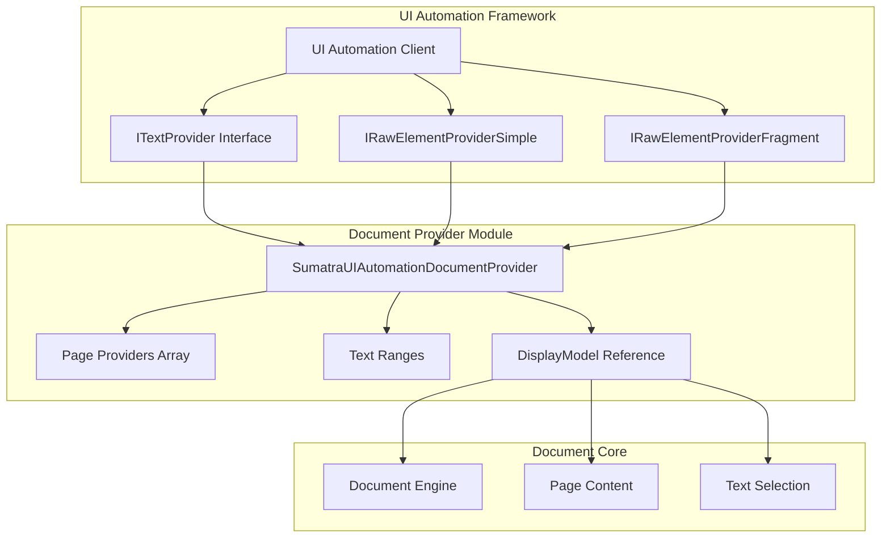
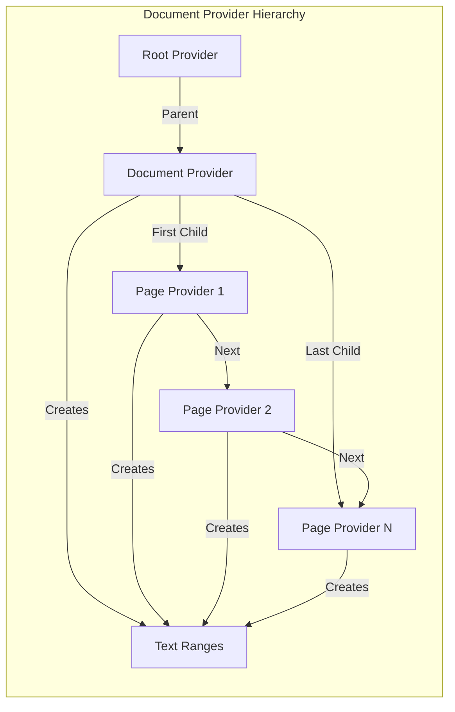
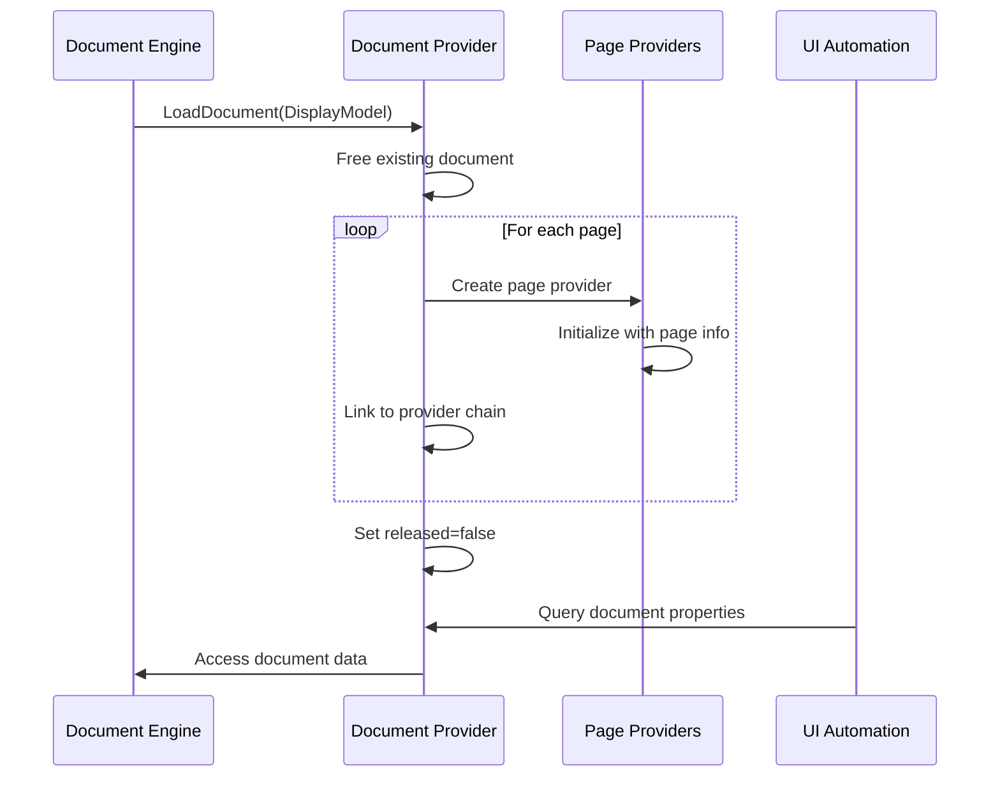
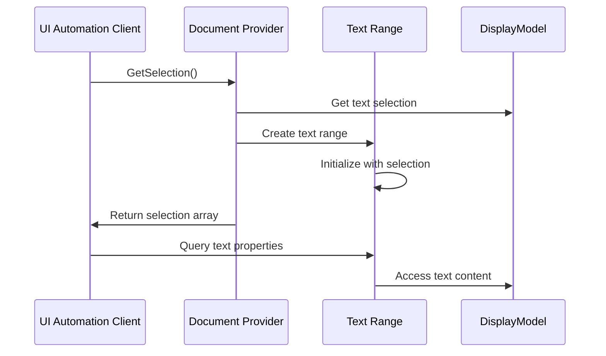

# Document Provider Module

## Introduction

The Document Provider module is a core component of the UI Automation (UIA) system in SumatraPDF, implementing the `IRawElementProviderSimple`, `IRawElementProviderFragment`, and `ITextProvider` interfaces. It serves as the primary bridge between the document content and accessibility tools, enabling screen readers and other assistive technologies to interact with PDF documents.

## Architecture Overview

The Document Provider acts as the central coordinator for UI Automation access to document content, managing page providers and text ranges while maintaining the document hierarchy required by the UIA framework.



## Core Components

### SumatraUIAutomationDocumentProvider

The main class that implements the UIA interfaces and manages the document's accessibility representation.

**Key Responsibilities:**
- Document lifecycle management (loading/unloading)
- Page provider coordination
- Text range creation and management
- UIA property and pattern implementation
- Navigation within the document structure

**Core Properties:**
- `refCount`: Reference counting for COM object lifecycle
- `canvasHwnd`: Handle to the canvas window
- `root`: Reference to the root UIA provider
- `released`: Document state flag
- `child_first/child_last`: Linked list of page providers
- `dm`: DisplayModel reference

## Component Relationships



## Data Flow

### Document Loading Process



### Text Selection Flow



## Interface Implementation

### ITextProvider Implementation

The Document Provider implements the `ITextProvider` interface to expose document text content:

- **GetSelection()**: Returns currently selected text ranges
- **GetVisibleRanges()**: Returns ranges for visible pages
- **RangeFromChild()**: Creates text range from page element
- **RangeFromPoint()**: Creates text range from screen coordinates (not implemented)
- **get_DocumentRange()**: Returns range covering entire document
- **get_SupportedTextSelection()**: Returns single selection support

### IRawElementProviderFragment Implementation

Implements navigation within the document structure:

- **Navigate()**: Handles parent/child navigation
- **GetRuntimeId()**: Provides unique runtime identifier
- **get_BoundingRectangle()**: Returns document bounds
- **get_FragmentRoot()**: Returns root provider reference

### IRawElementProviderSimple Implementation

Provides basic UIA element properties:

- **GetPatternProvider()**: Returns pattern implementations
- **GetPropertyValue()**: Returns UIA properties (name, control type, etc.)
- **get_HostRawElementProvider()**: Returns host provider (none)
- **get_ProviderOptions()**: Returns server-side provider options

## Key Features

### Document Lifecycle Management

```cpp
void LoadDocument(DisplayModel* newDm)
void FreeDocument()
bool IsDocumentLoaded() const
```

The provider maintains strict lifecycle control, ensuring proper cleanup of page providers and preventing access to released documents.

### Page Provider Coordination

Creates and manages a linked list of page providers, each representing a single page in the document:

```cpp
SumatraUIAutomationPageProvider* GetFirstPage()
SumatraUIAutomationPageProvider* GetLastPage()
```

### Text Range Management

Creates text ranges for various purposes:
- Current text selection
- Visible page ranges
- Document-wide ranges
- Page-specific ranges

## Error Handling

The implementation includes comprehensive error handling:
- Null pointer validation
- Document state verification
- Memory allocation failure handling
- COM interface compliance

## Dependencies

The Document Provider module depends on several other system components:

### Direct Dependencies
- [DisplayModel](display_model.md): Document presentation and page management
- [Page Provider](page_provider.md): Individual page accessibility
- [Text Range](text_range.md): Text content accessibility
- [Root Provider](root_provider.md): Top-level UIA provider

### Indirect Dependencies
- [Document Engine](document_core.md): Document format handling
- [UI Models](ui_models.md): User interface abstractions
- [Settings](settings.md): Application configuration

## Integration Points

### UI Automation Framework
The provider integrates with Windows UI Automation through standard COM interfaces, enabling accessibility tools to interact with document content.

### Document System
Works closely with the DisplayModel to access document content, page information, and text selection state.

### Windowing System
Maintains references to the canvas window for proper UIA runtime identification and coordinate mapping.

## Performance Considerations

- **Lazy Loading**: Page providers are created only when document is loaded
- **Reference Counting**: Proper COM object lifecycle management
- **Memory Management**: Careful cleanup of allocated resources
- **State Validation**: Prevents access to released documents

## Security Considerations

- **Input Validation**: All parameters are validated before use
- **Memory Safety**: Proper bounds checking and allocation verification
- **Access Control**: Document access is controlled through DisplayModel
- **COM Compliance**: Follows COM threading and lifecycle rules

## Future Enhancements

Potential areas for improvement:
- Implementation of RangeFromPoint for coordinate-based text access
- Support for multiple text selections
- Enhanced error reporting for accessibility tools
- Performance optimization for large documents
- Support for additional UIA patterns

## Related Documentation

- [Page Provider](page_provider.md) - Individual page accessibility
- [Text Range](text_range.md) - Text content accessibility
- [Root Provider](root_provider.md) - Top-level UIA provider
- [Display Model](display_model.md) - Document presentation layer
- [UI Automation Constants](uia_constants.md) - UIA-specific constants and definitions