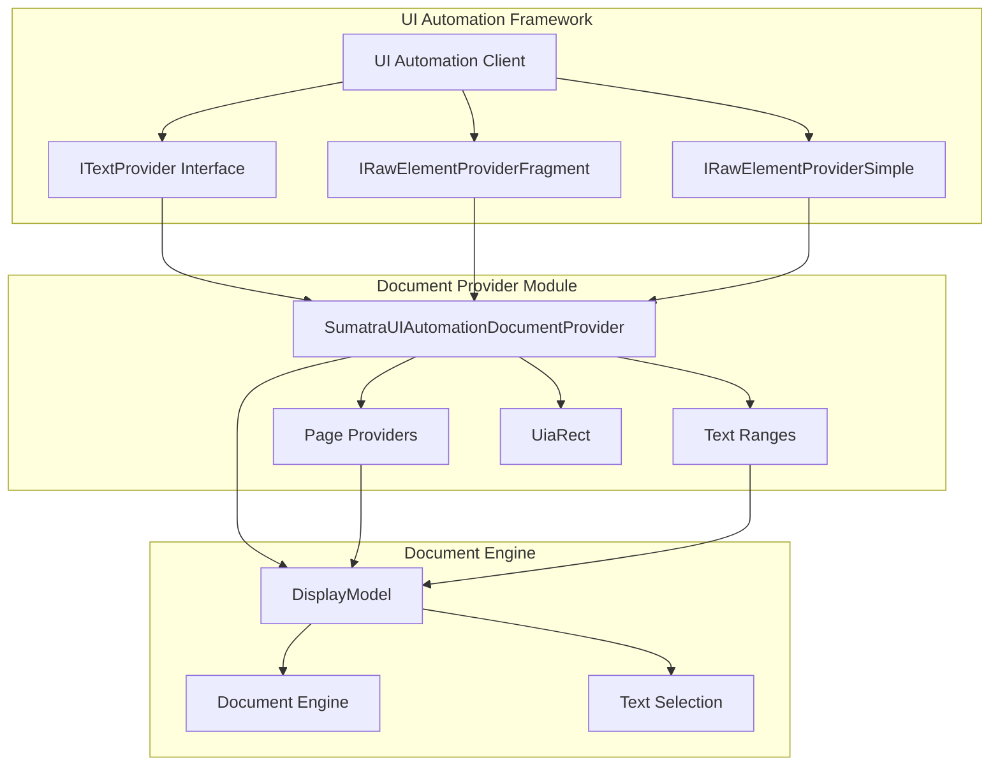
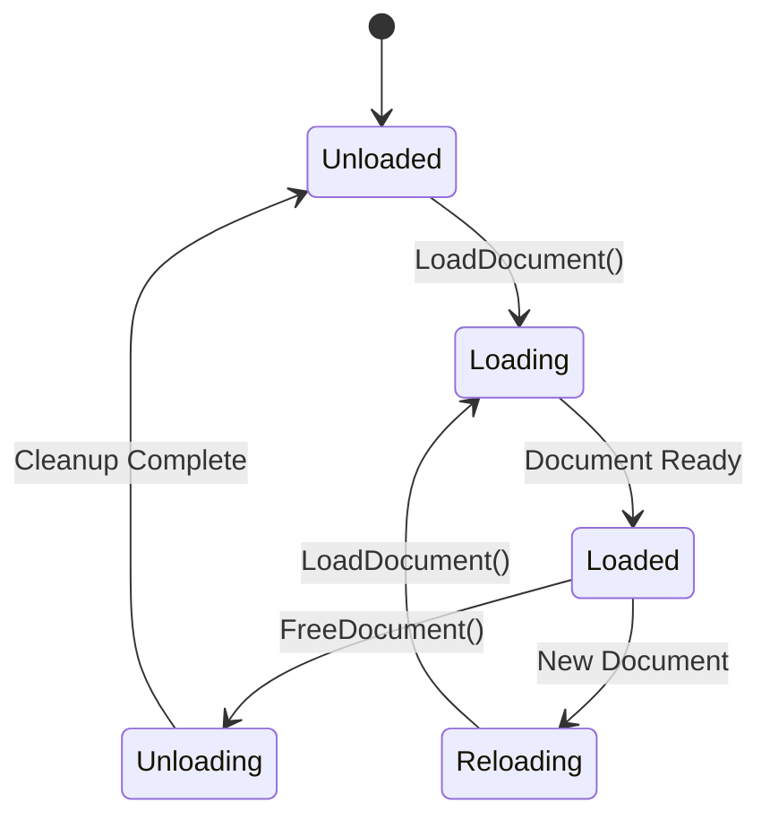
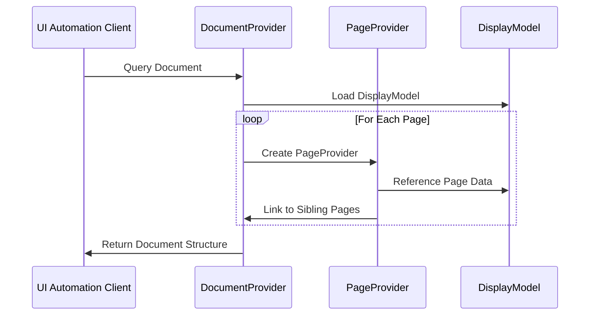
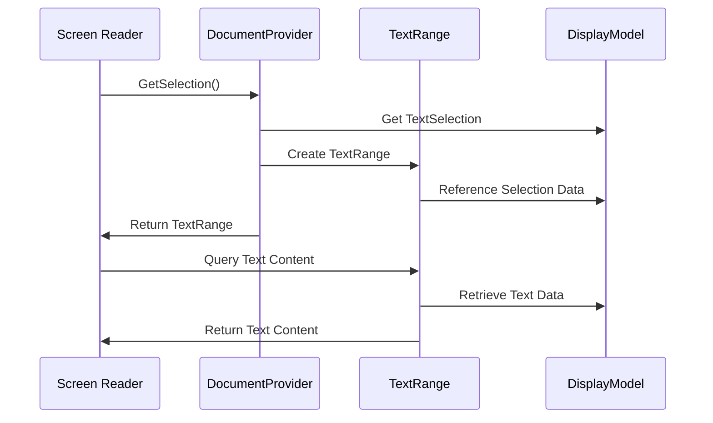
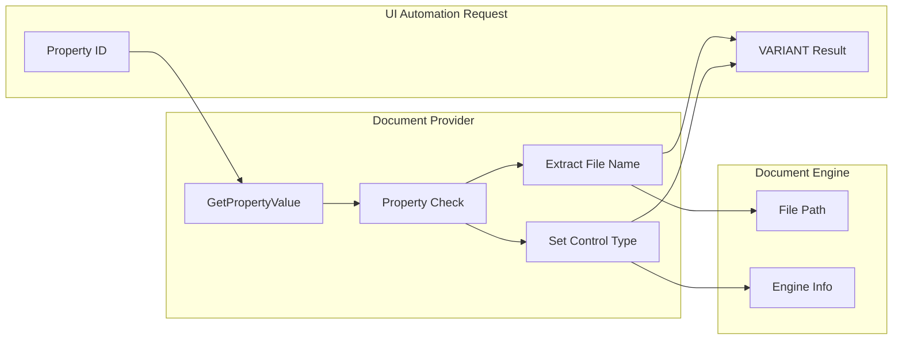
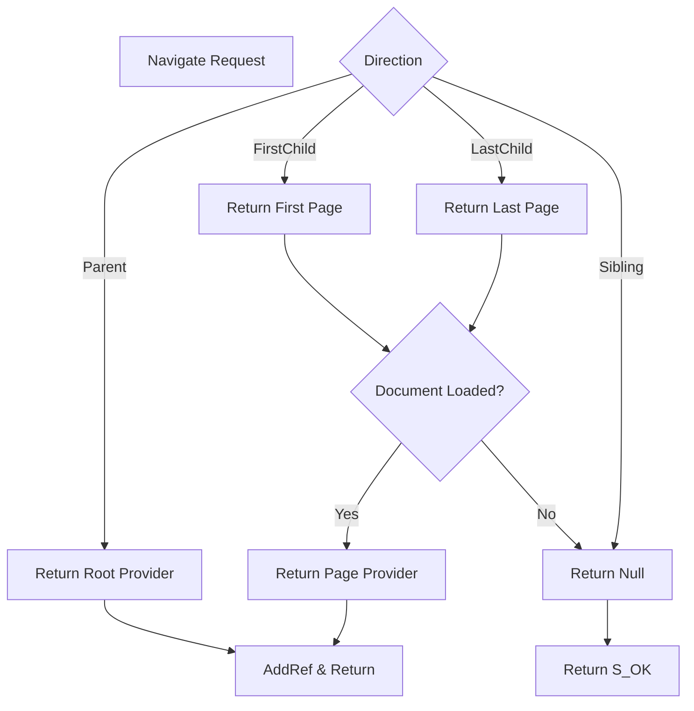

# Document Provider Module

## Introduction

The Document Provider module is a core component of SumatraPDF's accessibility infrastructure, implementing the UI Automation Document Provider interface for screen readers and accessibility tools. This module bridges the gap between SumatraPDF's document rendering engine and Windows UI Automation framework, enabling users with disabilities to access and navigate document content programmatically.

## Architecture Overview

The Document Provider module serves as the central accessibility hub for document content, implementing multiple COM interfaces to expose document structure and text content to assistive technologies. It creates a hierarchical representation of document pages and provides text range functionality for navigation and selection.


```mermaid
graph TB
    subgraph "UI Automation Framework"
        UIA[UI Automation Client]
        ITP[ITextProvider Interface]
        IREPF[IRawElementProviderFragment]
        IREPS[IRawElementProviderSimple]
    end
    
    subgraph "Document Provider Module"
        DP[SumatraUIAutomationDocumentProvider]
        PP[Page Providers]
        TR[Text Ranges]
        UR[UiaRect]
    end
    
    subgraph "Document Engine"
        DM[DisplayModel]
        DE[Document Engine]
        TS[Text Selection]
    end
    
    UIA --> ITP
    UIA --> IREPF
    UIA --> IREPS
    
    ITP --> DP
    IREPF --> DP
    IREPS --> DP
    
    DP --> PP
    DP --> TR
    DP --> UR
    
    DP --> DM
    DM --> DE
    DM --> TS
    
    PP --> DM
    TR --> DM
```

## Core Components

### SumatraUIAutomationDocumentProvider

The main document provider class that implements multiple COM interfaces to expose document accessibility functionality:

- **IRawElementProviderSimple**: Basic provider interface for UI Automation
- **IRawElementProviderFragment**: Fragment navigation within the accessibility tree
- **ITextProvider**: Text content and selection functionality
- **IAccIdentity**: Identity management for accessibility clients

#### Key Responsibilities

1. **Document Lifecycle Management**: Loads and unloads documents, maintaining references to DisplayModel
2. **Page Provider Management**: Creates and manages page provider instances for each document page
3. **Text Range Services**: Provides text selection and navigation capabilities
4. **Property Exposure**: Exposes document properties (name, type, selection state) to UI Automation
5. **Navigation Support**: Implements hierarchical navigation between document elements

#### Document State Management


```mermaid
stateDiagram-v2
    [*] --> Unloaded
    Unloaded --> Loading: LoadDocument()
    Loading --> Loaded: Document Ready
    Loaded --> Unloading: FreeDocument()
    Unloading --> Unloaded: Cleanup Complete
    
    Loaded --> Reloading: New Document
    Reloading --> Loading: LoadDocument()
```

### UiaRect Structure

A simple rectangle structure used for bounding box calculations in UI Automation:

```cpp
struct UiaRect {
    double left;
    double top;
    double width;
    double height;
};
```

## Component Interactions

### Document Loading Process


```mermaid
sequenceDiagram
    participant UI as UI Automation Client
    participant DP as DocumentProvider
    participant PP as PageProvider
    participant DM as DisplayModel
    
    UI->>DP: Query Document
    DP->>DM: Load DisplayModel
    loop For Each Page
        DP->>PP: Create PageProvider
        PP->>DM: Reference Page Data
        PP->>DP: Link to Sibling Pages
    end
    DP->>UI: Return Document Structure
```

### Text Selection Flow


```mermaid
sequenceDiagram
    participant SR as Screen Reader
    participant DP as DocumentProvider
    participant TR as TextRange
    participant DM as DisplayModel
    
    SR->>DP: GetSelection()
    DP->>DM: Get TextSelection
    DP->>TR: Create TextRange
    TR->>DM: Reference Selection Data
    DP->>SR: Return TextRange
    SR->>TR: Query Text Content
    TR->>DM: Retrieve Text Data
    TR->>SR: Return Text Content
```

## Data Flow Architecture

### Property Value Retrieval


```mermaid
graph LR
    subgraph "UI Automation Request"
        PROP[Property ID]
        VAR[VARIANT Result]
    end
    
    subgraph "Document Provider"
        PV[GetPropertyValue]
        CHECK[Property Check]
        NAME[Extract File Name]
        TYPE[Set Control Type]
    end
    
    subgraph "Document Engine"
        FP[File Path]
        ENG[Engine Info]
    end
    
    PROP --> PV
    PV --> CHECK
    CHECK --> NAME
    CHECK --> TYPE
    NAME --> FP
    TYPE --> ENG
    NAME --> VAR
    TYPE --> VAR
```

### Navigation Implementation


```mermaid
graph TD
    NAV[Navigate Request]
    DIR{Direction}
    
    DIR -->|Parent| ROOT[Return Root Provider]
    DIR -->|FirstChild| FIRST[Return First Page]
    DIR -->|LastChild| LAST[Return Last Page]
    DIR -->|Sibling| NULL[Return Null]
    
    FIRST --> CHECK{Document Loaded?}
    LAST --> CHECK
    
    CHECK -->|Yes| PAGE[Return Page Provider]
    CHECK -->|No| NULL
    
    ROOT --> ADDREF[AddRef & Return]
    PAGE --> ADDREF
    NULL --> OK[Return S_OK]
```

## Integration with Other Modules

### Core Application Integration

The Document Provider module integrates with the [core_application_and_ui](core_application_and_ui.md) module through:

- **DisplayModel**: References the main document display model for content access
- **MainWindow**: Receives canvas HWND for UI Automation boundary calculations
- **Settings**: Accesses application settings for accessibility features

### Engine Integration

Works with multiple document engines from various modules:

- **[mupdf_engine_integration](mupdf_engine_integration.md)**: PDF document text extraction and page information
- **[djvu_engine_integration](djvu_engine_integration.md)**: DjVu document accessibility support
- **[ebook_engines](ebook_engines.md)**: E-book format accessibility (CHM, FB2, MOBI)
- **[image_and_comic_book_engine](image_and_comic_book_engine.md)**: Image-based document support

### Text Range Module

Closely integrated with the [text_range](text_range.md) module for:

- **Text Navigation**: Line, word, and character endpoint movement
- **Selection Management**: Text selection creation and manipulation
- **Range Operations**: Document range calculations and visibility

## Accessibility Features

### Supported Patterns

1. **Text Pattern**: Full text content access and selection
2. **Selection Pattern**: Text selection management
3. **Value Pattern**: Document property values
4. **LegacyIAccessible Pattern**: Backward compatibility

### Document Properties Exposed

- **Name**: Document filename
- **Control Type**: Document control identifier
- **Content Element**: Indicates document is content
- **Text Pattern Available**: Confirms text accessibility
- **Automation ID**: "Document" identifier

### Navigation Capabilities

- **Parent Navigation**: Returns to root provider
- **Child Navigation**: Access to page providers
- **Document Range**: Entire document text range
- **Visible Ranges**: Currently visible page ranges
- **Selection Range**: Current text selection

## Error Handling

### Document State Validation

```cpp
bool IsDocumentLoaded() const {
    return !released;
}

DisplayModel* GetDM() {
    ReportIf(!IsDocumentLoaded());
    ReportIf(!dm);
    return dm;
}
```

### COM Interface Error Codes

- **E_POINTER**: Null pointer parameters
- **E_FAIL**: Document not loaded
- **E_OUTOFMEMORY**: Memory allocation failures
- **E_NOTIMPL**: Unsupported operations
- **S_OK**: Successful operations

## Performance Considerations

### Memory Management

- Reference counting for COM objects
- Cleanup of page provider chains
- Safe array management for selections
- CoTaskMem allocation for identity strings

### Optimization Strategies

1. **Lazy Loading**: Page providers created only when document loads
2. **Reference Sharing**: DisplayModel shared between providers
3. **State Caching**: Document state cached to avoid repeated checks
4. **Batch Operations**: Multiple selections handled in arrays

## Security Considerations

### Interface Access Control

- Server-side provider implementation
- No direct window handle exposure
- Safe string handling for file names
- Memory allocation validation

### Identity Management

- Runtime ID based on window handle
- Memory address-based identity strings
- Child ID mapping for page identification

## Future Enhancements

### Potential Improvements

1. **Enhanced Text Navigation**: Support for more complex text structures
2. **Annotation Accessibility**: Expose document annotations
3. **Form Field Support**: Interactive form accessibility
4. **Multilingual Support**: Better handling of multilingual documents
5. **Performance Optimization**: Faster text range calculations

### Extended Pattern Support

- **Scroll Pattern**: Document scrolling control
- **Grid Pattern**: Table structure exposure
- **Table Pattern**: Tabular data accessibility
- **Hyperlink Pattern**: Link navigation support

## Conclusion

The Document Provider module is essential for making SumatraPDF documents accessible to users with disabilities. By implementing the UI Automation interfaces, it enables screen readers and other assistive technologies to access document content programmatically. The module's architecture supports multiple document formats through integration with various engine modules while maintaining consistent accessibility behavior across all supported formats.