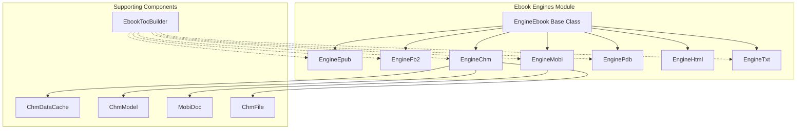
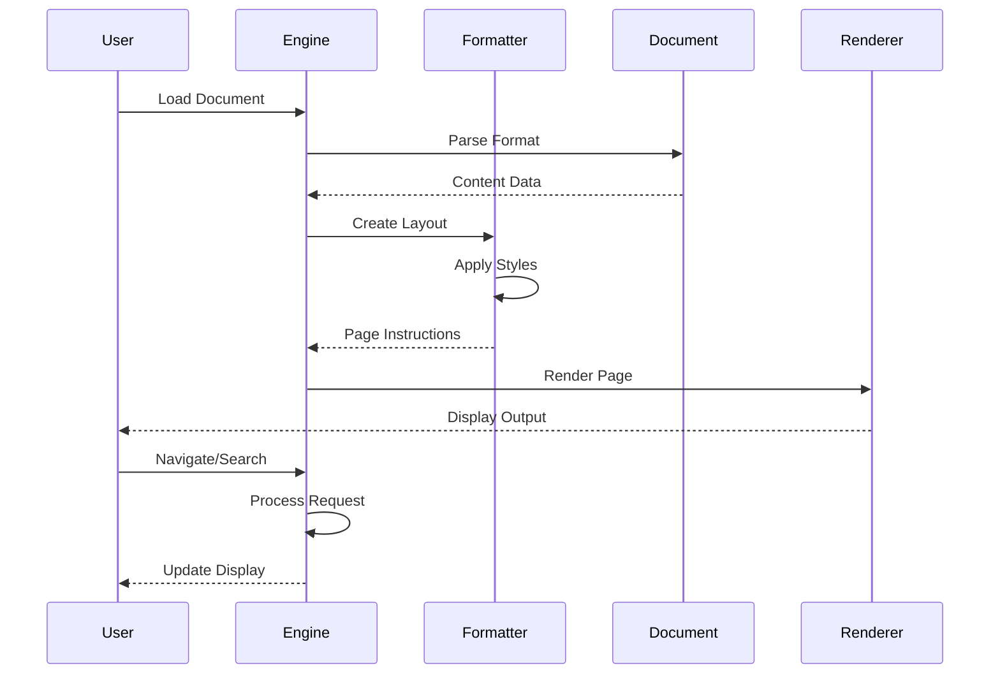

# Ebook Engines Module

## Overview

The ebook_engines module provides comprehensive support for rendering and displaying various ebook formats within the SumatraPDF application. It implements a unified engine architecture that converts flowed ebook content into fixed-page layouts, enabling consistent viewing experiences across different ebook formats.

## Purpose

This module serves as the primary interface for handling ebook documents, including:
- **Format Support**: EPUB, FictionBook2 (FB2), Mobi, PalmDOC, CHM, HTML, and TXT formats
- **Content Rendering**: Converts reflowable ebook content into paginated layouts
- **Navigation**: Provides page-based navigation for traditionally flowable content
- **Text Extraction**: Enables text selection and search functionality
- **Table of Contents**: Automatic TOC generation and navigation
- **Link Handling**: Internal and external hyperlink support

## Architecture

## Core Components

### EngineEbook (Base Class)
The abstract base class that provides common functionality for all ebook engines:
- **Page Layout**: Standardized "B Format" paperback dimensions (5.12" x 7.8")
- **Rendering Pipeline**: Converts HTML content to paginated layouts
- **Text Extraction**: Coordinates-based text selection
- **Navigation**: Anchor-based internal linking system
- **Font Management**: Consistent font handling across formats

For detailed information about format-specific engines, see [Ebook Format Engines](ebook_format_engines.md).

### Format-Specific Engines

#### EngineEpub
Handles EPUB documents with features:
- ZIP-based archive processing
- HTML content extraction and formatting
- CSS style application
- RTL (Right-to-Left) text support

#### EngineFb2
Processes FictionBook2 XML format:
- XML parsing and transformation
- Embedded metadata handling
- Zipped FB2 support (.fb2z)

#### EngineMobi
Manages MobiPocket format documents:
- PalmDOC database structure
- Compression support (None, PalmDOC, Huffman)
- Image extraction and handling
- DRM detection (unsupported)

For detailed MobiPocket format support, see [Mobi Document Support](mobi_document_support.md).

#### EngineChm
Microsoft Compiled HTML Help support:
- CHM archive navigation
- Multi-page document assembly
- Topic ID resolution
- Embedded content handling

For detailed CHM format support, see [CHM Document Support](chm_document_support.md).

#### EnginePdb
PalmDOC format support:
- Palm database format
- Text compression handling
- Simple HTML formatting

#### EngineHtml
Standalone HTML document support:
- Direct HTML rendering
- External link handling
- CSS style processing

#### EngineTxt
Plain text format support:
- RFC document recognition
- Automatic text formatting
- Line break handling

## Data Flow

## Key Features

### Page Layout System
- Standardized page dimensions for consistency
- Configurable margins and borders
- DPI-aware scaling
- Font size normalization

### Text Rendering
- Unicode text support
- RTL text handling
- Font fallback mechanisms
- Anti-aliased text rendering

### Navigation Support
- Page-based navigation for flowable content
- Anchor-based internal linking
- Table of contents integration
- Bookmark support

### Content Extraction
- Text selection with coordinates
- Image extraction
- Metadata preservation
- Search functionality

## Integration Points

The ebook_engines module integrates with:
- **[mupdf_engine_integration](mupdf_engine_integration.md)**: Shared rendering infrastructure
- **[core_application_and_ui](core_application_and_ui.md)**: User interface components
- **[html_rendering_components](html_rendering_components.md)**: HTML display support

## File Format Support

| Format | Extension | Features | Compression |
|--------|-----------|----------|-------------|
| EPUB | .epub | Full CSS, Images, TOC | ZIP |
| FictionBook2 | .fb2, .fb2z | XML-based, Metadata | Optional ZIP |
| MobiPocket | .mobi, .prc | PalmDB, Images | PalmDOC/Huffman |
| CHM | .chm | Compiled HTML, TOC | LZX |
| PalmDOC | .pdb | Text, Basic HTML | PalmDOC |
| HTML | .html, .htm | Web pages | None |
| Text | .txt | Plain text | None |

## Error Handling

The module implements comprehensive error handling:
- **Format Validation**: Early detection of unsupported formats
- **Memory Management**: Safe allocation with failure recovery
- **Decompression Errors**: Graceful handling of corrupted data
- **DRM Detection**: Clear messaging for protected content

## Performance Optimizations

- **Caching**: Page instruction caching for faster re-rendering
- **Lazy Loading**: On-demand content processing
- **Memory Pool**: Efficient memory allocation for text processing
- **Thread Safety**: Critical sections for concurrent access

## Dependencies

- **HtmlFormatter**: Converts HTML to page instructions
- **Mui Library**: Text rendering and layout
- **GDI+**: Graphics rendering
- **CHM Library**: Microsoft CHM format support
- **PalmDB Reader**: Palm format database handling

This module provides a robust foundation for ebook viewing within SumatraPDF, offering consistent behavior across diverse ebook formats while maintaining the application's lightweight and fast characteristics.