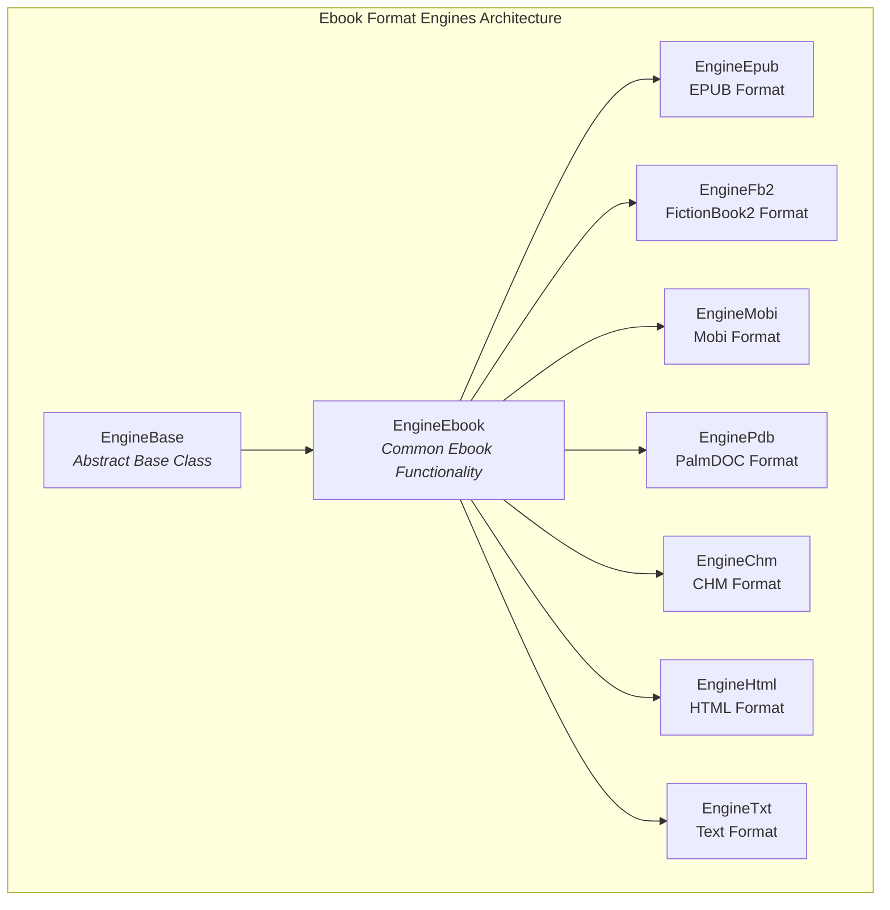
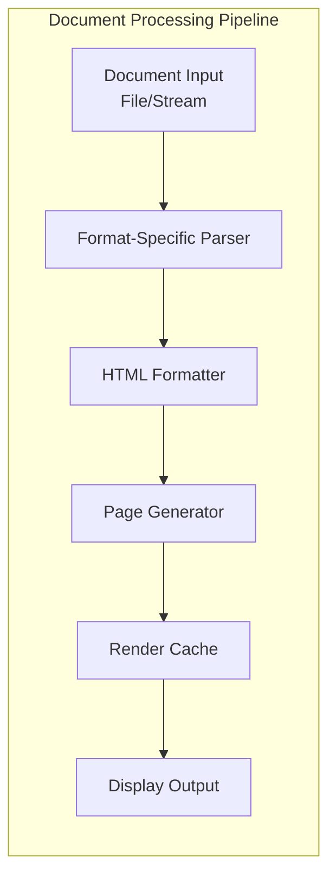
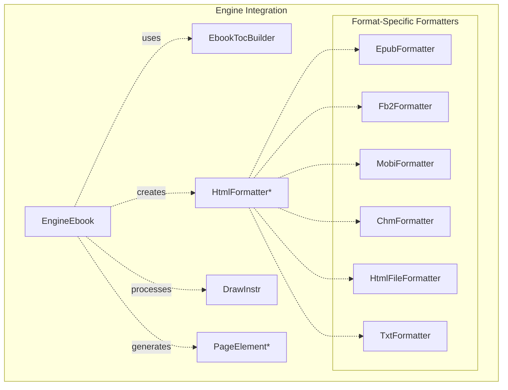
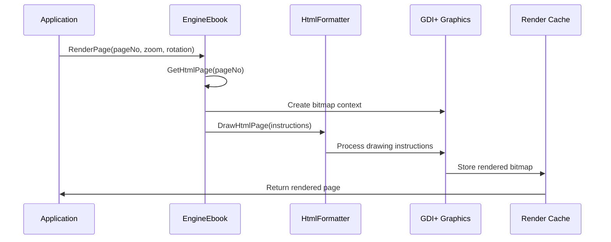

# Ebook Format Engines Module

## Introduction

The ebook_format_engines module is a core component of the SumatraPDF document rendering system that provides specialized engines for handling various ebook formats. This module transforms reflowable ebook content into fixed-page layouts, enabling consistent viewing experiences across different ebook formats including EPUB, FictionBook2 (FB2), Mobi, PalmDOC, CHM, HTML, and plain text documents.

The module serves as a bridge between the document parsing layer and the rendering system, converting structured ebook content into paginated HTML-like instructions that can be rendered using the application's graphics subsystem.

## Architecture Overview

The ebook_format_engines module implements a hierarchical engine architecture with a common base class that provides shared functionality for all ebook formats. Each specific format engine inherits from the base `EngineEbook` class and implements format-specific parsing and processing logic.

## Core Components

### EngineEbook Base Class

The `EngineEbook` class serves as the foundation for all ebook format engines, providing common functionality for page layout, text extraction, link handling, and rendering operations.

**Key Responsibilities:**
- Page dimension management with "B Format" paperback sizing (5.12" x 7.8")
- HTML instruction-based rendering system
- Text extraction with coordinate mapping
- Link destination resolution
- Font management and extraction
- Thread-safe page access through critical sections

**Core Data Structures:**
- `pages`: Vector of `HtmlPage` objects containing drawing instructions
- `anchors`: Collection of page anchors for navigation
- `baseAnchors`: Per-page base anchors for merged documents
- `pageRect`: Standardized page dimensions
- `pageBorder`: Consistent border spacing

### Format-Specific Engines

#### EngineEpub
Handles EPUB documents with ZIP-based archive structure and XML metadata. Supports both compressed and uncompressed EPUB files, with automatic recompression for directory-based documents.

#### EngineFb2
Processes FictionBook2 XML format documents, handling both standard and compressed (.fb2z) variants. Provides structured document parsing with built-in table of contents support.

#### EngineMobi
Manages Amazon MobiPocket format documents, including position-based navigation and specialized link resolution for internal document references.

#### EnginePdb
Supports PalmDOC format and extensions like TealDoc, providing legacy document compatibility with HTML conversion for consistent rendering.

#### EngineChm
Handles Microsoft Compiled HTML Help files with embedded resource management, CSS stylesheet processing, and topic ID resolution for help file navigation.

#### EngineHtml
Provides basic HTML document support for testing and regression scenarios, with external link handling and minimal CSS support.

#### EngineTxt
Converts plain text documents to paginated format, with special handling for RFC documents and automatic format detection.

## Data Flow Architecture

### Processing Stages

1. **Document Loading**: Format-specific parsers extract content and metadata
2. **HTML Generation**: Content converted to HTML with format-specific formatting
3. **Page Layout**: HTML formatter creates paginated drawing instructions
4. **Anchor Extraction**: Navigation anchors and links are identified and indexed
5. **Rendering**: Drawing instructions converted to bitmap representations
6. **Caching**: Rendered pages cached for performance optimization

## Component Interactions

## Rendering System

The rendering system converts HTML drawing instructions into visual representations using GDI+ graphics operations. Each page consists of a series of drawing instructions that specify text placement, font properties, images, and links.

### Drawing Instruction Types

- **String/RtlString**: Text content with left-to-right or right-to-left layout
- **Image**: Embedded image data with positioning and scaling
- **LinkStart/LinkEnd**: Hyperlink boundaries with destination information
- **Anchor**: Named navigation points within documents
- **SetFont**: Font property changes for text rendering
- **FixedSpace/ElasticSpace**: Spacing controls for text layout

### Page Rendering Process

## Navigation and Link Handling

The module provides comprehensive navigation support through multiple mechanisms:

### Named Destinations
- Anchor-based navigation within documents
- URL resolution for external links
- Position-based linking for Mobi format
- Topic ID resolution for CHM files

### Table of Contents
- Hierarchical TOC structure extraction
- Format-specific TOC parsing
- Visitor pattern for TOC building
- Integration with document navigation system

### Link Types
- **Internal Links**: Navigation within the same document
- **External URLs**: Web links opened in external browsers
- **Embedded Files**: CHM internal file references
- **Remote Files**: External document references

## Font and Text Management

The module implements sophisticated font handling to ensure consistent text rendering across different ebook formats:

### Font Configuration
- Default font selection (Georgia) with customizable alternatives
- DPI-aware font sizing for consistent display
- Font scaling based on user preferences
- Font list extraction for document properties

### Text Extraction
- Coordinate-accurate text positioning
- Unicode support with HTML entity resolution
- RTL (Right-to-Left) text handling
- Line and word boundary detection

## Error Handling and Resource Management

The module implements comprehensive error handling and resource management:

### Memory Management
- RAII-based resource cleanup
- Critical section protection for thread safety
- Automatic memory deallocation on errors
- Pool allocation for text processing

### Error Recovery
- Graceful handling of malformed documents
- Partial rendering on format errors
- Fallback mechanisms for unsupported features
- User notification for critical errors

## Performance Optimization

Several optimization strategies are employed to ensure responsive performance:

### Caching Strategies
- Rendered page bitmap caching
- Font and graphics resource reuse
- TOC structure caching to avoid re-parsing
- Anchor index caching for fast navigation

### Rendering Optimizations
- Clip optimization disabling for better caching
- Incremental page loading
- Background processing for large documents
- Memory-mapped file access for large documents

## Integration with SumatraPDF

The ebook_format_engines module integrates seamlessly with the broader SumatraPDF architecture:

### Document Controller Integration
- Standardized EngineBase interface compliance
- Property extraction for document information
- File operation support (save, copy)
- Stream-based document loading

### UI Component Interaction
- [Main Window Management](main_window_management.md) for document display
- [Document Navigation](document_navigation.md) for user interaction
- [UI Components](ui_components.md) for toolbar and menu integration

### Service Integration
- [Application Services](application_services.md) for external operations
- [MuPDF Engine Integration](mupdf_engine_integration.md) for complementary functionality

## Dependencies

The module relies on several key dependencies:

### Internal Dependencies
- [EbookBase](ebook_base.md) for common ebook functionality
- [HtmlFormatter](html_formatter.md) for page layout
- [EbookDoc](ebook_doc.md) for document parsing
- [Mui](mui.md) for text rendering

### External Libraries
- GDI+ for graphics rendering
- Windows API for file operations
- Standard C++ library for data structures

## Future Enhancements

Potential areas for future development include:

### Format Support
- Additional ebook format support (AZW3, KFX)
- Enhanced CSS support for better formatting
- JavaScript execution for interactive content
- Multimedia content integration

### Performance Improvements
- GPU-accelerated rendering
- Parallel page processing
- Predictive page caching
- Memory usage optimization

### Feature Enhancements
- Annotation support for ebook formats
- Bookmark synchronization
- Text-to-speech integration
- Advanced search capabilities

## Conclusion

The ebook_format_engines module provides a robust and extensible foundation for ebook document handling within SumatraPDF. Its architecture enables consistent rendering across diverse ebook formats while maintaining performance and reliability. The modular design facilitates maintenance and extension, supporting the application's goal of providing a comprehensive document viewing experience.