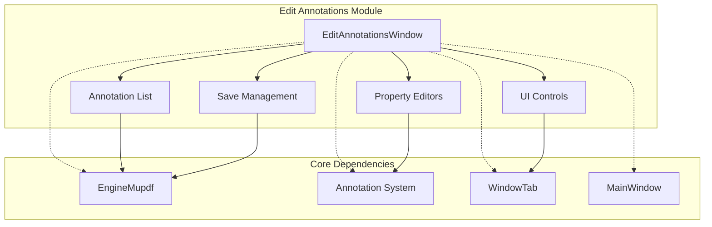
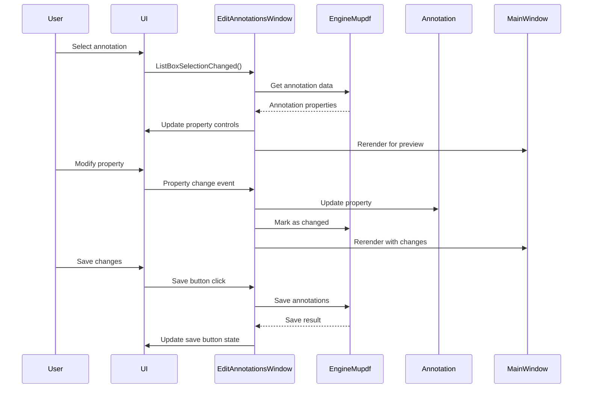

# Edit Annotations Module

## Overview

The Edit Annotations module provides a comprehensive user interface for managing PDF annotations within the SumatraPDF application. It enables users to view, edit, and manipulate various types of PDF annotations through a dedicated window interface, supporting real-time preview and modification of annotation properties.

## Purpose and Core Functionality

The module serves as the primary interface for annotation management, offering:
- **Annotation Listing**: Display all annotations in the current document with page numbers and types
- **Property Editing**: Modify annotation properties including colors, borders, text content, and visual attributes
- **Real-time Preview**: Live updates to annotations as properties are modified
- **Save Management**: Handle saving annotations to existing or new PDF files
- **Deletion Support**: Remove unwanted annotations from documents

## Architecture

### Component Structure

### Key Components

#### EditAnnotationsWindow
The main window class that orchestrates the annotation editing interface:
- Manages UI layout and control positioning
- Handles annotation selection and property updates
- Coordinates with the main application window
- Provides keyboard shortcuts and user interactions

#### UI Control Categories

**Display Controls:**
- `listBox`: Shows all document annotations
- `staticRect`: Displays annotation bounding rectangle
- `staticAuthor`: Shows annotation author information
- `staticModificationDate`: Displays last modification timestamp

**Property Editors:**
- `editContents`: Multi-line text editor for annotation content
- `dropDownColor/dropDownInteriorColor`: Color selection dropdowns
- `trackbarBorder/trackbarOpacity`: Numeric property sliders
- `dropDownTextAlignment/dropDownTextFont`: Text formatting controls

**Action Buttons:**
- `buttonDelete`: Removes selected annotation
- `buttonSaveToCurrentFile`: Saves to existing PDF
- `buttonSaveToNewFile`: Saves to new PDF file

## Data Flow

## Annotation Type Support

The module supports comprehensive property editing for different annotation types:

### Text Annotations
- Content editing with multi-line support
- Text alignment (Left/Center/Right)
- Font selection (Courier/Helvetica/TimesRoman)
- Font size adjustment (8-36pt)
- Text color customization

### Visual Annotations (Square, Circle, Line)
- Border width control (0-12px)
- Color and interior color selection
- Line ending styles for line annotations
- Opacity adjustment for highlights

### Icon-based Annotations
- **Text annotations**: Comment, Key, Note, Help, NewParagraph, Paragraph, Insert
- **File attachments**: Graph, Paperclip, PushPin, Tag
- **Sound annotations**: Speaker, Mic
- **Stamp annotations**: Approved, Draft, Confidential, etc.

## Integration with Application

### Window Management
- Positioned to the right of the main window
- Remembers last window size and position
- Synchronizes with main window focus
- Auto-sizes based on content and available screen space

### Real-time Updates
- Live preview of annotation changes
- Deferred rendering for text content changes (1-second delay)
- Automatic page navigation to selected annotations
- Synchronization with main window selection state

### Keyboard Shortcuts
- **Delete**: Remove selected annotation (when not in text edit)
- **Ctrl+Shift+S**: Save to current PDF file

## Save Management

### Change Detection
- Tracks unsaved annotation modifications
- Enables/disables save buttons based on change state
- Integrates with MuPDF's annotation change tracking

### Save Operations
- **Save to Current File**: Updates existing PDF with modifications
- **Save to New File**: Creates new PDF with all annotations
- Error handling and user feedback for save operations

## Error Handling and Edge Cases

### Validation
- Bounds checking for numeric properties
- Color validation and custom color support
- Annotation type compatibility verification

### Recovery
- Graceful handling of invalid annotation data
- Safe deletion with proper cleanup
- Window state preservation during errors

### Performance Considerations
- Efficient annotation list updates
- Deferred rendering for text changes
- Minimal UI updates during property changes

## Dependencies

### Core Modules
- **[EngineMupdf](mupdf_java_bindings.md)**: PDF engine integration and annotation manipulation
- **[Annotation](annotation.md)**: Annotation data structures and operations
- **[WindowTab](window_tab.md)**: Tab management and annotation selection
- **[MainWindow](main_window.md)**: Main application window coordination

### UI Framework
- **[wingui](wingui.md)**: Windows GUI controls and layout management
- **[Settings](settings.md)**: Application settings and preferences
- **[Translations](translations.md)**: Internationalization support

### Utility Modules
- **[utils](utils.md)**: File operations, string manipulation, and system utilities
- **[DisplayModel](display_model.md)**: Document display and page navigation

## Configuration and Customization

### Visual Customization
- Dark mode support through theme integration
- Font and color scheme adaptation
- Responsive layout based on window size

### Behavior Configuration
- Configurable list box size based on window height
- Custom color support with serialization
- Translation-ready user interface strings

## Security Considerations

### File Operations
- Safe handling of PDF file modifications
- Proper validation of annotation data
- Secure temporary file management during save operations

### User Input
- Text content sanitization
- Property value validation
- Safe handling of user-provided colors and content

This module provides a robust, user-friendly interface for PDF annotation management while maintaining integration with the broader SumatraPDF application architecture.