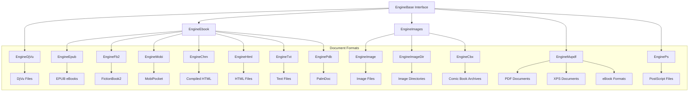

# Engines Module Documentation

## Overview

The engines module is the core document processing layer of SumatraPDF, providing a unified interface for rendering and interacting with various document formats. It implements a plugin-like architecture where each document format is handled by a specialized engine that conforms to the common `EngineBase` interface.

## Architecture

The engines module follows a hierarchical design with format-specific engines inheriting from a common base class:

## Core Components

### Base Engine Architecture

All engines inherit from `EngineBase` which provides the common interface:

- **Page Management**: `PageMediabox()`, `PageContentBox()`, `PageCount()`
- **Rendering**: `RenderPage()` with support for zoom, rotation, and partial rendering
- **Text Extraction**: `ExtractPageText()` with coordinate mapping
- **Navigation**: `GetNamedDest()`, `GetToc()` for bookmarks and table of contents
- **Element Detection**: `GetElements()`, `GetElementAtPos()` for interactive elements
- **File Operations**: `GetFileData()`, `SaveFileAs()` for document persistence

### Engine Categories

#### 1. Document Engines
Handle structured documents with text, images, and navigation:

- **EngineMupdf**: PDF, XPS, and eBook formats using MuPDF library
- **EngineDjVu**: DjVu format with specialized page info and link handling
- **EngineEbook**: Base class for reflowable eBook formats

#### 2. Image Engines
Process raster and vector images:

- **EngineImage**: Single image files with format detection
- **EngineImageDir**: Directory-based image collections
- **EngineCbx**: Comic book archives (CBZ, CBR, CB7, CBT)

#### 3. Conversion Engines
Transform documents through external tools:

- **EnginePs**: PostScript files via Ghostscript conversion

## Key Features

### Multi-format Support
The module supports 20+ document formats through specialized engines:

### Advanced Rendering Pipeline

Each engine implements sophisticated rendering:

1. **Page Layout Detection**: Automatic content box calculation
2. **Transform Support**: Zoom, rotation, and coordinate transformation
3. **Memory Management**: Efficient caching with LRU eviction
4. **Multi-threading**: Thread-safe rendering with abort capabilities

### Text and Navigation

- **Text Extraction**: With precise coordinate mapping for search and selection
- **Link Detection**: Automatic hyperlink discovery in text content
- **Bookmark Support**: Hierarchical table of contents extraction
- **Named Destinations**: Internal document navigation targets

## Performance Optimizations

### Caching Strategy
- **Page Cache**: LRU cache for rendered bitmaps
- **Metadata Cache**: Persistent document properties
- **Element Cache**: Pre-computed interactive elements

### Memory Management
- **Streaming**: Large documents loaded on-demand
- **Reference Counting**: Automatic resource cleanup
- **Memory Mapping**: Efficient file access for large documents

### Thread Safety
- **Critical Sections**: Protect shared resources
- **Per-thread Contexts**: Isolate MuPDF contexts
- **Lock-free Operations**: Where possible for performance

## Error Handling

The module implements comprehensive error handling:

- **Graceful Degradation**: Continue operation when features fail
- **Resource Cleanup**: Automatic cleanup on errors
- **User Feedback**: Meaningful error messages
- **Recovery Mechanisms**: Alternative rendering paths

## Integration Points

The engines module integrates with:

- **[Document Controller](doc_controller.md)**: For document lifecycle management
- **[UI Components](ui_components.md)**: For rendering and interaction
- **[Settings System](settings.md)**: For configuration and preferences
- **[Annotation System](annotations.md)**: For PDF annotation support

## Sub-modules

For detailed information about specific engine implementations, see:

- [mupdf_java_bindings.md](mupdf_java_bindings.md) - MuPDF integration and Java bindings
- [mupdf_wrap_scripts.md](mupdf_wrap_scripts.md) - MuPDF wrapper generation scripts
- [utils.md](utils.md) - Utility functions and helpers
- [document_formats.md](document_formats.md) - Format-specific document handling

## Security Considerations

- **Password Protection**: Secure handling of encrypted documents
- **Sandboxing**: Isolated processing of untrusted content
- **Resource Limits**: Prevention of resource exhaustion attacks
- **Input Validation**: Thorough validation of document structures

## Future Enhancements

- **GPU Acceleration**: Hardware-accelerated rendering
- **Cloud Integration**: Streaming from cloud storage
- **AI Enhancement**: Intelligent text recognition and layout analysis
- **Plugin Architecture**: Dynamic loading of additional format support