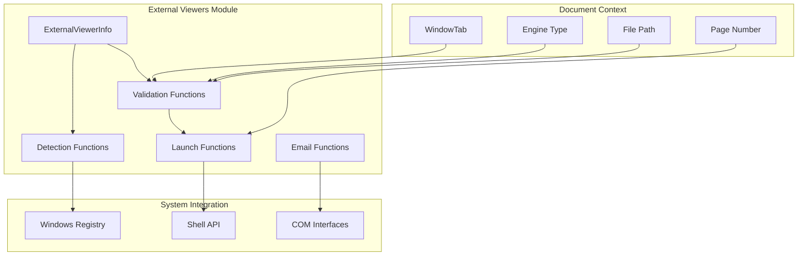
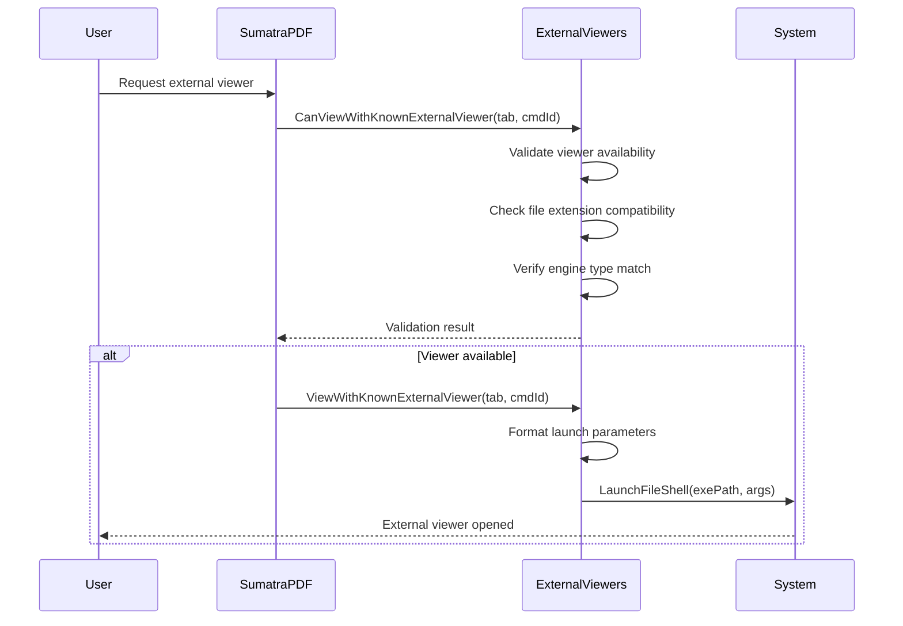

# External Viewers Module Documentation

## Introduction

The external_viewers module provides functionality for integrating SumatraPDF with external document viewers and applications. It enables users to open documents in alternative viewers, file managers, and specialized applications while maintaining context awareness such as current page numbers and file paths.

## Core Purpose

This module serves as a bridge between SumatraPDF and external applications, offering:
- **Viewer Integration**: Launch documents in alternative PDF readers (Acrobat, Foxit, PDF-XChange)
- **File Management**: Open documents in file managers (Explorer, Total Commander, Directory Opus)
- **Format-Specific Tools**: Integration with specialized viewers for different document formats
- **Email Integration**: Send documents as email attachments through system mail clients

## Architecture

### Component Structure



### Data Flow



## Core Components

### ExternalViewerInfo Structure

The `ExternalViewerInfo` structure is the central data structure that defines each external viewer integration:

```cpp
struct ExternalViewerInfo {
    const char* name;           // Display name for UI
    int cmdId;                  // Command identifier
    const char* exts;           // Supported file extensions
    const char* exePartialPath; // Relative path to executable
    const char* launchArgs;     // Launch arguments template
    Kind engineKind;            // Associated engine type
    const char* exeFullPath;    // Resolved full path (runtime)
};
```

### Predefined Viewers

The module includes predefined configurations for popular applications:

#### File Managers
- **Windows Explorer**: `/select,"%1"` - Opens with file selected
- **Directory Opus**: `"%d"` - Opens containing directory
- **Total Commander**: `"%d"` - Opens in file manager
- **Double Commander**: `--no-splash --client "%d"` - Opens with specific flags

#### PDF Viewers
- **Acrobat Reader**: `/A page=%p "%1"` - Opens at current page
- **Foxit Reader**: `"%1" /A page=%p` - Opens with page parameter
- **PDF-XChange Editor**: `/A page=%p "%1"` - Opens at specific page

#### Specialized Viewers
- **PDF & DjVu Bookmarker**: Supports both PDF and DjVu formats
- **XPS Viewer**: For XPS and OXPS documents
- **HTML Help**: For CHM files

## Key Functions

### Detection and Registration

```cpp
void DetectExternalViewers()
```
Scans the system for installed external viewers by:
1. Checking predefined paths in Program Files directories
2. Querying Windows Registry for application locations
3. Resolving full executable paths
4. Updating viewer availability status

### Validation Functions

```cpp
bool CanViewWithKnownExternalViewer(WindowTab* tab, int cmdId)
```
Validates if a specific external viewer can be used for the current document by checking:
- Viewer availability and installation status
- File extension compatibility
- Engine type compatibility
- File accessibility

### Launch Functions

```cpp
bool ViewWithKnownExternalViewer(WindowTab* tab, int cmdId)
```
Launches the specified external viewer with:
- Formatted command line arguments
- Current page number substitution (`%p`)
- File path substitution (`%1`)
- Directory path substitution (`%d`)

### Parameter Substitution

The module supports dynamic parameter substitution in launch arguments:
- `%1`: Full file path (quoted if necessary)
- `%d`: Directory containing the file
- `%p`: Current page number

## Integration Points

### Command System Integration

The module integrates with SumatraPDF's command system through predefined command IDs:
- `CmdOpenWithExplorer`
- `CmdOpenWithAcrobat`
- `CmdOpenWithFoxIt`
- And others for each supported viewer

### Settings Integration

External viewers can be configured through:
- Predefined viewer configurations
- Custom external viewer definitions
- Advanced settings for power users

### Email Integration

The module provides email functionality through:
```cpp
bool SendAsEmailAttachment(WindowTab* tab, HWND hwndParent)
```
Uses Windows SendMail COM interface for reliable email composition.

## Error Handling

### Validation Failures
- Missing viewer executables
- Unsupported file formats
- Inaccessible files
- Registry access failures

### User Feedback
- Error messages for missing viewers
- Status updates during detection
- Debug logging for troubleshooting

## Dependencies

### Internal Dependencies
- [utils](utils.md): File operations, string manipulation, registry access
- [ui_components](ui_components.md): Command system integration
- [document_formats](document_formats.md): Engine type detection

### External Dependencies
- Windows Shell API for process launching
- Windows Registry for application detection
- COM interfaces for email functionality

## Security Considerations

### Path Validation
- Validates executable paths before launching
- Prevents command injection through parameter sanitization
- Uses quoted paths to handle spaces in file names

### Registry Access
- Limited registry queries for application detection
- No modification of system registry
- Safe handling of missing registry keys

## Performance Optimization

### Caching
- Viewer detection results are cached after initial scan
- Full paths are resolved once and stored
- No repeated file system queries

### Lazy Loading
- Detection only occurs when needed
- Registry queries are minimized
- Efficient path resolution algorithms

## Extension Points

### Custom Viewers
Users can define custom external viewers through settings with:
- Custom executable paths
- Flexible argument templates
- File extension filters

### Plugin Architecture
The module can be extended to support:
- Additional viewer types
- Custom parameter substitution
- Specialized launch behaviors

## Troubleshooting

### Common Issues
1. **Viewer not detected**: Check installation path and registry entries
2. **Launch failures**: Verify file permissions and executable accessibility
3. **Parameter errors**: Ensure proper argument formatting and substitution

### Debug Information
The module provides logging for:
- Viewer detection results
- Launch parameter formatting
- Error conditions and failures

## Future Enhancements

### Potential Improvements
- Support for additional file managers and viewers
- Enhanced parameter substitution system
- Integration with cloud storage providers
- Support for portable application versions
- Advanced configuration UI for custom viewers