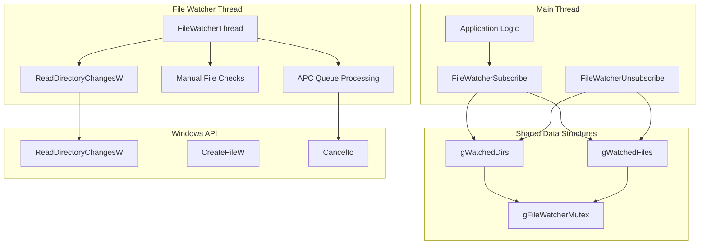
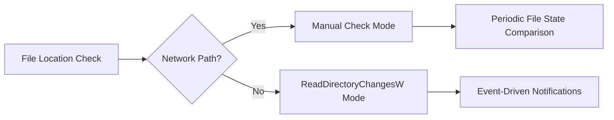
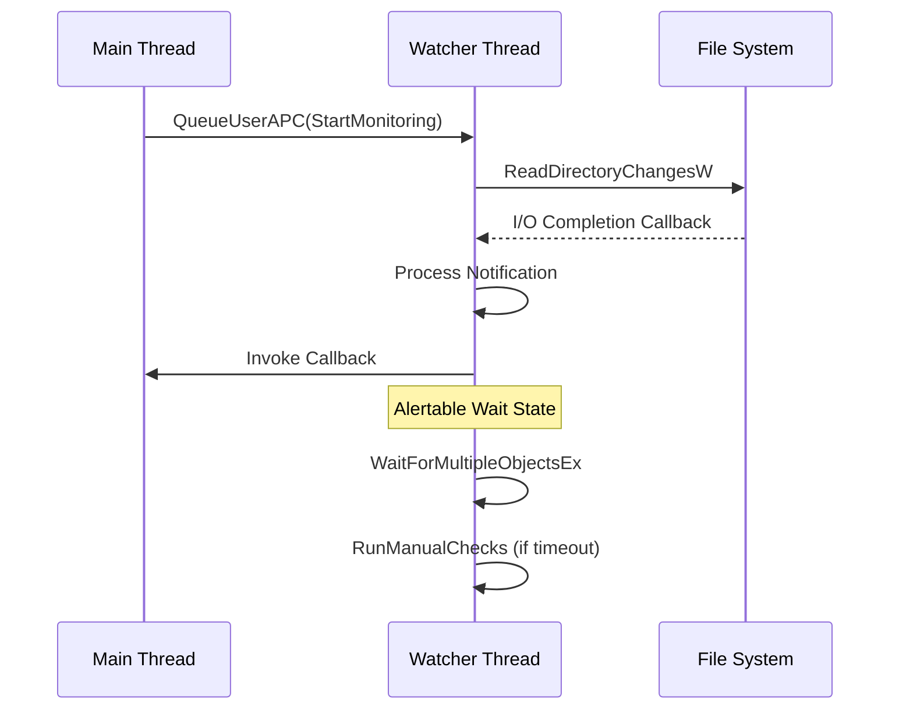
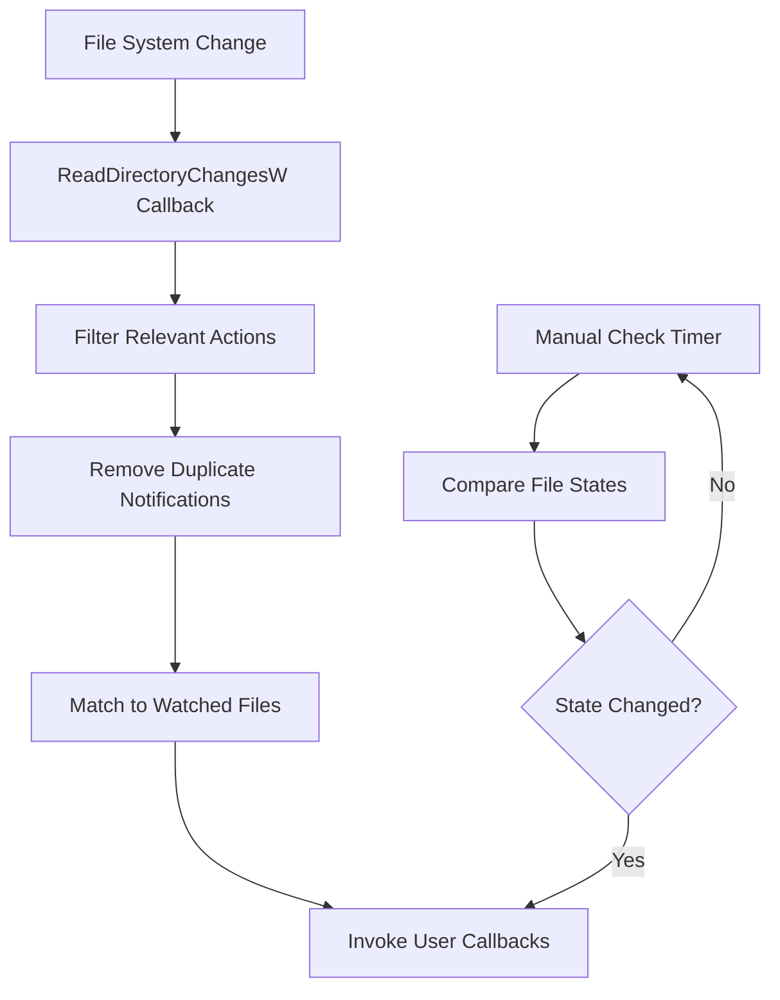

# File Watcher Module Documentation

## Introduction

The file_watcher module provides a robust file system monitoring system for SumatraPDF, enabling the application to detect when watched files are modified, created, or renamed. This functionality is crucial for features like automatic document reloading when files are updated by external applications.

The module implements a sophisticated multi-threaded architecture that efficiently monitors file changes using Windows API functions while handling edge cases like network drives and file system limitations.

## Architecture Overview

### Core Components

The module is built around several key components that work together to provide reliable file monitoring:

- **FileWatcherState**: Tracks file modification state (timestamp and size)
- **WatchedDir**: Manages directory-level monitoring using `ReadDirectoryChangesW`
- **WatchedFile**: Represents individual file subscriptions with change callbacks
- **FileWatcherThread**: Dedicated worker thread for handling file system notifications

### System Architecture



## Component Details

### FileWatcherState Structure

The `FileWatcherState` structure is the fundamental unit for tracking file changes:

```cpp
struct FileWatcherState {
    FILETIME time{};    // Last modification timestamp
    i64 size = 0;       // File size in bytes
};
```

This structure captures the essential file metadata needed to detect changes. The module compares both timestamp and size to determine if a file has been modified, providing robust change detection that accounts for rapid successive modifications.

### Directory Monitoring Strategy

The module employs a two-tier monitoring strategy based on file location:

1. **Local Files**: Uses `ReadDirectoryChangesW` for efficient, event-driven notifications
2. **Network Files**: Falls back to periodic manual checks due to API limitations



### Thread Architecture

The file watcher implements a dedicated worker thread that maintains an alertable state to receive asynchronous procedure calls (APCs) and I/O completion notifications:



## Data Flow and Processing

### File Change Detection Pipeline

The module processes file changes through a multi-stage pipeline:



### Notification Filtering

The system filters file system notifications to focus on meaningful changes:

- **FILE_ACTION_ADDED**: New files appearing in watched directories
- **FILE_ACTION_MODIFIED**: Content changes to existing files
- **FILE_ACTION_RENAMED_NEW_NAME**: Files renamed into place

This filtering prevents unnecessary callbacks for temporary files and intermediate states during file operations.

## Integration with SumatraPDF

### Document Reloading

The file watcher integrates with SumatraPDF's document management system to provide automatic reloading capabilities. When a watched document file changes, the module notifies the application layer, which can then reload the document to reflect the latest changes.

### Thread Safety

All shared data structures are protected by a critical section (`gFileWatcherMutex`), ensuring thread-safe operations between the main UI thread and the file watcher worker thread. The module uses scoped critical sections to minimize lock contention.

## Error Handling and Edge Cases

### Network Drive Handling

The module gracefully handles network drives where `ReadDirectoryChangesW` may not function reliably. For these cases, it implements a fallback mechanism using periodic file state checks with a configurable delay (`FILEWATCH_DELAY_IN_MS = 1000ms`).

### File System Limitations

The implementation accounts for several Windows file system quirks:

- **Short File Names**: The system may report 8.3 DOS-style names, though the current implementation doesn't explicitly handle this case
- **Multiple Notifications**: Single file operations can generate multiple notifications, handled through deduplication
- **Timestamp Granularity**: File modification timestamps may have limited granularity, so size comparisons provide additional change detection

### Resource Management

The module implements careful resource management:

- **Overlapped I/O**: Properly manages `OVERLAPPED` structures for asynchronous operations
- **Handle Cleanup**: Ensures all file handles and directory handles are properly closed
- **Memory Management**: Uses RAII patterns and careful allocation/deallocation tracking

## Performance Considerations

### Scalability

The module is designed to handle multiple file subscriptions efficiently:

- **Directory Sharing**: Multiple files in the same directory share a single `ReadDirectoryChangesW` handle
- **Notification Batching**: Collects and deduplicates notifications before processing
- **Minimal Locking**: Uses fine-grained locking to reduce contention

### Memory Usage

The module maintains minimal memory overhead:

- **Fixed Buffer Size**: Uses 16KB buffers for directory change notifications
- **Linked Lists**: Efficiently manages dynamic collections of watched items
- **Lazy Initialization**: Creates the watcher thread only when needed

## API Reference

### FileWatcherSubscribe

Subscribes to file change notifications for a specific file path.

```cpp
WatchedFile* FileWatcherSubscribe(const char* path, const Func0& onFileChangedCb);
```

**Parameters:**
- `path`: The file path to monitor
- `onFileChangedCb`: Callback function invoked when the file changes

**Returns:** A cancellation token for use with `FileWatcherUnsubscribe`

### FileWatcherUnsubscribe

Removes a file subscription.

```cpp
void FileWatcherUnsubscribe(WatchedFile* wf);
```

**Parameters:**
- `wf`: The subscription token returned by `FileWatcherSubscribe`

### FileWatcherWaitForShutdown

Waits for the file watcher thread to complete pending operations during application shutdown.

```cpp
void FileWatcherWaitForShutdown();
```

## Dependencies

The file_watcher module depends on several core utilities and system components:

- **Thread Utilities**: [thread_utilities.md](thread_utilities.md) for thread management
- **File Utilities**: [file_utilities.md](file_utilities.md) for file system operations
- **Windows API**: For `ReadDirectoryChangesW` and related functions
- **Logging System**: For debug output and error reporting

## Future Enhancements

### Potential Improvements

The module includes several TODO items indicating areas for future enhancement:

- **Thread Lifecycle Management**: Consider terminating the watcher thread when no files are being monitored
- **Notification Coalescing**: Implement delay mechanisms to collapse multiple rapid notifications for the same file
- **Short Name Handling**: Add support for 8.3 DOS-style file names in notifications
- **Lock-Free Design**: Explore removing the need for `gFileWatcherMutex` using lock-free data structures

### Performance Optimizations

- **Adaptive Polling**: Adjust manual check intervals based on file change frequency
- **Batch Processing**: Group multiple file change notifications for more efficient processing
- **Memory Pooling**: Use object pools for frequently allocated structures

## Conclusion

The file_watcher module provides a robust, efficient, and thread-safe foundation for file system monitoring in SumatraPDF. Its sophisticated architecture handles the complexities of Windows file system notifications while providing a simple, reliable API for the application layer. The module's design demonstrates careful attention to edge cases, performance considerations, and maintainability, making it a solid foundation for document auto-reloading and related features.