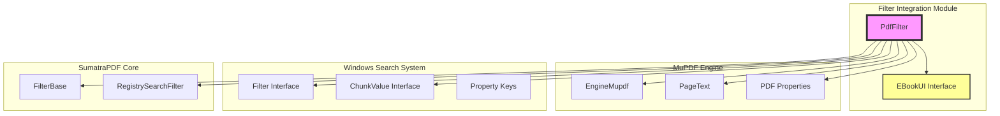
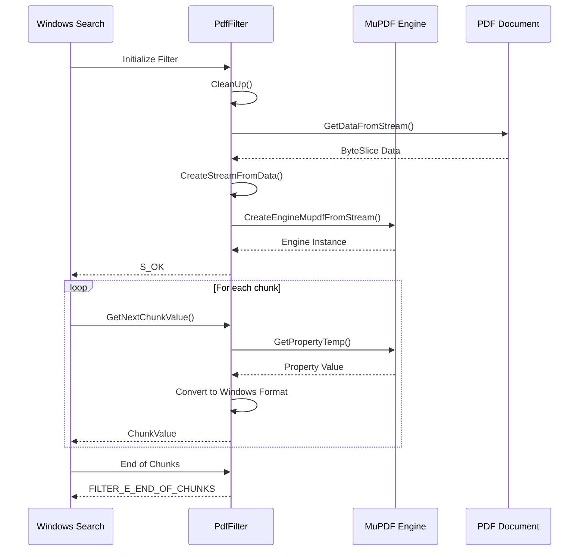
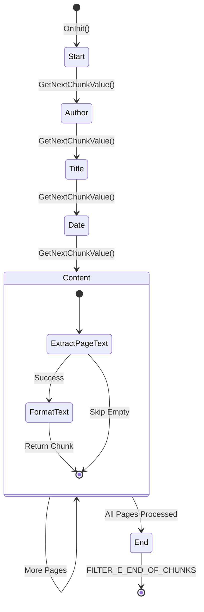
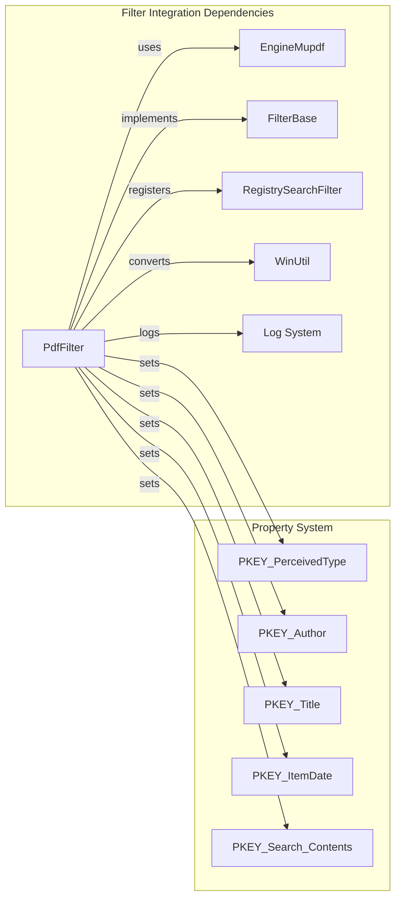

# Filter Integration Module Documentation

## Introduction

The filter_integration module provides Windows Search integration capabilities for PDF documents within the SumatraPDF application. It implements the `PdfFilter` class that enables Windows Search to index and search through PDF document content, metadata, and properties. This module serves as a bridge between the MuPDF engine and the Windows Search indexing system, allowing users to find PDF documents through Windows Search based on their content and metadata.

## Architecture Overview

The filter_integration module is part of the larger MuPDF engine integration ecosystem and implements the Windows Search filter interface for PDF documents.

## Core Components

### PdfFilter Class

The `PdfFilter` class is the primary component that implements the Windows Search filter interface for PDF documents. It provides the following key functionality:

- **Document Loading**: Loads PDF documents from IStream interfaces
- **Metadata Extraction**: Extracts document properties (author, title, dates)
- **Content Indexing**: Extracts and formats text content for search indexing
- **State Management**: Manages the filtering process through defined states

### EBookUI Interface

The `EBookUI` interface provides a placeholder for e-book UI functionality, currently returning `nullptr` in the implementation.

## Data Flow Architecture

## Filter States and Process Flow

## Component Dependencies

## Key Functions and Methods

### PdfFilter::OnInit()
- **Purpose**: Initializes the PDF filter with document data
- **Process**: 
  1. Cleans up any existing state
  2. Reads data from the input stream
  3. Creates a seekable stream from the data
  4. Initializes the MuPDF engine with the document
  5. Sets initial filter state

### PdfFilter::GetNextChunkValue()
- **Purpose**: Retrieves the next piece of searchable content
- **States**:
  - **Start**: Sets document type property
  - **Author**: Extracts and sets author metadata
  - **Title**: Extracts and sets title/subject metadata
  - **Date**: Parses and sets creation/modification dates
  - **Content**: Extracts and formats page text content
  - **End**: Returns end-of-chunks signal

### PdfFilter::CleanUp()
- **Purpose**: Releases resources and resets state
- **Actions**: Releases MuPDF engine instance and sets state to End

## Integration with Windows Search

The module integrates with Windows Search through the following mechanisms:

1. **Property Keys**: Uses standard Windows property keys for metadata
   - `PKEY_PerceivedType`: Document type classification
   - `PKEY_Author`: Document author information
   - `PKEY_Title`: Document title
   - `PKEY_ItemDate`: Document date information
   - `PKEY_Search_Contents`: Searchable content

2. **Chunk Values**: Returns data in Windows Search compatible format
   - Text values for metadata
   - FileTime values for dates
   - Formatted text content with proper line endings

3. **Error Handling**: Returns appropriate HRESULT values
   - `S_OK`: Successful operation
   - `E_FAIL`: General failure
   - `FILTER_E_END_OF_CHUNKS`: End of content

## Relationship with Other Modules

### MuPDF Engine Integration
The filter_integration module depends on the [mupdf_engine_integration](mupdf_engine_integration.md) module for:
- PDF document parsing and rendering
- Text extraction from pages
- Metadata property retrieval
- Document structure access

### Core Application Services
The module utilizes services from [core_application_and_ui](core_application_and_ui.md) for:
- Logging functionality
- Base utility functions
- Windows-specific utilities

## Error Handling and Logging

The module implements comprehensive logging for debugging and monitoring:
- Filter initialization and cleanup operations
- State transitions during chunk processing
- Error conditions and failures
- Property extraction results

## Performance Considerations

1. **Memory Management**: Uses scoped pointers and automatic cleanup
2. **Stream Handling**: Creates seekable streams for reliable document access
3. **Text Processing**: Efficiently formats text content with line ending conversion
4. **State Management**: Minimizes redundant operations through state tracking

## Security Considerations

1. **Stream Validation**: Validates input streams before processing
2. **Memory Safety**: Uses scoped pointers to prevent memory leaks
3. **Error Isolation**: Properly handles and reports errors without crashing
4. **Resource Cleanup**: Ensures all resources are properly released

## Future Enhancements

Potential improvements for the filter_integration module:

1. **Enhanced EBookUI**: Implement actual e-book UI functionality
2. **Performance Optimization**: Implement caching for frequently accessed documents
3. **Extended Format Support**: Add support for additional document formats
4. **Advanced Metadata**: Extract more comprehensive document metadata
5. **Content Filtering**: Implement content filtering and sanitization

## Conclusion

The filter_integration module provides essential Windows Search integration for PDF documents in SumatraPDF. It bridges the gap between the MuPDF rendering engine and Windows Search indexing system, enabling users to search through their PDF documents using Windows Search functionality. The module's state-based architecture ensures efficient processing of document content and metadata while maintaining compatibility with Windows Search requirements.