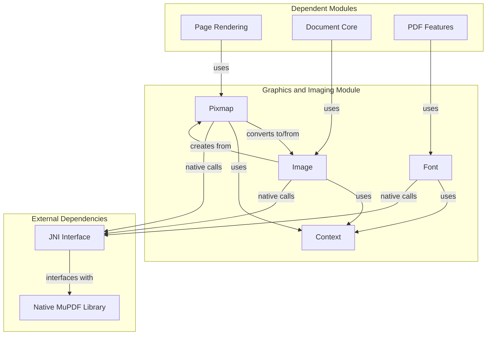
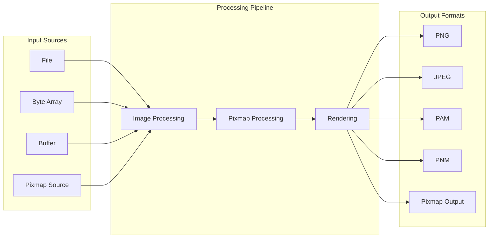

# Graphics and Imaging Module

## Introduction

The Graphics and Imaging module provides the core graphics processing capabilities for the MuPDF Java bindings. This module handles pixel-based image operations, image format conversions, font rendering, and advanced image processing features like barcode generation and document deskewing. It serves as the foundation for rendering and manipulating visual content across the entire document processing system.

## Module Overview

The Graphics and Imaging module is part of the MuPDF Java bindings (`mupdf_fitz_jni_bindings`) and provides essential graphics primitives that other modules depend on for visual content processing. It bridges native MuPDF functionality with Java applications through JNI interfaces.

## Core Components

### Pixmap Class
**Component ID**: `mupdf.platform.java.src.com.artifex.mupdf.fitz.Pixmap.Pixmap`

The Pixmap class represents a pixel-based image buffer with support for multiple color spaces and alpha channels. It serves as the primary container for rasterized content and provides comprehensive image manipulation capabilities.

**Key Features:**
- Multi-color space support (RGB, CMYK, Grayscale, etc.)
- Alpha channel transparency handling
- Multiple format export options (PNG, JPEG, PAM, PNM, PBM, PKM, JPX)
- Image processing operations (invert, gamma correction, tinting)
- Document processing features (deskewing, warping, barcode handling)
- Color space conversion with proofing support

**Constructor Options:**
- Basic creation with color space and dimensions
- Rectangle-based initialization
- Color and mask combination
- Deskewing with border handling

### Image Class
**Component ID**: `mupdf.platform.java.src.com.artifex.mupdf.fitz.Image.Image`

The Image class provides a higher-level abstraction for image data, supporting various input sources and metadata handling. It acts as a bridge between different image formats and the Pixmap representation.

**Key Features:**
- Multi-source input support (file, byte array, buffer, pixmap)
- Image metadata extraction (resolution, color space, components)
- Color key and decode array support
- Orientation handling
- Mask image support
- Format conversion to Pixmap

### Font Class
**Component ID**: `mupdf.platform.java.src.com.artifex.mupdf.fitz.Font.Font`

The Font class handles text rendering capabilities with support for various font encodings and character mappings. It provides essential typography functionality for document rendering.

**Key Features:**
- Multiple encoding support (Latin, Greek, Cyrillic)
- Adobe CJK font support (CNS, GB, Japan, Korea)
- Font property detection (monospace, serif, bold, italic)
- Unicode character encoding
- Glyph advance calculation

## Architecture

### Component Relationships



### Data Flow Architecture



## Key Features and Capabilities

### Image Processing Operations

#### Basic Operations
- **Clear Operations**: Fill pixmap with solid colors or transparency
- **Color Manipulation**: Invert colors, adjust gamma, apply tinting
- **Geometric Operations**: Deskewing, warping, document detection

#### Advanced Features
- **Barcode Support**: Generate and decode various barcode types
- **Color Space Conversion**: Convert between different color spaces with proofing
- **Resolution Handling**: Get and set image resolution for print optimization

### Format Support

#### Input Formats
- File-based loading
- Byte array input
- Buffer-based streaming
- Pixmap conversion

#### Output Formats
- PNG (lossless compression)
- JPEG (lossy compression with quality control)
- PAM (Portable Arbitrary Map)
- PNM (Portable Any Map)
- PBM (Portable BitMap)
- PKM (Packed Pixel Map)
- JPX (JPEG 2000)

### Font and Text Support

#### Character Encoding
- Latin character support
- Greek alphabet support
- Cyrillic script support
- Adobe CJK (Chinese, Japanese, Korean) fonts

#### Typography Features
- Font property detection
- Character-to-glyph mapping
- Glyph advance calculation
- Writing mode support

## Integration with Other Modules

### Page Rendering Integration
The Graphics and Imaging module provides the foundation for [page rendering](page_rendering.md) operations. Pixmap objects serve as the target for rendering operations, while Image objects handle source material conversion.

### Document Processing Integration
Font objects are essential for [PDF-specific features](pdf_specific_features.md) that require text rendering and manipulation. The module's color space conversion capabilities support document-wide color management.

### Image Format Engine Integration
The module's comprehensive format support enables integration with [image and comic book engines](image_and_comic_book_engine.md), providing format conversion and processing capabilities for various image types.

## Usage Patterns

### Basic Image Processing
```java
// Create pixmap from color space and dimensions
Pixmap pixmap = new Pixmap(colorSpace, width, height, hasAlpha);

// Process image
pixmap.gamma(1.2f);
pixmap.invertLuminance();

// Export to format
Buffer pngData = pixmap.asPNG();
pixmap.saveAsJPEG("output.jpg", 85);
```

### Image Loading and Conversion
```java
// Load image from various sources
Image image = new Image("input.png");
Image imageFromBytes = new Image(byteArray);

// Convert to pixmap for processing
Pixmap pixmap = image.toPixmap();

// Access image properties
int width = image.getWidth();
ColorSpace cs = image.getColorSpace();
```

### Font Operations
```java
// Create font
Font font = new Font("Arial", 0);

// Check font properties
boolean isBold = font.isBold();
boolean isMono = font.isMono();

// Get glyph information
int glyph = font.encodeCharacter(unicode);
float advance = font.advanceGlyph(glyph);
```

## Error Handling and Resource Management

### Memory Management
All classes implement proper resource management through:
- Native finalization methods
- Explicit destroy() methods
- JNI resource cleanup

### Thread Safety
- Context initialization is thread-safe
- Individual object instances are not thread-safe
- External synchronization required for concurrent access

## Performance Considerations

### Optimization Strategies
- Reuse Pixmap objects when possible
- Batch processing operations
- Use appropriate color spaces for target output
- Consider format-specific optimizations (e.g., JPEG quality settings)

### Memory Usage
- Pixmap memory usage scales with dimensions and color depth
- Alpha channels increase memory requirements
- Format conversion may require temporary buffers

## Dependencies

### Internal Dependencies
- **Context Management**: Requires initialized MuPDF context
- **Color Space Support**: Integrates with color space definitions
- **Buffer Management**: Uses buffer classes for data exchange

### External Dependencies
- **Native MuPDF Library**: Core functionality provided by native code
- **JNI Interface**: Java Native Interface for cross-language calls
- **Operating System**: Platform-specific graphics capabilities

## Future Enhancements

### Potential Improvements
- Additional format support (WebP, AVIF)
- GPU acceleration for processing operations
- Advanced color management features
- Machine learning integration for document processing
- Enhanced barcode format support

### Scalability Considerations
- Support for large image processing
- Streaming processing for memory-constrained environments
- Parallel processing capabilities
- Cloud-based processing integration

## Related Documentation

- [Context Management](context_management.md) - Core context initialization and management
- [Page Rendering](page_rendering.md) - Integration with page rendering operations
- [PDF Specific Features](pdf_specific_features.md) - Font and text rendering in PDF context
- [Image and Comic Book Engine](image_and_comic_book_engine.md) - Format-specific image handling