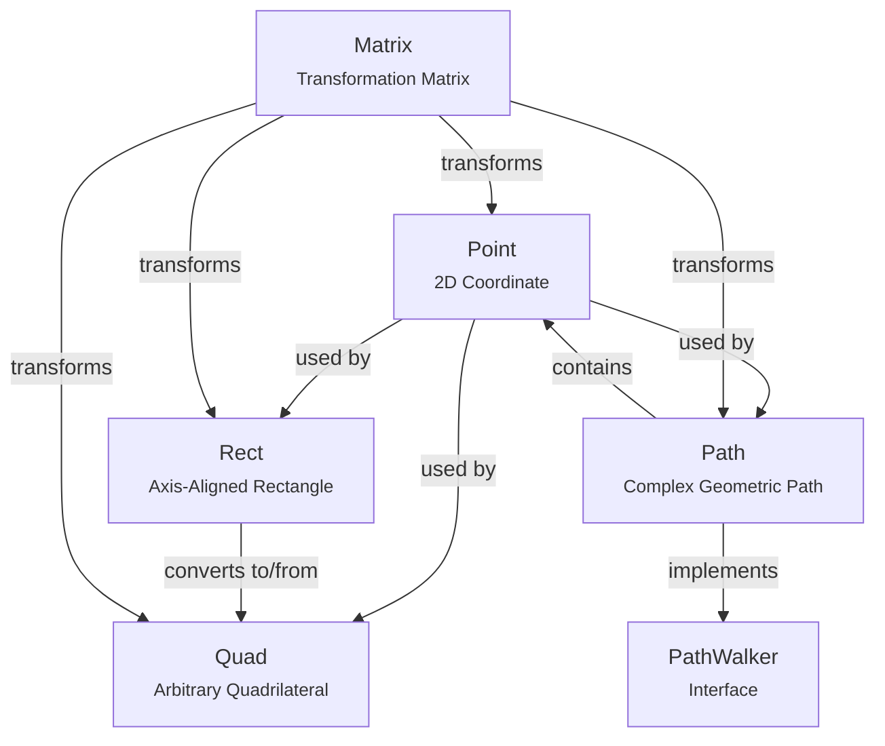
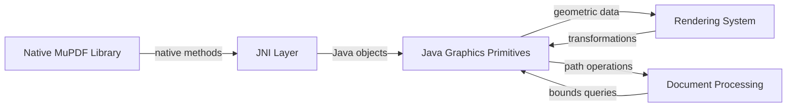

# Graphics Primitives Module

## Introduction

The graphics_primitives module provides the fundamental geometric building blocks for 2D graphics operations within the MuPDF Java bindings system. This module defines the core mathematical structures and operations needed for representing and manipulating geometric shapes, paths, and coordinate transformations in document rendering and graphics processing.

## Module Overview

The graphics_primitives module serves as the foundation for all geometric operations in the MuPDF rendering pipeline. It provides essential data structures for representing points, rectangles, quadrilaterals, and complex paths that are used throughout the document processing workflow.

## Core Components

### 1. Point Class
**Component ID**: `mupdf.platform.java.src.com.artifex.mupdf.fitz.Point.Point`

The Point class represents a 2D coordinate in the graphics system. It serves as the fundamental building block for all geometric operations.

**Key Features:**
- Immutable 2D coordinate representation with x and y float values
- Matrix transformation support for coordinate system conversions
- Equality comparison and hash code generation for use in collections
- String representation for debugging and serialization

**Core Operations:**
- `transform(Matrix tm)`: Applies affine transformations to the point
- Coordinate access through public x, y fields
- Copy constructor for creating duplicate points

### 2. Rect Class
**Component ID**: `mupdf.platform.java.src.com.artifex.mupdf.fitz.Rect.Rect`

The Rect class represents an axis-aligned rectangular region defined by two corner points (x0, y0) and (x1, y1).

**Key Features:**
- Support for infinite, empty, and invalid rectangle states
- Comprehensive geometric operations (union, intersection, containment)
- Matrix transformation support
- Stroke adjustment for rendering operations
- Multiple constructors for different initialization patterns

**Core Operations:**
- `transform(Matrix tm)`: Applies affine transformations
- `contains()`: Point and rectangle containment testing
- `union()`: Rectangle union operations
- `adjustForStroke()`: Stroke width compensation
- `inset()`, `offset()`: Geometric manipulation methods

### 3. Quad Class
**Component ID**: `mupdf.platform.java.src.com.artifex.mupdf.fitz.Quad.Quad`

The Quad class represents an arbitrary quadrilateral defined by four corner points (ul, ur, ll, lr), enabling representation of rotated and perspective-transformed rectangles.

**Key Features:**
- Four-point quadrilateral representation for complex transformations
- Conversion to axis-aligned bounding rectangles
- Point-in-quadrilateral testing using triangle-based algorithms
- Matrix transformation support
- Support for infinite and invalid states

**Core Operations:**
- `transformed()`, `transform()`: Matrix transformation methods
- `contains()`: Point containment with triangle-based algorithms
- `toRect()`: Conversion to bounding rectangle
- Cross-product calculations for geometric testing

### 4. Path Class
**Component ID**: `mupdf.platform.java.src.com.artifex.mupdf.fitz.Path.Path`

The Path class represents complex geometric paths consisting of line segments, curves, and subpaths, implementing the PathWalker interface for path traversal.

**Key Features:**
- Native path construction and manipulation
- Support for lines, Bézier curves, and rectangles
- Path walking interface for traversal and serialization
- Matrix transformation support
- Bounds calculation with stroke state consideration
- Memory management with native resource cleanup

**Core Operations:**
- `moveTo()`, `lineTo()`: Basic path construction
- `curveTo()`, `curveToV()`, `curveToY()`: Bézier curve operations
- `rect()`: Rectangle path construction
- `transform()`: Path transformation
- `getBounds()`: Bounding box calculation
- `walk()`: Path traversal with visitor pattern

## Architecture

### Component Relationships



### Data Flow Architecture



## Integration with System Modules

### Upstream Dependencies

The graphics_primitives module depends on the following system components:

- **[Matrix Operations](rendering_system.md)**: Provides transformation matrices for geometric operations
- **[Context Management](document_core.md)**: Manages the MuPDF context initialization
- **[Stroke State](rendering_system.md)**: Defines stroke properties for path rendering

### Downstream Consumers

The graphics_primitives module is utilized by:

- **[Rendering System](rendering_system.md)**: Uses paths and geometric primitives for drawing operations
- **[Document Core](document_core.md)**: Employs rectangles and points for page layout and positioning
- **[Content Extraction](content_extraction.md)**: Uses quadrilaterals for text selection and highlighting
- **[PDF Features](pdf_features.md)**: Leverages paths for annotation rendering and form fields

## Key Design Patterns

### 1. Immutable Value Objects
Point objects are designed as immutable value objects with public fields, enabling efficient coordinate representation while maintaining thread safety.

### 2. Native Resource Management
The Path class implements proper native resource management with finalizers and explicit destroy methods, preventing memory leaks in JNI interactions.

### 3. Visitor Pattern
Path traversal implements the visitor pattern through PathWalker interface, enabling extensible path processing without modifying the core path structure.

### 4. Geometric State Management
Rectangle and quadrilateral classes maintain explicit state information (valid, infinite, empty), enabling robust geometric algorithms and error handling.

## Usage Examples

### Basic Geometric Operations

```java
// Point operations
Point p1 = new Point(10.0f, 20.0f);
Point p2 = new Point(p1);
Matrix transform = new Matrix();
p1.transform(transform);

// Rectangle operations
Rect rect = new Rect(0, 0, 100, 100);
Rect bounds = rect.transform(transform);
boolean contains = rect.contains(50.0f, 50.0f);

// Path construction
Path path = new Path();
path.moveTo(0, 0);
path.lineTo(100, 0);
path.curveTo(150, 50, 200, 50, 200, 100);
path.closePath();
```

### Complex Transformations

```java
// Quadrilateral for text selection
Quad selection = new Quad(rect);
Quad transformed = selection.transformed(matrix);
boolean hitTest = transformed.contains(point);

// Path bounds calculation
StrokeState stroke = new StrokeState();
Rect pathBounds = path.getBounds(stroke, transformMatrix);
```

## Performance Considerations

### Memory Management
- Native path resources require explicit cleanup to prevent memory leaks
- Point and rectangle objects are lightweight and suitable for frequent allocation
- Quadrilateral operations involve floating-point arithmetic optimized for accuracy

### Computational Efficiency
- Matrix transformations are implemented natively for optimal performance
- Point-in-quadrilateral testing uses efficient triangle-based algorithms
- Path bounds calculation considers stroke properties for accurate results

## Error Handling

### Invalid State Management
- Geometric primitives maintain explicit validity states
- Operations on invalid objects return predictable results
- Native method failures are handled through exception propagation

### Boundary Conditions
- Infinite and empty rectangle states are explicitly handled
- Quadrilateral degeneracy is detected through coordinate validation
- Path construction validates native resource allocation

## Future Extensions

The graphics_primitives module provides a solid foundation for potential enhancements:

- Additional geometric primitives (circles, ellipses, polygons)
- Advanced transformation operations (perspective, projective)
- Geometric intersection and union algorithms
- Optimized batch operations for multiple primitives

## References

- [Rendering System](rendering_system.md) - Transformation matrices and stroke states
- [Document Core](document_core.md) - Context management and coordinate systems
- [Content Extraction](content_extraction.md) - Text selection and highlighting applications
- [PDF Features](pdf_features.md) - Annotation and form field rendering