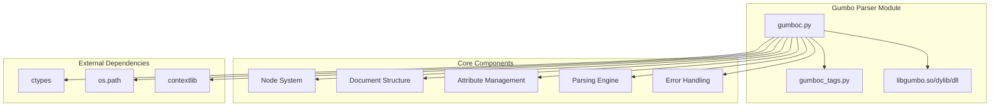
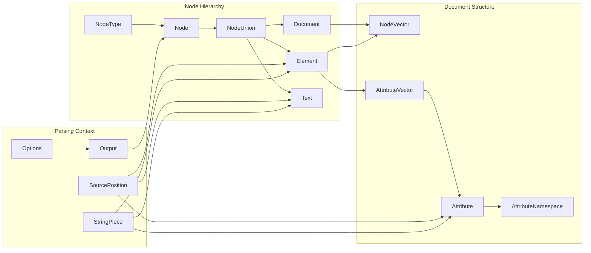
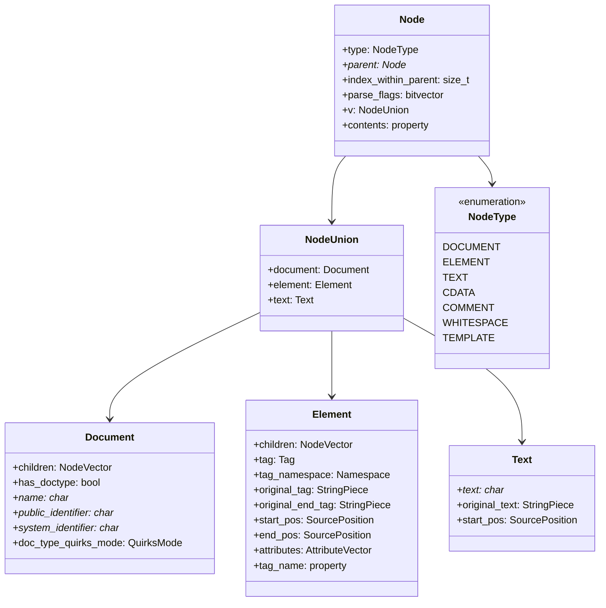
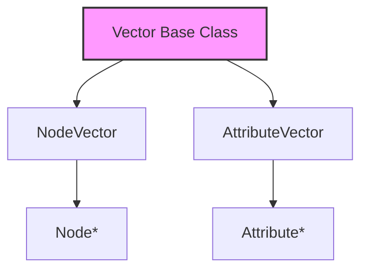
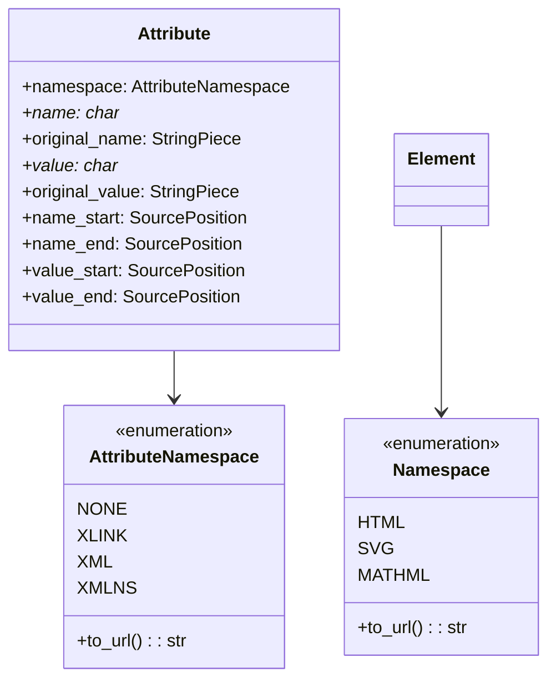
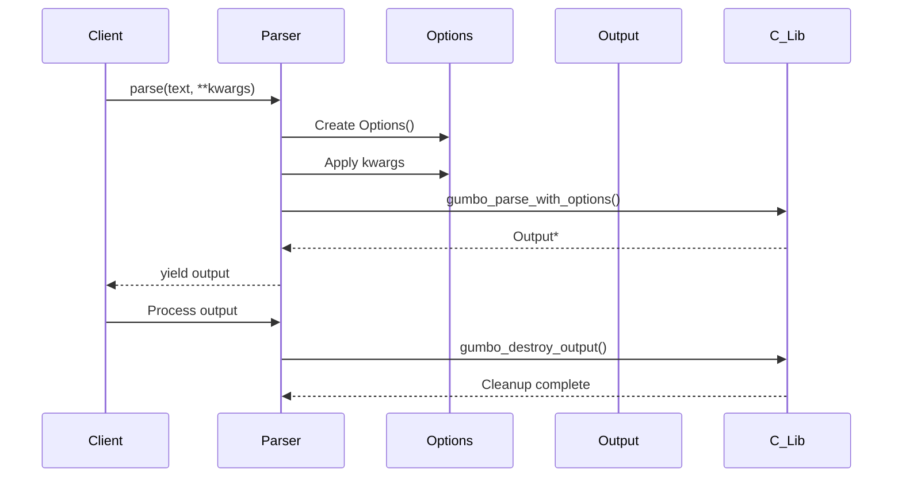
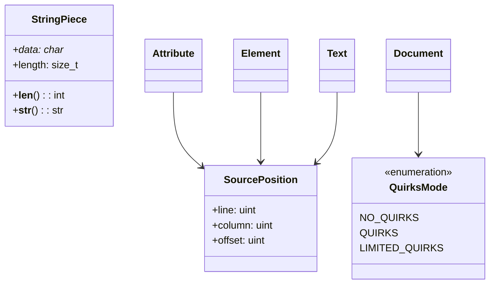
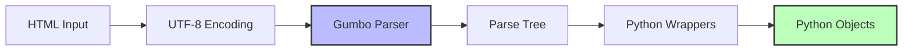
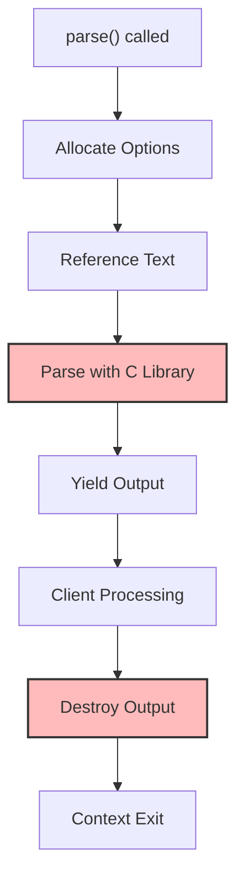
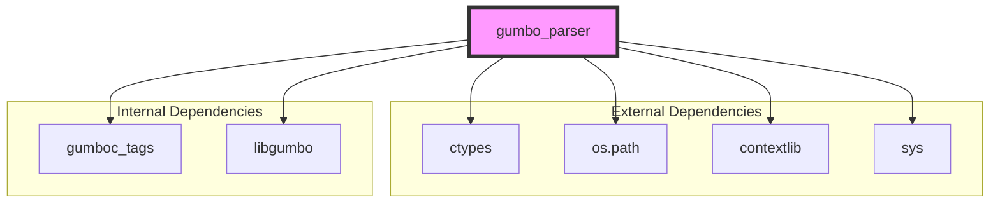

# Gumbo Parser Module Documentation

## Introduction

The Gumbo Parser module provides Python bindings for the Gumbo HTML5 parser, a pure C library developed by Google for parsing HTML5 documents. This module offers a comprehensive set of ctypes wrappers that expose the raw interface of the Gumbo library, enabling robust HTML5 parsing with proper error handling and standards compliance.

The module is designed as a low-level interface that can be wrapped by higher-level libraries to provide more Pythonic APIs. It handles the complexities of HTML5 parsing, including malformed markup, different document modes, and various HTML5-specific features.

## Architecture Overview

### Core Architecture

### Component Relationships

## Core Components

### Node System

The node system forms the foundation of the HTML document representation, providing a unified interface for different types of HTML content.

#### Node Structure

#### Node Types and Usage

The `Node` class serves as the primary interface for accessing HTML content. It uses a union structure (`NodeUnion`) to efficiently represent different types of content:

- **Document Nodes**: Represent the root of HTML documents
- **Element Nodes**: Represent HTML elements with tags, attributes, and children
- **Text Nodes**: Contain textual content within elements

The node system provides transparent access to content through Python properties, automatically delegating to the appropriate underlying structure based on the node type.

### Document Structure Management

#### Vector System

The vector system provides efficient storage and iteration for collections of nodes and attributes. Key features include:

- **Dynamic sizing**: Automatic capacity management
- **Iterator support**: Python-compatible iteration protocol
- **Type safety**: Specialized vectors for nodes and attributes
- **Memory efficiency**: Direct access to underlying C structures

#### Attribute Management

Attributes are managed with full namespace support and position tracking for error reporting and source mapping.

### Parsing Engine

#### Core Parsing Flow

#### Parsing Options

The parsing engine supports extensive configuration through the `Options` structure:

- **Memory management**: Custom allocator/deallocator functions
- **Error handling**: Configurable error limits and stopping behavior
- **Fragment parsing**: Support for parsing HTML fragments
- **Tab handling**: Configurable tab stop positions

### Error Handling and Source Positioning

#### Source Position Tracking

Every significant element in the parse tree includes source position information, enabling:

- **Error reporting**: Precise location of parsing issues
- **Source mapping**: Correlation between parsed output and original HTML
- **Debugging assistance**: Detailed location information for development tools

## Data Flow Architecture

### Input Processing Pipeline

### Memory Management Flow

## Integration with System Architecture

### Module Dependencies

### Usage Patterns

The module is designed to be used as a foundation for higher-level HTML processing libraries. Typical usage patterns include:

1. **Direct Parsing**: Using the `parse()` context manager for one-off HTML parsing
2. **Wrapper Libraries**: Building more Pythonic APIs on top of the ctypes interface
3. **HTML Analysis**: Extracting structured data from HTML documents
4. **HTML Sanitization**: Processing and cleaning HTML content
5. **Document Transformation**: Converting HTML to other formats

## Key Features and Capabilities

### Standards Compliance
- Full HTML5 specification compliance
- Proper handling of malformed HTML
- Support for all HTML5 document modes
- Namespace-aware parsing

### Performance Characteristics
- Direct C library integration via ctypes
- Minimal memory overhead
- Efficient vector-based collections
- Streaming parsing capabilities

### Error Resilience
- Graceful handling of parsing errors
- Configurable error limits
- Detailed error positioning
- Recovery from malformed markup

### Extensibility
- Custom memory allocators
- Fragment parsing support
- Configurable parsing options
- Namespace extension points

## API Reference

### Primary Functions

#### `parse(text, **kwargs)`
Context manager for parsing HTML content with automatic cleanup.

**Parameters:**
- `text`: HTML content to parse (str)
- `**kwargs`: Parsing options (see Options structure)

**Returns:**
- `Output`: Parsed document structure

### Core Classes

#### `Node`
Unified interface for all HTML content types.

#### `Document`
Represents the root of an HTML document.

#### `Element`
Represents HTML elements with tags and attributes.

#### `Text`
Contains textual content within HTML elements.

#### `Attribute`
Represents HTML element attributes with namespace support.

### Utility Classes

#### `StringPiece`
Efficient string reference with length tracking.

#### `SourcePosition`
Location information for error reporting and source mapping.

#### `Vector` and Specializations
Type-safe collections for nodes and attributes.

## Best Practices

### Memory Management
- Always use the `parse()` context manager
- Avoid holding references to parsed data beyond the context
- Let the library handle memory cleanup automatically

### Error Handling
- Check for parsing errors in the Output structure
- Use source position information for detailed error reporting
- Configure appropriate error limits for your use case

### Performance Optimization
- Reuse parsing options when processing multiple documents
- Consider fragment parsing for partial HTML content
- Use the vector iteration methods for efficient traversal

## Related Documentation

For information about other modules in the system, see:
- [metadata.md](metadata.md) - Core metadata types used throughout the system
- [utils.md](utils.md) - Utility functions and data structures
- [document_formats.md](document_formats.md) - Document format handling

For more information about the underlying Gumbo library, refer to the official Gumbo documentation and the HTML5 specification.