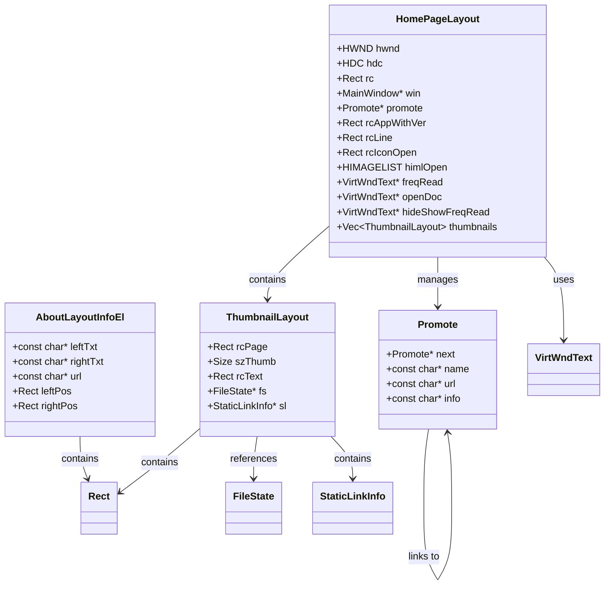
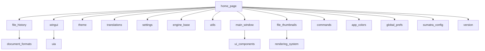
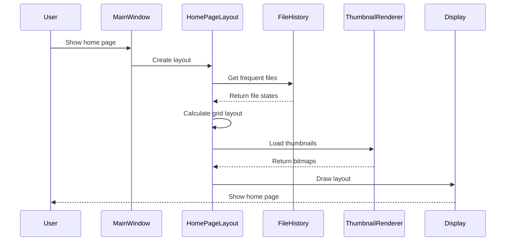
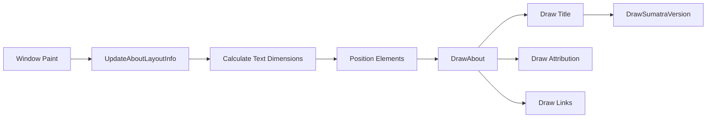
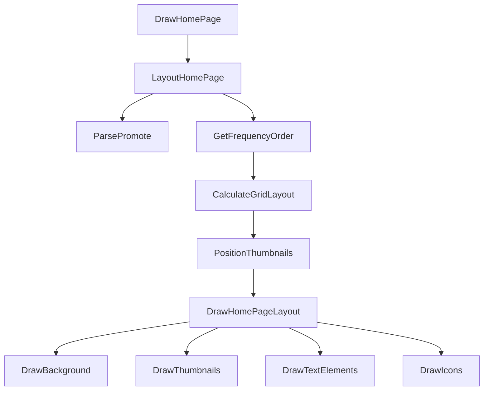
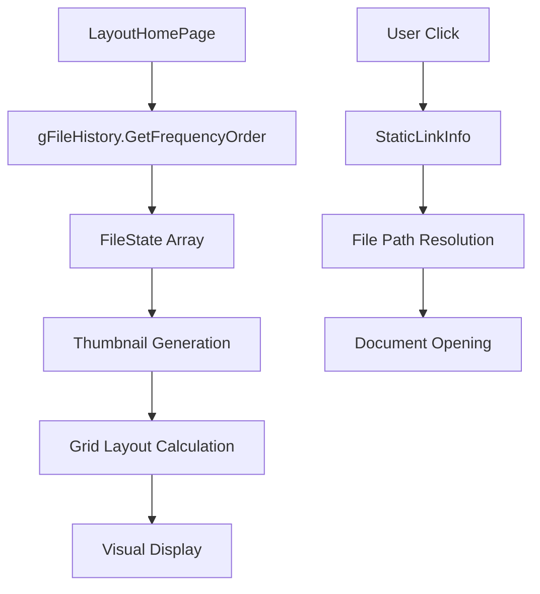

# Home Page Module Documentation

## Introduction

The home_page module is a core UI component of the SumatraPDF application that manages the display of the application's home screen and about dialog. This module provides two primary interfaces: the main home page that appears when no document is loaded, and the about window that displays application information and credits. The module integrates with the file history system to show frequently read documents as thumbnails and provides navigation links to various application features and external resources.

## Architecture Overview

The home_page module is built around a layout-based architecture that dynamically calculates and renders UI elements based on the current window dimensions and DPI settings. The module consists of several key architectural layers:

### Core Components

### Module Dependencies

## Component Details

### AboutLayoutInfoEl

The `AboutLayoutInfoEl` structure defines the layout information for each line in the about dialog. It contains static text data (left and right text, URL) and dynamically calculated positioning information (left and right rectangles for rendering).

**Key Features:**
- Static configuration for about dialog content
- Dynamic layout calculation based on text measurements
- Support for clickable links with URL navigation
- RTL (Right-to-Left) language support

### ThumbnailLayout

The `ThumbnailLayout` structure manages the visual representation of document thumbnails on the home page. It handles the positioning, sizing, and interaction areas for each thumbnail.

**Key Features:**
- Dynamic thumbnail positioning in grid layout
- File state integration for document metadata
- Clickable areas for document opening
- Icon integration for file type visualization

### Promote

The `Promote` structure represents promotional content that can be displayed on the home page. It supports a linked list structure for multiple promotional items.

**Key Features:**
- Configurable promotional content
- External link support
- Built-in promotional content parsing
- Memory management for promotional data

### HomePageLayout

The `HomePageLayout` structure is the central coordinator for the home page display. It manages all visual elements, layout calculations, and user interaction areas.

**Key Features:**
- Complete home page layout management
- Thumbnail grid calculation and positioning
- Promotional content integration
- Dynamic text element management
- Icon and visual element coordination

## Data Flow

## Rendering System

The module implements a sophisticated rendering system that handles both the about dialog and home page display:

### About Dialog Rendering

### Home Page Rendering

## Configuration and Theming

The module integrates with the application's theming system to support both light and dark modes:

- **Color Management**: Uses `ThemeWindowTextColor()`, `ThemeMainWindowBackgroundColor()`, and `ThemeWindowLinkColor()` for consistent theming
- **DPI Awareness**: All dimensions are scaled using `DpiScale()` for high-DPI display support
- **RTL Support**: Full right-to-left language support through `IsUIRtl()` and appropriate text alignment

## File History Integration

The home page module deeply integrates with the file history system to display frequently read documents:

## User Interaction

The module handles various user interactions through a comprehensive event system:

### Mouse Interactions
- **Hover Effects**: Link highlighting and tooltip display
- **Click Handling**: Document opening and URL navigation
- **Cursor Management**: Hand cursor for clickable elements

### Keyboard Interactions
- **Escape Key**: Window closure
- **Copy Command**: About information to clipboard

### Link Management
- **Static Links**: Persistent links in about dialog
- **Dynamic Links**: Generated links for thumbnails and actions
- **URL Validation**: Network access verification before navigation

## Performance Considerations

The module implements several optimization strategies:

### Layout Caching
- Layout calculations are performed once per paint cycle
- Text measurements are cached to avoid redundant calculations
- Thumbnail loading is optimized through the file thumbnails system

### Memory Management
- RAII patterns for GDI object management
- Automatic cleanup of dynamically allocated objects
- Smart pointer usage for resource management

### Rendering Optimization
- Clipping regions for thumbnail display
- Efficient bitmap rendering with color adaptation
- Minimal redraw areas to reduce flicker

## Integration Points

### Main Window Integration
The module integrates with the main window system through:
- `MainWindow` pointer for context access
- Static link management through `win->staticLinks`
- Canvas rendering through `win->hwndCanvas`

### Settings Integration
Configuration is managed through:
- Global preferences via `gGlobalPrefs`
- Theme settings through the theme system
- Translation support through `_TRA()` macro

### File System Integration
File operations are handled through:
- File history management
- Thumbnail loading and caching
- File type detection and icon display

## Error Handling

The module implements robust error handling:

- **Null Pointer Checks**: Comprehensive validation of pointers
- **Resource Validation**: Verification of GDI objects and handles
- **File Access**: Network and disk access permission checks
- **Memory Allocation**: Graceful handling of allocation failures

## Security Considerations

Security measures include:

- **URL Validation**: Verification of URLs before navigation
- **File Access**: Permission-based file access control
- **Clipboard**: Secure clipboard operations for about information
- **External Links**: Safe browsing practices for external URLs

## Future Enhancements

Potential areas for improvement:

- **Async Thumbnail Loading**: Background loading of thumbnails
- **Customizable Layouts**: User-configurable home page layouts
- **Enhanced Promotions**: Dynamic promotional content system
- **Performance Metrics**: Loading time optimization
- **Accessibility**: Enhanced screen reader support

## Related Documentation

- [Main Window System](main_window.md) - Core window management
- [File History System](file_history.md) - Document history management
- [Theme System](theme.md) - Application theming and colors
- [Translation System](translations.md) - Internationalization support
- [File Thumbnails](file_thumbnails.md) - Thumbnail generation and management
- [UI Components](ui_components.md) - User interface framework
- [Commands System](commands.md) - Command handling and processing