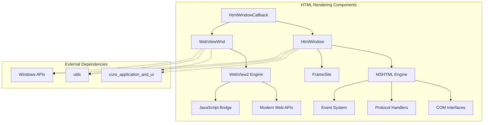
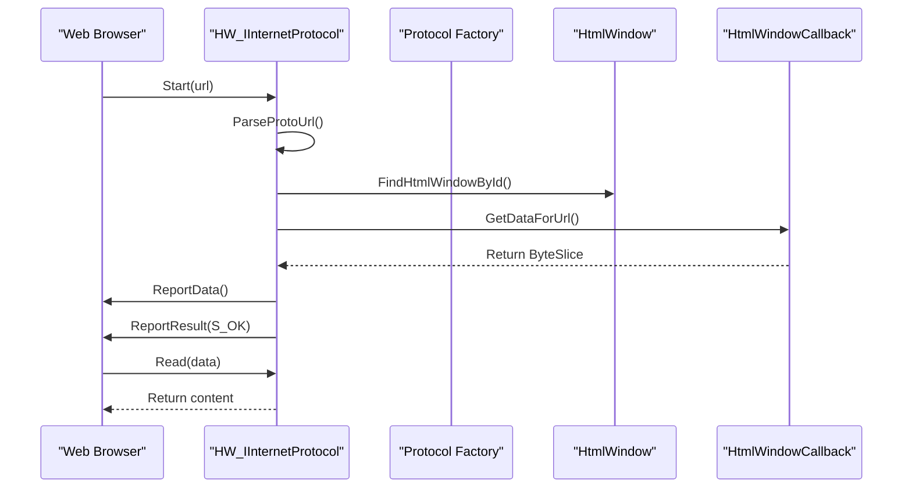
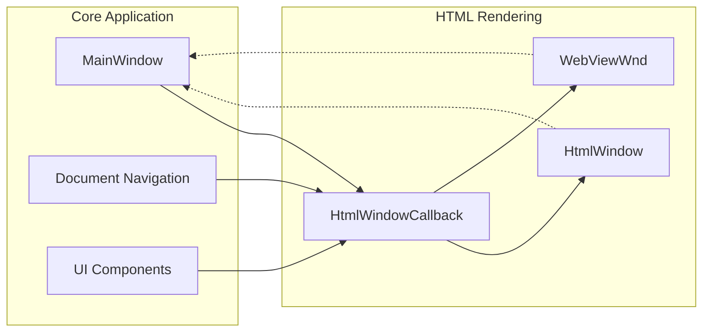

# HTML Rendering Components Module

## Overview

The HTML Rendering Components module provides comprehensive HTML rendering capabilities for the SumatraPDF application. It implements two distinct rendering engines: a legacy Internet Explorer-based engine using MSHTML/ActiveX controls, and a modern WebView2-based engine using Microsoft Edge Chromium. This dual-engine approach ensures compatibility across different Windows versions while providing modern web standards support where available.

## Architecture

## Core Components

### 1. HtmlWindow (MSHTML Engine)

The `HtmlWindow` class provides a comprehensive wrapper around Internet Explorer's MSHTML engine through COM interfaces. It implements custom protocol handling, event management, and document manipulation capabilities.

**Key Features:**
- Custom protocol implementation (`its://`) for handling CHM documents
- Complete COM interface implementation for MSHTML integration
- Event-driven architecture with navigation callbacks
- Screenshot capture functionality
- Zoom and print support

For detailed implementation details, see [MSHTML Engine Documentation](mshtml_engine.md).

### 2. WebViewWnd (WebView2 Engine)

The `WebViewWnd` class implements a modern HTML rendering solution using Microsoft's WebView2 control, providing better web standards compliance and performance.

**Key Features:**
- Chromium-based rendering engine
- JavaScript execution and communication
- Modern web standards support
- Permission management
- Navigation and content manipulation

For detailed implementation details, see [WebView2 Engine Documentation](webview2_engine.md).

## Protocol Handling System

The module implements a sophisticated protocol handling system for managing custom URL schemes and content delivery:

## Event System

Both engines implement comprehensive event handling systems for navigation, document loading, and user interactions:

### MSHTML Events
- `DISPID_BEFORENAVIGATE2`: Navigation interception
- `DISPID_DOCUMENTCOMPLETE`: Document loading completion
- `DISPID_COMMANDSTATECHANGE`: Browser state changes
- `DISPID_NEWWINDOW3`: New window requests

### WebView2 Events
- `WebMessageReceived`: JavaScript message handling
- `PermissionRequested`: Permission management
- Navigation events through controller interfaces

## Integration with Core Application

The HTML rendering components integrate with the broader SumatraPDF application through well-defined interfaces:

## Usage Patterns

### CHM Document Display
The primary use case is displaying CHM (Compiled HTML Help) documents, which requires:
- Custom protocol handling for embedded resources
- Navigation between help topics
- Search functionality integration
- Print support

### Modern Web Content
For modern web content and HTML-based interfaces:
- WebView2 engine for better compatibility
- JavaScript execution for dynamic content
- Modern CSS and HTML5 support
- Responsive design capabilities

## Error Handling and Fallbacks

The module implements robust error handling with fallback mechanisms:

1. **Engine Selection**: Automatically selects appropriate engine based on system capabilities
2. **Protocol Fallbacks**: Graceful handling of unsupported protocols
3. **Content Error Pages**: Custom error pages for failed navigation
4. **COM Error Recovery**: Proper cleanup and recovery from COM failures

## Performance Considerations

- **Resource Management**: Proper COM object lifecycle management
- **Memory Efficiency**: Streaming protocol implementation for large documents
- **Caching**: Intelligent caching of rendered content
- **Thread Safety**: Thread-safe COM interface implementations

## Security Features

- **Protocol Restrictions**: Limited to internal protocols for security
- **Permission Management**: Granular permission control in WebView2
- **Content Isolation**: Proper sandboxing of web content
- **Navigation Filtering**: Interception and validation of navigation requests

## Dependencies

This module depends on several other system components:

- **[core_application_and_ui](core_application_and_ui.md)**: For main window integration and UI components
- **[utils](utils.md)**: For string manipulation, file operations, and system utilities
- **Windows APIs**: COM, MSHTML, and WebView2 runtime dependencies

## Future Considerations

- **WebView2 Migration**: Gradual migration from MSHTML to WebView2
- **Enhanced JavaScript Bridge**: Improved communication between native and web code
- **Performance Optimization**: Better caching and rendering performance
- **Accessibility**: Enhanced accessibility support for screen readers