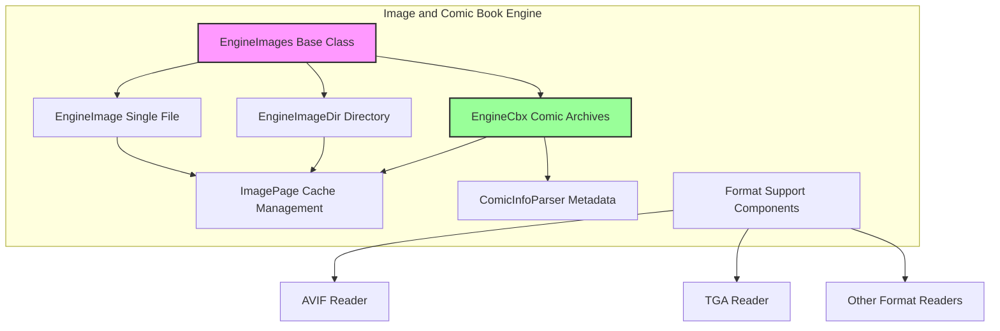
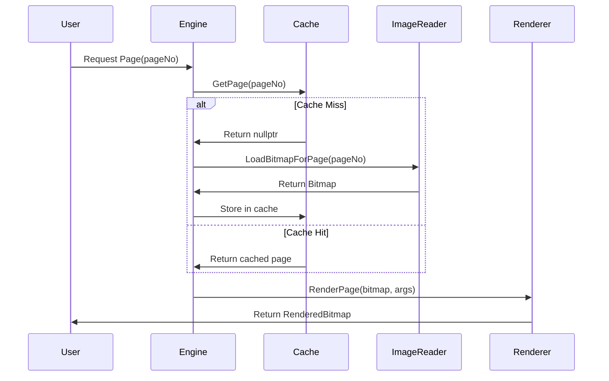

# Image and Comic Book Engine Module

## Overview

The image_and_comic_book_engine module provides comprehensive support for rendering and managing image-based documents and comic book archives within the SumatraPDF application. This module serves as a specialized document engine that handles various image formats and comic book archive formats, offering seamless integration with the application's document viewing infrastructure.

## Purpose and Core Functionality

The module's primary purpose is to:
- Render individual image files as documents with full page navigation
- Handle comic book archives (CBZ, CBR, CB7, CBT) as multi-page documents
- Manage image directories as sequential document collections
- Extract and parse metadata from comic book files
- Provide optimized image caching and rendering performance
- Support various image formats including modern formats like AVIF and HEIC

## Architecture Overview

## Core Components

### 1. EngineImages Base Class
The foundational abstract class that provides common functionality for all image-based engines:
- **ImagePage caching system** with LRU eviction policy
- **Rendering pipeline** with GDI+ integration
- **Page transformation** support (zoom, rotation)
- **Content box calculation** for automatic margin cropping
- **Element extraction** for image-based page elements

### 2. EngineImage (Single File Handler)
Handles individual image files as single-page or multi-frame documents:
- Supports formats: PNG, JPEG, GIF, TIFF, BMP, TGA, JXR, WebP, JP2, HEIC, AVIF
- Multi-frame extraction for TIFF and animated GIF files
- EXIF metadata extraction and property mapping
- Stream-based loading for embedded scenarios

### 3. EngineImageDir (Directory Handler)
Treats directories containing image files as multi-page documents:
- Natural sorting of image files
- Page labeling using file names
- TOC generation from file structure
- Batch file operations for save functionality

### 4. EngineCbx (Comic Book Archive Handler)
Specialized engine for comic book archive formats:
- Supports CBZ (ZIP), CBR (RAR), CB7 (7Z), CBT (TAR) formats
- **ComicInfo.xml** metadata parsing
- **ComicBookInfo** JSON metadata extraction
- Archive format auto-detection and handling
- Optimized image extraction from archives

### 5. Image Support Components
Specialized readers for modern image formats:
- **AVIF Reader**: HEIF/AVIF format support using libheif
- **TGA Reader**: Truevision TGA format with RLE compression
- Integration with GDI+ for seamless rendering

## Data Flow Architecture

## Key Features

### Image Caching System
- **LRU cache** with configurable size (MAX_IMAGE_PAGE_CACHE = 10)
- **Thread-safe** access using critical sections
- **Reference counting** for memory management
- **Automatic eviction** of least recently used pages

### Comic Book Metadata Support
- **ComicInfo.xml** standard metadata extraction
- **ComicBookInfo** JSON format support
- Author, title, publication date extraction
- Summary and creator information parsing

### Format Detection and Handling
- **Content-based** format detection for archives
- **Extension-based** fallback detection
- **Multi-format archive** support (ZIP, RAR, 7Z, TAR)
- **Modern image format** support (AVIF, HEIC, WebP)

### Performance Optimizations
- **Lazy loading** of image pages
- **Memory-mapped** file access where applicable
- **Efficient bitmap** handling with GDI+
- **Content box calculation** for margin removal

## Integration with SumatraPDF

The module integrates seamlessly with SumatraPDF's document engine architecture:
- Inherits from **EngineBase** for uniform document interface
- Implements **IPageElement** for interactive content
- Uses **RenderedBitmap** for consistent rendering output
- Supports **TOC generation** for navigation

## Error Handling and Robustness

- **Graceful degradation** for unsupported formats
- **Memory allocation** failure handling
- **Corrupt file** detection and recovery
- **Stream operation** error management

## Dependencies

- **GDI+** for image rendering and manipulation
- **libheif** for AVIF/HEIC format support
- **Archive libraries** for comic book format support
- **SumatraPDF Core** for base engine functionality

## Related Documentation

- [Core Application and UI Module](core_application_and_ui.md) - Main application interface
- [MuPDF Engine Integration](mupdf_engine_integration.md) - PDF rendering engine
- [Core Utilities](core_utilities.md) - Shared utility functions

## Sub-modules

For detailed information about specific components, see:
- [Comic Book Archive Handler](comic_book_archive_handler.md) - EngineCbx implementation details, ComicInfo.xml parsing, and archive format support
- [Image Format Readers](image_format_readers.md) - AVIF and TGA format readers with technical implementation details
- [Image Directory Handler](image_directory_handler.md) - EngineImageDir implementation for treating image directories as documents