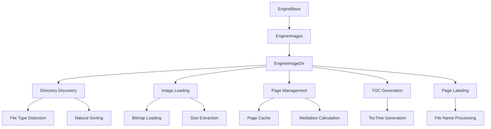
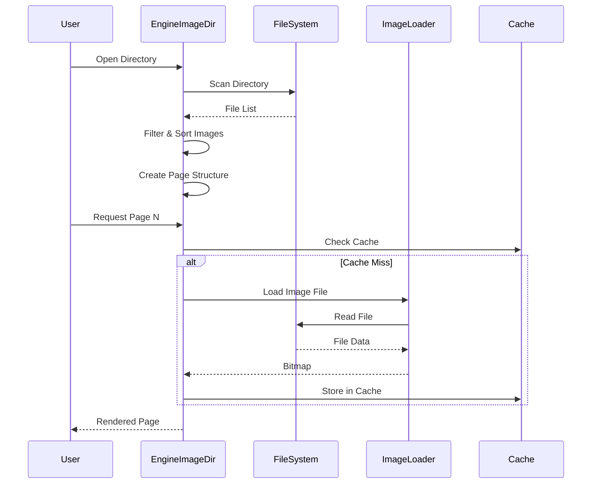

# Image Directory Handler Module

## Introduction

The image_directory_handler module provides functionality for treating directories containing image files as virtual documents within the SumatraPDF application. This module enables users to navigate through collections of images as if they were pages in a single document, providing a seamless viewing experience for image galleries, photo collections, and other image-based content.

## Core Functionality

The module's primary component is the `EngineImageDir` class, which extends the base `EngineImages` class to handle directories of image files. It automatically discovers supported image formats within a directory, sorts them naturally, and presents them as a paginated document with navigation capabilities.

## Architecture

### Component Hierarchy



### Key Components

#### EngineImageDir Class
The main class responsible for handling image directories. It implements the following key features:

- **Directory Scanning**: Automatically discovers all supported image files in a directory
- **Natural Sorting**: Sorts image files using natural ordering (e.g., "image1.jpg", "image2.jpg", "image10.jpg")
- **Page Management**: Treats each image as a document page with proper sizing and metadata
- **Table of Contents**: Generates a TOC based on file names for easy navigation
- **Page Labeling**: Provides meaningful page labels based on file names

#### Supported Image Formats
The module supports a wide range of image formats through the underlying image processing infrastructure:

- PNG, JPEG, GIF, TIFF, BMP
- TGA, JXR, HDP, WDP
- WebP, JPEG 2000, HEIC, AVIF

### Data Flow



## Integration with SumatraPDF

### Engine Registration
The image directory handler integrates with SumatraPDF's engine system through factory functions:

```cpp
EngineBase* CreateEngineImageDirFromFile(const char* fileName);
bool IsEngineImageDirSupportedFile(const char* fileName, bool);
```

### Document Properties
The module provides document properties through the standard property interface:

- **File Path**: The directory path being viewed
- **Page Count**: Number of images in the directory
- **Page Labels**: File names without extensions
- **Resolution**: DPI information from images

### Navigation Features

#### Page Navigation
- Standard page navigation (first, last, next, previous)
- Go to page by number or label
- Table of contents for quick navigation

#### Page Content Detection
The module includes sophisticated margin detection to automatically crop uniform borders from images, improving the viewing experience for scanned documents and photos with consistent backgrounds.

## Performance Optimization

### Caching Strategy
The module implements a Least Recently Used (LRU) cache with the following characteristics:

- **Cache Size**: Limited to 10 decoded bitmaps (MAX_IMAGE_PAGE_CACHE)
- **Thread Safety**: Uses critical sections for concurrent access
- **Memory Management**: Automatic cleanup of unused bitmaps

### Lazy Loading
Images are loaded on-demand when requested, reducing initial load time and memory usage for large directories.

### Size Optimization
The module can extract image dimensions without loading the full bitmap when possible, enabling quick page layout calculations.

## Error Handling

### Graceful Degradation
- **Missing Images**: Skips unreadable image files during directory scanning
- **Corrupted Files**: Handles corrupted image data gracefully
- **Memory Constraints**: Manages memory usage through cache limits

### User Feedback
- Provides meaningful error messages for unsupported directories
- Handles edge cases like empty directories or directories with no supported images

## Dependencies

### Internal Dependencies
- **EngineImages**: Base class providing common image engine functionality
- **File Utilities**: Directory iteration and file type detection
- **Image Processing**: Bitmap loading and manipulation through GDI+

### External Dependencies
- **GDI+**: For image loading, rendering, and manipulation
- **Windows API**: For file system operations and memory management

## Usage Examples

### Basic Usage
```cpp
// Create engine from directory
EngineBase* engine = CreateEngineImageDirFromFile("C:\\Photos\\Vacation");
if (engine) {
    // Use like any other document engine
    int pageCount = engine->PageCount();
    // Navigate through pages...
}
```

### Advanced Features
```cpp
// Access page labels
EngineImageDir* imgDir = (EngineImageDir*)engine;
TempStr label = imgDir->GetPageLabeTemp(pageNo);

// Navigate by label
int pageNo = imgDir->GetPageByLabel("IMG_0010");

// Access table of contents
TocTree* toc = imgDir->GetToc();
```

## Relationship to Other Modules

### [image_and_comic_book_engine.md](image_and_comic_book_engine.md)
The image_directory_handler is part of the broader image and comic book engine family, sharing the `EngineImages` base class and common image processing infrastructure.

### [mupdf_engine_integration.md](mupdf_engine_integration.md)
While independent from MuPDF, the image directory handler can complement MuPDF-based engines by providing alternative viewing modes for image-heavy documents.

### [core_utilities.md](core_utilities.md)
Leverages core utilities for file operations, string manipulation, and data structures like `StrVec` for managing file name collections.

## Future Enhancements

### Potential Improvements
- **Metadata Extraction**: Read EXIF data and other image metadata
- **Thumbnail Generation**: Create and cache thumbnails for faster navigation
- **Subdirectory Support**: Recursively include images from subdirectories
- **Filtering Options**: Allow users to filter images by type, size, or date
- **Batch Operations**: Support for batch image processing and conversion

### Performance Optimizations
- **Parallel Loading**: Load multiple images concurrently
- **Predictive Caching**: Preload likely next pages
- **Memory Mapping**: Use memory-mapped files for large images
- **GPU Acceleration**: Leverage GPU for image processing when available

## Conclusion

The image_directory_handler module provides a robust and efficient solution for viewing collections of images as documents within SumatraPDF. Its integration with the existing engine architecture ensures seamless operation while providing specialized features for image navigation and viewing. The module's caching and optimization strategies make it suitable for handling large directories of high-resolution images while maintaining responsive user interaction.