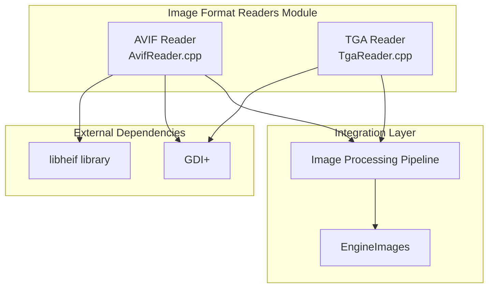
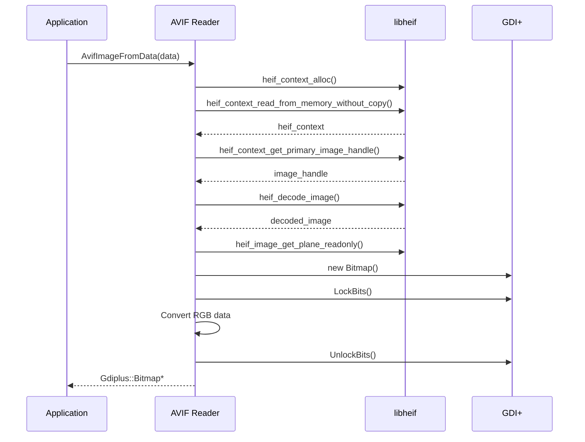
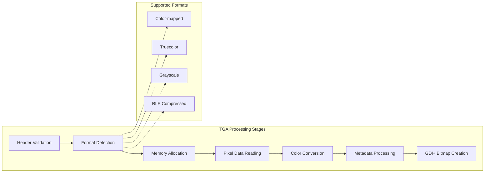
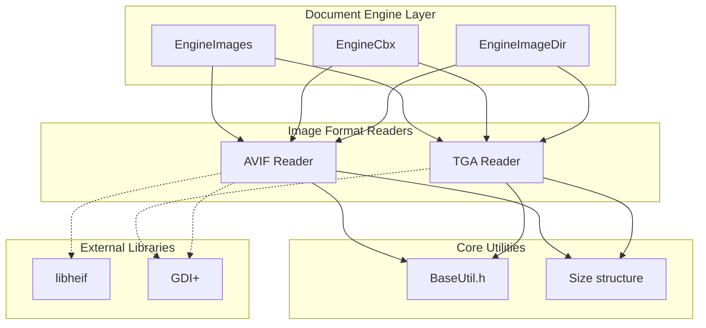

# Image Format Readers Module

## Introduction

The image_format_readers module provides specialized image format support for the SumatraPDF document viewer, specifically handling AVIF (AV1 Image File Format) and TGA (Truevision Graphics Adapter) image formats. These readers extend the application's capability to display modern and legacy image formats that are not natively supported by standard Windows imaging libraries.

## Architecture Overview

The module consists of two independent format readers that integrate with the broader image processing pipeline:

## Core Components

### AVIF Reader (AvifReader.cpp)

The AVIF reader provides support for the modern AV1 Image File Format using the libheif library. It implements two primary functions:

- **`AvifSizeFromData()`**: Extracts image dimensions from AVIF data without full decoding
- **`AvifImageFromData()`**: Converts AVIF data to a GDI+ Bitmap for display

#### Key Features:
- Memory-efficient processing using libheif's zero-copy interface
- RGB color space conversion with optional alpha channel support
- Error handling for corrupted or unsupported AVIF files
- Conditional compilation support (`#ifndef NO_AVIF`)

#### Data Flow:

### TGA Reader (TgaReader.cpp)

The TGA reader provides comprehensive support for Truevision Graphics Adapter files, including legacy formats used in game development and digital content creation. It handles multiple TGA variants:

- **Color-mapped images** (palette-based)
- **Truecolor images** (24-bit and 32-bit)
- **Grayscale images** (8-bit)
- **RLE compressed** variants of all types
- **Version 2.0** format with metadata support

#### Key Features:
- Complete TGA format specification support
- RLE decompression for compressed images
- Metadata extraction (author, date, software)
- Proper handling of image orientation flags
- Bitmap serialization for export functionality

#### TGA Processing Pipeline:

## Component Relationships

The image format readers integrate with the broader document processing architecture:

## Integration Points

### Image Engine Integration
The readers are utilized by the [EngineImages](image_and_comic_book_engine.md) component, which serves as the primary image document engine. The engine automatically detects image formats and delegates to the appropriate reader.

### Comic Book Archive Support
Both readers support comic book archive processing through the [EngineCbx](image_and_comic_book_engine.md#comic-book-archive-handler) component, enabling AVIF and TGA images within CBZ/CBR archives.

### Image Directory Processing
The [EngineImageDir](image_and_comic_book_engine.md#image-directory-handler) component uses these readers when processing directories containing mixed image formats.

## Error Handling and Fallbacks

### AVIF Error Handling
- **libheif initialization failures**: Returns empty size/null bitmap
- **Corrupted data detection**: Validates heif_error codes at each step
- **Memory allocation failures**: Graceful cleanup with proper resource deallocation

### TGA Error Handling
- **Format validation**: Comprehensive header validation before processing
- **Buffer overflow protection**: Bounds checking on all data access
- **Unsupported format detection**: Returns null for invalid TGA variants
- **RLE decompression errors**: Fails gracefully on corrupted compressed data

## Performance Considerations

### AVIF Optimization
- Zero-copy memory interface where possible
- Early dimension extraction without full decode
- Efficient RGB channel reordering for GDI+ compatibility

### TGA Optimization
- Single-pass RLE decompression
- Direct bitmap memory manipulation
- Minimal memory allocations during processing

## Dependencies

### External Libraries
- **libheif**: Required for AVIF format support
- **GDI+**: Used for bitmap creation and manipulation

### Internal Dependencies
- **BaseUtil.h**: Core utility functions and types
- **Size structure**: Dimension handling

## Configuration Options

### Build-time Configuration
- `NO_AVIF`: Disables AVIF support and removes libheif dependency
- Conditional compilation allows minimal builds without modern format support

### Runtime Behavior
- Automatic format detection through signature analysis
- Graceful degradation when optional libraries are unavailable
- Thread-safe operation for concurrent image processing

## Future Considerations

### Potential Enhancements
- **HEIC support**: Extend AVIF reader for HEIC compatibility
- **Additional TGA variants**: Support for less common TGA formats
- **Performance optimization**: SIMD optimizations for color conversion
- **Metadata preservation**: Enhanced EXIF/XMP support

### Integration Improvements
- **Streaming support**: Progressive loading for large images
- **Thumbnail generation**: Fast preview extraction
- **Format validation**: Enhanced corruption detection
- **Memory mapping**: Large file optimization

## Related Documentation

- [Image and Comic Book Engine](image_and_comic_book_engine.md) - Primary consumer of image format readers
- [MuPDF Engine Integration](mupdf_engine_integration.md) - Alternative image processing pipeline
- [Core Utilities](core_utilities.md) - Shared utility functions and types