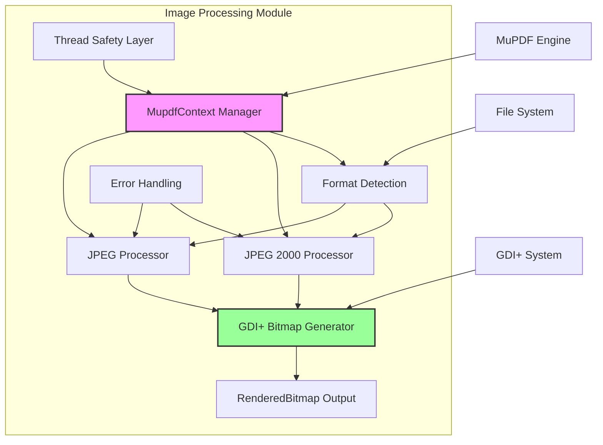
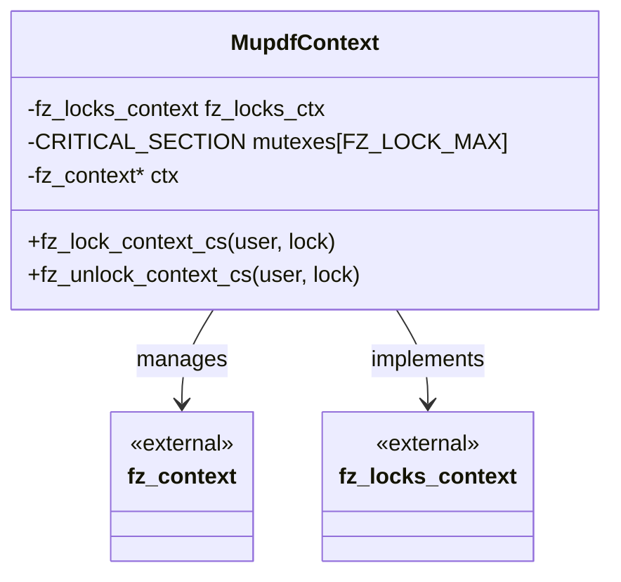
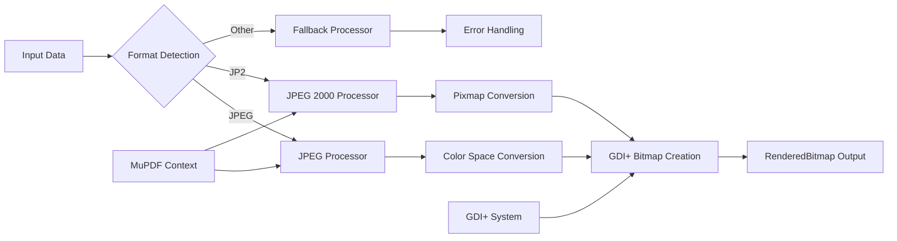
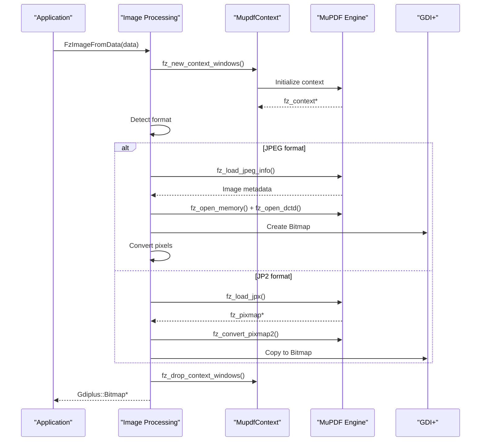
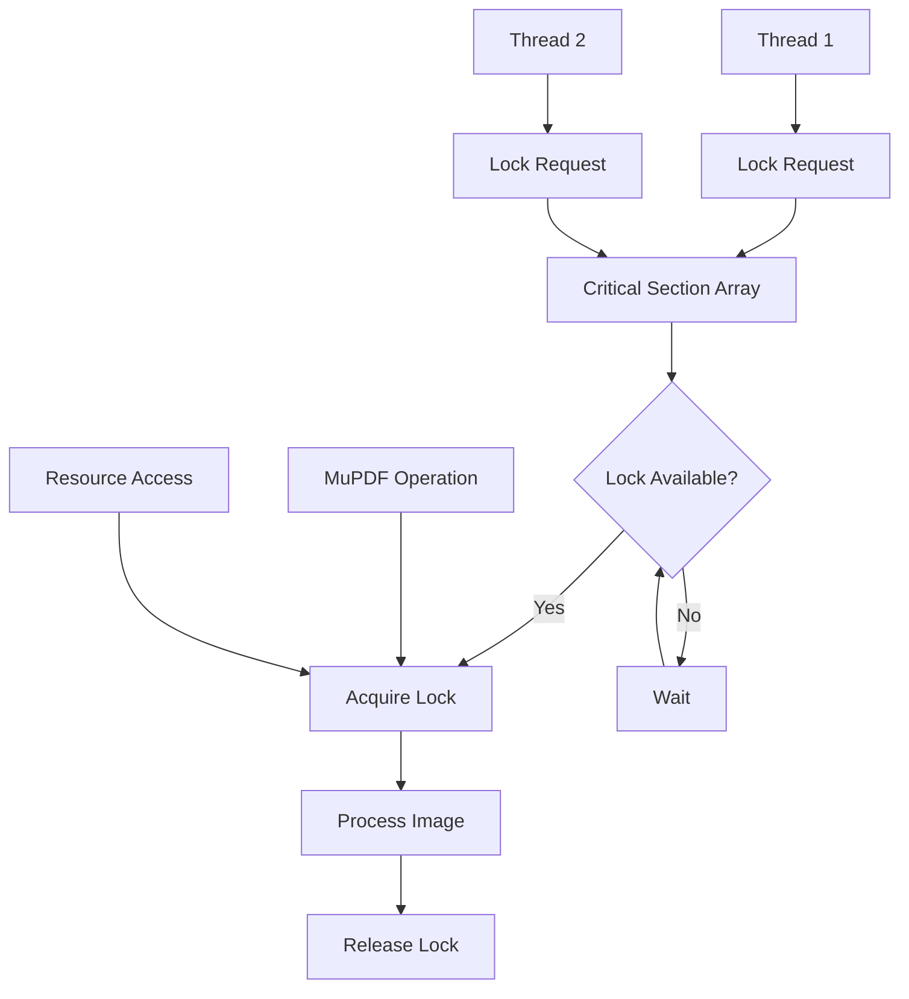
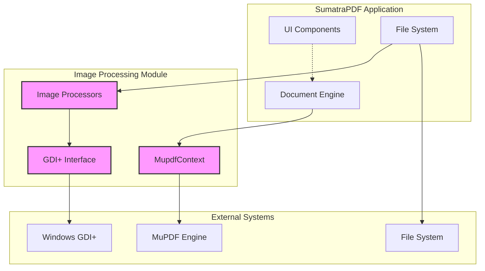

# Image Processing Module Documentation

## Introduction

The image_processing module is a critical component of the SumatraPDF application that handles image format conversion, processing, and rendering. It serves as a bridge between the MuPDF engine and the Windows GDI+ graphics system, enabling the application to load and display various image formats including JPEG, JPEG 2000 (JP2), and other supported formats. The module provides thread-safe image processing capabilities and integrates seamlessly with the application's document rendering pipeline.

## Architecture Overview

The image_processing module is built around a centralized MuPDF context management system that provides thread-safe operations for image processing. The architecture follows a layered approach with clear separation between MuPDF integration, format-specific processors, and GDI+ output generation.



## Core Components

### MupdfContext Structure

The `MupdfContext` is the central component that manages the MuPDF context with thread-safe operations. It provides a Windows-specific implementation of the MuPDF locking mechanism, ensuring safe concurrent access to image processing operations.



### Image Processing Pipeline

The module implements a sophisticated image processing pipeline that handles different formats through specialized processors while maintaining a unified interface.



## Key Functions and Features

### Context Management

The module provides specialized context management functions for Windows environments:

- **`fz_new_context_windows(maxStore)`**: Creates a new MuPDF context with Windows-specific thread safety
- **`fz_drop_context_windows(ctx)`**: Properly cleans up MuPDF context and associated resources

### Image Format Support

#### JPEG Processing
The JPEG processor (`ImageFromJpegData`) handles standard JPEG files with support for:
- Multiple color spaces (RGB, Grayscale, CMYK)
- Resolution information preservation
- Color space conversion to Windows-compatible formats
- Automatic orientation handling

#### JPEG 2000 Processing
The JP2 processor (`ImageFromJp2Data`) provides advanced features:
- High-quality image decoding
- Alpha channel preservation
- Efficient pixmap conversion
- BGR color space output for Windows compatibility

### Unified Interface

The module exposes a simple yet powerful interface:

- **`FzImageFromData(data)`**: Main entry point for image processing
- **`BitmapFromData(data)`**: Enhanced interface with Windows bitmap support
- **`LoadRenderedBitmap(path)`**: File-based image loading with rendering optimization

## Data Flow Architecture



## Thread Safety and Concurrency

The module implements a comprehensive thread safety mechanism using Windows critical sections:



## Error Handling and Recovery

The module implements robust error handling using MuPDF's exception mechanism:

- **Try-catch blocks**: Wrap all MuPDF operations for safe error recovery
- **Resource cleanup**: Ensure proper cleanup in both success and failure cases
- **Graceful degradation**: Return nullptr on errors without crashing
- **Error reporting**: Log errors through MuPDF's error reporting system

## Integration with Application Architecture

The image_processing module integrates with the broader SumatraPDF architecture:



## Performance Optimizations

The module includes several performance optimizations:

1. **Context Reuse**: Efficient MuPDF context management with proper cleanup
2. **Memory Management**: Direct memory operations for pixel data transfer
3. **Format Detection**: Fast format identification using magic bytes
4. **Color Space Optimization**: Direct color space conversion to Windows formats
5. **Resource Pooling**: Critical section reuse for thread safety

## Dependencies

The image_processing module has the following key dependencies:

- **[mupdf_engine_integration](mupdf_engine_integration.md)**: Provides the core MuPDF integration and page management capabilities
- **[core_utilities](core_utilities.md)**: Utilizes file system utilities and data structures
- **External Libraries**:
  - MuPDF/Fitz library for image processing
  - Windows GDI+ for bitmap operations
  - Windows Critical Sections for thread safety

## Usage Patterns

### Basic Image Loading
```cpp
// Load image from file data
ByteSlice data = file::ReadFile("image.jpg");
Gdiplus::Bitmap* bmp = FzImageFromData(data);
if (bmp) {
    // Use bitmap
    delete bmp;
}
data.Free();
```

### Rendered Bitmap Creation
```cpp
// Load and create rendered bitmap
RenderedBitmap* rendered = LoadRenderedBitmap("image.png");
if (rendered) {
    // Use rendered bitmap
    delete rendered;
}
```

## Future Considerations

The module is designed with extensibility in mind:

- **Additional Formats**: Easy to add support for new image formats
- **Performance Enhancements**: Potential for GPU acceleration
- **Memory Optimization**: Opportunities for streaming large images
- **Format-Specific Features**: Can leverage format-specific capabilities

## Conclusion

The image_processing module serves as a robust, thread-safe bridge between MuPDF's powerful image processing capabilities and Windows' GDI+ graphics system. Its modular design, comprehensive error handling, and performance optimizations make it an essential component for document viewing and image rendering within the SumatraPDF application.