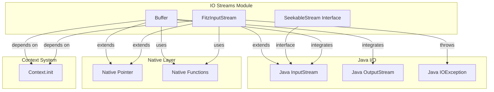
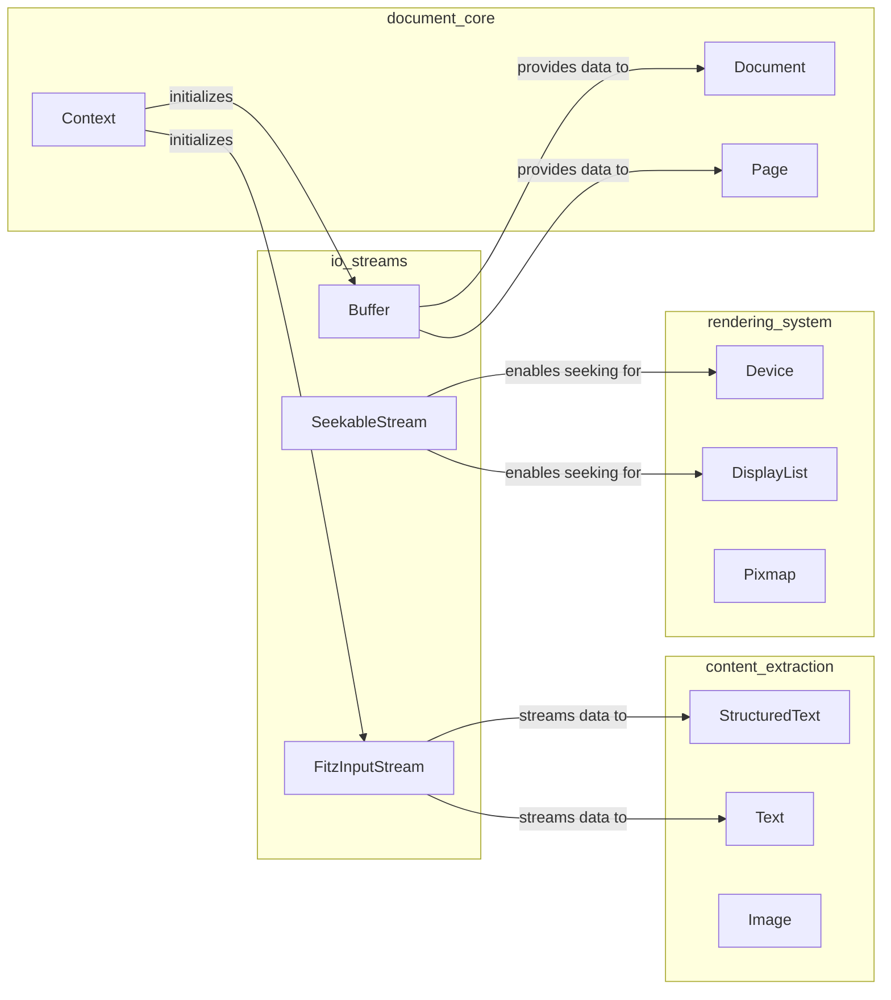
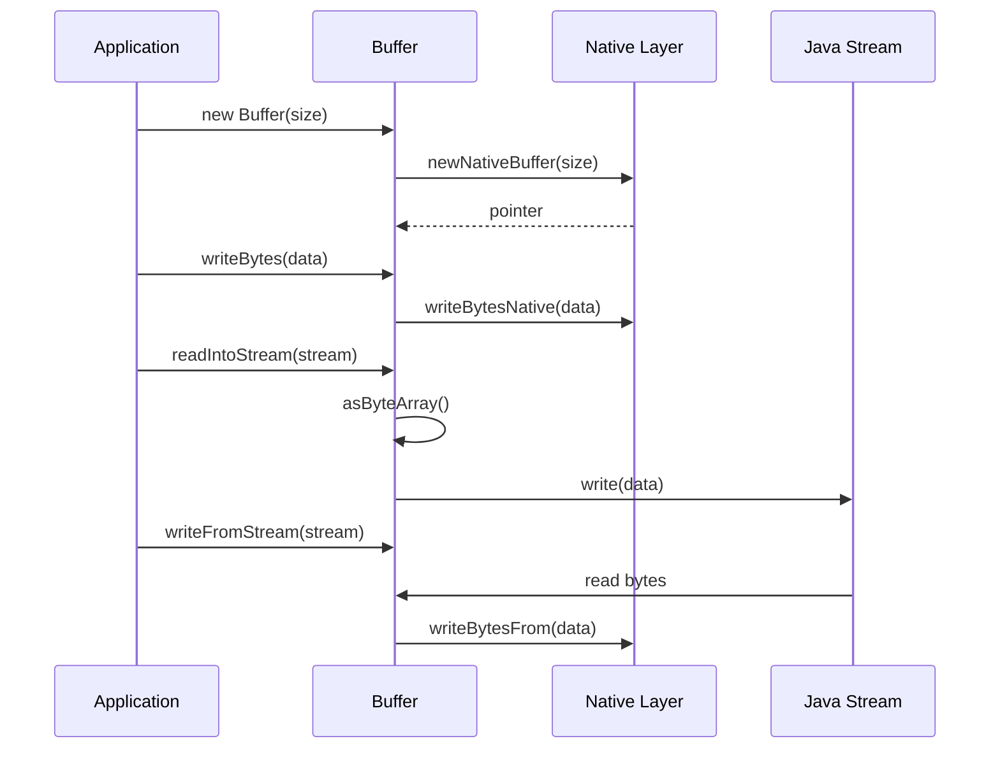
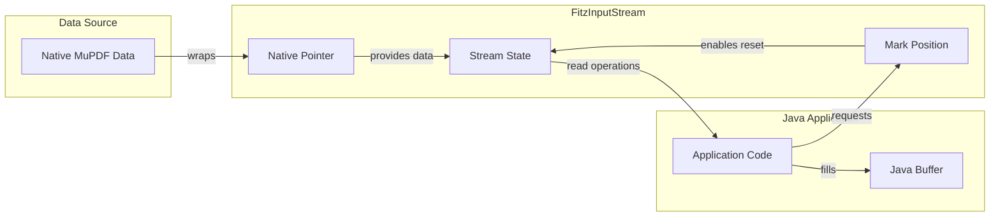
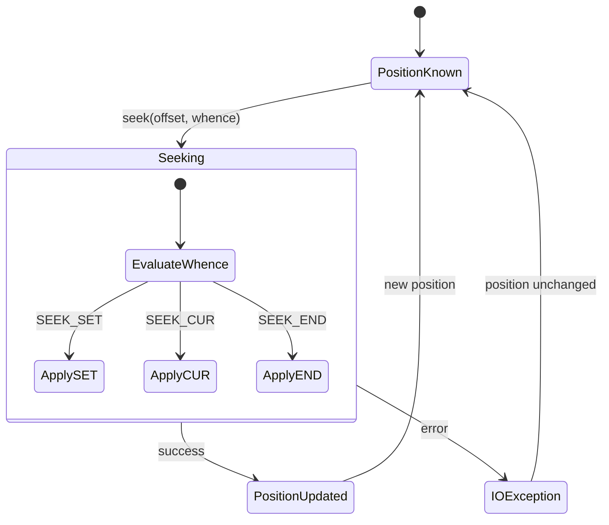
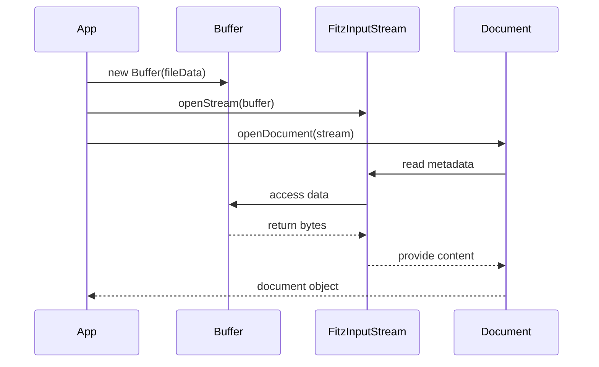
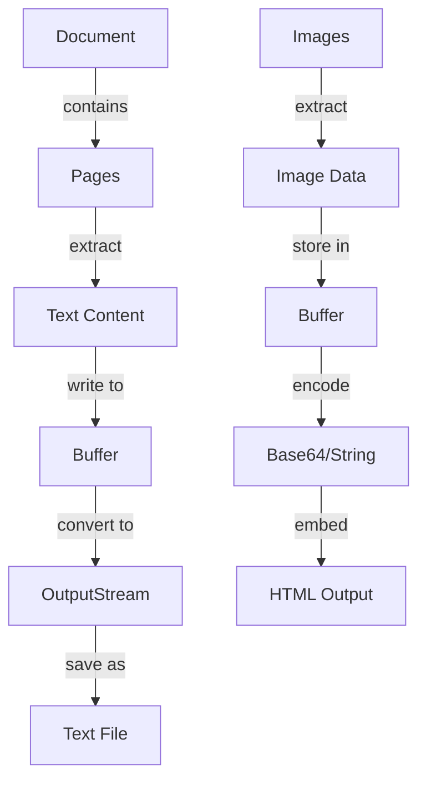
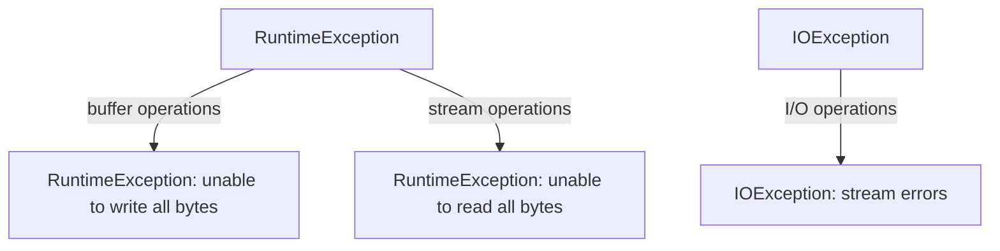

# IO Streams Module Documentation

## Introduction

The `io_streams` module provides essential input/output stream abstractions for the MuPDF Java bindings, forming a critical part of the document processing pipeline. This module handles binary data management, stream operations, and seekable I/O functionality, serving as the foundation for document loading, content extraction, and data manipulation operations within the MuPDF ecosystem.

## Module Overview

The io_streams module is part of the larger `mupdf_java_bindings` system and provides three core components:

- **Buffer**: A flexible binary data container with read/write capabilities
- **FitzInputStream**: A Java InputStream implementation for MuPDF data streams
- **SeekableStream**: An interface for stream positioning operations

These components work together to provide comprehensive I/O functionality for document processing, from raw binary data handling to advanced stream operations with positioning capabilities.

## Architecture

### Component Architecture



### Module Dependencies



## Core Components

### Buffer Class

The `Buffer` class serves as the primary binary data container within the MuPDF Java bindings. It provides a comprehensive set of operations for managing binary data, including reading, writing, slicing, and stream integration.

#### Key Features

- **Native Integration**: Uses native pointers for direct memory access
- **Stream Compatibility**: Seamless integration with Java I/O streams
- **Binary Operations**: Support for byte-level and array-level operations
- **String Conversion**: Built-in string encoding/decoding capabilities
- **Memory Management**: Automatic cleanup through finalization

#### Data Flow



#### API Reference

**Constructors**
- `Buffer()` - Creates an empty buffer
- `Buffer(int n)` - Creates a buffer with initial capacity
- `Buffer(long p)` - Creates a buffer from existing native pointer

**Read Operations**
- `getLength()` - Returns buffer length
- `readByte(int at)` - Reads byte at specified position
- `readBytes(int at, byte[] bs)` - Reads bytes into array
- `asByteArray()` - Returns entire buffer as byte array
- `asString()` - Returns buffer content as string

**Write Operations**
- `writeByte(byte b)` - Writes single byte
- `writeBytes(byte[] bs)` - Writes byte array
- `writeBuffer(Buffer buf)` - Writes another buffer
- `writeRune(int rune)` - Writes Unicode character
- `writeLine(String line)` - Writes text line

**Stream Integration**
- `readIntoStream(OutputStream stream)` - Writes buffer to output stream
- `writeFromStream(InputStream stream)` - Reads from input stream

### FitzInputStream Class

The `FitzInputStream` class extends Java's standard `InputStream` to provide MuPDF-specific stream functionality. It bridges the gap between MuPDF's native stream handling and Java's I/O ecosystem.

#### Key Features

- **Java Compatibility**: Full implementation of Java InputStream contract
- **Native Performance**: Leverages native code for optimal performance
- **Mark/Reset Support**: Supports stream positioning and reset operations
- **Resource Management**: Proper cleanup through finalization

#### Stream Processing Flow



#### API Reference

**Core Methods**
- `read()` - Reads single byte
- `read(byte[] b)` - Reads into byte array
- `read(byte[] b, int off, int len)` - Reads with offset and length
- `available()` - Returns available bytes
- `close()` - Closes the stream

**Positioning Methods**
- `mark(int readlimit)` - Marks current position
- `reset()` - Resets to marked position
- `markSupported()` - Checks if marking is supported

### SeekableStream Interface

The `SeekableStream` interface defines the contract for streams that support random access operations. It provides standard seek semantics compatible with C library conventions.

#### Key Features

- **Standard Seek Constants**: SEEK_SET, SEEK_CUR, SEEK_END
- **Position Management**: Track and modify stream position
- **Exception Handling**: Proper IOException propagation
- **Interface Design**: Flexible implementation requirements

#### Seek Operations



#### API Reference

**Constants**
- `SEEK_SET = 0` - Set position to offset
- `SEEK_CUR = 1` - Set position to current + offset
- `SEEK_END = 2` - Set position to EOF + offset

**Methods**
- `seek(long offset, int whence)` - Seeks to position
- `position()` - Returns current position

## Integration Patterns

### Document Loading Pattern



### Content Extraction Pattern



## Error Handling

### Exception Hierarchy



### Error Recovery Strategies

1. **Buffer Operations**: Validate data availability before operations
2. **Stream Operations**: Check stream state before read/write
3. **Resource Management**: Ensure proper cleanup in error conditions
4. **Native Integration**: Handle native pointer validity

## Performance Considerations

### Memory Management

- **Native Buffers**: Direct memory access minimizes copying
- **Automatic Cleanup**: Finalization ensures resource release
- **Stream Buffering**: Efficient data transfer between Java and native layers

### Optimization Strategies

1. **Buffer Reuse**: Reuse buffer instances when possible
2. **Stream Chunking**: Process large data in manageable chunks
3. **Native Integration**: Leverage native performance for bulk operations
4. **Position Management**: Minimize seek operations in seekable streams

## Usage Examples

### Basic Buffer Operations

```java
// Create and populate buffer
Buffer buffer = new Buffer();
buffer.writeBytes("Hello, World!".getBytes());

// Read from buffer
byte[] data = buffer.asByteArray();
String content = buffer.asString();

// Stream integration
FileOutputStream fos = new FileOutputStream("output.txt");
buffer.readIntoStream(fos);
fos.close();
```

### Stream Processing

```java
// Create input stream from buffer
FitzInputStream fis = new FitzInputStream(nativePointer);

// Read data
byte[] buffer = new byte[1024];
int bytesRead = fis.read(buffer);

// Position management
if (fis.markSupported()) {
    fis.mark(1024);
    // ... read operations
    fis.reset(); // return to marked position
}

// Clean up
fis.close();
```

### Seekable Operations

```java
// Implement seekable stream
class MySeekableStream implements SeekableStream {
    private long position = 0;
    
    public long seek(long offset, int whence) throws IOException {
        switch (whence) {
            case SEEK_SET:
                position = offset;
                break;
            case SEEK_CUR:
                position += offset;
                break;
            case SEEK_END:
                // Implementation specific
                break;
        }
        return position;
    }
    
    public long position() throws IOException {
        return position;
    }
}
```

## Related Modules

- **[document_core](document_core.md)**: Document and page management that utilizes io_streams for data loading
- **[content_extraction](content_extraction.md)**: Text and image extraction that depends on stream operations
- **[rendering_system](rendering_system.md)**: Rendering operations that require seekable streams for efficient data access

## Best Practices

1. **Resource Management**: Always close streams and destroy buffers when done
2. **Error Handling**: Implement proper exception handling for I/O operations
3. **Performance**: Use buffer operations for bulk data transfers
4. **Memory**: Be mindful of large buffer allocations in memory-constrained environments
5. **Thread Safety**: Consider thread safety when sharing buffers across threads

## Conclusion

The io_streams module provides the foundational I/O capabilities for the MuPDF Java bindings, offering efficient binary data management, stream operations, and seekable access patterns. Its design bridges Java's I/O ecosystem with MuPDF's native performance, enabling robust document processing workflows while maintaining compatibility with standard Java I/O patterns.