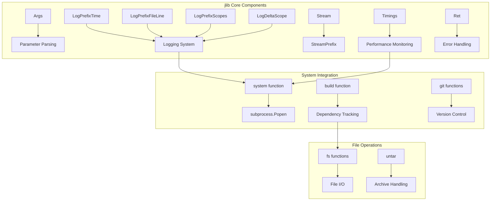
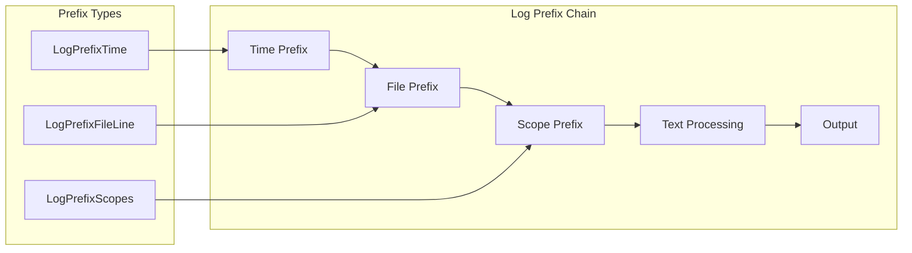
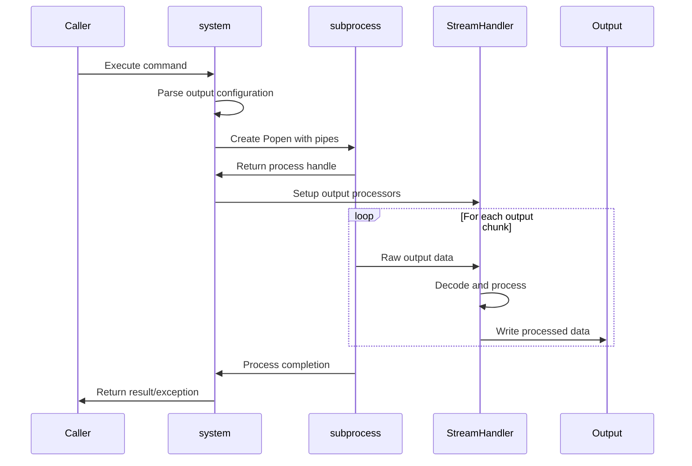
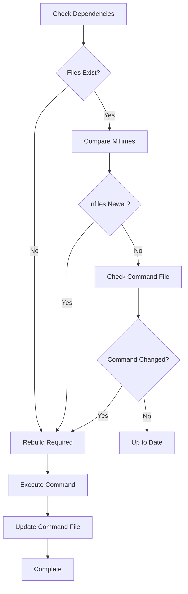
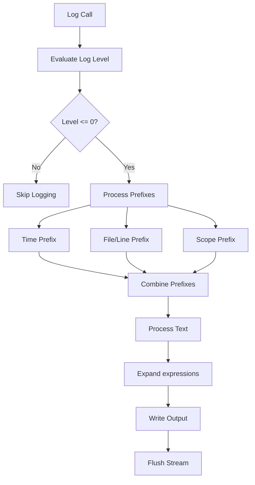
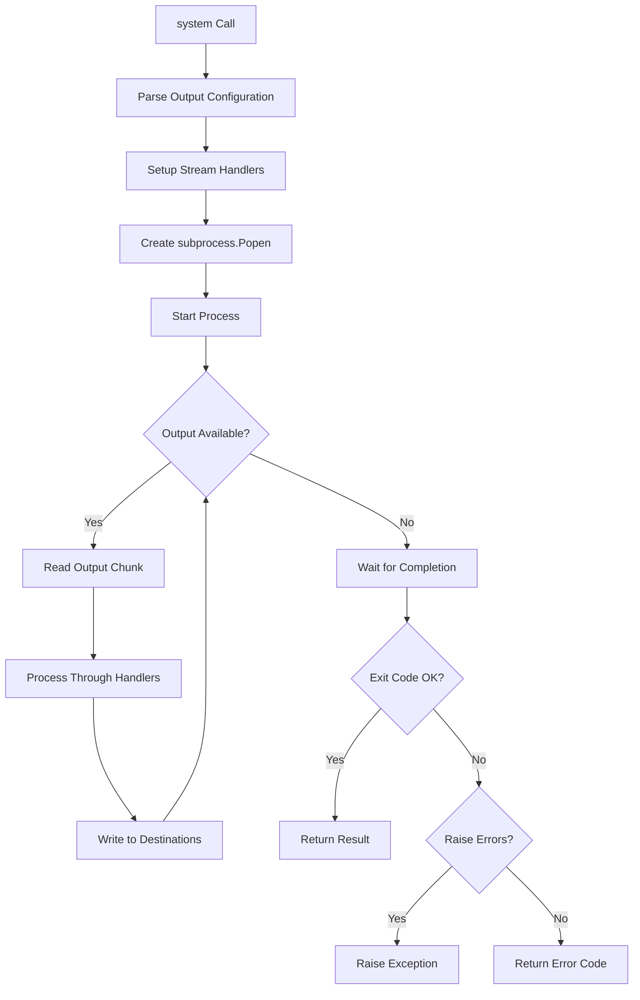

# jlib Module Documentation

## Overview

The `jlib` module is a comprehensive Python utility library that provides essential tools for logging, system operations, file handling, and build management. It serves as a foundational component in the MuPDF project's build and scripting infrastructure, offering enhanced versions of common system operations with advanced features like hierarchical logging, timing utilities, and sophisticated build dependency tracking.

## Purpose and Core Functionality

The jlib module provides several key functional areas:

### 1. Enhanced Logging System
- **Hierarchical logging** with customizable prefixes (time, file/line, scopes)
- **Enhanced f-string support** with `{expression}` evaluation in log messages
- **Log level management** with environment-based filtering
- **Scoped logging** for temporary log configuration changes

### 2. System Operations
- **Advanced subprocess management** with flexible output handling
- **Command execution** with environment variable support
- **Build system** with makefile-like dependency tracking
- **File system operations** with atomic updates and safety features

### 3. Development Utilities
- **Exception handling** with enhanced traceback formatting
- **Timing and profiling** with hierarchical timing collection
- **Git integration** for version tracking and file listing
- **Text processing** utilities for enhanced string formatting

## Architecture and Component Relationships



## Component Details

### Logging Infrastructure

The logging system is built around a flexible prefix architecture that allows multiple prefix types to be combined:



#### Key Logging Features:
- **Enhanced f-string support**: The `text_nv()` function provides advanced string interpolation with `{expression}` evaluation
- **Hierarchical timing**: `Timings` class collects performance data across nested operations
- **Environment-based filtering**: Log levels can be controlled via `JLIB_log_levels` environment variable
- **Scoped configuration**: `LogDeltaScope` and `LogPrefixScope` allow temporary logging changes

### System Operations Architecture



#### System Command Features:
- **Flexible output handling**: Support for multiple output destinations (files, callbacks, logging, etc.)
- **Encoding management**: Robust handling of different character encodings
- **Environment control**: Support for additional environment variables
- **Error handling**: Configurable exception raising on command failure

### Build System

The `build()` function implements a sophisticated dependency tracking system:



## Data Flow and Process Flows

### Enhanced Logging Flow



### Command Execution Flow



## Integration with Other Modules

The jlib module serves as a foundational utility that other modules depend on:

### Dependencies from Other Modules:
- **[mupdf_wrap_scripts](mupdf_wrap_scripts.md)**: Uses jlib for logging and system operations
- **[wrap_main](wrap_main.md)**: Leverages jlib's system execution capabilities
- **[wrap_classes](wrap_classes.md)**: Utilizes jlib's logging infrastructure

### External Dependencies:
- **Standard Library**: `subprocess`, `os`, `sys`, `time`, `inspect`, `traceback`
- **System Integration**: Platform-specific operations for Windows/Unix

## Key Features and Capabilities

### 1. Advanced String Processing
The `text_nv()` function provides enhanced f-string functionality:
- Expression evaluation in caller's context
- Support for formatting specifications (`!r`, `:format`)
- Name-value output with `=` suffix
- Multi-expression evaluation with space separation

### 2. Hierarchical Timing System
The `Timings` class offers comprehensive performance monitoring:
- Nested timing collection
- Context manager support
- Hierarchical output formatting
- Integration with logging system

### 3. Robust File Operations
File system utilities with safety features:
- Atomic file updates via temporary files
- Directory tree operations
- Mtime-based dependency checking
- Archive extraction with validation

### 4. Enhanced Exception Handling
The `exception_info()` function provides:
- Complete stack traces including outer frames
- Chained exception support
- Customizable output formatting
- Integration with logging system

## Usage Examples

### Basic Logging
```python
import jlib

# Simple logging
jlib.log('Starting operation')

# Enhanced f-string logging
x = 42
jlib.log('Value is {x} and {x*2=}')

# Scoped logging
with jlib.LogPrefixScope('Operation: '):
    jlib.log('Inside scoped operation')
```

### System Operations
```python
# Execute command with output capture
output = jlib.system('ls -la', out='return')

# Execute with custom prefix
jlib.system('echo "Hello"', prefix='>> ')

# Execute with environment variables
jlib.system('echo $MESSAGE', env_extra={'MESSAGE': 'Hello World'})
```

### Build System
```python
# Simple build rule
jlib.build(
    infiles='source.c',
    outfiles='output.o',
    command='gcc -c {IN} -o {OUT}'
)

# Complex build with multiple dependencies
jlib.build(
    infiles=['header.h', 'source.c'],
    outfiles=['object.o', 'program'],
    command='gcc {IN} -o {OUT}'
)
```

## Configuration and Environment

### Environment Variables
- `JLIB_log_levels`: Controls logging verbosity with format `filename:function=delta,filename:function=delta`

### Global State
- `g_log_prefixes`: List of prefix generators for all log output
- `g_log_delta`: Global log level adjustment
- `g_log_prefix_scopes`: Stack-based scope management for logging

## Error Handling and Safety

The module implements several safety mechanisms:
- **Atomic file operations**: Uses temporary files and renames for safety
- **Encoding error handling**: Graceful handling of Unicode encoding issues
- **Process management**: Proper cleanup and error reporting for subprocesses
- **Validation**: Extensive parameter validation and error checking

## Performance Considerations

- **Caching**: Log level lookups are cached for performance
- **Streaming**: Large command outputs are processed in chunks
- **Lazy evaluation**: Prefixes are only generated when needed
- **Memory management**: Proper cleanup of frame references to avoid cycles

This comprehensive utility module provides the foundation for robust scripting and build operations within the MuPDF ecosystem, with particular emphasis on logging, system integration, and dependency management.